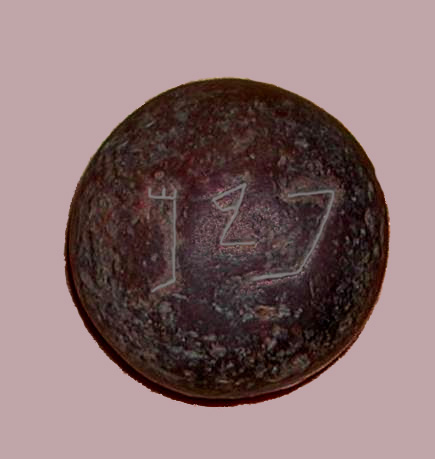

# Human-made Things in the Bible

## License Information

Human-made Things in the Bible © United Bible Societies, 2025. Adapted from: <cite>The Works of Their Hands: Man-made Things in the Bible</cite>, by Ray Pritz © 2009 United Bible Societies. This work is licensed under Creative Commons Attribution-ShareAlike 4.0 International (<a href="https://creativecommons.org/licenses/by-sa/4.0/">https://creativecommons.org/licenses/by-sa/4.0/</a>).

--------------------------------

## Weights (id: REALIA:11.1)

11\.1 Weights
=============

The metric and imperial equivalents given in the tables are rounded\-off approximations. While they should suffice for purposes of translation, they are not intended to present a high degree of mathematical precision.
-------------------------------------------------------------------------------------------------------------------------------------------------------------------------------------------------------------------------

**Old Testament:**

Name: Talent (*kikar*)

Equivalence: 60 minas

Metric: 34 kilograms

Imperial: 75 pounds

Name: Mina (*maneh*, *mna*)

Equivalence: 50 shekels

Metric: 0\.6 kilogram

Imperial: 1\.25 pounds

Name: Shekel (*sheqel*)

Equivalence:——

Metric: 12 grams

Imperial: 0\.4 ounce

Name: Pim (*pim*)

Equivalence: 0\.7 shekel

Metric: 8 grams

Imperial: 0\.3 ounce

Name: Beqa (*beqa‘*)

Equivalence: 0\.5 shekel

Metric: 6 grams

Imperial: 0\.2 ounce

Name: Gerah (*gerah*)

Equivalence: 0\.05 shekel

Metric: 0\.6 gram

Imperial: 0\.02 ounce

**New Testament and Deuterocanon:**

Name: Talent (*talanton*)

Equivalence: (See [11\.6 Money\<REALIA:11\.6\>](#))

Name: Pound (*litra*)

Equivalence:——

Metric: 327 grams

Imperial: 11\.5 ounces

## Gerah (id: REALIA:11.1.1)

11\.1\.1 Gerah
==============

References:
-----------

Hebrew גֵּרָה (gerah)

[EXO 30:13](https://ref.ly/Exod30:13), [LEV 27:25](https://ref.ly/Lev27:25), [NUM 3:47](https://ref.ly/Num3:47), [NUM 18:16](https://ref.ly/Num18:16), [EZK 45:12](https://ref.ly/Ezek45:12)

In all of these references, the *gerah* only appears as a definition of the shekel, of which it is 1/20; that is, the *gerah* has no significance apart from the shekel. If the name “shekel” is retained in translation, then the name “gerah” may also be kept. If the word “shekel” is translated, it may still be possible to retain the word “gerah,” because you will just be saying it is 1/20 of the unit used for “shekel.”
------------------------------------------------------------------------------------------------------------------------------------------------------------------------------------------------------------------------------------------------------------------------------------------------------------------------------------------------------------------------------------------------------------------------------------

* **Associated Passages:** Exodus 30:13; Leviticus 27:25; Numbers 3:47; Numbers 18:16; Ezekiel 45:12

* **Associated ACAI Concepts:** Gerah (ID: `realia:Gerah`)

## Beqa (id: REALIA:11.1.2)

11\.1\.2 Beqa
=============

References:
-----------

Hebrew בֶּקַע (beqa‘)

[GEN 24:22](https://ref.ly/Gen24:22), [EXO 38:26](https://ref.ly/Exod38:26)

In [EXO 38:26](https://ref.ly/Exod38:26) a *beqa‘* is defined as half a shekel. In [GEN 24:22](https://ref.ly/Gen24:22) it is the weight of a gold nose ring. NRSV (New Revised Standard Version (1989)) just converts it to the shekel weight by saying “a gold nose\-ring weighing a half shekel.” The *beqa‘* equals 10 gerahs.
----------------------------------------------------------------------------------------------------------------------------------------------------------------------------------------------------------------------------------------------------------------------------------------------------------------------------------

* **Associated Passages:** Genesis 24:22; Exodus 38:26

## Pim (id: REALIA:11.1.3)

11\.1\.3 Pim
============

References:
-----------

Hebrew פִּים (pim)

[1SA 13:21](https://ref.ly/1Sam13:21)

*This stone weight has its name, 'pim', inscribed on it in ancient Hebrew letters (Funhistory, CC0, via Wikimedia Commons)*

“The charge was a pim” (*haptsirah fim*): The meaning of these two Hebrew words is highly conjectural. While most translators agree with RSV (Revised Standard Version (1952)) that they indicate some unit of payment, others have thought that they refer to another kind of metal implement. However, the KJV (King James Version (1611)) rendering “file” (which would hardly need sharpening but which could itself be used to sharpen things) is surely incorrect. Archaeologists in the land of Israel have found a number of small round stone objects, each weighing about 7\.5 grams (¼ ounce; that is about ⅔ of a shekel) and inscribed with the word *pim* (\= *fim*).

* **Associated Passages:** 1 Samuel 13:21

## Peres, Parsin (id: REALIA:11.1.4)

11\.1\.4 Peres, Parsin
======================

References:
-----------

Aramaic פְּרֵס (peres)

[DAN 5:25](https://ref.ly/Dan5:25), [DAN 5:28](https://ref.ly/Dan5:28)

The basic meaning of the Aramaic word *peres* (plural form *parsin*) is “division,” “split,” “partition,” or “separation.” It seems in the context of [DAN 5:25–DAN 5:28](https://ref.ly/Dan5:25-Dan5:28) to indicate either half a mina or half a shekel. However, this meaning is of little significance in the narrative and does not need to be reflected either in the translation or in a note. The first sentence of CEV (Contemporary English Version) for these verses is a good model: “The words written there are *mne’*, which means ‘numbered,’ *teqel*, which means ‘weighed,’ and *parsin*, which means ‘divided.’ ” To this CEV (Contemporary English Version) adds the following footnote: “In the Aramaic text of verse 25, the words ‘mene, tekel, parsin,’ are used, and in verses 26–28 the words ‘mene, tekel, peres’ (the singular of ‘parsin’) are used. ‘Parsin’ means ‘divided,’ but ‘peres’ can mean either ‘divided’ or ‘Persia.’ ”
----------------------------------------------------------------------------------------------------------------------------------------------------------------------------------------------------------------------------------------------------------------------------------------------------------------------------------------------------------------------------------------------------------------------------------------------------------------------------------------------------------------------------------------------------------------------------------------------------------------------------------------------------------------------------------------------------------------------------------------------------------------------------------------------------------------------------------------------------------------------------------------------------------------------------------------------------------------

* **Associated Passages:** Daniel 5:25; Daniel 5:28

## Pound (id: REALIA:11.1.5)

11\.1\.5 Pound
==============

References:
-----------

Greek λίτρα (litra)

[JHN 12:3](https://ref.ly/John12:3), [JHN 19:39](https://ref.ly/John19:39)

[JHN 12:3](https://ref.ly/John12:3): In this verse the “pound” (RSV (Revised Standard Version (1952)); *litra* in Greek) of costly ointment would have been kept in a relatively small container, something that would hold about a third of a kilogram. This corresponds to the volume of a small jar or tin can today. PV says “half a liter.”
------------------------------------------------------------------------------------------------------------------------------------------------------------------------------------------------------------------------------------------------------------------------------------------------------------------------------------------------

In focus here is not so much the amount of perfume but rather its high value. Translators should ensure that the amount of the ointment chosen to translate this verse would indeed be expensive (about a year’s wages; see the discussion under *dēnarion* below, [11\.6\.2\.6 Drachma\<REALIA:11\.6\.2\.6\>](#)).

It may be most effective to substitute a container for the volume and begin this verse with “Mary took a bottle of very expensive perfume” (GW (God's Word Translation)).

[JHN 19:39](https://ref.ly/John19:39): RSV (Revised Standard Version (1952)) understands a *litra* to be equal to a pound, so at the end of this verse it has “about a hundred pounds’ weight.” This is misleading since the Roman *litra* contained only about three quarters of a modern pound. For this reason many English translations say “about 75 pounds” (so NIV (New International Version (1984))NCV (New Century Version)). In the metric system this will be “about 30 kilos” (FRCL (French Common Language Version (Bible en français courant))).

* **Associated Passages:** John 12:3; John 19:39

* **Associated ACAI Concepts:** Pound (ID: `realia:Pound`)
