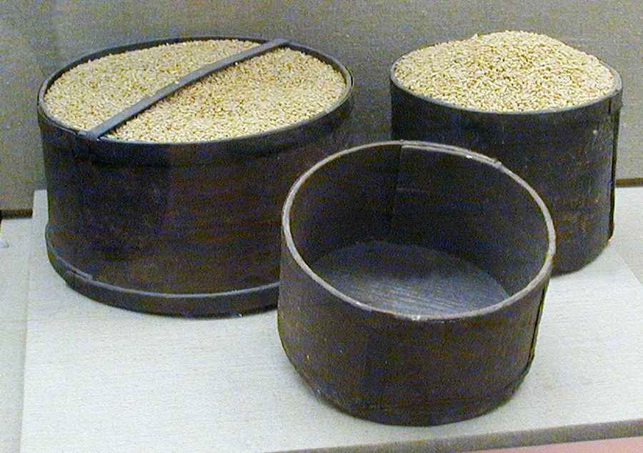

# Human-made Things in the Bible

## License Information

Human-made Things in the Bible © United Bible Societies, 2025. Adapted from: <cite>The Works of Their Hands: Man-made Things in the Bible</cite>, by Ray Pritz © 2009 United Bible Societies. This work is licensed under Creative Commons Attribution-ShareAlike 4.0 International (<a href="https://creativecommons.org/licenses/by-sa/4.0/">https://creativecommons.org/licenses/by-sa/4.0/</a>).

--------------------------------

## Measures of volume (id: REALIA:11.3)

11\.3 Measures of volume
========================

References:
-----------

Estimates of volume vary in different authorities by a factor of two. In other words, according to some authorities the figures given above for Old Testament capacities should all be doubled.
-----------------------------------------------------------------------------------------------------------------------------------------------------------------------------------------------

**Dry measure**

Name: Kor (*kor*, *koros*)

Equivalence: 10 ephahs

Metric: 220 liters

Imperial: 6 bushels

Name: Homer (*chomer*)

Equivalence: 10 ephahs

Metric: 220 liters

Imperial: 6 bushels

Name: *Artabē*

Equivalence:——

Metric: 50 liters

Imperial: 12\.5 gallons

Name: Ephah (*’eyfah*)

Equivalence:——

Metric: 22 liters

Imperial: 0\.6 bushels

Name: Seah (*se’ah*, *saton*)

Equivalence: 0\.3 ephah

Metric: 7 liters

Imperial: 7 quarts

Name: Omer (*‘omer*)

Equivalence: 0\.1 ephah

Metric: 2\.2 liters

Imperial: 2\.2 quarts

Name: Qab (*qav*)

Equivalence: 0\.05 ephah

Metric: 1\.2 liters

Imperial: 1\.2 quarts

Name: Choinix

Equivalence:——

Metric: 1 liter

Imperial: 1 quart

**Liquid measure**

Name: Kor (*kor*)

Equivalence: 10 baths

Metric: 220 liters

Imperial: 60 gallons

Name: *Metrētēs*

Equivalence:——

Metric: 40 liters

Imperial: 10 gallons

Name: Bath (*bath*, *batos*)

Equivalence:——

Metric: 22 liters

Imperial: 6 gallons

Name: Hin (*hin*)

Equivalence: 1/6 bath

Metric: 4 liters

Imperial: 4 quarts

Name: Log (*log*)

Equivalence: 1/72 bath

Metric: 0\.3 liter

Imperial: 0\.3 quart

## Measures of volume in the Old Testament (id: REALIA:11.3.1)

11\.3\.1 Measures of volume in the Old Testament
================================================

Schneider has suggested substituting the names of known containers that contain approximately the volume or capacity indicated by the biblical name. Thus, for example, some cultures will have a special name for a basket or sack that holds about 25 liters (50 pounds) of grain, which is approximately equal to the *’eyfah*. It is recommended that translators investigate this possibility in their own setting. A word of caution, however, is in order. One should avoid words that are clearly anachronistic, words which indicate containers made of plastic or tin alloy. Thus, for example, in [LEV 14:10](https://ref.ly/Lev14:10) the *’eyfah* of fine flour is to be mixed with a *log* (about half a liter) of oil. It would be inappropriate to say “mixed with one can of oil,” although it would be possible to say “mixed with two cups of oil.” 

*Measures of volume (© Ray Pritz by United Bible Societies)*
----------------------------------------------------------------------------------------------------------------------------------------------------------------------------------------------------------------------------------------------------------------------------------------------------------------------------------------------------------------------------------------------------------------------------------------------------------------------------------------------------------------------------------------------------------------------------------------------------------------------------------------------------------------------------------------------------------------------------------------------------------------------------------------------------------------------------------------------------------------------------------------------------------------------------------------------------------------------------------------------------------

* **Associated Passages:** Leviticus 14:10

## Qab (id: REALIA:11.3.1.1)

11\.3\.1\.1 Qab
===============

References:
-----------

Hebrew קַב (qav)

[2KI 6:25](https://ref.ly/2Kgs6:25)

[2KI 6:25](https://ref.ly/2Kgs6:25): The one\-fourth of a *qav* here is equal to about half a liter. GNT (Good News Translation (1992)) has “half a pound.” CEV (Contemporary English Version) prefers to use a container, saying “a small bowl.” This will be a good solution in most cases.
---------------------------------------------------------------------------------------------------------------------------------------------------------------------------------------------------------------------------------------------------------------------------------------------

* **Associated Passages:** 2 Kings 6:25

## Seah (id: REALIA:11.3.1.2)

11\.3\.1\.2 Seah
================

References:
-----------

Hebrew סְאָה (s’ah)

[GEN 18:6](https://ref.ly/Gen18:6), [1SA 25:18](https://ref.ly/1Sam25:18), [1KI 18:32](https://ref.ly/1Kgs18:32), [2KI 7:1](https://ref.ly/2Kgs7:1), [2KI 7:1](https://ref.ly/2Kgs7:1), [2KI 7:16](https://ref.ly/2Kgs7:16), [2KI 7:16](https://ref.ly/2Kgs7:16), [2KI 7:18](https://ref.ly/2Kgs7:18), [2KI 7:18](https://ref.ly/2Kgs7:18)

[GEN 18:6](https://ref.ly/Gen18:6): Abraham tells Sarah to prepare “three seahs” of flour for the guests. What is important here is that this represents a relatively large amount of flour, perhaps indicating Abraham’s generosity toward his guests. A good model is CEV (Contemporary English Version) “a large sack.”
--------------------------------------------------------------------------------------------------------------------------------------------------------------------------------------------------------------------------------------------------------------------------------------------------------------------------

[1SA 25:18](https://ref.ly/1Sam25:18): Abigail prepares “five seahs” of roasted grain for David’s men. Some modern translations say “a bushel” (NCV (New Century Version); GNT (Good News Translation (1992)) is more generous with “two bushels) or “about forty liters” (SPCL (Spanish Common Language Version (Dios Habla Hoy))). It is effective to give the name of a container; thus CEV (Contemporary English Version) and ITCL (Italian Common Language Version) have “a large sack.”

[1KI 18:32](https://ref.ly/1Kgs18:32): Elijah digs a trench around the altar, “large enough for two seahs of seed” (similarly NIV (New International Version (1984))). This is about 12 or 13 quarts, or about 11\.5 liters, which is not a large amount. It has long been suggested that this speaks of the area that can be sown with this amount of seed, and in fact ancient Jewish authorities even calculated the area as 5,000 square cubits. If this is the intention, then it is clearly an exaggeration. Most translations give the idea that the volume of the trench was the same as that volume of seed, which would make a small and unimpressive trench. GECL (German Common Language Version (Gute Nachricht Bibel)), however, says “so wide that it would have been possible to sow twelve kilos of seed in it.” GNT (Good News Translation (1992)) changes the dry measure to a liquid one, saying “large enough to hold about four gallons of water.”

[2KI 7:1](https://ref.ly/2Kgs7:1); [2KI 7:1](https://ref.ly/2Kgs7:1); [2KI 7:16](https://ref.ly/2Kgs7:16); [2KI 7:16](https://ref.ly/2Kgs7:16); [2KI 7:18](https://ref.ly/2Kgs7:18); [2KI 7:18](https://ref.ly/2Kgs7:18): The point of Elisha’s prophecy here is that prices will drop drastically and that what had been impossible to obtain will be plentiful and cheap. Here it is important that the amount to be paid seem like a very small amount considering what is being bought. However, this is the kind of thing which becomes quickly outdated in a translation. The translator might wish to add a qualifying phrase such as “XX will be sold for *as little as* YY.” For the last half of [2KI 7:1](https://ref.ly/2Kgs7:1), CEV (Contemporary English Version) provides a good model: “you will be able to buy a large sack of flour or two large sacks of barley for almost nothing.”

* **Associated Passages:** Genesis 18:6; 1 Samuel 25:18; 1 Kings 18:32; 2 Kings 7:1; 2 Kings 7:16; 2 Kings 7:18

* **Associated ACAI Concepts:** Seah (ID: `realia:Seah`)

## Ephah (id: REALIA:11.3.1.3)

11\.3\.1\.3 Ephah
=================

References:
-----------

Hebrew אֵיפָה (’eyfah)

[EXO 16:36](https://ref.ly/Exod16:36), [LEV 5:11](https://ref.ly/Lev5:11), [LEV 6:13](https://ref.ly/Lev6:13), [LEV 19:36](https://ref.ly/Lev19:36), [NUM 5:15](https://ref.ly/Num5:15), [NUM 28:5](https://ref.ly/Num28:5), [DEU 25:14](https://ref.ly/Deut25:14), [DEU 25:14](https://ref.ly/Deut25:14), [DEU 25:15](https://ref.ly/Deut25:15), [JDG 6:19](https://ref.ly/Judg6:19), [RUT 2:17](https://ref.ly/Ruth2:17), [1SA 1:24](https://ref.ly/1Sam1:24), [1SA 17:17](https://ref.ly/1Sam17:17), [PRO 20:10](https://ref.ly/Prov20:10), [PRO 20:10](https://ref.ly/Prov20:10), [ISA 5:10](https://ref.ly/Isa5:10), [EZK 45:10](https://ref.ly/Ezek45:10), [EZK 45:11](https://ref.ly/Ezek45:11), [EZK 45:11](https://ref.ly/Ezek45:11), [EZK 45:13](https://ref.ly/Ezek45:13), [EZK 45:13](https://ref.ly/Ezek45:13), [EZK 45:24](https://ref.ly/Ezek45:24), [EZK 45:24](https://ref.ly/Ezek45:24), [EZK 45:24](https://ref.ly/Ezek45:24), [EZK 46:5](https://ref.ly/Ezek46:5), [EZK 46:5](https://ref.ly/Ezek46:5), [EZK 46:7](https://ref.ly/Ezek46:7), [EZK 46:7](https://ref.ly/Ezek46:7), [EZK 46:7](https://ref.ly/Ezek46:7), [EZK 46:11](https://ref.ly/Ezek46:11), [EZK 46:11](https://ref.ly/Ezek46:11), [EZK 46:11](https://ref.ly/Ezek46:11), [EZK 46:14](https://ref.ly/Ezek46:14), [AMO 8:5](https://ref.ly/Amos8:5), [MIC 6:10](https://ref.ly/Mic6:10), [ZEC 5:6](https://ref.ly/Zech5:6), [ZEC 5:7](https://ref.ly/Zech5:7), [ZEC 5:8](https://ref.ly/Zech5:8), [ZEC 5:9](https://ref.ly/Zech5:9), [ZEC 5:10](https://ref.ly/Zech5:10)

The *’eyfah* is the dry equivalent to the *bath* liquid measure.
----------------------------------------------------------------

In six of the above passages ([EXO 16:36](https://ref.ly/Exod16:36); [LEV 5:11](https://ref.ly/Lev5:11); [LEV 14:21](https://ref.ly/Lev14:21); [NUM 5:15](https://ref.ly/Num5:15); [NUM 15:4](https://ref.ly/Num15:4); [NUM 28:5](https://ref.ly/Num28:5)), the quantity mentioned is 1/10 of an *’eyfah*, which equals an *‘omer* (see [EXO 16:36](https://ref.ly/Exod16:36)). In these passages it will be possible to use the same word that has been chosen to render *‘omer*.

[LEV 19:36](https://ref.ly/Lev19:36): This command to have just measures may need to be adjusted in some languages. It is not the absolute value of the *’eyfah* or the *hin* which should be just, but rather the accurate capacity of the containers that are supposed to measure them. A merchant should not be doing business with a container that is supposed to contain an *’eyfah* but which actually holds less. It is possible to expand this to include enough extra information to give the reader understanding. Thus for the literal phrase “a just ephah, and a just hin” (RSV (Revised Standard Version (1952))), NCV (New Century Version) has “with your weighing baskets the right size and your jars holding the right amount of liquid.” This, however, may be too cumbersome. Perhaps best is CEV (Contemporary English Version) with “don’t cheat when you … measure anything.”

* **Associated Passages:** Exodus 16:36; Leviticus 5:11; Leviticus 6:13; Leviticus 19:36; Numbers 5:15; Numbers 28:5; Deuteronomy 25:14; Deuteronomy 25:15; Judges 6:19; Ruth 2:17; 1 Samuel 1:24; 1 Samuel 17:17; Proverbs 20:10; Isaiah 5:10; Ezekiel 45:10; Ezekiel 45:11; Ezekiel 45:13; Ezekiel 45:24; Ezekiel 46:5; Ezekiel 46:7; Ezekiel 46:11; Ezekiel 46:14; Amos 8:5; Micah 6:10; Zechariah 5:6; Zechariah 5:7; Zechariah 5:8; Zechariah 5:9; Zechariah 5:10; Leviticus 14:21; Numbers 15:4

* **Associated ACAI Concepts:** Ephah (ID: `realia:Ephah`)

## Homer (id: REALIA:11.3.1.4)

11\.3\.1\.4 Homer
=================

References:
-----------

Hebrew חֹמֶר (chomer)

[LEV 27:16](https://ref.ly/Lev27:16), [NUM 11:32](https://ref.ly/Num11:32), [ISA 5:10](https://ref.ly/Isa5:10), [EZK 45:11](https://ref.ly/Ezek45:11), [EZK 45:11](https://ref.ly/Ezek45:11), [EZK 45:11](https://ref.ly/Ezek45:11), [EZK 45:13](https://ref.ly/Ezek45:13), [EZK 45:13](https://ref.ly/Ezek45:13), [EZK 45:14](https://ref.ly/Ezek45:14), [EZK 45:14](https://ref.ly/Ezek45:14), [HOS 3:2](https://ref.ly/Hos3:2)

The derivation of the Hebrew word *chomer* suggests that it originally indicated the quantity of grain which was carried by a donkey.
-------------------------------------------------------------------------------------------------------------------------------------

[LEV 27:16](https://ref.ly/Lev27:16): The amount of seed used to value a field here (50 shekels per *chomer*) is the amount that it will yield, not the amount used to sow it. In other words, it is an estimate of the field’s worth, not its area.

[ISA 5:10](https://ref.ly/Isa5:10): The Hebrew text here compares two capacities of measure, the *chomer* and the *’eyfah*, which was equal to one tenth of a *chomer*. It is important to try to retain that the ratio of one unit of seed planted yields only one tenth of that unit in harvest. If this can be done, then the precise capacities of the *chomer* and the *’eyfah* are less important. The point here is that harvest yields will be extremely poor. Most translations emphasize this by adding a word like “only,” “barely,” or “merely.”

[EZK 45:11](https://ref.ly/Ezek45:11); [EZK 45:11](https://ref.ly/Ezek45:11); [EZK 45:11](https://ref.ly/Ezek45:11); [EZK 45:13](https://ref.ly/Ezek45:13); [EZK 45:13](https://ref.ly/Ezek45:13); [EZK 45:14](https://ref.ly/Ezek45:14); [EZK 45:14](https://ref.ly/Ezek45:14): This passage equates the ephah and the bath. Both are one\-tenth of a homer. See also the comments under *’eyfah* above, [11\.3\.1\.3 Ephah\<REALIA:11\.3\.1\.3\>](#).

[HOS 3:2](https://ref.ly/Hos3:2): The total amount paid by Hosea for his wife was not very large. It was somewhat less than a bride price (compare [DEU 22:29](https://ref.ly/Deut22:29)) and similar to the price to be paid for a slave (compare [GEN 37:28](https://ref.ly/Gen37:28); [EXO 21:32](https://ref.ly/Exod21:32)). The mixture of silver and barley is unusual. The exact amount of barley cannot be known, because the text adds another Hebrew word, *lethek*, the value of which is unknown. Some commentators and translations understand it to be half the volume of a *chomer*, but this is only a guess. The Hebrew for the last part of this verse is literally “a homer of barley and a lethek of barley.”

Some translations follow the Septuagint, which has “a homer of barley and a wineskin of wine.”

* **Associated Passages:** Leviticus 27:16; Numbers 11:32; Isaiah 5:10; Ezekiel 45:11; Ezekiel 45:13; Ezekiel 45:14; Hosea 3:2; Deuteronomy 22:29; Genesis 37:28; Exodus 21:32

* **Associated ACAI Concepts:** Homer (ID: `realia:Homer`)

## Kor (id: REALIA:11.3.1.5)

11\.3\.1\.5 Kor
===============

References:
-----------

Hebrew כֹּר (kor)

[1KI 5:2](https://ref.ly/1Kgs5:2), [1KI 5:2](https://ref.ly/1Kgs5:2), [1KI 5:25](https://ref.ly/1Kgs5:25), [1KI 5:25](https://ref.ly/1Kgs5:25), [2CH 2:9](https://ref.ly/2Chr2:9), [2CH 2:9](https://ref.ly/2Chr2:9), [2CH 27:5](https://ref.ly/2Chr27:5), [EZK 45:14](https://ref.ly/Ezek45:14)

Aramaic כֹּר (kor)

[EZR 7:22](https://ref.ly/Ezra7:22)

According to [EZK 45:14](https://ref.ly/Ezek45:14), the *kor* is the same as the *chomer*.
------------------------------------------------------------------------------------------

[1KI 5:25](https://ref.ly/1Kgs5:25); [1KI 5:25](https://ref.ly/1Kgs5:25); [2CH 2:9](https://ref.ly/2Chr2:9); [2CH 2:9](https://ref.ly/2Chr2:9): The amount of oil which Solomon provides to Hiram is different by a factor of one hundred between these two verses. [1KI 5:25](https://ref.ly/1Kgs5:25); [1KI 5:25](https://ref.ly/1Kgs5:25) has “20 cors,” while the parallel text in [2CH 2:9](https://ref.ly/2Chr2:9); [2CH 2:9](https://ref.ly/2Chr2:9) has “20,000 baths.” HOTTP (Hebrew Old Testament Text Project (UBS)) accepts “twenty cors” as the best reading at [1KI 5:25](https://ref.ly/1Kgs5:25); [1KI 5:25](https://ref.ly/1Kgs5:25) and remarks that the translator should resist the temptation to harmonize the two texts. Not all commentators and translations agree with HOTTP (Hebrew Old Testament Text Project (UBS)) ’s reading, however, and some prefer to accept the Septuagint’s “20,000 baths,” which brings the two texts into line.

* **Associated Passages:** 1 Kings 5:2; 1 Kings 5:25; 2 Chronicles 2:9; 2 Chronicles 27:5; Ezekiel 45:14; Ezra 7:22

* **Associated ACAI Concepts:** Kor (ID: `realia:Kor`)

## Omer (id: REALIA:11.3.1.6)

11\.3\.1\.6 Omer
================

References:
-----------

Hebrew עֹמֶר (‘omer)

[EXO 16:16](https://ref.ly/Exod16:16), [EXO 16:18](https://ref.ly/Exod16:18), [EXO 16:22](https://ref.ly/Exod16:22), [EXO 16:32](https://ref.ly/Exod16:32), [EXO 16:33](https://ref.ly/Exod16:33), [EXO 16:36](https://ref.ly/Exod16:36)

In [EXO 16:16](https://ref.ly/Exod16:16) the *‘omer* was the amount of manna to be gathered. It is expressed by many translations as “two quarts” (GNT (Good News Translation (1992))). Luther and GECL (German Common Language Version (Gute Nachricht Bibel)) prefer a container of appropriate size, saying “a jar full.” [EXO 16:36](https://ref.ly/Exod16:36) defines an omer as 1/10 of an ephah.
-------------------------------------------------------------------------------------------------------------------------------------------------------------------------------------------------------------------------------------------------------------------------------------------------------------------------------------------------------------------------------------------------------

* **Associated Passages:** Exodus 16:16; Exodus 16:18; Exodus 16:22; Exodus 16:32; Exodus 16:33; Exodus 16:36

* **Associated ACAI Concepts:** Omer (ID: `realia:Omer`)

## Log (id: REALIA:11.3.1.7)

11\.3\.1\.7 Log
===============

References:
-----------

Hebrew לֹג (log)

[LEV 14:10](https://ref.ly/Lev14:10), [LEV 14:12](https://ref.ly/Lev14:12), [LEV 14:15](https://ref.ly/Lev14:15), [LEV 14:21](https://ref.ly/Lev14:21), [LEV 14:24](https://ref.ly/Lev14:24)

The *log* was the amount of oil to be mixed with offerings for cleansing lepers. It would be equal to about a measuring cup used in modern cooking recipes.
-----------------------------------------------------------------------------------------------------------------------------------------------------------

* **Associated Passages:** Leviticus 14:10; Leviticus 14:12; Leviticus 14:15; Leviticus 14:21; Leviticus 14:24

* **Associated ACAI Concepts:** Log (ID: `realia:Log`)

## Hin (id: REALIA:11.3.1.8)

11\.3\.1\.8 Hin
===============

References:
-----------

Hebrew הִין (hin)

[EXO 29:40](https://ref.ly/Exod29:40), [EXO 29:40](https://ref.ly/Exod29:40), [EXO 30:24](https://ref.ly/Exod30:24), [LEV 19:36](https://ref.ly/Lev19:36), [LEV 23:13](https://ref.ly/Lev23:13), [NUM 15:4](https://ref.ly/Num15:4), [NUM 15:5](https://ref.ly/Num15:5), [NUM 15:6](https://ref.ly/Num15:6), [NUM 15:7](https://ref.ly/Num15:7), [NUM 15:9](https://ref.ly/Num15:9), [NUM 15:10](https://ref.ly/Num15:10), [NUM 28:5](https://ref.ly/Num28:5), [NUM 28:7](https://ref.ly/Num28:7), [NUM 28:14](https://ref.ly/Num28:14), [NUM 28:14](https://ref.ly/Num28:14), [NUM 28:14](https://ref.ly/Num28:14), [EZK 4:11](https://ref.ly/Ezek4:11), [EZK 45:24](https://ref.ly/Ezek45:24), [EZK 46:5](https://ref.ly/Ezek46:5), [EZK 46:7](https://ref.ly/Ezek46:7), [EZK 46:11](https://ref.ly/Ezek46:11), [EZK 46:14](https://ref.ly/Ezek46:14)

The *hin* was a liquid measure for wine and oil for the sacrifices and for mixing the incense to be used in the Tabernacle.
---------------------------------------------------------------------------------------------------------------------------

[LEV 19:36](https://ref.ly/Lev19:36): See the comments under *’eyfah* above, [11\.3\.1\.3 Ephah\<REALIA:11\.3\.1\.3\>](#).

[EZK 4:11](https://ref.ly/Ezek4:11): GW (God's Word Translation) and NCV (New Century Version) give the amount of water Ezekiel can drink as he acts out the siege as “two\-thirds of a quart.” GNT (Good News Translation (1992)) conveys the picture nicely with “two cups” (similarly CEV (Contemporary English Version) “two large cups”).

* **Associated Passages:** Exodus 29:40; Exodus 30:24; Leviticus 19:36; Leviticus 23:13; Numbers 15:4; Numbers 15:5; Numbers 15:6; Numbers 15:7; Numbers 15:9; Numbers 15:10; Numbers 28:5; Numbers 28:7; Numbers 28:14; Ezekiel 4:11; Ezekiel 45:24; Ezekiel 46:5; Ezekiel 46:7; Ezekiel 46:11; Ezekiel 46:14

* **Associated ACAI Concepts:** Hin (ID: `realia:Hin`)

## Bath (id: REALIA:11.3.1.9)

11\.3\.1\.9 Bath
================

References:
-----------

Hebrew בַּת (bath)

[1KI 7:26](https://ref.ly/1Kgs7:26), [1KI 7:38](https://ref.ly/1Kgs7:38), [2CH 2:9](https://ref.ly/2Chr2:9), [2CH 2:9](https://ref.ly/2Chr2:9), [2CH 4:5](https://ref.ly/2Chr4:5), [ISA 5:10](https://ref.ly/Isa5:10), [EZK 45:10](https://ref.ly/Ezek45:10), [EZK 45:11](https://ref.ly/Ezek45:11), [EZK 45:11](https://ref.ly/Ezek45:11), [EZK 45:14](https://ref.ly/Ezek45:14), [EZK 45:14](https://ref.ly/Ezek45:14), [EZK 45:14](https://ref.ly/Ezek45:14), [EZK 45:14](https://ref.ly/Ezek45:14)

The *bath* is the liquid equivalent to the *’eyfah* dry measure.
----------------------------------------------------------------

[1KI 7:26](https://ref.ly/1Kgs7:26); [2CH 4:5](https://ref.ly/2Chr4:5): In these verses the capacity of the bronze Sea is given according to the *bath* measure. Since scholars do not agree on the size of the *bath*, translations differ wildly on the capacity of the bronze Sea in [1KI 7:26](https://ref.ly/1Kgs7:26): 80,000 liters (FRCL (French Common Language Version (Bible en français courant))), 40,000 liters (GECL (German Common Language Version (Gute Nachricht Bibel))), 11,000 gallons (CEV (Contemporary English Version)), 10,000 gallons (GNT (Good News Translation (1992))), and so. It is to be noted that [1KI 7:26](https://ref.ly/1Kgs7:26) gives the capacity as 2,000 baths, while [2CH 4:5](https://ref.ly/2Chr4:5) has 3,000 baths. Translators should not try to harmonize these figures. See also the discussion under [4\.3\.2 Temple: Sea, tank\<REALIA:4\.3\.2\>](#).

[ISA 5:10](https://ref.ly/Isa5:10): See the comments under *chomer* above, [11\.3\.1\.4 Homer\<REALIA:11\.3\.1\.4\>](#).

[EZK 45:10](https://ref.ly/Ezek45:10); [EZK 45:11](https://ref.ly/Ezek45:11); [EZK 45:11](https://ref.ly/Ezek45:11); [EZK 45:14](https://ref.ly/Ezek45:14); [EZK 45:14](https://ref.ly/Ezek45:14); [EZK 45:14](https://ref.ly/Ezek45:14); [EZK 45:14](https://ref.ly/Ezek45:14): This passage equates the ephah and the bath. They are both one\-tenth of a homer.

* **Associated Passages:** 1 Kings 7:26; 1 Kings 7:38; 2 Chronicles 2:9; 2 Chronicles 4:5; Isaiah 5:10; Ezekiel 45:10; Ezekiel 45:11; Ezekiel 45:14

* **Associated ACAI Concepts:** Bath (ID: `realia:Bath`)

## Lethek (id: REALIA:11.3.1.10)

11\.3\.1\.10 Lethek
===================

References:
-----------

Hebrew לֵתֶךְ (lethek)

[HOS 3:2](https://ref.ly/Hos3:2)

See the discussion under *chomer* above, [11\.3\.1\.4 Homer\<REALIA:11\.3\.1\.4\>](#).
--------------------------------------------------------------------------------------

* **Associated Passages:** Hosea 3:2

## Shalish (id: REALIA:11.3.1.11)

11\.3\.1\.11 Shalish
====================

References:
-----------

Hebrew שָׁלִישׁ (shalish)

[PSA 80:6](https://ref.ly/Ps80:6), [ISA 40:12](https://ref.ly/Isa40:12)

Many commentators understand the Hebrew word *shalish* to refer not to a specific measure of volume but rather to some container. The word literally means “a third.”
---------------------------------------------------------------------------------------------------------------------------------------------------------------------

[PSA 80:6](https://ref.ly/Ps80:6): Here *shalish* may refer to a large drinking vessel. The point here is that the sorrow of God’s people is great, as indicated by the abundance of their tears. For the second line of this verse, GNT (Good News Translation (1992)) has “a large cup of tears to drink,” while NIV (New International Version (1984)) says “you have made them drink tears by the bowlful” (similarly CEV (Contemporary English Version)). TOB (Traduction Oecuménique de la Bible (French, 1975)) translates “a triple measure of tears to drink.”

[ISA 40:12](https://ref.ly/Isa40:12): Translations give a variety of interpretations to the word *shalish* here, including “bucket” (CEV (Contemporary English Version)), “cup” (GNT (Good News Translation (1992))), “bowl” (NCV (New Century Version)), and “basket” (NIV (New International Version (1984))). However, almost all agree in using some kind of container.

* **Associated Passages:** Psalms 80:6; Isaiah 40:12

## Measures of volume in the New Testament and the Deuterocanon (id: REALIA:11.3.2)

11\.3\.2 Measures of volume in the New Testament and the Deuterocanon
=====================================================================

## Saton (id: REALIA:11.3.2.1)

11\.3\.2\.1 Saton
=================

References:
-----------

Greek σάτον (saton)

[MAT 13:33](https://ref.ly/Matt13:33), [LUK 13:21](https://ref.ly/Luke13:21)

[MAT 13:33](https://ref.ly/Matt13:33): The precise amount of flour is not important here, although the translation will want to indicate that it is a relatively large amount. Translators sometimes render “three measures” (RSV (Revised Standard Version (1952))) as “three containers” or as three of some well\-known local equivalent measure, such as “three pans.” The other choice would be to use whatever the local way would be of speaking about approximately 50 pounds or 40 liters of flour; for example, GNT (Good News Translation (1992)) has “a bushel.” Common\-language translations tend to avoid using a specific volume. CEV (Contemporary English Version) has “three big batches,” NCV (New Century Version) renders “a large tub,” and GW (God's Word Translation) and ITCL (Italian Common Language Version) say simply “a large amount.”
----------------------------------------------------------------------------------------------------------------------------------------------------------------------------------------------------------------------------------------------------------------------------------------------------------------------------------------------------------------------------------------------------------------------------------------------------------------------------------------------------------------------------------------------------------------------------------------------------------------------------------------------------------------------------------------------------------------------------------------------------------------------------------------------------------------------------------------------------------------------

* **Associated Passages:** Matthew 13:33; Luke 13:21

* **Associated ACAI Concepts:** Saton (ID: `realia:Saton`)

## Bath, Kor (id: REALIA:11.3.2.2)

11\.3\.2\.2 Bath, Kor
=====================

References:
-----------

Greek βάτος (batos)

[LUK 16:6](https://ref.ly/Luke16:6)

Greek κόρος (koros)

[LUK 16:7](https://ref.ly/Luke16:7), [1ES 8:20](https://ref.ly/1Esd8:20)

[LUK 16:6](https://ref.ly/Luke16:6); [LUK 16:7](https://ref.ly/Luke16:7): Since the point of this parable is that the steward settled the bills for a lesser amount, the exact quantity of the *batos* (equals the Old Testament *bath*) and *koros* (equals the Old Testament *kor*) is not really in focus, except that the quantities in question are fairly large. RSV (Revised Standard Version (1952)) simply renders both words as “measures,” which will adequately convey the idea. *A Handbook on The Gospel of Luke* suggests that “one may adjust the renderings of ‘hundred’ and ‘fifty’ in such a way that the sum total approximately agrees with the original” (page 561\). This seems unnecessarily cumbersome. (See also the comments of Louw and Nida, who say it is important to retain the possibly symbolic numerical values.) Common\-language translations often render these words according to containers rather than according to specific volume. Thus GECL (German Common Language Version (Gute Nachricht Bibel))DUCL (Dutch Common Language Version)ITCL (Italian Common Language Version) have “barrels of \[olive] oil” and “sacks of grain.” This will be the best solution in many cases.
----------------------------------------------------------------------------------------------------------------------------------------------------------------------------------------------------------------------------------------------------------------------------------------------------------------------------------------------------------------------------------------------------------------------------------------------------------------------------------------------------------------------------------------------------------------------------------------------------------------------------------------------------------------------------------------------------------------------------------------------------------------------------------------------------------------------------------------------------------------------------------------------------------------------------------------------------------------------------------------------------------------------------------------------------------------------------------------------------------------------------------------------------------------------------------------------------------------------------

* **Associated Passages:** Luke 16:6; Luke 16:7; 1 Esdras (Greek) 8:20

* **Associated ACAI Concepts:** Kor (ID: `realia:Kor.2`)

## Choinix (id: REALIA:11.3.2.3)

11\.3\.2\.3 Choinix
===================

References:
-----------

Greek χοῖνιξ (choinix)

[REV 6:6](https://ref.ly/Rev6:6), [REV 6:6](https://ref.ly/Rev6:6)

[REV 6:6](https://ref.ly/Rev6:6); [REV 6:6](https://ref.ly/Rev6:6): The *choinix* was approximately equal to a liter or a quart, and it is possible to make a straight substitution without changing the numbers.
-----------------------------------------------------------------------------------------------------------------------------------------------------------------------------------------------------------------

* **Associated Passages:** Revelation 6:6

## 
 (id: REALIA:11.3.2.4)

11\.3\.2\.4
===========

References:
-----------

Greek μετρητής (metrētēs)

[JHN 2:6](https://ref.ly/John2:6), [BEL 1:3](https://ref.ly/Bel1:3), [1ES 8:20](https://ref.ly/1Esd8:20)

[JHN 2:6](https://ref.ly/John2:6): The capacity of these stone jars is given as “between two and three measures,” that is, twenty to thirty gallons (about 80–120 liters). When expressing the capacity of these jars, it is important to indicate that they were large; it is less important to give precise capacities. GW (God's Word Translation) “18 to 27 gallons” is too precise. It is also possible to give an average volume rather than a range; for example, GECL (German Common Language Version (Gute Nachricht Bibel)) and PV have “about a hundred liters.” See also the illustration and discussion at [5\.18\.1\.1 Stone jar\<REALIA:5\.18\.1\.1\>](#).
-------------------------------------------------------------------------------------------------------------------------------------------------------------------------------------------------------------------------------------------------------------------------------------------------------------------------------------------------------------------------------------------------------------------------------------------------------------------------------------------------------------------------------------------------------------------------------------------------------------------------------------------------------------------------

* **Associated Passages:** John 2:6; Bel and the Dragon 1:3; 1 Esdras (Greek) 8:20

## 
 (id: REALIA:11.3.2.5)

11\.3\.2\.5
===========

References:
-----------

Greek ἀρτάβη (artabē)

[BEL 1:3](https://ref.ly/Bel1:3)

[BEL 1:3](https://ref.ly/Bel1:3): The *artabē* was a Persian measure of volume equivalent to about 50 liters or 13 gallons. The text says the Babylonians were bringing twelve of these measures of flour every day to their idol Bel. This was a huge amount since each *artabē* was equal to a large sack in volume. It is not necessary in translation to attempt to give a precise equivalent here. Where a roughly equivalent volume measure is known, it should be used; for example, RSV (Revised Standard Version (1952))GNT (Good News Translation (1992))NJB (New Jerusalem Bible (1985)) say “twelve bushels,” and ITCL (Italian Common Language Version) has “twelve sacks.” Another possible rendering is “enough flour to feed several hundred people.”
---------------------------------------------------------------------------------------------------------------------------------------------------------------------------------------------------------------------------------------------------------------------------------------------------------------------------------------------------------------------------------------------------------------------------------------------------------------------------------------------------------------------------------------------------------------------------------------------------------------------------------------------------------------------------------------------------------------------------------------------------------------------

* **Associated Passages:** Bel and the Dragon 1:3

