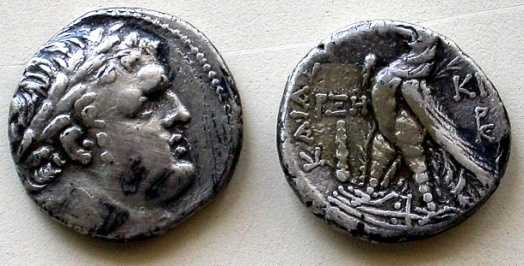

# Human-made Things in the Bible

## License Information

Human-made Things in the Bible © United Bible Societies, 2025. Adapted from: <cite>The Works of Their Hands: Man-made Things in the Bible</cite>, by Ray Pritz © 2009 United Bible Societies. This work is licensed under Creative Commons Attribution-ShareAlike 4.0 International (<a href="https://creativecommons.org/licenses/by-sa/4.0/">https://creativecommons.org/licenses/by-sa/4.0/</a>).

--------------------------------

## Greek coins (id: REALIA:11.6.2)

11\.6\.2 Greek coins
====================

argurion, see [1\.6\.3 Money, coins\<REALIA:1\.6\.3\>](#).

## Assarion (id: REALIA:11.6.2.1)

11\.6\.2\.1 Assarion
====================

References:
-----------

Greek ἀσσάριον (assarion)

[MAT 10:29](https://ref.ly/Matt10:29), [LUK 12:6](https://ref.ly/Luke12:6)

The Greek words *assarion*, *kodrantēs* and *lepton* ([11\.6\.2\.2 Kodrantes\<REALIA:11\.6\.2\.2\>](#) and [11\.6\.2\.3 Lepton\<REALIA:11\.6\.2\.3\>](#)) refer to small coins. Each of these words may be rendered “very small coin,” “coin with very little value,” or “money that was not worth very much.” Generally the same word or phrase may be used for all three, except in [MRK 12:42](https://ref.ly/Mark12:42), where two *lepta* equal a *kodrantēs*.
-------------------------------------------------------------------------------------------------------------------------------------------------------------------------------------------------------------------------------------------------------------------------------------------------------------------------------------------------------------------------------------------------------------------------------------------------------------------

For the *assarion*, translations generally choose a very low denomination coin in [MAT 10:29](https://ref.ly/Matt10:29); [LUK 12:6](https://ref.ly/Luke12:6), for example, “a penny” (so RSV (Revised Standard Version (1952))GNT (Good News Translation (1992))). The meaning of Jesus’ saying is well conveyed also by PV, which says “for almost nothing.”

* **Associated Passages:** Matthew 10:29; Luke 12:6; Mark 12:42

## Kodrantes (id: REALIA:11.6.2.2)

11\.6\.2\.2 Kodrantes
=====================

References:
-----------

Greek κοδράντης (kodrantēs)

[MAT 5:26](https://ref.ly/Matt5:26), [MRK 12:42](https://ref.ly/Mark12:42)

*Tiberian quadrans or kodrantes, similar to a penny (© Kwo\-Wei Peng by United Bible Societies)*

Kodrantes:

[MAT 5:26](https://ref.ly/Matt5:26): At the end of this verse most translations have something like “until you have paid the last penny” (NIV (New International Version (1984))). It is also possible to express this well without naming a specific coin; for example, NCV (New Century Version) and PV say “until you have paid everything you owe.” Some scholars think it more likely, however, more likely that this clause means “until you have paid off all the money the judge fined you \[or, said you must pay].” Compare GNT (Good News Translation (1992)), which reads “until you pay the last penny of your fine” (similarly GW (God's Word Translation)).

[MRK 12:42](https://ref.ly/Mark12:42): At the end of this verse the Greek says literally “two lepta, which are a kodrantes.” Many translations expand “two lepta” somewhat to “two small copper coins” (NCV (New Century Version)), and then indicate that they were worth very little by saying they were worth “a penny” (RSV (Revised Standard Version (1952))), “a few cents” (NCV (New Century Version)), “less than a cent” (GW (God's Word Translation)), “about a penny” (GNT (Good News Translation (1992))), or “of very low value” (SPCL (Spanish Common Language Version (Dios Habla Hoy))). ITCL (Italian Common Language Version) omits the second phrase, since the purpose of that phrase in the original text was to explain to Mark’s readers the value of the lesser known *lepton*.

* **Associated Passages:** Matthew 5:26; Mark 12:42

## Lepton (id: REALIA:11.6.2.3)

11\.6\.2\.3 Lepton
==================

References:
-----------

Greek λεπτόν (lepton)

[MRK 12:42](https://ref.ly/Mark12:42), [LUK 12:59](https://ref.ly/Luke12:59), [LUK 21:2](https://ref.ly/Luke21:2)

See the comments under *kodrantēs* above, [11\.6\.2\.2 Kodrantes\<REALIA:11\.6\.2\.2\>](#).
-------------------------------------------------------------------------------------------

* **Associated Passages:** Mark 12:42; Luke 12:59; Luke 21:2

## Adarkon, darkmon (id: REALIA:11.6.2.4)

11\.6\.2\.4 Adarkon, darkmon
============================

References:
-----------

Hebrew אֲדַרְכּוֹן (’adarkon)

[1CH 29:7](https://ref.ly/1Chr29:7), [EZR 8:27](https://ref.ly/Ezra8:27)

Hebrew דַּרְכְּמוֹנִים (darkmonim)

[EZR 2:69](https://ref.ly/Ezra2:69), [NEH 7:69](https://ref.ly/Neh7:69), [NEH 7:70](https://ref.ly/Neh7:70), [NEH 7:71](https://ref.ly/Neh7:71)

The *’adarkon* /*darkmon* is a monetary unit of uncertain value.
----------------------------------------------------------------

According to some scholars, the *’adarkon* and the *darkmon* are not the same coin, the former coin corresponding to the Persian daric and the latter one to the Greek drachma. In all of the passages listed above, however, it is possible that the reference is to a weight of gold and not to coins.

In [1CH 29:7](https://ref.ly/1Chr29:7) it does not seem necessary to retain the actual numbers nor to give the amounts with too much precision. GNT (Good News Translation (1992)) provides a good model with “190 tons of gold, 380 tons of silver, 675 tons of bronze, and 3,750 tons of iron.” The mention of coins in this verse is anachronistic, as coins did not make their first appearance until several hundred years after the time of David. It is possible that the writer of Chronicles has converted the amount of gold into a monetary unit contemporary with the time of writing.

* **Associated Passages:** 1 Chronicles 29:7; Ezra 8:27; Ezra 2:69; Nehemiah 7:69; Nehemiah 7:70; Nehemiah 7:71

## Denarius (id: REALIA:11.6.2.5)

11\.6\.2\.5 Denarius
====================

References:
-----------

Greek δηνάριον (dēnarion)

[MAT 18:28](https://ref.ly/Matt18:28), [MAT 20:2](https://ref.ly/Matt20:2), [MAT 20:9](https://ref.ly/Matt20:9), [MAT 20:10](https://ref.ly/Matt20:10), [MAT 20:13](https://ref.ly/Matt20:13), [MAT 22:19](https://ref.ly/Matt22:19), [MRK 6:37](https://ref.ly/Mark6:37), [MRK 12:15](https://ref.ly/Mark12:15), [MRK 14:5](https://ref.ly/Mark14:5), [LUK 7:41](https://ref.ly/Luke7:41), [LUK 10:35](https://ref.ly/Luke10:35), [LUK 20:24](https://ref.ly/Luke20:24), [JHN 6:7](https://ref.ly/John6:7), [JHN 12:5](https://ref.ly/John12:5), [REV 6:6](https://ref.ly/Rev6:6), [REV 6:6](https://ref.ly/Rev6:6)

*The head of Emperor Tiberius on a denarius (© Kwo\-Wei Peng by United Bible Societies)*

Because of the recent rapid inflation in the world and the considerable loss of buying power of coinage metals such as gold, silver and copper in comparison to ancient times, a number of translators have attempted in some measure to relate coinage to buying power, or perhaps better, to earning power. Thus, rather than translating “denarius” by some specific amount in a modern currency, it may be equated to a day’s wage. For example, in [MRK 6:37](https://ref.ly/Mark6:37) the literal expression “two hundred denarii” (RSV (Revised Standard Version (1952))) is sometimes rendered “the equivalent of 200 days’ wages” or even “eight months of a laborer’s wages.” This will be a good solution in most cases with a couple of exceptions: (1\) There are some passages where converting to work days will be unwieldy; for example, in [MAT 18:28](https://ref.ly/Matt18:28) the debt of the second servant is equivalent to about four months’ wages, which is a figure that people can grasp. However, the debt of the first servant was approximately equivalent to the wages of 1000 men for 20 years. It would be awkward to include this in translation. (2\) There are still some cultures in the world where hiring day laborers is unknown because each person or family unit in the village does its own hunting and gathering or even farming. In such cultures “a day’s wage” may have little meaning.

When calculating the number of days’ wages, translators should not forget that, unlike other peoples in the ancient world, Jews did not work one day out of seven. Thus a work week consisted of six work days, and about 25 days made up one work month. The 100 denarii of [MAT 18:28](https://ref.ly/Matt18:28) equaled four months’ salary and not three months, as stated in some common\-language translations.

* **Associated Passages:** Matthew 18:28; Matthew 20:2; Matthew 20:9; Matthew 20:10; Matthew 20:13; Matthew 22:19; Mark 6:37; Mark 12:15; Mark 14:5; Luke 7:41; Luke 10:35; Luke 20:24; John 6:7; John 12:5; Revelation 6:6

## Drachma (id: REALIA:11.6.2.6)

11\.6\.2\.6 Drachma
===================

References:
-----------

Greek δραχμή (drachmē)

[LUK 15:8](https://ref.ly/Luke15:8), [LUK 15:8](https://ref.ly/Luke15:8), [LUK 15:9](https://ref.ly/Luke15:9), [TOB 5:15](https://ref.ly/Tob5:15), [2MA 4:19](https://ref.ly/2Macc4:19), [2MA 10:20](https://ref.ly/2Macc10:20), [2MA 12:43](https://ref.ly/2Macc12:43), [3MA 3:28](https://ref.ly/3Macc3:28)

The drachma had the same value as the denarius, that is, a day’s wage. See the comments under *dēnarion* above, [11\.6\.2\.6 Drachma\<REALIA:11\.6\.2\.6\>](#).
---------------------------------------------------------------------------------------------------------------------------------------------------------------

[LUK 15:8](https://ref.ly/Luke15:8); [LUK 15:8](https://ref.ly/Luke15:8); [LUK 15:9](https://ref.ly/Luke15:9): While the amount the woman has lost here may not seem like a lot since it is only one day’s wage, it should not be represented in translation as insignificant. This would be against the whole point of the parable. The word “silver,” which appears in many translations (so RSV (Revised Standard Version (1952))GNT (Good News Translation (1992))), is only implied in the word “drachma” (which was a silver coin). Including this piece of information in translation can help to indicate that the coins were not of low value.

* **Associated Passages:** Luke 15:8; Luke 15:9; Tobit 5:15; 2 Maccabees 4:19; 2 Maccabees 10:20; 2 Maccabees 12:43; 3 Maccabees 3:28

## Didrachma (id: REALIA:11.6.2.7)

11\.6\.2\.7 Didrachma
=====================

References:
-----------

Greek δίδραχμον (didrachmon)

[MAT 17:24](https://ref.ly/Matt17:24), [MAT 17:24](https://ref.ly/Matt17:24)

[MAT 17:24](https://ref.ly/Matt17:24); [MAT 17:24](https://ref.ly/Matt17:24): Here the Greek word *didrachma* (rendered “the half\-shekel tax” in RSV (Revised Standard Version (1952))) refers to the tax which, according to [EXO 30:13](https://ref.ly/Exod30:13), was required of every male Jew from the age of twenty onward.
-----------------------------------------------------------------------------------------------------------------------------------------------------------------------------------------------------------------------------------------------------------------------------------------------------------------------------------

*A half\-shekel from Tyre (© Kwo\-Wei Peng by United Bible Societies)*

It is not the amount of the half\-shekel tax that is really important in this verse, but rather the nature of it, as seen in GNT (Good News Translation (1992)), which says “the Temple tax.” Translators can say “the tax all the men \[or, all Jewish men] paid for the Temple expenses” or “the tax paid to support the Temple.”

Some translators have wanted to give some indication of the amount of money here and have said “the tax of money of half a shekel” or even “the money called a half\-shekel that people had to pay to the Temple.” It is also possible to indicate in a footnote that this was about half the wages a laborer would earn in a day. But this is marginal information and does not need to be specified in the text. Another rendering some have used is “the small amount of money people had to pay to support the Temple.” But translators should be careful not to make the expression too cumbersome. Nor should they give more emphasis to the amount of money than to its function. The Temple tax was paid once a year.

* **Associated Passages:** Matthew 17:24; Exodus 30:13

## Stater (id: REALIA:11.6.2.8)

11\.6\.2\.8 Stater
==================

References:
-----------

Greek στατήρ (statēr)

[MAT 17:27](https://ref.ly/Matt17:27)

The *statēr* was a silver coin worth two *didrachma* or approximately four denarii. In [MAT 17:27](https://ref.ly/Matt17:27) it may be rendered “a coin.” A footnote might be added: “Literally, ‘a stater,’ a silver coin worth four drachmas, the exact amount needed for two people to pay the Temple tax.”
--------------------------------------------------------------------------------------------------------------------------------------------------------------------------------------------------------------------------------------------------------------------------------------------------------------

* **Associated Passages:** Matthew 17:27

