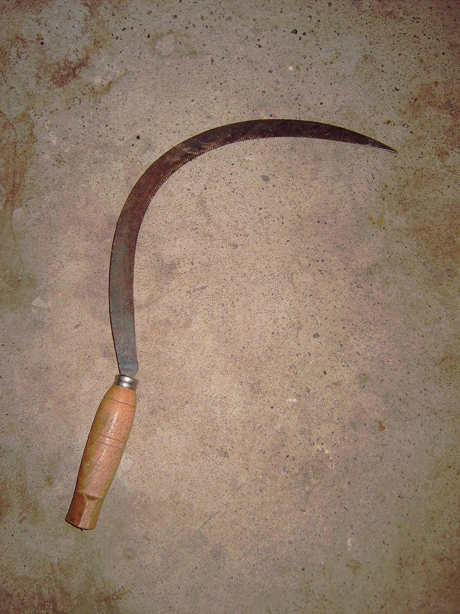

# Human-made Things in the Bible

## License Information

Human-made Things in the Bible © United Bible Societies, 2025. Adapted from: <cite>The Works of Their Hands: Man-made Things in the Bible</cite>, by Ray Pritz © 2009 United Bible Societies. This work is licensed under Creative Commons Attribution-ShareAlike 4.0 International (<a href="https://creativecommons.org/licenses/by-sa/4.0/">https://creativecommons.org/licenses/by-sa/4.0/</a>).

--------------------------------

## 标题：镰刀（sickle） (id: REALIA:1.1.6)

1\.1\.6 标题：镰刀（sickle）
=====================

经文出处
----

Hebrew 来：חֶרְמֵשׁ (音译：chermesh)

[DEU 16:9](https://ref.ly/Deut16:9), [DEU 23:26](https://ref.ly/Deut23:26)

Hebrew 来：מַגָּל (音译：magal)

[JER 50:16](https://ref.ly/Jer50:16), [JOL 4:13](https://ref.ly/Joel4:13)

Greek 希：δρέπανον (音译：drepanon)

[MRK 4:29](https://ref.ly/Mark4:29), [REV 14:14](https://ref.ly/Rev14:14), [REV 14:15](https://ref.ly/Rev14:15), [REV 14:16](https://ref.ly/Rev14:16), [REV 14:17](https://ref.ly/Rev14:17), [REV 14:18](https://ref.ly/Rev14:18), [REV 14:18](https://ref.ly/Rev14:18), [REV 14:19](https://ref.ly/Rev14:19)

描述
--

*男子用镰刀割谷物 (The Pictorial New Testament, The Religious Tract Society 1881, Public domain)*

镰刀是一种比较大的弧形刀具，装有一个较短的木柄（15—20厘米或6—8英寸），用来割下成熟了的谷物。

---

用途
--

*镰刀 (© Juan R. Lascorz, CC BY\-SA 3\.0, via Wikimedia Commons)*

使用者将镰刀贴近地面、以圆弧动作挥舞，将草或麦子割下。使用短柄镰刀贴近地面工作时，人需要弯下腰来；如果使用长柄镰刀，则可以站着工作（另参[2\.15\.1 车轮弯刀（战车武器）（scythe \[chariot weapon]）\<REALIA:2\.15\.1\>](#) ）。

---

翻译
--

如果目标语言中没有“镰刀”一词，翻译者可使用描述性的短语，如“用来割麦子的弯刀”、“收割钩”，或“收割用的大砍刀”。在[REV 14:0](https://ref.ly/Rev14:0) ，镰刀出现在若干惯用语中，这可能会让读者感到困惑。例如，[REV 14:15](https://ref.ly/Rev14:15) 不应按照原文字面译成“伸进去你的镰刀，收割吧”（RSV (Revised Standard Version (1952)) 采用直译），而是应该译成“用你的镰刀收割庄稼吧”（GNT (Good News Translation (1992)) 英文直译），这样会更清楚。古代以色列人不使用长柄镰刀。如果翻译者必须在短柄镰刀和长柄镰刀之间做出选择，则前者更为准确。

* **Associated Passages:** 申命记 16:9; 申命记 23:26; 耶利米书 50:16; 约珥书 4:13; 马可福音 4:29; 启示录 14:14; 启示录 14:15; 启示录 14:16; 启示录 14:17; 启示录 14:18; 启示录 14:19; 启示录 14:0

