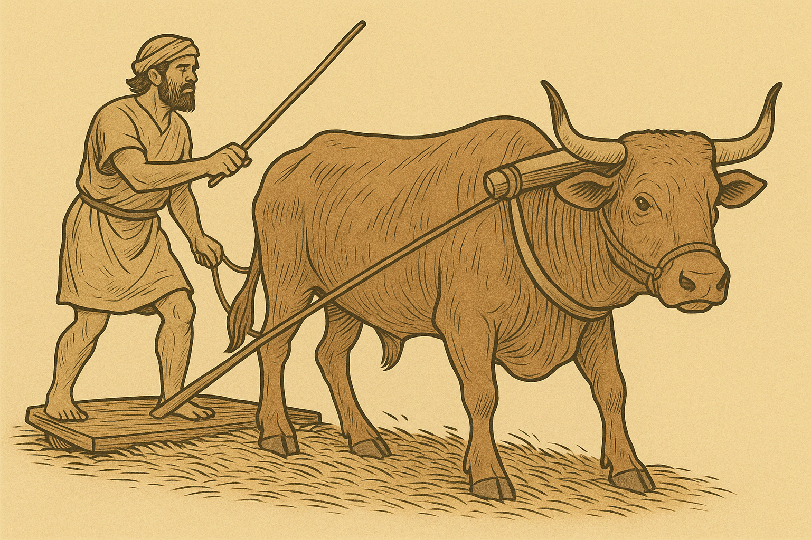
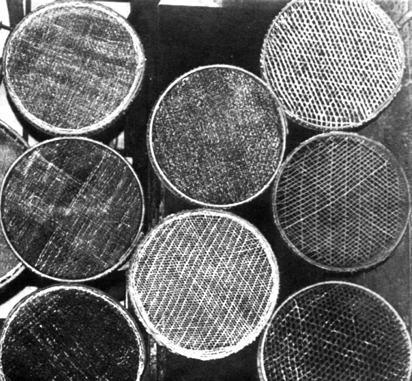
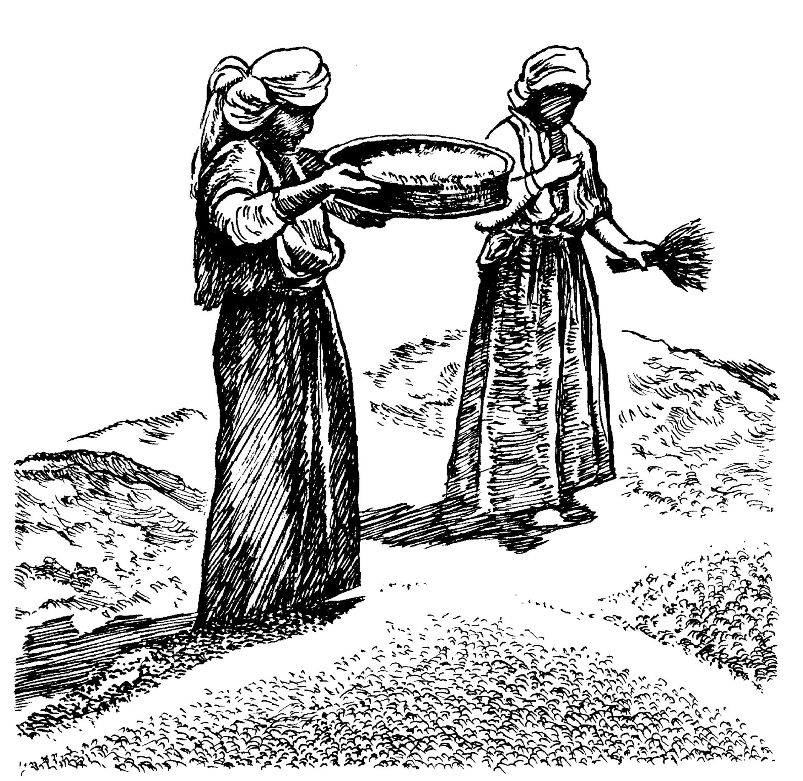

# Human-made Things in the Bible

## License Information

Human-made Things in the Bible © United Bible Societies, 2025. Adapted from: <cite>The Works of Their Hands: Man-made Things in the Bible</cite>, by Ray Pritz © 2009 United Bible Societies. This work is licensed under Creative Commons Attribution-ShareAlike 4.0 International (<a href="https://creativecommons.org/licenses/by-sa/4.0/">https://creativecommons.org/licenses/by-sa/4.0/</a>).

--------------------------------

## 标题：脱粒和扬场（threshing and winnowing） (id: REALIA:1.1.8)

1\.1\.8 标题：脱粒和扬场（threshing and winnowing）
=========================================

脱粒就是使麦粒与麦秆分离，方法是用连枷击打，或是用牲畜踩踏，或是让牲畜拖着脱粒板从麦秆上面压过（参[1\.1\.8\.2 打谷机、脱粒板 (threshing board, sledge)\<REALIA:1\.1\.8\.2\>](#) ）

扬场就是用扬场木杈（参[1\.1\.8\.3 扬场木杈 (winnowing fork)\<REALIA:1\.1\.8\.3\>](#) ）或簸箕（参[1\.1\.8\.4 筛子、筛箩、簸箕 (sieve, winnowing basket)\<REALIA:1\.1\.8\.4\>](#) ）将麦秆、麦糠、麦粒和灰尘的混合物扬到风中。较重的麦粒会落在禾场的地面上或簸箕里，而风会带走灰尘、麦糠和麦秆。麦秆与麦穗分开后，可以作为牲畜的饲料。

以色列地区通常在下午两点左右开始刮风，并且一直持续到深夜。扬场时的风不能太大，因此傍晚是扬场的最佳时间。

扬场的第一步是筛掉麦粒中的异物。人们会使用较浅的圆形筛箩，筛箩的底部有用藤条、皮革、树皮、干草等条状物做成的网眼。

如果目标语言没有表示扬场的词语，翻译者可以使用描述性的短语；例如，“把谷物中的灰尘抖出去”，“把谷物与麦糠分开”，或“把谷物与叶子分开”。

## 标题：禾场（threshing floor） (id: REALIA:1.1.8.1)

1\.1\.8\.1 标题：禾场（threshing floor）
=================================

经文出处
----

Aramaic 兰：אִדְּרֵי (音译：’idar)

[DAN 2:35](https://ref.ly/Dan2:35)

Hebrew 来：גֹּרֶן (音译：goren)

[NUM 15:20](https://ref.ly/Num15:20), [NUM 18:27](https://ref.ly/Num18:27), [NUM 18:30](https://ref.ly/Num18:30), [DEU 15:14](https://ref.ly/Deut15:14), [DEU 16:13](https://ref.ly/Deut16:13), [JDG 6:37](https://ref.ly/Judg6:37), [RUT 3:2](https://ref.ly/Ruth3:2), [RUT 3:3](https://ref.ly/Ruth3:3), [RUT 3:6](https://ref.ly/Ruth3:6), [RUT 3:14](https://ref.ly/Ruth3:14), [1SA 23:1](https://ref.ly/1Sam23:1), [2SA 24:16](https://ref.ly/2Sam24:16), [2SA 24:18](https://ref.ly/2Sam24:18), [2SA 24:21](https://ref.ly/2Sam24:21), [2SA 24:24](https://ref.ly/2Sam24:24), [1KI 22:10](https://ref.ly/1Kgs22:10), [2KI 6:27](https://ref.ly/2Kgs6:27), [1CH 21:15](https://ref.ly/1Chr21:15), [1CH 21:18](https://ref.ly/1Chr21:18), [1CH 21:21](https://ref.ly/1Chr21:21), [1CH 21:22](https://ref.ly/1Chr21:22), [1CH 21:28](https://ref.ly/1Chr21:28), [2CH 3:1](https://ref.ly/2Chr3:1), [2CH 18:9](https://ref.ly/2Chr18:9), [JOB 39:12](https://ref.ly/Job39:12), [ISA 21:10](https://ref.ly/Isa21:10), [JER 2:25](https://ref.ly/Jer2:25), [JER 51:33](https://ref.ly/Jer51:33), [HOS 9:1](https://ref.ly/Hos9:1), [HOS 9:2](https://ref.ly/Hos9:2), [HOS 13:3](https://ref.ly/Hos13:3), [JOL 2:24](https://ref.ly/Joel2:24), [MIC 4:12](https://ref.ly/Mic4:12)

Greek 希：ἅλων (音译：halōn)

[MAT 3:12](https://ref.ly/Matt3:12), [LUK 3:17](https://ref.ly/Luke3:17)

Latin 拉：area

[2ES 4:30](https://ref.ly/2Esd4:30), [2ES 4:39](https://ref.ly/2Esd4:39), [2ES 9:17](https://ref.ly/2Esd9:17)

描述
--

*打谷场 (© Klearchos Kapoutsis, CC BY 2\.0, via Wikimedia Commons)*

禾场是一块平坦的圆形区域，直径约7\.5—12米（25—40英尺），通常位于种植谷物的田地附近，并且尽量选在有风吹过的高处（参[1\.1\.8\.3 扬场木杈 (winnowing fork)\<REALIA:1\.1\.8\.3\>](#) ）。禾场通常位于村庄附近，以便保护谷物。禾场可以是基岩，也可以是夯实的泥地。禾场的边缘常会围上石块，将谷物围在其中。

---

用途
--

割下麦子之后，还需要将子粒与麦秆和外壳分离。割下的麦子摆放在禾场上。麦秆和外壳与子粒分离的方法有以下几种：（1）将脱粒板从麦子上方拖过去（参[1\.1\.8\.2 打谷机、脱粒板 (threshing board, sledge)\<REALIA:1\.1\.8\.2\>](#) ）；（2）让牲畜在麦子上面来回踩踏；（3）用工具敲打。

---

翻译
--

在[JER 51:33](https://ref.ly/Jer51:33) 和[MIC 4:12](https://ref.ly/Mic4:12) ，用于踹谷的禾场象征着审判或刑罚。如果人们不知道谷物脱粒的过程，或者不明白谷物脱粒是什么意思，那么翻译者可以明白表述；例如，[MIC 4:12](https://ref.ly/Mic4:12) b可以译成，“他们没有意识到他们已被聚集在一起受惩罚，就像谷物被运到禾场脱粒那样”（GNT (Good News Translation (1992)) 直译）。另外，比较《〈马太福音〉手册》（*A Handbook on The Gospel of Matthew* ，第70页）关于[MAT 3:12](https://ref.ly/Matt3:12) 的另一种建议译法：“他预备好进行审判，将好人与坏人分开，就像农夫准备用簸箕将麦子与麦糠分开；他将保证好人的安全，就像农夫将麦子放入粮仓；他必将恶人扔在永不止息的火中焚烧，就像农夫清除禾场上的糠秕，将其烧掉一样。”

在[MAT 3:12](https://ref.ly/Matt3:12) 和[LUK 3:17](https://ref.ly/Luke3:17) ，*halōn* 一词表示“禾场”的意思进行了引申，这里是指仍然留在禾场上面的、已脱粒的谷物。如果将这里原文字面意为“要扬净他的禾场”一语译为“他要彻底扬净所有的谷物”，那么经文的意思就会十分清楚。另一方面，翻译者也可以字面解释这两处新约经文中*halōn* 的意思，译为“他要扬净他的禾场”，意即聚拢谷物并去除麦秆和麦糠。

* **Associated Passages:** 但以理书 2:35; 民数记 15:20; 民数记 18:27; 民数记 18:30; 申命记 15:14; 申命记 16:13; 士师记 6:37; 路得记 3:2; 路得记 3:3; 路得记 3:6; 路得记 3:14; 撒母耳记上 23:1; 撒母耳记下 24:16; 撒母耳记下 24:18; 撒母耳记下 24:21; 撒母耳记下 24:24; 列王纪上 22:10; 列王纪下 6:27; 历代志上 21:15; 历代志上 21:18; 历代志上 21:21; 历代志上 21:22; 历代志上 21:28; 历代志下 3:1; 历代志下 18:9; 约伯记 39:12; 以赛亚书 21:10; 耶利米书 2:25; 耶利米书 51:33; 何西阿书 9:1; 何西阿书 9:2; 何西阿书 13:3; 约珥书 2:24; 弥迦书 4:12; 马太福音 3:12; 路加福音 3:17; 厄斯德拉下 4:30; 厄斯德拉下 4:39; 厄斯德拉下 9:17

* **Associated ACAI Concepts:** Threshing Floor (ID: `realia:ThreshingFloor`)

## 标题：打谷机、脱粒板（threshing board, sledge） (id: REALIA:1.1.8.2)

1\.1\.8\.2 标题：打谷机、脱粒板（threshing board, sledge）
==============================================

经文出处
----

Hebrew 来：חָרוּץ (音译：charuts)

[JOB 41:22](https://ref.ly/Job41:22), [ISA 28:27](https://ref.ly/Isa28:27), [ISA 41:15](https://ref.ly/Isa41:15), [AMO 1:3](https://ref.ly/Amos1:3)

Hebrew 来：מוֹרַג (音译：morag)

[2SA 24:22](https://ref.ly/2Sam24:22), [1CH 21:23](https://ref.ly/1Chr21:23), [ISA 41:15](https://ref.ly/Isa41:15)

Hebrew 来：עֲגָלָה (音译：‘agalah, ‘eglah)

[ISA 28:27](https://ref.ly/Isa28:27), [ISA 28:28](https://ref.ly/Isa28:28)

描述
--

*脱粒板底部 (© Renyrt, CC BY\-SA 3\.0, via Wikimedia Commons)*

脱粒板是一个木制的平板型农具，用一块木板或者几块木板并排连接而成，大小约为1\.5×1米（5×3英尺）。在板的一面凿出一些小孔，里面牢牢嵌入坚硬的尖石子（燧石或玄武岩）或金属片。

---

用途
--

*铁制脱粒板 (© CarlosVdeHabsburgo, CC BY\-SA 4\.0, via Wikimedia Commons)*

将脱粒板带有尖石的一侧朝下，用绳子套在牲畜上，然后碾过割下来的麦子。为了增加器具的重量（和效率），农夫可以站在或坐在板上面。当嵌着石头的脱粒板碾过麦子时，麦秆与麦粒分离，麦粒与外皮分离，同时麦秆被轧碎成糠。参上面的[1\.1\.8 脱粒和扬场 (threshing and winnowing)\<REALIA:1\.1\.8\>](#) 。

---

翻译
--

*(Image generated by ChatGPT using OpenAI technology)*

[ISA 28:27](https://ref.ly/Isa28:27); [ISA 28:28](https://ref.ly/Isa28:28) 使用了多个词语来表示功能类似的器具。希伯来文*‘agalah* ／*‘eglah* 可能是一个装着锋利圆盘的打谷机，顶部有一个座位。第27节提到这种农具是为了说明：经文提到的孜然和莳萝种子太小了，不能像小麦和大麦等较大的谷物那样用脱粒板来脱粒。希伯来文*charuts* 可能是指装着铁钉而非石子的脱粒板。第27节的*’ofan* 指的是小推车的轮子（参[8\.3 轮、车轮 (wheel)\<REALIA:8\.3\>](#) ）。

[AMO 1:3](https://ref.ly/Amos1:3) 提到“铁的脱粒板”（RSV (Revised Standard Version (1952)) 直译），这不是说脱粒板的平板是用铁制成的，而是说木制平板上突出来的不是常用的石头，而是大铁钉。[AMO 1:3](https://ref.ly/Amos1:3) 中的这个表达可能是比喻，如果这个比喻在某种文化中会失去意义，那么经文的后半部分可以扩展译为，“因为他们毁灭了基列人，就像有人用装着铁钉的脱粒板打谷一样。”或者也可以不使用比喻，译成“他们野蛮、残忍地对待基列人”（GNT (Good News Translation (1992)) 直译）。

* **Associated Passages:** 约伯记 41:22; 以赛亚书 28:27; 以赛亚书 41:15; 阿摩司书 1:3; 撒母耳记下 24:22; 历代志上 21:23; 以赛亚书 28:28

* **Associated ACAI Concepts:** Threshing-Sledge (ID: `realia:Threshing-sledge`)

## 标题：扬场木杈（winnowing fork） (id: REALIA:1.1.8.3)

1\.1\.8\.3 标题：扬场木杈（winnowing fork）
==================================

经文出处
----

Hebrew 来：זרה (音译：zarah（动词）)

[RUT 3:2](https://ref.ly/Ruth3:2), [PRO 20:8](https://ref.ly/Prov20:8), [PRO 20:26](https://ref.ly/Prov20:26), [ISA 30:24](https://ref.ly/Isa30:24), [ISA 41:16](https://ref.ly/Isa41:16), [JER 4:11](https://ref.ly/Jer4:11), [JER 15:7](https://ref.ly/Jer15:7), [JER 51:2](https://ref.ly/Jer51:2)

Hebrew 来：מִזְרֶה (音译：mizreh)

[ISA 30:24](https://ref.ly/Isa30:24), [JER 15:7](https://ref.ly/Jer15:7)

Hebrew 来：רַחַת (音译：rachath)

[ISA 30:24](https://ref.ly/Isa30:24)

Greek 希：λικμάω (音译：likmaō（动词）)

[SIR 5:9](https://ref.ly/Sir5:9)

Greek 希：πτύον (音译：ptuon)

[MAT 3:12](https://ref.ly/Matt3:12), [LUK 3:17](https://ref.ly/Luke3:17)

描述
--

*(Image generated by ChatGPT using OpenAI technology)*

扬场木杈是一种木制的叉状工具，有五到七个齿，用来将脱粒后的谷物扔向空中，这样风就可以把麦子与麦秆、麦糠分离开来。

---

用途
--

参[1\.1\.8 脱粒和扬场 (threshing and winnowing)\<REALIA:1\.1\.8\>](#) 。

---

翻译
--

*簸箕叉用于分离谷物和糠 (© Deutsche Bibelgesellschaft, Stuttgart by United Bible Societies)*

如果目标语言没有表示“扬场木杈”的词语，那么翻译者可以采用描述性的短语；例如，“用来把脱粒后的谷物扔向空中，好让麦糠被风吹走的工具”。

希伯来文动词*zarah* 的字面意思是“分散”，在圣经中指多种动作，包括扬场。

*木铲，可能用于簸谷（水彩和石墨画，阿奇汤普森（Archie Thompson），1938年） (National Gallery of Art, CC0, via Wikimedia Commons)*

希伯来文*rachath* 在圣经中只出现一次（[ISA 30:24](https://ref.ly/Isa30:24) ），其含义不明；可能是指一种木制工具，在长柄上固定一个长而扁平的刃片，就像是一把铁锹，但是用木头制成。这节经文提到了两种工具，用于扬场的不同步骤。经文的要点是：即使是给动物吃的食物，也进行了仔细的处理。有些译本依循《七十士译本》，因而不需要译出工具的名称；例如，“为你耕地的牛和驴也必吃最好的谷物”（CEV (Contemporary English Version) 直译）。

在[SIR 5:9](https://ref.ly/Sir5:9) ，扬场用在一句谚语中。原文字面意为“不要在刮每一种风时都扬场，不要每一条路都走”，NRSV (New Revised Standard Version (1989)) 采用了直译。但是，GNT (Good News Translation (1992)) 重新组织第9节和第10节的结构（将顺序颠倒），这样谚语的意思变成：“不要试图取悦所有人，或同意人们所说的一切话。”

* **Associated Passages:** 路得记 3:2; 箴言 20:8; 箴言 20:26; 以赛亚书 30:24; 以赛亚书 41:16; 耶利米书 4:11; 耶利米书 15:7; 耶利米书 51:2; 德训篇 5:9; 马太福音 3:12; 路加福音 3:17

* **Associated ACAI Concepts:** Winnowing Fork (ID: `realia:WinnowingFork`)

## 标题：筛子、筛箩、簸箕（sieve, winnowing basket） (id: REALIA:1.1.8.4)

1\.1\.8\.4 标题：筛子、筛箩、簸箕（sieve, winnowing basket）
===============================================

经文出处
----

Hebrew 来：כְּבָרָה (音译：kvarah)

[AMO 9:9](https://ref.ly/Amos9:9)

Hebrew 来：נָפָה (音译：nafah)

[ISA 30:28](https://ref.ly/Isa30:28)

Hebrew 来：נוף (音译：nuf)

[ISA 30:28](https://ref.ly/Isa30:28)

Greek 希：κόσκινον (音译：koskinon)

[SIR 27:4](https://ref.ly/Sir27:4)

Greek 希：σινιάζω (音译：siniazō（动词）)

[LUK 22:31](https://ref.ly/Luke22:31)

描述
--

*用于分离谷物和糠的筛筐或筛网 (© Israel Government Press Office)*

扬场的第二个步骤是用浅而平的圆形筛子过筛谷物。筛子的底部有网眼，是用干草、绳索、树皮条或芦苇编成。网眼的大小根据需要而定。

---

翻译
--

有些语言可能会用不同的词语来表示不同的筛子，如过滤谷物等干货的筛子，以及让液体通过但是挡住固体物质的筛子。在上述所有经文中，这个词指的都是第一种筛子。

[ISA 30:28](https://ref.ly/Isa30:28) ：这节经文的语境是在描述列国所受的刑罚和毁灭，该刑罚和毁灭在本节的第三行被比作来回摇晃筛子中的东西：“要用毁灭的筛子筛净列国”（NRSV (New Revised Standard Version (1989)) 意同）。GECL (German Common Language Version (Gute Nachricht Bibel)) 将这一行中的四个希伯来文词语扩展译为：“他在筛子中震动列国，将它们扔出去，就像毫无价值的糠秕。”在有些语言中，即使这样扩译也仍然不能让人充分理解，因此最好不要使用筛子的比喻。GNT (Good News Translation (1992)) 在这里没有使用筛子的比喻，在后续经文中也没有使用在牲畜嘴里放嚼环的比喻，而是将两者合并，英文直译作：“它［风］扫除列国，毁灭并终结它们的邪恶计谋。”我们查阅的几乎所有译本都力图保留筛子的比喻。希伯来文*nafah* 可能是指一种比较细密的筛子，非常适合过滤面粉等物。

*妇女用筛子筛谷物 (© Deutsche Bibelgesellschaft, Stuttgart by United Bible Societies)*

[AMO 9:9](https://ref.ly/Amos9:9) ：这里表示筛子的希伯来文词语可能指的是一种网眼比较大的筛子，麦子会漏下去，石头则留在筛子里面。泥水匠也使用类似的筛子，将较大的石头与砂浆所用的细砂分开。因此，这里的画面可能是在筛谷物或沙子。翻译者选择哪个画面其实并不重要，因为重点是没有一块石头能穿过筛子漏下去。它们都会被挡住，然后被扔掉。

上帝命令以色列的仇敌这样对待以色列：以色列人中没有一个罪人能逃脱惩罚，就像没有石头能穿过筛子。因此，经文可以这样翻译，“我会摇动／筛滤以色列人，就像人过筛沙子（或译：谷物），没有一块石子能穿过筛子掉到地上。我必摇晃／筛滤他们，除去其中的恶人。”

虽然[LUK 22:31](https://ref.ly/Luke22:31) 没有提到“筛子”这个实物，但是提到了筛滤的动作。有些语言在翻译这一句时，加上完成这个动作的工具会更加自然；比较ITCL (Italian Common Language Version) ，“……让你们全部通过一个筛子，就像筛出谷物那样。”

* **Associated Passages:** 阿摩司书 9:9; 以赛亚书 30:28; 德训篇 27:4; 路加福音 22:31

* **Associated ACAI Concepts:** Sieve (ID: `realia:Sieve`)
