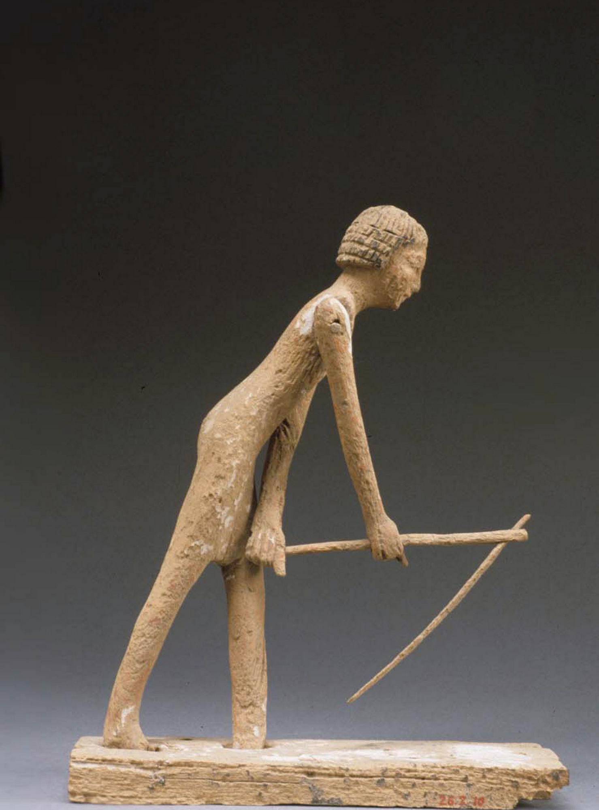

# Human-made Things in the Bible

## License Information

Human-made Things in the Bible © United Bible Societies, 2025. Adapted from: <cite>The Works of Their Hands: Man-made Things in the Bible</cite>, by Ray Pritz © 2009 United Bible Societies. This work is licensed under Creative Commons Attribution-ShareAlike 4.0 International (<a href="https://creativecommons.org/licenses/by-sa/4.0/">https://creativecommons.org/licenses/by-sa/4.0/</a>).

--------------------------------

## 标题：锄头（hoe） (id: REALIA:1.1.9.1)

1\.1\.9\.1 标题：锄头（hoe）
=====================

经文出处
----

Hebrew 来：מַחֲרֵשָׁה (音译：machareshah)

[1SA 13:20](https://ref.ly/1Sam13:20), [1SA 13:20](https://ref.ly/1Sam13:20), [1SA 13:21](https://ref.ly/1Sam13:21)

Hebrew 来：מַעְדֵּר (音译：ma‘der)

[ISA 7:25](https://ref.ly/Isa7:25)

描述
--

*使用锄头的男人 (Metropolitan Museum of Art, CC0, MMA)*

锄头是一个扁平的金属刃片，宽10—20厘米（4—8英寸），安装在木柄上，刃片与锄柄成直角。左图所示是没有木柄的锄头刃片。

---

用途
--

这种工具用来松土，更多是除草。

---

翻译
--

*锄头刀片（罗马式） (© Giovanni Dall'Orto, Attribution, via Wikimedia Commons)*

参[1\.1\.9 铁器、铁制工具 (iron tools)\<REALIA:1\.1\.9\>](#) 中对[1SA 13:20](https://ref.ly/1Sam13:20); [1SA 13:21](https://ref.ly/1Sam13:21) 的注解。

* **Associated Passages:** 撒母耳记上 13:20; 撒母耳记上 13:21; 以赛亚书 7:25

