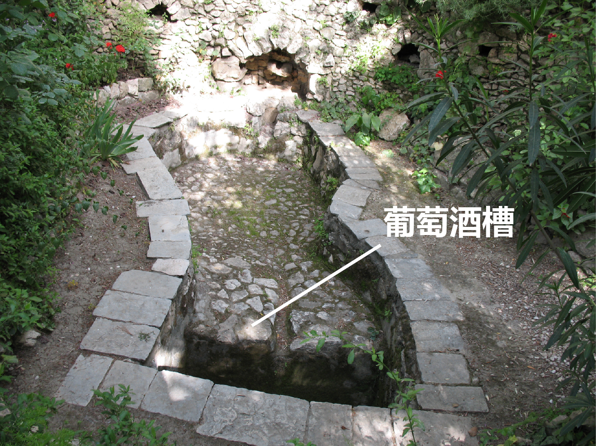

# Human-made Things in the Bible

## License Information

Human-made Things in the Bible © United Bible Societies, 2025. Adapted from: <cite>The Works of Their Hands: Man-made Things in the Bible</cite>, by Ray Pritz © 2009 United Bible Societies. This work is licensed under Creative Commons Attribution-ShareAlike 4.0 International (<a href="https://creativecommons.org/licenses/by-sa/4.0/">https://creativecommons.org/licenses/by-sa/4.0/</a>).

--------------------------------

## 标题：榨酒池、压酒池（wine press） (id: REALIA:1.1.10)

1\.1\.10 标题：榨酒池、压酒池（wine press）
===============================

经文出处
----

Hebrew 来：גַּת (音译：gath)

[JDG 6:11](https://ref.ly/Judg6:11), [NEH 13:15](https://ref.ly/Neh13:15), [ISA 63:2](https://ref.ly/Isa63:2), [LAM 1:15](https://ref.ly/Lam1:15), [JOL 4:13](https://ref.ly/Joel4:13)

Hebrew 来：יֶקֶב (音译：yeqev)

[NUM 18:27](https://ref.ly/Num18:27), [NUM 18:30](https://ref.ly/Num18:30), [DEU 15:14](https://ref.ly/Deut15:14), [DEU 16:13](https://ref.ly/Deut16:13), [JDG 7:25](https://ref.ly/Judg7:25), [2KI 6:27](https://ref.ly/2Kgs6:27), [JOB 24:11](https://ref.ly/Job24:11), [PRO 3:10](https://ref.ly/Prov3:10), [ISA 5:2](https://ref.ly/Isa5:2), [ISA 16:10](https://ref.ly/Isa16:10), [JER 48:33](https://ref.ly/Jer48:33), [HOS 9:2](https://ref.ly/Hos9:2), [JOL 2:24](https://ref.ly/Joel2:24), [JOL 4:13](https://ref.ly/Joel4:13), [HAG 2:16](https://ref.ly/Hag2:16), [ZEC 14:10](https://ref.ly/Zech14:10)

Hebrew 来：פּוּרָה (音译：purah)

[ISA 63:3](https://ref.ly/Isa63:3)

Greek 希：ληνός (音译：lēnos)

[MAT 21:33](https://ref.ly/Matt21:33), [REV 14:19](https://ref.ly/Rev14:19), [REV 14:20](https://ref.ly/Rev14:20), [REV 14:20](https://ref.ly/Rev14:20), [REV 19:15](https://ref.ly/Rev19:15), [SIR 33:17](https://ref.ly/Sir33:17)

Greek 希：ὑπολήνιον (音译：hupolēnion)

[MRK 12:1](https://ref.ly/Mark12:1)

描述和用途
-----

*站在压酒池中的男子 (© James Emery \- Wikimedia Commons)*

压酒池是人们压榨葡萄汁的地方，压出来的葡萄汁用来酿制葡萄酒（参[9\.1 酒、葡萄酒 (wine)\<REALIA:9\.1\>](#) ）、葡萄醋和葡萄蜜。古时的压酒池里面有很大的踩踏平台，人们在这个平台上面踩碎葡萄以取得葡萄汁。根据具体地形，压酒池可能比下图所示的更大更浅。踩踏平台下方会放置（或从岩石中凿出来）一个槽或桶，让刚刚压出来的葡萄汁流进去。

---

翻译
--

希伯来文*gath* 通常指踩踏平台或整个压汁设施，*yeqev* 指装葡萄汁的桶。

“压酒池”的对等描述可作：“压出葡萄汁的地方”或“挤出葡萄汁的地方”（PV 在[MRK 12:1](https://ref.ly/Mark12:1) 中的处理类似）。SPCL (Spanish Common Language Version (Dios Habla Hoy)) 译作“酿制葡萄酒的地方”（[JDG 6:11](https://ref.ly/Judg6:11) ）。“葡萄酒槽”可以使用描述性的短语，如“收集葡萄汁的地方”。

希伯来文*purah* 可指榨出来的葡萄汁的度量单位，或指在压酒池中压出葡萄汁的活动。在[ISA 63:3](https://ref.ly/Isa63:3) 中，大多数译本都将这个词译为“压酒池”。对于这节经文的第一行，NJPSV (New Jewish Publication Society Version) 的译法更加准确，英文直译作“我独自踹尽葡萄。”GNT (Good News Translation (1992)) 直译作“我像踹葡萄一样践踏列国”，CEV (Contemporary English Version) 直译作“我独自踹葡萄！”这些都是很好的译法。

希腊文*lēnos* 的意思是凹处、洞、槽或坑。压榨葡萄的整个过程需要使用多个这样的凹处；一个凹处（在以色列地是一个平台）用来放置葡萄以将其踩碎，还有一个或多个凹处用来接葡萄汁。*Lēnos* 可指其中任何一个凹处，通常可以译为“压碎葡萄的坑”（CEV (Contemporary English Version) 直译；[MAT 21:33](https://ref.ly/Matt21:33) ）。

[MAT 21:33](https://ref.ly/Matt21:33) 使用了希腊文*lēnos* ，而平行经文[MRK 12:1](https://ref.ly/Mark12:1) 则使用了一个不同的希腊文词语（*hupolēnion* ），这个词是指*lēnos* 下面的一个坑，即“葡萄汁收集坑”，葡萄汁从上面踩碎葡萄的平台流进这个坑里面。（马可这里似乎依循《七十士译本》对于《以赛亚书》5:2的理解，然而没有采用《七十士译本》的用词。）很多译本对这两个词采用了同样的译法，通常是“压酒池”或对等词。有些译本（TOB (Traduction Oecuménique de la Bible (French, 1975)) 、NJB (New Jerusalem Bible (1985)) 、NRSV (New Revised Standard Version (1989)) 、NIV (New International Version (1984)) 、NASB (New American Standard Bible) ）在《马可福音》中使用了不同的词语或表达；例如，“压酒池下面的大桶”（NASB (New American Standard Bible) 直译）。

* **Associated Passages:** 士师记 6:11; 尼希米记 13:15; 以赛亚书 63:2; 耶利米哀歌 1:15; 约珥书 4:13; 民数记 18:27; 民数记 18:30; 申命记 15:14; 申命记 16:13; 士师记 7:25; 列王纪下 6:27; 约伯记 24:11; 箴言 3:10; 以赛亚书 5:2; 以赛亚书 16:10; 耶利米书 48:33; 何西阿书 9:2; 约珥书 2:24; 哈该书 2:16; 撒迦利亚书 14:10; 以赛亚书 63:3; 马太福音 21:33; 启示录 14:19; 启示录 14:20; 启示录 19:15; 德训篇 33:17; 马可福音 12:1

