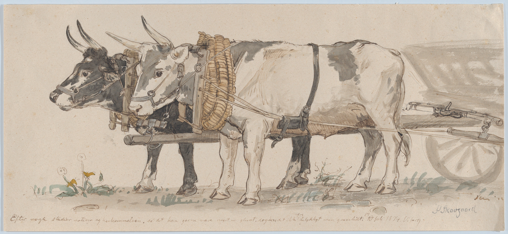
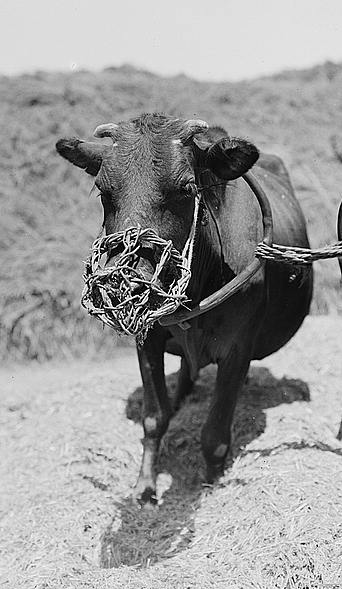

# Human-made Things in the Bible

## License Information

Human-made Things in the Bible © United Bible Societies, 2025. Adapted from: <cite>The Works of Their Hands: Man-made Things in the Bible</cite>, by Ray Pritz © 2009 United Bible Societies. This work is licensed under Creative Commons Attribution-ShareAlike 4.0 International (<a href="https://creativecommons.org/licenses/by-sa/4.0/">https://creativecommons.org/licenses/by-sa/4.0/</a>).

--------------------------------

## 标题：农业（agriculture and farming） (id: REALIA:1.1)

1\.1 标题：农业（agriculture and farming）
===================================

## 标题：轭（yoke） (id: REALIA:1.1.1)

1\.1\.1 标题：轭（yoke）
==================

经文出处
----

Hebrew 来：מוֹט, מוֹטָה (音译：mot, motah)

[LEV 26:13](https://ref.ly/Lev26:13), [ISA 58:6](https://ref.ly/Isa58:6), [ISA 58:6](https://ref.ly/Isa58:6), [ISA 58:9](https://ref.ly/Isa58:9), [JER 27:2](https://ref.ly/Jer27:2), [JER 28:10](https://ref.ly/Jer28:10), [JER 28:12](https://ref.ly/Jer28:12), [JER 28:13](https://ref.ly/Jer28:13), [JER 28:13](https://ref.ly/Jer28:13), [EZK 30:18](https://ref.ly/Ezek30:18), [EZK 34:27](https://ref.ly/Ezek34:27), [NAM 1:13](https://ref.ly/Nah1:13)

Hebrew 来：עֹל (音译：‘ol)

[GEN 27:40](https://ref.ly/Gen27:40), [LEV 26:13](https://ref.ly/Lev26:13), [NUM 19:2](https://ref.ly/Num19:2), [DEU 21:3](https://ref.ly/Deut21:3), [DEU 28:48](https://ref.ly/Deut28:48), [1SA 6:7](https://ref.ly/1Sam6:7), [1KI 12:4](https://ref.ly/1Kgs12:4), [1KI 12:4](https://ref.ly/1Kgs12:4), [1KI 12:11](https://ref.ly/1Kgs12:11), [1KI 12:11](https://ref.ly/1Kgs12:11), [1KI 12:14](https://ref.ly/1Kgs12:14), [1KI 12:14](https://ref.ly/1Kgs12:14), [2CH 10:4](https://ref.ly/2Chr10:4), [2CH 10:4](https://ref.ly/2Chr10:4), [2CH 10:11](https://ref.ly/2Chr10:11), [2CH 10:11](https://ref.ly/2Chr10:11), [2CH 10:14](https://ref.ly/2Chr10:14), [ISA 9:3](https://ref.ly/Isa9:3), [ISA 10:27](https://ref.ly/Isa10:27), [ISA 10:27](https://ref.ly/Isa10:27), [ISA 14:25](https://ref.ly/Isa14:25), [ISA 47:6](https://ref.ly/Isa47:6), [JER 2:20](https://ref.ly/Jer2:20), [JER 5:5](https://ref.ly/Jer5:5), [JER 27:8](https://ref.ly/Jer27:8), [JER 27:11](https://ref.ly/Jer27:11), [JER 27:12](https://ref.ly/Jer27:12), [JER 28:2](https://ref.ly/Jer28:2), [JER 28:4](https://ref.ly/Jer28:4), [JER 28:11](https://ref.ly/Jer28:11), [JER 28:14](https://ref.ly/Jer28:14), [JER 30:8](https://ref.ly/Jer30:8), [LAM 1:14](https://ref.ly/Lam1:14), [LAM 3:27](https://ref.ly/Lam3:27), [EZK 34:27](https://ref.ly/Ezek34:27), [HOS 11:4](https://ref.ly/Hos11:4)

Greek 希：βοοζύγιον (音译：boozugion)

[SIR 26:7](https://ref.ly/Sir26:7)

Greek 希：ἑτεροζυγέω (音译：heterozugeō)

[2CO 6:14](https://ref.ly/2Cor6:14)

Greek 希：κλοιός (音译：kloios)

[SIR 6:24](https://ref.ly/Sir6:24), [SIR 6:29](https://ref.ly/Sir6:29), [SIR 21:25](https://ref.ly/Sir21:25)

Greek 希：ζυγός (音译：zugos)

[MAT 11:29](https://ref.ly/Matt11:29), [MAT 11:30](https://ref.ly/Matt11:30), [ACT 15:10](https://ref.ly/Acts15:10), [GAL 5:1](https://ref.ly/Gal5:1), [1TI 6:1](https://ref.ly/1Tim6:1), [SIR 28:19](https://ref.ly/Sir28:19), [SIR 28:20](https://ref.ly/Sir28:20), [SIR 28:20](https://ref.ly/Sir28:20), [SIR 28:25](https://ref.ly/Sir28:25), [SIR 33:27](https://ref.ly/Sir33:27), [SIR 40:1](https://ref.ly/Sir40:1), [SIR 42:4](https://ref.ly/Sir42:4), [SIR 51:26](https://ref.ly/Sir51:26), [1MA 8:18](https://ref.ly/1Macc8:18), [1MA 8:31](https://ref.ly/1Macc8:31), [1MA 13:41](https://ref.ly/1Macc13:41), [3MA 4:9](https://ref.ly/3Macc4:9), [PSS 7:9](https://ref.ly/PssSol7:9), [PSS 17:30](https://ref.ly/PssSol17:30)

描述
--

*轭牛 (© Wikimedia Commons)*

轭是一根木杆或一个木架子，通常架在两头役畜的脖子上，将其连在一起，这样牲畜就可以更有效率地一起拉犁、拉脱粒板、拉耙或拉车。另外也有人背的轭，但通常是给一个人使用的索具。

---

用途
--

*被枷锁的奴隶 (© Osama Shukir Muhammed Amin FRCP(Glasg), CC BY\-SA 4\.0, via Wikimedia Commons)*

轭通过项圈固定在牲畜的脖子上，项圈是由木头、藤条或绳子制成。轭的中间用绳索或杆子连接到需要牵拉的物件上，这样两头牲畜就能并排一起牵拉。有时，人们也会把轭放在俘虏（[JER 28:10](https://ref.ly/Jer28:10) ）或奴隶的身上，以限制他们移动或防止他们逃跑。

---

翻译
--

如果当地文化不知道或不熟悉役畜负轭，翻译者可以将[NUM 19:2](https://ref.ly/Num19:2) （以及[DEU 21:3](https://ref.ly/Deut21:3) ）中原文字面意为“未曾负过轭的”一语译为：“未曾干过活的”（GNT (Good News Translation (1992)) 直译）。

在所有新约经文和部分旧约经文中，“轭”用作比喻，象征奴仆的服从和被奴役的状态。在这种情况下（如：[LEV 26:13](https://ref.ly/Lev26:13) ；[ISA 10:27](https://ref.ly/Isa10:27) ；[JER 28:2](https://ref.ly/Jer28:2) ，[JER 28:14](https://ref.ly/Jer28:14) ，[JER 30:8](https://ref.ly/Jer30:8) ；[EZK 34:27](https://ref.ly/Ezek34:27) ；[NAM 1:13](https://ref.ly/Nah1:13) ；[ACT 15:10](https://ref.ly/Acts15:10) ；[GAL 5:1](https://ref.ly/Gal5:1) ；[1TI 6:1](https://ref.ly/1Tim6:1) ），翻译者可以不按照字面意思来翻译，而是将其喻意表达出来（[LEV 26:13](https://ref.ly/Lev26:13) “……我打碎了压制你们的权势……”；GNT (Good News Translation (1992)) 直译）。同样，[SIR 40:1](https://ref.ly/Sir40:1) 可以译成“……沉重的担子压在我们所有人身上……”（GNT (Good News Translation (1992)) 直译）。

[LAM 5:5](https://ref.ly/Lam5:5) 中可能提到了“轭”，参《〈耶利米哀歌〉手册》（*A Handbook on Lamentations* ）第134页中的注解。

在[SIR 33:27](https://ref.ly/Sir33:27) 中，负轭意指戴着特制的“索具”或“项圈”。这是一种套在脖子上的绳子、皮条、藤条或木制物品，轭就连接在这个物品上面。在这节经文中，它与控制牲畜的动作有关，因此ITCL (Italian Common Language Version) 将这个词译为“缰绳”。在[SIR 6:24](https://ref.ly/Sir6:24); [SIR 6:29](https://ref.ly/Sir6:29) 中，*kloios* 是一个象征。在许多语言中，可以保留锁链和轭等词语。然而，如果某种语言不允许这样使用，那么可以译成“让你的所有行为都受智慧管治”（6:24），以及“如果你让智慧管治你，你就会保有平安，你就能掌管发生在你身上的事”（6:29）。

* **Associated Passages:** 利未记 26:13; 以赛亚书 58:6; 以赛亚书 58:9; 耶利米书 27:2; 耶利米书 28:10; 耶利米书 28:12; 耶利米书 28:13; 以西结书 30:18; 以西结书 34:27; 那鸿书 1:13; 创世记 27:40; 民数记 19:2; 申命记 21:3; 申命记 28:48; 撒母耳记上 6:7; 列王纪上 12:4; 列王纪上 12:11; 列王纪上 12:14; 历代志下 10:4; 历代志下 10:11; 历代志下 10:14; 以赛亚书 9:3; 以赛亚书 10:27; 以赛亚书 14:25; 以赛亚书 47:6; 耶利米书 2:20; 耶利米书 5:5; 耶利米书 27:8; 耶利米书 27:11; 耶利米书 27:12; 耶利米书 28:2; 耶利米书 28:4; 耶利米书 28:11; 耶利米书 28:14; 耶利米书 30:8; 耶利米哀歌 1:14; 耶利米哀歌 3:27; 何西阿书 11:4; 德训篇 26:7; 哥林多后书 6:14; 德训篇 6:24; 德训篇 6:29; 德训篇 21:25; 马太福音 11:29; 马太福音 11:30; 使徒行传 15:10; 加拉太书 5:1; 提摩太前书 6:1; 德训篇 28:19; 德训篇 28:20; 德训篇 28:25; 德训篇 33:27; 德训篇 40:1; 德训篇 42:4; 德训篇 51:26; 玛加伯上 8:18; 玛加伯上 8:31; 玛加伯上 13:41; 玛加伯三书 4:9; 所罗门诗篇 7:9; 所罗门诗篇 17:30; 耶利米哀歌 5:5

* **Associated ACAI Concepts:** Yoke (ID: `realia:Yoke`)

## 标题：刺棒、尖头棒（goad） (id: REALIA:1.1.2)

1\.1\.2 标题：刺棒、尖头棒（goad）
=======================

经文出处
----

Hebrew 来：דָּרְבָן (音译：darvan)

[1SA 13:21](https://ref.ly/1Sam13:21), [ECC 12:11](https://ref.ly/Eccl12:11)

Hebrew 来：מַלְמַד (音译：malmad)

[JDG 3:31](https://ref.ly/Judg3:31)

Greek 希：κέντρον (音译：kentron)

[ACT 26:14](https://ref.ly/Acts26:14), [SIR 38:25](https://ref.ly/Sir38:25), [4MA 14:19](https://ref.ly/4Macc14:19), [PSS 16:4](https://ref.ly/PssSol16:4)

描述
--

*(© Unknown \- Wikimedia Commons)*

刺棒是一根棒子，有时带一个金属尖头（*darvan* ），用来驱赶役畜或绵羊等。刺棒必须足够长，这样人们从站立的地方就能戳到动物，因此通常为1—2米（3—6英尺）长。

---

用途
--

如果拉着车辆或其他东西的牲畜不肯出力，或是走错方向，驱赶的人就可以用刺棒的尖端戳刺牲畜的臀部，疼痛会迫使牲畜更加卖力或改变方向。

---

翻译
--

如果当地人不知道役畜，[JDG 3:31](https://ref.ly/Judg3:31) 中“赶牛的棍子”可以翻译成“尖头棒”或“带金属尖头的杆子”。[ECC 12:11](https://ref.ly/Eccl12:11) 可以扩展翻译如下：“智慧人的话语就像牧羊人用来引导羊群的尖头棒……”（GNT (Good News Translation (1992)) 直译；GECL (German Common Language Version (Gute Nachricht Bibel)) 的译文类似），或“有经验之人的言语就像激动心灵的棒子……”（FRCL (French Common Language Version (Bible en français courant)) 直译）。另外也可以译成，“智慧人的话语锐利而精辟……”（DUCL (Dutch Common Language Version) 直译）。

[ACT 26:14](https://ref.ly/Acts26:14) ：这是新约中唯一出现这个词的地方，出现在短语“用脚踢刺棒”中，意思是抗拒权柄以致自己遭受伤害或痛苦，在反抗某人或某个命令时导致自己受到伤损。这节经文的后半部分也可译成，“扫罗，你为什么逼迫我？你的反抗会让你自己受伤。”

在[SIR 38:25](https://ref.ly/Sir38:25) 中，重点是工人所做的事，因此没有必要找到一个词来翻译这件物品；例如，翻译者可以译成，“当农夫唯一的愿望就是赶牛耕地，……他怎能获得知识呢？”（GNT (Good News Translation (1992)) 直译），也可以译成，“当农夫唯一的愿望就是在牛想要停下来的时候驱赶它们继续往前走，……他怎能获得知识呢？”

* **Associated Passages:** 撒母耳记上 13:21; 传道书 12:11; 士师记 3:31; 使徒行传 26:14; 德训篇 38:25; 玛加伯四书 14:19; 所罗门诗篇 16:4

* **Associated ACAI Concepts:** Goad (ID: `realia:Goad`)

## 标题：鞭子（whip, scourge） (id: REALIA:1.1.3)

1\.1\.3 标题：鞭子（whip, scourge）
============================

经文出处
----

Hebrew 来：שׁוֹט, שֹׁטֵט (音译：shot, shotet)

[JOS 23:13](https://ref.ly/Josh23:13), [1KI 12:11](https://ref.ly/1Kgs12:11), [1KI 12:14](https://ref.ly/1Kgs12:14), [2CH 10:11](https://ref.ly/2Chr10:11), [2CH 10:14](https://ref.ly/2Chr10:14), [JOB 5:21](https://ref.ly/Job5:21), [JOB 9:23](https://ref.ly/Job9:23), [PRO 26:3](https://ref.ly/Prov26:3), [ISA 10:26](https://ref.ly/Isa10:26), [ISA 28:15](https://ref.ly/Isa28:15), [ISA 28:18](https://ref.ly/Isa28:18), [NAM 3:2](https://ref.ly/Nah3:2)

Greek 希：μαστιγόω, μαστίζω, μάστιξ (音译：mastigoō（动词）, mastizō（动词）, mastix)

[MAT 10:17](https://ref.ly/Matt10:17), [MAT 20:19](https://ref.ly/Matt20:19), [MAT 23:34](https://ref.ly/Matt23:34), [MRK 10:34](https://ref.ly/Mark10:34), [LUK 18:33](https://ref.ly/Luke18:33), [JHN 19:1](https://ref.ly/John19:1), [ACT 22:24](https://ref.ly/Acts22:24), [ACT 22:25](https://ref.ly/Acts22:25), [HEB 11:36](https://ref.ly/Heb11:36), [HEB 12:6](https://ref.ly/Heb12:6), [TOB 13:16](https://ref.ly/Tob13:16), [JDT 8:27](https://ref.ly/Jdt8:27), [WIS 5:11](https://ref.ly/Wis5:11), [WIS 12:22](https://ref.ly/Wis12:22), [WIS 16:16](https://ref.ly/Wis16:16), [SIR 30:14](https://ref.ly/Sir30:14), [SIR 23:2](https://ref.ly/Sir23:2), [SIR 23:11](https://ref.ly/Sir23:11), [SIR 26:6](https://ref.ly/Sir26:6), [SIR 28:17](https://ref.ly/Sir28:17), [SIR 30:1](https://ref.ly/Sir30:1), [SIR 39:28](https://ref.ly/Sir39:28), [SIR 40:9](https://ref.ly/Sir40:9), [SIR 22:6](https://ref.ly/Sir22:6), [2MA 3:26](https://ref.ly/2Macc3:26), [2MA 3:34](https://ref.ly/2Macc3:34), [2MA 3:38](https://ref.ly/2Macc3:38), [2MA 5:18](https://ref.ly/2Macc5:18), [2MA 6:30](https://ref.ly/2Macc6:30), [3MA 2:21](https://ref.ly/3Macc2:21), [2MA 7:1](https://ref.ly/2Macc7:1), [2MA 7:37](https://ref.ly/2Macc7:37), [2MA 9:11](https://ref.ly/2Macc9:11), [4MA 6:3](https://ref.ly/4Macc6:3), [4MA 6:6](https://ref.ly/4Macc6:6), [4MA 9:12](https://ref.ly/4Macc9:12), [PSS 7:9](https://ref.ly/PssSol7:9), [PSS 10:1](https://ref.ly/PssSol10:1), [PSS 10:2](https://ref.ly/PssSol10:2)

Greek 希：φραγέλλιον, φραγελλόω (音译：fragellion, fragelloō（动词）)

[MAT 27:26](https://ref.ly/Matt27:26), [MRK 15:15](https://ref.ly/Mark15:15), [JHN 2:15](https://ref.ly/John2:15)

Latin 拉：flagellum

[2ES 16:20](https://ref.ly/2Esd16:20), [2ES 16:21](https://ref.ly/2Esd16:21)

描述
--

*拿着鞭子的男人 (© Clyde L. Cheney \- Wikimedia Commons)*

鞭子是用一根或数根鞭条做成的工具，鞭条末端可能会有加重的尖头。鞭条通常是用皮革做的，加重的尖头由金属制成，以增强抽打的力量，从而增加刑罚的严厉程度。

---

用途
--

*拿着鞭子的士兵 (© Johnbod, CC BY\-SA 4\.0, via Wikimedia Commons)*

对役畜使用鞭子是为了让其走得更快，这可以通过抽打，或者通过甩鞭来达到；甩鞭时，鞭梢发出的破空声会使牲畜害怕。驱赶牲畜的鞭子通常没有加重的尖端。在严厉惩罚人的时候，会使用带尖头的鞭子（参[DEU 25:2](https://ref.ly/Deut25:2); [DEU 25:3](https://ref.ly/Deut25:3) ）。

---

翻译
--

当“鞭子”一词用作比喻时，译文通常不必出现这个词语，直接表达出这个词的喻义即可；例如，对于[JOB 5:21](https://ref.ly/Job5:21) 中原文字面意为“你必被隐藏，不受舌头的鞭打”这个分句，RSV (Revised Standard Version (1952)) 采用直译，然而也可以译为“上帝会拯救你不受毁谤的伤害”（GNT (Good News Translation (1992)) 直译）。

[PRO 26:3](https://ref.ly/Prov26:3) ：对于原文字面意为“给马用的鞭子”这个短语，RSV (Revised Standard Version (1952)) 采用了直译，然而最好使用一个动词来描述该动作，例如，“你必须用鞭子抽打马”（GNT (Good News Translation (1992)) 英文直译）。

* **Associated Passages:** 约书亚记 23:13; 列王纪上 12:11; 列王纪上 12:14; 历代志下 10:11; 历代志下 10:14; 约伯记 5:21; 约伯记 9:23; 箴言 26:3; 以赛亚书 10:26; 以赛亚书 28:15; 以赛亚书 28:18; 那鸿书 3:2; 马太福音 10:17; 马太福音 20:19; 马太福音 23:34; 马可福音 10:34; 路加福音 18:33; 约翰福音 19:1; 使徒行传 22:24; 使徒行传 22:25; 希伯来书 11:36; 希伯来书 12:6; 多俾亚传 13:16; 友弟德传 8:27; 智慧篇 5:11; 智慧篇 12:22; 智慧篇 16:16; 德训篇 30:14; 德训篇 23:2; 德训篇 23:11; 德训篇 26:6; 德训篇 28:17; 德训篇 30:1; 德训篇 39:28; 德训篇 40:9; 德训篇 22:6; 玛加伯下 3:26; 玛加伯下 3:34; 玛加伯下 3:38; 玛加伯下 5:18; 玛加伯下 6:30; 玛加伯三书 2:21; 玛加伯下 7:1; 玛加伯下 7:37; 玛加伯下 9:11; 玛加伯四书 6:3; 玛加伯四书 6:6; 玛加伯四书 9:12; 所罗门诗篇 7:9; 所罗门诗篇 10:1; 所罗门诗篇 10:2; 马太福音 27:26; 马可福音 15:15; 约翰福音 2:15; 厄斯德拉下 16:20; 厄斯德拉下 16:21; 申命记 25:2; 申命记 25:3

* **Associated ACAI Concepts:** Whip (ID: `realia:Whip`)

## 标题：笼头（muzzle） (id: REALIA:1.1.4)

1\.1\.4 标题：笼头（muzzle）
=====================

经文出处
----

Hebrew 来：חסם (音译：chasam（动词）)

[DEU 25:4](https://ref.ly/Deut25:4)

Hebrew 来：מַחְסוֹם (音译：machsom)

[PSA 39:2](https://ref.ly/Ps39:2)

Greek 希：φιμός (音译：fimos)

[SIR 20:29](https://ref.ly/Sir20:29), [SUS 1:60](https://ref.ly/Sus1:60)

Greek 希：φιμόω (音译：fimoō（动词）)

[1TI 5:18](https://ref.ly/1Tim5:18), [4MA 1:35](https://ref.ly/4Macc1:35)

Greek 希：κημόω (音译：kēmoō（动词）)

[1CO 9:9](https://ref.ly/1Cor9:9)

描述和用途
-----

*戴嘴套的牛进行谷物脱粒 (Matson Collection, Library of Congress, Public domain)*

笼头是放在牲畜嘴上面或周圈的防护装置，以防止牲畜撕咬或吃东西。笼头是用绳子或皮条做成的网状物件，这样既不妨碍牲畜呼吸，又能阻止它们吃东西。

---

翻译
--

新约两次提及这个词都是在引用[DEU 25:4](https://ref.ly/Deut25:4) （其中[1TI 5:18](https://ref.ly/1Tim5:18) 依循《七十士译本》，[1CO 9:9](https://ref.ly/1Cor9:9) 用的是对应的动词）。有些语言可能需要使用描述性的语句来表达“笼住牛的嘴”，例如，“绑住牛的嘴，不让它吃东西”，或“盖住牛的嘴，使它不能吃东西”。在[PSA 39:2](https://ref.ly/Ps39:2) （《和》39:1），原文字面意为“我要用嚼环护住我的口”一句，可以译成“我会保持沉默”，或“我一句话也不说”（GNT (Good News Translation (1992)) 英文直译）。

* **Associated Passages:** 申命记 25:4; 诗篇 39:2; 德训篇 20:29; 苏撒拿传 1:60; 提摩太前书 5:18; 玛加伯四书 1:35; 哥林多前书 9:9

* **Associated ACAI Concepts:** To Muzzle (ID: `realia:ToMuzzle`)

## 标题：犁、犁头（Plow and plowshare） (id: REALIA:1.1.5)

1\.1\.5 标题：犁、犁头（Plow and plowshare）
===================================

经文出处
----

Hebrew 来：אֵת (音译：’eth)

[1SA 13:20](https://ref.ly/1Sam13:20), [1SA 13:21](https://ref.ly/1Sam13:21), [ISA 2:4](https://ref.ly/Isa2:4), [JOL 4:10](https://ref.ly/Joel4:10), [MIC 4:3](https://ref.ly/Mic4:3)

Hebrew 来：חרשׁ (音译：charash（动词）)

[DEU 22:10](https://ref.ly/Deut22:10), [JDG 14:18](https://ref.ly/Judg14:18), [1SA 8:12](https://ref.ly/1Sam8:12), [1KI 19:19](https://ref.ly/1Kgs19:19), [JOB 1:14](https://ref.ly/Job1:14), [JOB 4:8](https://ref.ly/Job4:8), [PSA 129:3](https://ref.ly/Ps129:3), [PSA 129:3](https://ref.ly/Ps129:3), [PRO 20:4](https://ref.ly/Prov20:4), [ISA 28:24](https://ref.ly/Isa28:24), [ISA 28:24](https://ref.ly/Isa28:24), [JER 26:18](https://ref.ly/Jer26:18), [HOS 10:11](https://ref.ly/Hos10:11), [HOS 10:13](https://ref.ly/Hos10:13), [AMO 6:12](https://ref.ly/Amos6:12), [AMO 9:13](https://ref.ly/Amos9:13), [MIC 3:12](https://ref.ly/Mic3:12)

Greek 希：ἀροτριάω (音译：arotriaō（动词）)

[LUK 17:7](https://ref.ly/Luke17:7), [1CO 9:10](https://ref.ly/1Cor9:10), [1CO 9:10](https://ref.ly/1Cor9:10), [SIR 6:19](https://ref.ly/Sir6:19), [SIR 7:12](https://ref.ly/Sir7:12)

Greek 希：ἄροτρον (音译：arotron)

[LUK 9:62](https://ref.ly/Luke9:62), [SIR 38:25](https://ref.ly/Sir38:25)

描述
--

*埃及耕犁模型 (Metropolitan Museum of Art, Public domain, MMA)*

犁是一个扁平的三角形刃片（“犁头”），由硬木或金属制成，连接着一个把手。犁头还有一种设计，是在木棒上面包着一个圆柱形的带尖金属套筒。把手上面系着绳子或木棒，然后与轭连在一起，由一只或多只牲畜牵拉。

---

用途
--

犁用来破开土壤，为播种或种植幼苗做准备。撒好种子后，有时会再次翻耕土壤来盖住种子，以免被鸟吃掉或被太阳晒死。犁头的尖端会在地上破开一道浅沟。犁并不翻起土壤，只是破开土地表层，深度很少超过25厘米（10英寸）。犁可以由人来拉，但更多时候是用牛或驴，人走在后面指挥着牲畜，同时扶住犁以掌握方向和破土深度。

*锄犁 (© Deutsche Bibelgesellschaft, Stuttgart by United Bible Societies)*

有学者提出，*’eth* 是一种在真正耕犁之前划开土壤的锐利农具。

---

翻译
--

在世界大多数地区，人们至少会知道某种类型的犁。如果当地人不知道犁，翻译者可以使用翻土所用的某种农具作为译词，例如“锄头”。但是，如果经文讲的是用牲畜耕地，就不能这样翻译（如[DEU 22:10](https://ref.ly/Deut22:10) ；[1KI 19:19](https://ref.ly/1Kgs19:19) ）。在[ISA 2:4](https://ref.ly/Isa2:4) 、[JOL 4:10](https://ref.ly/Joel4:10) 和[MIC 4:3](https://ref.ly/Mic4:3) 中，*’eth* 强调的是犁头和刀在外形上很相似。如果目标语言文化不知道犁，翻译者在这些经文中可以用其他农具来替代，不过这种农具应该可以很合理地用剑、大砍刀或弯刀改铸而成。

希伯来文动词*charash* 在几处经文中是比喻用法。在[JER 26:18](https://ref.ly/Jer26:18) 和[MIC 3:12](https://ref.ly/Mic3:12) ，这个词说的是耶路撒冷被完全毁灭；在[JOB 4:8](https://ref.ly/Job4:8) 和[HOS 10:13](https://ref.ly/Hos10:13) ，这个词的意思是行恶将带来恶果。关于耕犁在[PSA 129:3](https://ref.ly/Ps129:3) 中的比喻用法，参《〈诗篇〉手册》（*A Handbook on Psalms* ）第1080页。

* **Associated Passages:** 撒母耳记上 13:20; 撒母耳记上 13:21; 以赛亚书 2:4; 约珥书 4:10; 弥迦书 4:3; 申命记 22:10; 士师记 14:18; 撒母耳记上 8:12; 列王纪上 19:19; 约伯记 1:14; 约伯记 4:8; 诗篇 129:3; 箴言 20:4; 以赛亚书 28:24; 耶利米书 26:18; 何西阿书 10:11; 何西阿书 10:13; 阿摩司书 6:12; 阿摩司书 9:13; 弥迦书 3:12; 路加福音 17:7; 哥林多前书 9:10; 德训篇 6:19; 德训篇 7:12; 路加福音 9:62; 德训篇 38:25

## 标题：镰刀（sickle） (id: REALIA:1.1.6)

1\.1\.6 标题：镰刀（sickle）
=====================

经文出处
----

Hebrew 来：חֶרְמֵשׁ (音译：chermesh)

[DEU 16:9](https://ref.ly/Deut16:9), [DEU 23:26](https://ref.ly/Deut23:26)

Hebrew 来：מַגָּל (音译：magal)

[JER 50:16](https://ref.ly/Jer50:16), [JOL 4:13](https://ref.ly/Joel4:13)

Greek 希：δρέπανον (音译：drepanon)

[MRK 4:29](https://ref.ly/Mark4:29), [REV 14:14](https://ref.ly/Rev14:14), [REV 14:15](https://ref.ly/Rev14:15), [REV 14:16](https://ref.ly/Rev14:16), [REV 14:17](https://ref.ly/Rev14:17), [REV 14:18](https://ref.ly/Rev14:18), [REV 14:18](https://ref.ly/Rev14:18), [REV 14:19](https://ref.ly/Rev14:19)

描述
--

*男子用镰刀割谷物 (The Pictorial New Testament, The Religious Tract Society 1881, Public domain)*

镰刀是一种比较大的弧形刀具，装有一个较短的木柄（15—20厘米或6—8英寸），用来割下成熟了的谷物。

---

用途
--

*镰刀 (© Juan R. Lascorz, CC BY\-SA 3\.0, via Wikimedia Commons)*

使用者将镰刀贴近地面、以圆弧动作挥舞，将草或麦子割下。使用短柄镰刀贴近地面工作时，人需要弯下腰来；如果使用长柄镰刀，则可以站着工作（另参[2\.15\.1 车轮弯刀（战车武器）（scythe \[chariot weapon]）\<REALIA:2\.15\.1\>](#) ）。

---

翻译
--

如果目标语言中没有“镰刀”一词，翻译者可使用描述性的短语，如“用来割麦子的弯刀”、“收割钩”，或“收割用的大砍刀”。在[REV 14:0](https://ref.ly/Rev14:0) ，镰刀出现在若干惯用语中，这可能会让读者感到困惑。例如，[REV 14:15](https://ref.ly/Rev14:15) 不应按照原文字面译成“伸进去你的镰刀，收割吧”（RSV (Revised Standard Version (1952)) 采用直译），而是应该译成“用你的镰刀收割庄稼吧”（GNT (Good News Translation (1992)) 英文直译），这样会更清楚。古代以色列人不使用长柄镰刀。如果翻译者必须在短柄镰刀和长柄镰刀之间做出选择，则前者更为准确。

* **Associated Passages:** 申命记 16:9; 申命记 23:26; 耶利米书 50:16; 约珥书 4:13; 马可福音 4:29; 启示录 14:14; 启示录 14:15; 启示录 14:16; 启示录 14:17; 启示录 14:18; 启示录 14:19; 启示录 14:0

* **Associated ACAI Concepts:** Sickle (ID: `realia:Sickle`)

## 标题：捆、禾捆（sheaf） (id: REALIA:1.1.7)

1\.1\.7 标题：捆、禾捆（sheaf）
======================

经文出处
----

Hebrew 来：אֲלֻמָּה (音译：’alumah)

[GEN 37:7](https://ref.ly/Gen37:7), [GEN 37:7](https://ref.ly/Gen37:7), [GEN 37:7](https://ref.ly/Gen37:7), [GEN 37:7](https://ref.ly/Gen37:7), [PSA 126:6](https://ref.ly/Ps126:6)

Hebrew 来：עָמִיר (音译：‘amir)

[JER 9:21](https://ref.ly/Jer9:21), [AMO 2:13](https://ref.ly/Amos2:13), [MIC 4:12](https://ref.ly/Mic4:12), [ZEC 12:6](https://ref.ly/Zech12:6)

Hebrew 来：עמר (音译：‘imer（动词）)

[PSA 129:7](https://ref.ly/Ps129:7)

Hebrew 来：עֹמֶר (音译：‘omer)

[LEV 23:12](https://ref.ly/Lev23:12), [LEV 23:15](https://ref.ly/Lev23:15), [DEU 24:19](https://ref.ly/Deut24:19), [RUT 2:7](https://ref.ly/Ruth2:7), [RUT 2:15](https://ref.ly/Ruth2:15), [JOB 24:10](https://ref.ly/Job24:10)

Greek 希：δράγμα (音译：dragma)

[JDT 8:3](https://ref.ly/Jdt8:3)

描述
--

*收获的谷穗 ( Jakub Hałun © Wikimedia Commons)*

禾捆是将收割下来的农作物的秆和穗子捆在一起而形成的束，通常就用农作物的秆来捆扎。

---

用途
--

收割谷物时，可以用镰刀贴近地面将其割下来（参[1\.1\.6 镰刀 (sickle)\<REALIA:1\.1\.6\>](#) ），或者用手拔出来。然后，把许多谷物的秆拢成束，在中间将其捆扎起来，成为一捆。如果这些禾捆不是立即搬走，那么可以竖立在地上，以免穗子接触潮湿的地面。把禾捆聚拢到一起后，就可以送去禾场（参[1\.1\.8\.1 禾场 (threshing floor)\<REALIA:1\.1\.8\.1\>](#) ）。

---

翻译
--

在翻译“禾捆”一词时，翻译者可以使用描述性的短语，例如“一束收获的谷物”。在有些文化中，人们并不知道将谷物捆成捆的做法。有些语言可能必须采用“捆在一起的谷物”这类短语来表达。有些经文需要具体指明是哪种谷物。有时，翻译者需要将“禾捆”宽泛地翻译成“庄稼”（“harvest”，如GNT (Good News Translation (1992)) 的[PSA 126:6](https://ref.ly/Ps126:6) ；比较GNT (Good News Translation (1992)) 在[JOB 24:10](https://ref.ly/Job24:10) 中的译词，“wheat”“小麦”），甚至译成“谷物”（“grain”，如GNT (Good News Translation (1992)) 的[AMO 2:13](https://ref.ly/Amos2:13) 和[MIC 4:12](https://ref.ly/Mic4:12) ）。GNT (Good News Translation (1992)) 在比较宽泛的意义上翻译“禾捆”的另一处经文是[JDT 8:3](https://ref.ly/Jdt8:3) 。这节经文的原文直译为：“当他站在那里，监督那些在田间捆禾捆的人的时候”，RSV (Revised Standard Version (1952)) 采用了直译，但GNT (Good News Translation (1992)) 英文直译作“在地里监督农民的时候”。

实际上，希伯来文*‘amir* 和*‘omer* 是指放在田边的许多禾捆形成的堆，还没有被送到禾场，因此[AMO 2:13](https://ref.ly/Amos2:13) 的重点是在谷物的总重量。

* **Associated Passages:** 创世记 37:7; 诗篇 126:6; 耶利米书 9:21; 阿摩司书 2:13; 弥迦书 4:12; 撒迦利亚书 12:6; 诗篇 129:7; 利未记 23:12; 利未记 23:15; 申命记 24:19; 路得记 2:7; 路得记 2:15; 约伯记 24:10; 友弟德传 8:3

* **Associated ACAI Concepts:** Sheaf (ID: `realia:Sheaf`); Sickle (ID: `realia:Sickle`)

## 标题：脱粒和扬场（threshing and winnowing） (id: REALIA:1.1.8)

1\.1\.8 标题：脱粒和扬场（threshing and winnowing）
=========================================

脱粒就是使麦粒与麦秆分离，方法是用连枷击打，或是用牲畜踩踏，或是让牲畜拖着脱粒板从麦秆上面压过（参[1\.1\.8\.2 打谷机、脱粒板 (threshing board, sledge)\<REALIA:1\.1\.8\.2\>](#) ）

扬场就是用扬场木杈（参[1\.1\.8\.3 扬场木杈 (winnowing fork)\<REALIA:1\.1\.8\.3\>](#) ）或簸箕（参[1\.1\.8\.4 筛子、筛箩、簸箕 (sieve, winnowing basket)\<REALIA:1\.1\.8\.4\>](#) ）将麦秆、麦糠、麦粒和灰尘的混合物扬到风中。较重的麦粒会落在禾场的地面上或簸箕里，而风会带走灰尘、麦糠和麦秆。麦秆与麦穗分开后，可以作为牲畜的饲料。

以色列地区通常在下午两点左右开始刮风，并且一直持续到深夜。扬场时的风不能太大，因此傍晚是扬场的最佳时间。

扬场的第一步是筛掉麦粒中的异物。人们会使用较浅的圆形筛箩，筛箩的底部有用藤条、皮革、树皮、干草等条状物做成的网眼。

如果目标语言没有表示扬场的词语，翻译者可以使用描述性的短语；例如，“把谷物中的灰尘抖出去”，“把谷物与麦糠分开”，或“把谷物与叶子分开”。

## 标题：禾场（threshing floor） (id: REALIA:1.1.8.1)

1\.1\.8\.1 标题：禾场（threshing floor）
=================================

经文出处
----

Aramaic 兰：אִדְּרֵי (音译：’idar)

[DAN 2:35](https://ref.ly/Dan2:35)

Hebrew 来：גֹּרֶן (音译：goren)

[NUM 15:20](https://ref.ly/Num15:20), [NUM 18:27](https://ref.ly/Num18:27), [NUM 18:30](https://ref.ly/Num18:30), [DEU 15:14](https://ref.ly/Deut15:14), [DEU 16:13](https://ref.ly/Deut16:13), [JDG 6:37](https://ref.ly/Judg6:37), [RUT 3:2](https://ref.ly/Ruth3:2), [RUT 3:3](https://ref.ly/Ruth3:3), [RUT 3:6](https://ref.ly/Ruth3:6), [RUT 3:14](https://ref.ly/Ruth3:14), [1SA 23:1](https://ref.ly/1Sam23:1), [2SA 24:16](https://ref.ly/2Sam24:16), [2SA 24:18](https://ref.ly/2Sam24:18), [2SA 24:21](https://ref.ly/2Sam24:21), [2SA 24:24](https://ref.ly/2Sam24:24), [1KI 22:10](https://ref.ly/1Kgs22:10), [2KI 6:27](https://ref.ly/2Kgs6:27), [1CH 21:15](https://ref.ly/1Chr21:15), [1CH 21:18](https://ref.ly/1Chr21:18), [1CH 21:21](https://ref.ly/1Chr21:21), [1CH 21:22](https://ref.ly/1Chr21:22), [1CH 21:28](https://ref.ly/1Chr21:28), [2CH 3:1](https://ref.ly/2Chr3:1), [2CH 18:9](https://ref.ly/2Chr18:9), [JOB 39:12](https://ref.ly/Job39:12), [ISA 21:10](https://ref.ly/Isa21:10), [JER 2:25](https://ref.ly/Jer2:25), [JER 51:33](https://ref.ly/Jer51:33), [HOS 9:1](https://ref.ly/Hos9:1), [HOS 9:2](https://ref.ly/Hos9:2), [HOS 13:3](https://ref.ly/Hos13:3), [JOL 2:24](https://ref.ly/Joel2:24), [MIC 4:12](https://ref.ly/Mic4:12)

Greek 希：ἅλων (音译：halōn)

[MAT 3:12](https://ref.ly/Matt3:12), [LUK 3:17](https://ref.ly/Luke3:17)

Latin 拉：area

[2ES 4:30](https://ref.ly/2Esd4:30), [2ES 4:39](https://ref.ly/2Esd4:39), [2ES 9:17](https://ref.ly/2Esd9:17)

描述
--

*打谷场 (© Klearchos Kapoutsis, CC BY 2\.0, via Wikimedia Commons)*

禾场是一块平坦的圆形区域，直径约7\.5—12米（25—40英尺），通常位于种植谷物的田地附近，并且尽量选在有风吹过的高处（参[1\.1\.8\.3 扬场木杈 (winnowing fork)\<REALIA:1\.1\.8\.3\>](#) ）。禾场通常位于村庄附近，以便保护谷物。禾场可以是基岩，也可以是夯实的泥地。禾场的边缘常会围上石块，将谷物围在其中。

---

用途
--

割下麦子之后，还需要将子粒与麦秆和外壳分离。割下的麦子摆放在禾场上。麦秆和外壳与子粒分离的方法有以下几种：（1）将脱粒板从麦子上方拖过去（参[1\.1\.8\.2 打谷机、脱粒板 (threshing board, sledge)\<REALIA:1\.1\.8\.2\>](#) ）；（2）让牲畜在麦子上面来回踩踏；（3）用工具敲打。

---

翻译
--

在[JER 51:33](https://ref.ly/Jer51:33) 和[MIC 4:12](https://ref.ly/Mic4:12) ，用于踹谷的禾场象征着审判或刑罚。如果人们不知道谷物脱粒的过程，或者不明白谷物脱粒是什么意思，那么翻译者可以明白表述；例如，[MIC 4:12](https://ref.ly/Mic4:12) b可以译成，“他们没有意识到他们已被聚集在一起受惩罚，就像谷物被运到禾场脱粒那样”（GNT (Good News Translation (1992)) 直译）。另外，比较《〈马太福音〉手册》（*A Handbook on The Gospel of Matthew* ，第70页）关于[MAT 3:12](https://ref.ly/Matt3:12) 的另一种建议译法：“他预备好进行审判，将好人与坏人分开，就像农夫准备用簸箕将麦子与麦糠分开；他将保证好人的安全，就像农夫将麦子放入粮仓；他必将恶人扔在永不止息的火中焚烧，就像农夫清除禾场上的糠秕，将其烧掉一样。”

在[MAT 3:12](https://ref.ly/Matt3:12) 和[LUK 3:17](https://ref.ly/Luke3:17) ，*halōn* 一词表示“禾场”的意思进行了引申，这里是指仍然留在禾场上面的、已脱粒的谷物。如果将这里原文字面意为“要扬净他的禾场”一语译为“他要彻底扬净所有的谷物”，那么经文的意思就会十分清楚。另一方面，翻译者也可以字面解释这两处新约经文中*halōn* 的意思，译为“他要扬净他的禾场”，意即聚拢谷物并去除麦秆和麦糠。

* **Associated Passages:** 但以理书 2:35; 民数记 15:20; 民数记 18:27; 民数记 18:30; 申命记 15:14; 申命记 16:13; 士师记 6:37; 路得记 3:2; 路得记 3:3; 路得记 3:6; 路得记 3:14; 撒母耳记上 23:1; 撒母耳记下 24:16; 撒母耳记下 24:18; 撒母耳记下 24:21; 撒母耳记下 24:24; 列王纪上 22:10; 列王纪下 6:27; 历代志上 21:15; 历代志上 21:18; 历代志上 21:21; 历代志上 21:22; 历代志上 21:28; 历代志下 3:1; 历代志下 18:9; 约伯记 39:12; 以赛亚书 21:10; 耶利米书 2:25; 耶利米书 51:33; 何西阿书 9:1; 何西阿书 9:2; 何西阿书 13:3; 约珥书 2:24; 弥迦书 4:12; 马太福音 3:12; 路加福音 3:17; 厄斯德拉下 4:30; 厄斯德拉下 4:39; 厄斯德拉下 9:17

* **Associated ACAI Concepts:** Threshing Floor (ID: `realia:ThreshingFloor`)

## 标题：打谷机、脱粒板（threshing board, sledge） (id: REALIA:1.1.8.2)

1\.1\.8\.2 标题：打谷机、脱粒板（threshing board, sledge）
==============================================

经文出处
----

Hebrew 来：חָרוּץ (音译：charuts)

[JOB 41:22](https://ref.ly/Job41:22), [ISA 28:27](https://ref.ly/Isa28:27), [ISA 41:15](https://ref.ly/Isa41:15), [AMO 1:3](https://ref.ly/Amos1:3)

Hebrew 来：מוֹרַג (音译：morag)

[2SA 24:22](https://ref.ly/2Sam24:22), [1CH 21:23](https://ref.ly/1Chr21:23), [ISA 41:15](https://ref.ly/Isa41:15)

Hebrew 来：עֲגָלָה (音译：‘agalah, ‘eglah)

[ISA 28:27](https://ref.ly/Isa28:27), [ISA 28:28](https://ref.ly/Isa28:28)

描述
--

*脱粒板底部 (© Renyrt, CC BY\-SA 3\.0, via Wikimedia Commons)*

脱粒板是一个木制的平板型农具，用一块木板或者几块木板并排连接而成，大小约为1\.5×1米（5×3英尺）。在板的一面凿出一些小孔，里面牢牢嵌入坚硬的尖石子（燧石或玄武岩）或金属片。

---

用途
--

*铁制脱粒板 (© CarlosVdeHabsburgo, CC BY\-SA 4\.0, via Wikimedia Commons)*

将脱粒板带有尖石的一侧朝下，用绳子套在牲畜上，然后碾过割下来的麦子。为了增加器具的重量（和效率），农夫可以站在或坐在板上面。当嵌着石头的脱粒板碾过麦子时，麦秆与麦粒分离，麦粒与外皮分离，同时麦秆被轧碎成糠。参上面的[1\.1\.8 脱粒和扬场 (threshing and winnowing)\<REALIA:1\.1\.8\>](#) 。

---

翻译
--

*(Image generated by ChatGPT using OpenAI technology)*

[ISA 28:27](https://ref.ly/Isa28:27); [ISA 28:28](https://ref.ly/Isa28:28) 使用了多个词语来表示功能类似的器具。希伯来文*‘agalah* ／*‘eglah* 可能是一个装着锋利圆盘的打谷机，顶部有一个座位。第27节提到这种农具是为了说明：经文提到的孜然和莳萝种子太小了，不能像小麦和大麦等较大的谷物那样用脱粒板来脱粒。希伯来文*charuts* 可能是指装着铁钉而非石子的脱粒板。第27节的*’ofan* 指的是小推车的轮子（参[8\.3 轮、车轮 (wheel)\<REALIA:8\.3\>](#) ）。

[AMO 1:3](https://ref.ly/Amos1:3) 提到“铁的脱粒板”（RSV (Revised Standard Version (1952)) 直译），这不是说脱粒板的平板是用铁制成的，而是说木制平板上突出来的不是常用的石头，而是大铁钉。[AMO 1:3](https://ref.ly/Amos1:3) 中的这个表达可能是比喻，如果这个比喻在某种文化中会失去意义，那么经文的后半部分可以扩展译为，“因为他们毁灭了基列人，就像有人用装着铁钉的脱粒板打谷一样。”或者也可以不使用比喻，译成“他们野蛮、残忍地对待基列人”（GNT (Good News Translation (1992)) 直译）。

* **Associated Passages:** 约伯记 41:22; 以赛亚书 28:27; 以赛亚书 41:15; 阿摩司书 1:3; 撒母耳记下 24:22; 历代志上 21:23; 以赛亚书 28:28

* **Associated ACAI Concepts:** Threshing-Sledge (ID: `realia:Threshing-sledge`)

## 标题：扬场木杈（winnowing fork） (id: REALIA:1.1.8.3)

1\.1\.8\.3 标题：扬场木杈（winnowing fork）
==================================

经文出处
----

Hebrew 来：זרה (音译：zarah（动词）)

[RUT 3:2](https://ref.ly/Ruth3:2), [PRO 20:8](https://ref.ly/Prov20:8), [PRO 20:26](https://ref.ly/Prov20:26), [ISA 30:24](https://ref.ly/Isa30:24), [ISA 41:16](https://ref.ly/Isa41:16), [JER 4:11](https://ref.ly/Jer4:11), [JER 15:7](https://ref.ly/Jer15:7), [JER 51:2](https://ref.ly/Jer51:2)

Hebrew 来：מִזְרֶה (音译：mizreh)

[ISA 30:24](https://ref.ly/Isa30:24), [JER 15:7](https://ref.ly/Jer15:7)

Hebrew 来：רַחַת (音译：rachath)

[ISA 30:24](https://ref.ly/Isa30:24)

Greek 希：λικμάω (音译：likmaō（动词）)

[SIR 5:9](https://ref.ly/Sir5:9)

Greek 希：πτύον (音译：ptuon)

[MAT 3:12](https://ref.ly/Matt3:12), [LUK 3:17](https://ref.ly/Luke3:17)

描述
--

*(Image generated by ChatGPT using OpenAI technology)*

扬场木杈是一种木制的叉状工具，有五到七个齿，用来将脱粒后的谷物扔向空中，这样风就可以把麦子与麦秆、麦糠分离开来。

---

用途
--

参[1\.1\.8 脱粒和扬场 (threshing and winnowing)\<REALIA:1\.1\.8\>](#) 。

---

翻译
--

*簸箕叉用于分离谷物和糠 (© Deutsche Bibelgesellschaft, Stuttgart by United Bible Societies)*

如果目标语言没有表示“扬场木杈”的词语，那么翻译者可以采用描述性的短语；例如，“用来把脱粒后的谷物扔向空中，好让麦糠被风吹走的工具”。

希伯来文动词*zarah* 的字面意思是“分散”，在圣经中指多种动作，包括扬场。

*木铲，可能用于簸谷（水彩和石墨画，阿奇汤普森（Archie Thompson），1938年） (National Gallery of Art, CC0, via Wikimedia Commons)*

希伯来文*rachath* 在圣经中只出现一次（[ISA 30:24](https://ref.ly/Isa30:24) ），其含义不明；可能是指一种木制工具，在长柄上固定一个长而扁平的刃片，就像是一把铁锹，但是用木头制成。这节经文提到了两种工具，用于扬场的不同步骤。经文的要点是：即使是给动物吃的食物，也进行了仔细的处理。有些译本依循《七十士译本》，因而不需要译出工具的名称；例如，“为你耕地的牛和驴也必吃最好的谷物”（CEV (Contemporary English Version) 直译）。

在[SIR 5:9](https://ref.ly/Sir5:9) ，扬场用在一句谚语中。原文字面意为“不要在刮每一种风时都扬场，不要每一条路都走”，NRSV (New Revised Standard Version (1989)) 采用了直译。但是，GNT (Good News Translation (1992)) 重新组织第9节和第10节的结构（将顺序颠倒），这样谚语的意思变成：“不要试图取悦所有人，或同意人们所说的一切话。”

* **Associated Passages:** 路得记 3:2; 箴言 20:8; 箴言 20:26; 以赛亚书 30:24; 以赛亚书 41:16; 耶利米书 4:11; 耶利米书 15:7; 耶利米书 51:2; 德训篇 5:9; 马太福音 3:12; 路加福音 3:17

* **Associated ACAI Concepts:** Winnowing Fork (ID: `realia:WinnowingFork`)

## 标题：筛子、筛箩、簸箕（sieve, winnowing basket） (id: REALIA:1.1.8.4)

1\.1\.8\.4 标题：筛子、筛箩、簸箕（sieve, winnowing basket）
===============================================

经文出处
----

Hebrew 来：כְּבָרָה (音译：kvarah)

[AMO 9:9](https://ref.ly/Amos9:9)

Hebrew 来：נָפָה (音译：nafah)

[ISA 30:28](https://ref.ly/Isa30:28)

Hebrew 来：נוף (音译：nuf)

[ISA 30:28](https://ref.ly/Isa30:28)

Greek 希：κόσκινον (音译：koskinon)

[SIR 27:4](https://ref.ly/Sir27:4)

Greek 希：σινιάζω (音译：siniazō（动词）)

[LUK 22:31](https://ref.ly/Luke22:31)

描述
--

*用于分离谷物和糠的筛筐或筛网 (© Israel Government Press Office)*

扬场的第二个步骤是用浅而平的圆形筛子过筛谷物。筛子的底部有网眼，是用干草、绳索、树皮条或芦苇编成。网眼的大小根据需要而定。

---

翻译
--

有些语言可能会用不同的词语来表示不同的筛子，如过滤谷物等干货的筛子，以及让液体通过但是挡住固体物质的筛子。在上述所有经文中，这个词指的都是第一种筛子。

[ISA 30:28](https://ref.ly/Isa30:28) ：这节经文的语境是在描述列国所受的刑罚和毁灭，该刑罚和毁灭在本节的第三行被比作来回摇晃筛子中的东西：“要用毁灭的筛子筛净列国”（NRSV (New Revised Standard Version (1989)) 意同）。GECL (German Common Language Version (Gute Nachricht Bibel)) 将这一行中的四个希伯来文词语扩展译为：“他在筛子中震动列国，将它们扔出去，就像毫无价值的糠秕。”在有些语言中，即使这样扩译也仍然不能让人充分理解，因此最好不要使用筛子的比喻。GNT (Good News Translation (1992)) 在这里没有使用筛子的比喻，在后续经文中也没有使用在牲畜嘴里放嚼环的比喻，而是将两者合并，英文直译作：“它［风］扫除列国，毁灭并终结它们的邪恶计谋。”我们查阅的几乎所有译本都力图保留筛子的比喻。希伯来文*nafah* 可能是指一种比较细密的筛子，非常适合过滤面粉等物。

*妇女用筛子筛谷物 (© Deutsche Bibelgesellschaft, Stuttgart by United Bible Societies)*

[AMO 9:9](https://ref.ly/Amos9:9) ：这里表示筛子的希伯来文词语可能指的是一种网眼比较大的筛子，麦子会漏下去，石头则留在筛子里面。泥水匠也使用类似的筛子，将较大的石头与砂浆所用的细砂分开。因此，这里的画面可能是在筛谷物或沙子。翻译者选择哪个画面其实并不重要，因为重点是没有一块石头能穿过筛子漏下去。它们都会被挡住，然后被扔掉。

上帝命令以色列的仇敌这样对待以色列：以色列人中没有一个罪人能逃脱惩罚，就像没有石头能穿过筛子。因此，经文可以这样翻译，“我会摇动／筛滤以色列人，就像人过筛沙子（或译：谷物），没有一块石子能穿过筛子掉到地上。我必摇晃／筛滤他们，除去其中的恶人。”

虽然[LUK 22:31](https://ref.ly/Luke22:31) 没有提到“筛子”这个实物，但是提到了筛滤的动作。有些语言在翻译这一句时，加上完成这个动作的工具会更加自然；比较ITCL (Italian Common Language Version) ，“……让你们全部通过一个筛子，就像筛出谷物那样。”

* **Associated Passages:** 阿摩司书 9:9; 以赛亚书 30:28; 德训篇 27:4; 路加福音 22:31

* **Associated ACAI Concepts:** Sieve (ID: `realia:Sieve`)

## 标题：铁器、铁制工具（iron tools） (id: REALIA:1.1.9)

1\.1\.9 标题：铁器、铁制工具（iron tools）
==============================

[1SA 13:20](https://ref.ly/1Sam13:20); [1SA 13:21](https://ref.ly/1Sam13:21) 给翻译者带来一个很特别的问题；这里的希伯来文本有些含糊，根据具体的解释，不同译本可能会列出五到七种不同的工具。下述讨论依据RSV (Revised Standard Version (1952)) 的翻译顺序：

“犁”（“Plowshare”；*macharesheth* ）：有些解经家认为，清单中的第一个词语是一个统称，意思是“犁地的工具”。后面的词语是几种工具，包括*machareshah* ；在希伯来文中，*machareshah* 与*macharesheth* 的辅音完全相同，只有加上表示元音的点之后才能区别开来。然而，该解释仅仅只是一种猜测。

“鹤嘴锄”（“Mattock”；*’eth* ）：这个词可能是指“犁”（参[1\.1\.5 犁、犁头 (Plow and plowshare)\<REALIA:1\.1\.5\>](#) ），虽然古时的鹤嘴锄（一种锄头）已被发现。

“斧”（“Axe”；*qardom* ）：《七十士译本》也将这个词译为“斧”（希腊文*axinē* ）。更准确地说，这可能是一种类似斧头的工具，刃部与手柄垂直。这种工具可以像锄头那样松土，或者像锛那样砍削木头（参[1\.1\.9\.3 斧头、锛 (axe, adze)\<REALIA:1\.1\.9\.3\>](#) ）。

“镰”（“Sickle”；*machareshah* ）：RSV (Revised Standard Version (1952)) 再次按照《七十士译本》将这个词译为“sickle”（“镰刀”；参[1\.1\.6 镰刀 (sickle)\<REALIA:1\.1\.6\>](#) ）。然而，另一位古代的翻译者将该词译为一种用来松土和除草的小型花园锄头。本手册倾向于后面这种解法（参[1\.1\.9\.1 锄头(hoe)\<REALIA:1\.1\.9\.1\>](#) ）。

“价钱是一个pim”（*haptsirah fim* ）：参[11\.1\.3 三分之二舍客勒（pim）\<REALIA:11\.1\.3\>](#) 中关于*pim* 的讨论。

“三分之一舍客勒”（*shlosh qilshon* ）：这个希伯来文短语的含义不明。许多译本认为这是第二个（并且较低的）价格，是磨利这些工具中两种较小工具的费用。这样翻译需要假定希伯来文本中的字母顺序已被颠倒（参《希伯来文旧约文本项目初步和中期报告》，HOTTP (Hebrew Old Testament Text Project (UBS)) ）。许多解经家和翻译者认为这里提到的是另一种农具，一种带木柄的三齿耙或叉子。如果这是耙子，那么就是用它来把散落一地的枝叶拢在一起。不过它更有可能是一个叉子，叉齿需要经常磨尖。这种叉子用来叉起枝叶堆。

“尖头棒”（“Goad”；*darvan* ）：参[1\.1\.2 刺棒、尖头棒 (goad)\<REALIA:1\.1\.2\>](#) 。

这段经文要表达的要点是：以色列人被迫把他们用钝了的农具带到非利士人那里去磨利。如果目标语言没有表示这几种农具的对应词语，翻译者可以用一般性的说法来表达这个意思，第20—21节可以这样翻译：“以色列人不得不去非利士人那里磨快他们的铁制农具。不同农具的价格不同。”另外也可以译成：“以色列人不得不去非利士人那里把他们已经用钝的铁制农具磨快。不同农具的价格不同。”另参《〈撒母耳记〉手册》（*A Handbook on the First and Second Books of Samuel* ）第267—269页对于这段经文的注解。

* **Associated Passages:** 撒母耳记上 13:20; 撒母耳记上 13:21

* **Associated ACAI Concepts:** Mattock (ID: `realia:Mattock`)

## 标题：锄头（hoe） (id: REALIA:1.1.9.1)

1\.1\.9\.1 标题：锄头（hoe）
=====================

经文出处
----

Hebrew 来：מַחֲרֵשָׁה (音译：machareshah)

[1SA 13:20](https://ref.ly/1Sam13:20), [1SA 13:20](https://ref.ly/1Sam13:20), [1SA 13:21](https://ref.ly/1Sam13:21)

Hebrew 来：מַעְדֵּר (音译：ma‘der)

[ISA 7:25](https://ref.ly/Isa7:25)

描述
--

*使用锄头的男人 (Metropolitan Museum of Art, CC0, MMA)*

锄头是一个扁平的金属刃片，宽10—20厘米（4—8英寸），安装在木柄上，刃片与锄柄成直角。左图所示是没有木柄的锄头刃片。

---

用途
--

这种工具用来松土，更多是除草。

---

翻译
--

*锄头刀片（罗马式） (© Giovanni Dall'Orto, Attribution, via Wikimedia Commons)*

参[1\.1\.9 铁器、铁制工具 (iron tools)\<REALIA:1\.1\.9\>](#) 中对[1SA 13:20](https://ref.ly/1Sam13:20); [1SA 13:21](https://ref.ly/1Sam13:21) 的注解。

* **Associated Passages:** 撒母耳记上 13:20; 撒母耳记上 13:21; 以赛亚书 7:25

* **Associated ACAI Concepts:** Hoe (ID: `realia:Hoe`)

## 标题：叉（fork） (id: REALIA:1.1.9.2)

1\.1\.9\.2 标题：叉（fork）
=====================

经文出处
----

Hebrew 来：שְׁלֹשׁ קִלְּשֹׁון (音译：shlosh qilshon)

[1SA 13:21](https://ref.ly/1Sam13:21)

描述
--

*锄头刀片（罗马式） (© Giovanni Dall'Orto, Attribution, via Wikimedia Commons)*

叉是由铁制叉头和一根木柄组成，铁头有两个或三个尖齿，连接在木柄的末端，总长约1—1\.3米（3—4英尺）。

---

用途
--

农夫和在田地里做工的人用叉子来叉起枝叶堆。

---

翻译
--

参阅上面关于[1SA 13:20](https://ref.ly/1Sam13:20); [1SA 13:21](https://ref.ly/1Sam13:21) 的讨论。

* **Associated Passages:** 撒母耳记上 13:21; 撒母耳记上 13:20

* **Associated ACAI Concepts:** Fork (ID: `realia:Fork.2`)

## 标题：斧头、锛（axe, adze） (id: REALIA:1.1.9.3)

1\.1\.9\.3 标题：斧头、锛（axe, adze）
=============================

经文出处
----

Hebrew 来：בַּרְזֶל (音译：barzel)

[DEU 19:5](https://ref.ly/Deut19:5), [2KI 6:5](https://ref.ly/2Kgs6:5), [2KI 6:6](https://ref.ly/2Kgs6:6), [ISA 10:34](https://ref.ly/Isa10:34)

Hebrew 来：גַּרְזֶן (音译：garzen)

[DEU 19:5](https://ref.ly/Deut19:5), [DEU 20:19](https://ref.ly/Deut20:19), [1KI 6:7](https://ref.ly/1Kgs6:7), [ISA 10:15](https://ref.ly/Isa10:15)

Hebrew 来：מַעֲצָד (音译：ma‘atsad)

[JER 10:3](https://ref.ly/Jer10:3)

Hebrew 来：קַרְדֹּם (音译：qardom)

[JDG 9:48](https://ref.ly/Judg9:48), [1SA 13:20](https://ref.ly/1Sam13:20), [1SA 13:21](https://ref.ly/1Sam13:21), [PSA 74:5](https://ref.ly/Ps74:5), [JER 46:22](https://ref.ly/Jer46:22)

Greek 希：ἀξίνη (音译：axinē)

[MAT 3:10](https://ref.ly/Matt3:10), [LUK 3:9](https://ref.ly/Luke3:9)

Greek 希：πέλεκυς (音译：pelekus)

[LJE 1:13](https://ref.ly/EpJer1:13)

描述
--

*木柄锛 (Metropolitan Museum of Art, CC0, via Wikimedia Commons)*

斧或锛是一种带有锋利金属刃的工具，金属头固定在一根木柄上，约为一个男子手臂的长度。木柄通常会牢牢楔入金属头上的一个孔内，孔和刃分别位于金属头的两端，若用绳子缠绕金属头和手柄，可使其更加牢固。斧（*garzen* ）的刃与手柄平行，而锛（*qardom* ）的刃则垂直于手柄。

---

用途
--

*叙利亚和伊朗的各种青铜套筒斧头和锛头（公元前2–1千年，圣安东尼奥艺术博物馆（San Antonio Museum of Art），近东藏品） (© Zereshk, CC BY\-SA 3\.0, via Wikimedia Commons)*

这种工具用来砍伐树木和木本植物，将其劈成小块，也是木匠用来砍削木材的工具之一。

---

翻译
--

[LJE 1:13](https://ref.ly/EpJer1:13) 中提到的“斧子”很可能是一种武器而非手工工具。虽然斧子的形状一般是相同的，但有些语言会用不同的词语表示用来工作的斧子和用作武器的斧子。另外，翻译者也可以比较宽泛地翻译这节经文的前半部分，例如译成“有时候他们拿着武器”。

* **Associated Passages:** 申命记 19:5; 列王纪下 6:5; 列王纪下 6:6; 以赛亚书 10:34; 申命记 20:19; 列王纪上 6:7; 以赛亚书 10:15; 耶利米书 10:3; 士师记 9:48; 撒母耳记上 13:20; 撒母耳记上 13:21; 诗篇 74:5; 耶利米书 46:22; 马太福音 3:10; 路加福音 3:9; 耶利米书信 1:13

* **Associated ACAI Concepts:** Axe (ID: `realia:Axe`)

## 标题：修枝刀（pruning knife） (id: REALIA:1.1.9.4)

1\.1\.9\.4 标题：修枝刀（pruning knife）
================================

经文出处
----

Hebrew 来：מַזְמֵרָה (音译：mazmerah)

[ISA 2:4](https://ref.ly/Isa2:4), [ISA 18:5](https://ref.ly/Isa18:5), [JOL 4:10](https://ref.ly/Joel4:10), [MIC 4:3](https://ref.ly/Mic4:3)

描述
--

*修剪钩 (Lax1, Public domain, via Wikimedia Commons)*

修枝刀是一把刀或金属刃片，有时会固定在一根长木柄上。

---

用途
--

修枝就是剪掉或剪短不结果子的枝子，使树木能够更好地结果。

---

翻译
--

除[ISA 18:5](https://ref.ly/Isa18:5) 之外，所有相关经文都是讲到将长矛改铸成修枝刀或者相反。如果当地文化没有金属犁和修枝刀等农具，翻译者需要对这个比喻做出一些调整。经文的要点是，战争和流血的武器将被和平与繁荣的工具所取代（[JOL 4:10](https://ref.ly/Joel4:10) 则相反）。如果某个地区不使用铁制工具，翻译者可能无法保留武器被制成农具的意思。在这种情况下，翻译者可以简单地说：人们将摧毁武器，转而制造农具。

* **Associated Passages:** 以赛亚书 2:4; 以赛亚书 18:5; 约珥书 4:10; 弥迦书 4:3

* **Associated ACAI Concepts:** Pruning Knife (ID: `realia:PruningKnife`)

## 标题：榨酒池、压酒池（wine press） (id: REALIA:1.1.10)

1\.1\.10 标题：榨酒池、压酒池（wine press）
===============================

经文出处
----

Hebrew 来：גַּת (音译：gath)

[JDG 6:11](https://ref.ly/Judg6:11), [NEH 13:15](https://ref.ly/Neh13:15), [ISA 63:2](https://ref.ly/Isa63:2), [LAM 1:15](https://ref.ly/Lam1:15), [JOL 4:13](https://ref.ly/Joel4:13)

Hebrew 来：יֶקֶב (音译：yeqev)

[NUM 18:27](https://ref.ly/Num18:27), [NUM 18:30](https://ref.ly/Num18:30), [DEU 15:14](https://ref.ly/Deut15:14), [DEU 16:13](https://ref.ly/Deut16:13), [JDG 7:25](https://ref.ly/Judg7:25), [2KI 6:27](https://ref.ly/2Kgs6:27), [JOB 24:11](https://ref.ly/Job24:11), [PRO 3:10](https://ref.ly/Prov3:10), [ISA 5:2](https://ref.ly/Isa5:2), [ISA 16:10](https://ref.ly/Isa16:10), [JER 48:33](https://ref.ly/Jer48:33), [HOS 9:2](https://ref.ly/Hos9:2), [JOL 2:24](https://ref.ly/Joel2:24), [JOL 4:13](https://ref.ly/Joel4:13), [HAG 2:16](https://ref.ly/Hag2:16), [ZEC 14:10](https://ref.ly/Zech14:10)

Hebrew 来：פּוּרָה (音译：purah)

[ISA 63:3](https://ref.ly/Isa63:3)

Greek 希：ληνός (音译：lēnos)

[MAT 21:33](https://ref.ly/Matt21:33), [REV 14:19](https://ref.ly/Rev14:19), [REV 14:20](https://ref.ly/Rev14:20), [REV 14:20](https://ref.ly/Rev14:20), [REV 19:15](https://ref.ly/Rev19:15), [SIR 33:17](https://ref.ly/Sir33:17)

Greek 希：ὑπολήνιον (音译：hupolēnion)

[MRK 12:1](https://ref.ly/Mark12:1)

描述和用途
-----

*站在压酒池中的男子 (© James Emery \- Wikimedia Commons)*

压酒池是人们压榨葡萄汁的地方，压出来的葡萄汁用来酿制葡萄酒（参[9\.1 酒、葡萄酒 (wine)\<REALIA:9\.1\>](#) ）、葡萄醋和葡萄蜜。古时的压酒池里面有很大的踩踏平台，人们在这个平台上面踩碎葡萄以取得葡萄汁。根据具体地形，压酒池可能比下图所示的更大更浅。踩踏平台下方会放置（或从岩石中凿出来）一个槽或桶，让刚刚压出来的葡萄汁流进去。

---

翻译
--

希伯来文*gath* 通常指踩踏平台或整个压汁设施，*yeqev* 指装葡萄汁的桶。

“压酒池”的对等描述可作：“压出葡萄汁的地方”或“挤出葡萄汁的地方”（PV 在[MRK 12:1](https://ref.ly/Mark12:1) 中的处理类似）。SPCL (Spanish Common Language Version (Dios Habla Hoy)) 译作“酿制葡萄酒的地方”（[JDG 6:11](https://ref.ly/Judg6:11) ）。“葡萄酒槽”可以使用描述性的短语，如“收集葡萄汁的地方”。

希伯来文*purah* 可指榨出来的葡萄汁的度量单位，或指在压酒池中压出葡萄汁的活动。在[ISA 63:3](https://ref.ly/Isa63:3) 中，大多数译本都将这个词译为“压酒池”。对于这节经文的第一行，NJPSV (New Jewish Publication Society Version) 的译法更加准确，英文直译作“我独自踹尽葡萄。”GNT (Good News Translation (1992)) 直译作“我像踹葡萄一样践踏列国”，CEV (Contemporary English Version) 直译作“我独自踹葡萄！”这些都是很好的译法。

希腊文*lēnos* 的意思是凹处、洞、槽或坑。压榨葡萄的整个过程需要使用多个这样的凹处；一个凹处（在以色列地是一个平台）用来放置葡萄以将其踩碎，还有一个或多个凹处用来接葡萄汁。*Lēnos* 可指其中任何一个凹处，通常可以译为“压碎葡萄的坑”（CEV (Contemporary English Version) 直译；[MAT 21:33](https://ref.ly/Matt21:33) ）。

[MAT 21:33](https://ref.ly/Matt21:33) 使用了希腊文*lēnos* ，而平行经文[MRK 12:1](https://ref.ly/Mark12:1) 则使用了一个不同的希腊文词语（*hupolēnion* ），这个词是指*lēnos* 下面的一个坑，即“葡萄汁收集坑”，葡萄汁从上面踩碎葡萄的平台流进这个坑里面。（马可这里似乎依循《七十士译本》对于《以赛亚书》5:2的理解，然而没有采用《七十士译本》的用词。）很多译本对这两个词采用了同样的译法，通常是“压酒池”或对等词。有些译本（TOB (Traduction Oecuménique de la Bible (French, 1975)) 、NJB (New Jerusalem Bible (1985)) 、NRSV (New Revised Standard Version (1989)) 、NIV (New International Version (1984)) 、NASB (New American Standard Bible) ）在《马可福音》中使用了不同的词语或表达；例如，“压酒池下面的大桶”（NASB (New American Standard Bible) 直译）。

* **Associated Passages:** 士师记 6:11; 尼希米记 13:15; 以赛亚书 63:2; 耶利米哀歌 1:15; 约珥书 4:13; 民数记 18:27; 民数记 18:30; 申命记 15:14; 申命记 16:13; 士师记 7:25; 列王纪下 6:27; 约伯记 24:11; 箴言 3:10; 以赛亚书 5:2; 以赛亚书 16:10; 耶利米书 48:33; 何西阿书 9:2; 约珥书 2:24; 哈该书 2:16; 撒迦利亚书 14:10; 以赛亚书 63:3; 马太福音 21:33; 启示录 14:19; 启示录 14:20; 启示录 19:15; 德训篇 33:17; 马可福音 12:1

* **Associated ACAI Concepts:** Winepress (ID: `realia:Winepress`); Must (ID: `realia:Must`)

## 标题：瞭望楼（watchtower） (id: REALIA:1.1.11)

1\.1\.11 标题：瞭望楼（watchtower）
===========================

经文出处
----

Hebrew 来：מִגְדָּל (音译：migdal)

[GEN 35:21](https://ref.ly/Gen35:21), [2CH 26:10](https://ref.ly/2Chr26:10), [ISA 5:2](https://ref.ly/Isa5:2), [MIC 4:8](https://ref.ly/Mic4:8)

Greek 希：πύργος (音译：purgos)

[MAT 21:33](https://ref.ly/Matt21:33), [MRK 12:1](https://ref.ly/Mark12:1), [LUK 14:28](https://ref.ly/Luke14:28)

描述和用途
-----

瞭望楼是由石头建造的建筑物，通常为长方形，有时是圆形，一般建在葡萄园内部或附近的高地上。瞭望楼高2—5米（6—16英尺），可以通过梯子或台阶爬上去。在葡萄收获期间，葡萄园的主人、家人或仆人通常会在瞭望楼上过夜，以防动物或盗贼偷吃葡萄。另外，人们也会建造类似的塔楼来看守其他财产，如羊群等。

---

翻译
--

英文基本上使用相同的表达来描述农夫田地中的这种建筑，以及城墙上的瞭望点（参[3\.13\.3\.3 瞭望塔、塔楼、塔 (watchtower, tower)\<REALIA:3\.13\.3\.3\>](#) ）。然而，在有些语言中，这两种建筑可能会有非常不同的说法。在部分经文中（如[1CH 27:25](https://ref.ly/1Chr27:25) ；[2CH 26:10](https://ref.ly/2Chr26:10) ；[SIR 37:14](https://ref.ly/Sir37:14) ），翻译者并不能根据上下文确定该词指的是哪种类型的塔；[GEN 35:21](https://ref.ly/Gen35:21) 和[MIC 4:8](https://ref.ly/Mic4:8) 指的可能是其中任何一种，甚至可能是地名。

翻译者也可以使用描述性短语来翻译“瞭望楼”，如“看守葡萄园的塔”（PV ；[MAT 21:33](https://ref.ly/Matt21:33) ）。

* **Associated Passages:** 创世记 35:21; 历代志下 26:10; 以赛亚书 5:2; 弥迦书 4:8; 马太福音 21:33; 马可福音 12:1; 路加福音 14:28; 历代志上 27:25; 德训篇 37:14

* **Associated ACAI Concepts:** Tower (ID: `realia:Tower`); Watch-Tower (ID: `realia:Watch-tower`)

## 标题：灌溉水渠、运河（irrigation channel, canal） (id: REALIA:1.1.12)

1\.1\.12 标题：灌溉水渠、运河（irrigation channel, canal）
==============================================

经文出处
----

Hebrew 来：יְאֹר (音译：y’or)

[EXO 7:19](https://ref.ly/Exod7:19), [EXO 8:1](https://ref.ly/Exod8:1)

Hebrew 来：נָהָר (音译：nahar)

[ISA 19:6](https://ref.ly/Isa19:6)

Greek 希：διῶρυξ (音译：diōrux)

[SIR 24:30](https://ref.ly/Sir24:30), [SIR 24:31](https://ref.ly/Sir24:31)

Greek 希：ὑδραγωγός (音译：udragōgos)

[SIR 24:30](https://ref.ly/Sir24:30)

描述和用途
-----

*从瓦迪凯尔特（Wadi Kelt）到耶利哥的灌溉管道 (© Bukvoed, CC BY 4\.0, via Wikimedia Commons)*

灌溉水渠是在岩石上凿出来或者在地上挖出来的小水道，把水从河流等较大的水源引到种植庄稼的田地里面。[SIR 24:30](https://ref.ly/Sir24:30) 描述了灌溉水渠的作用：“我如从河里引出来的水道，我如通到乐园的水渠”（《思》）。在浇灌园子时，把水从较大的水渠引到若干条较小的水渠，然后送到园子的各处；这个系统利用重力来输送水。

---

翻译
--

希伯来文*y’or* 通常指的是尼罗河。但是，大多数译本都同意这个词在[EXO 7:19](https://ref.ly/Exod7:19) 和[EXO 8:1](https://ref.ly/Exod8:1) （《和》8:5）中是指“灌溉用运河”。同样，希伯来文*nahar* 通常表示“一条河”，但这个词在[ISA 19:6](https://ref.ly/Isa19:6) 的希伯来文本中为复数，大多数译本将这个词译为“运河”（“canals”，RSV (Revised Standard Version (1952)) ）或“渠道”（“channels”，NJPSV (New Jewish Publication Society Version) ）。

* **Associated Passages:** 出埃及记 7:19; 出埃及记 8:1; 以赛亚书 19:6; 德训篇 24:30; 德训篇 24:31

