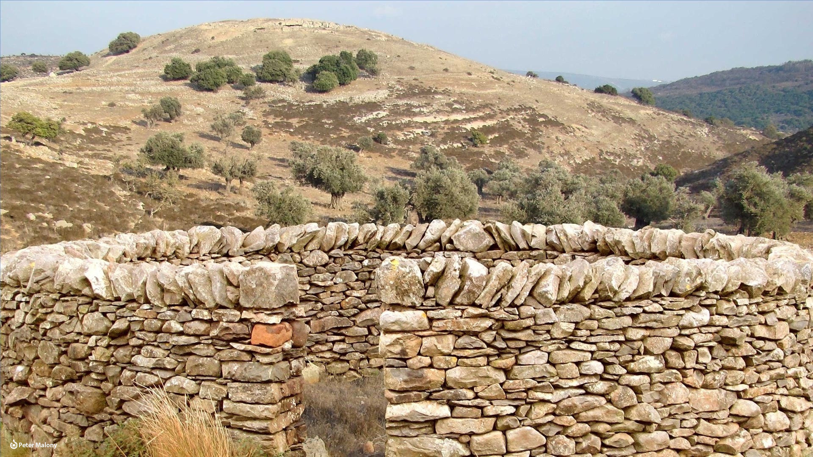

# Human-made Things in the Bible

## License Information

Human-made Things in the Bible © United Bible Societies, 2025. Adapted from: <cite>The Works of Their Hands: Man-made Things in the Bible</cite>, by Ray Pritz © 2009 United Bible Societies. This work is licensed under Creative Commons Attribution-ShareAlike 4.0 International (<a href="https://creativecommons.org/licenses/by-sa/4.0/">https://creativecommons.org/licenses/by-sa/4.0/</a>).

--------------------------------

## 标题：羊圈、羊栏（sheep pen, sheepfold） (id: REALIA:1.2.1)

1\.2\.1 标题：羊圈、羊栏（sheep pen, sheepfold）
======================================

经文出处
----

Hebrew 来：בָּצְרָה (音译：botsrah)

[MIC 2:12](https://ref.ly/Mic2:12)

Hebrew 来：גְּדֵרָה (音译：gidroth, gidroth ts’on)

[NUM 32:16](https://ref.ly/Num32:16), [NUM 32:24](https://ref.ly/Num32:24), [NUM 32:36](https://ref.ly/Num32:36), [1SA 24:4](https://ref.ly/1Sam24:4), [JER 49:3](https://ref.ly/Jer49:3), [ZEP 2:6](https://ref.ly/Zeph2:6)

Hebrew 来：מִכְלָא (音译：mikla’, mikl’oth, mikl’oth ts’on)

[PSA 50:9](https://ref.ly/Ps50:9), [PSA 78:70](https://ref.ly/Ps78:70), [HAB 3:17](https://ref.ly/Hab3:17)

Hebrew 来：מִשְׁפְּתַיִם, שְׁפַתַּיִם (音译：mishpthayim, shfatayim)

[GEN 49:14](https://ref.ly/Gen49:14), [JDG 5:16](https://ref.ly/Judg5:16), [PSA 68:14](https://ref.ly/Ps68:14)

Greek 希：αὐλή (音译：aulē)

[JHN 10:1](https://ref.ly/John10:1), [JHN 10:16](https://ref.ly/John10:16)

Greek 希：μάνδρα (音译：mandra)

[JDT 2:26](https://ref.ly/Jdt2:26), [JDT 3:3](https://ref.ly/Jdt3:3)

描述和用途
-----

*石栅栏在夜间保护羊群 (© Free Bible Images © David Padfield)*

羊圈是用石头墙或者树枝和荆棘围起来的一个地方，有一个狭窄的开口供绵羊通过，这个开口可以用灌木丛或牧羊人的身体挡住。晚上，牧人将羊赶入圈中，以保护它们不受盗贼或野兽的侵害。

---

翻译
--

“羊圈”经常需要译为：“保护羊群的地方”、“羊待的地方，周围建有围墙”，或“羊的围栏”。与下一个词条（[1\.2\.2 牲畜棚、牲畜围栏 (animal pen, stall)\<REALIA:1\.2\.2\>](#) ）不同，这个围栏建在羊群吃草的区域内，而不是在房屋附近。很多时候，羊圈只是一个临时搭建的构筑物。

在[JER 49:3](https://ref.ly/Jer49:3) 中，希伯来文*gderoth* 被译为“羊圈”（“sheep\-pens”；NJB (New Jerusalem Bible (1985)) ）或“羊栏”（“sheepfolds”；NJPSV (New Jewish Publication Society Version) ）。有些译本将这个词译为“墙”（“walls”；NIV (New International Version (1984)) 、NASB (New American Standard Bible) 、NCV (New Century Version) ），或“树篱”（“hedges”；RSV (Revised Standard Version (1952)) 、NLT (New Living Translation) ）。然而，还有一些译本将希伯来文本做了一个小小的改变，该词的意思因之变为“被划伤遮盖”，表示哀悼。采用这种解法的译本将这节经文第四行的后半部分译为：“哀号，用鞭子抽打自己”（NRSV (New Revised Standard Version (1989)) 直译），或“划破你们的身体”（REB (Revised English Bible (1989)) 直译）。

希伯来文*mishpthayim* 和*shfatayim* 有几种译法。在[GEN 49:14](https://ref.ly/Gen49:14) 中，RSV (Revised Standard Version (1952)) 和NJPSV (New Jewish Publication Society Version) 将其译为“sheepfolds”（“羊圈”），而REB (Revised English Bible (1989)) 译作“cattle pens”（“牛栏”）。这些译本认为这些词是指家畜的围栏。GNT (Good News Translation (1992)) 和NIV (New International Version (1984)) 将其译为“saddlebags”（“鞍袋、马褡裢”），这是《〈创世记〉手册》（*A Handbook on Genesis* ）第1090页所推荐的译法。

* **Associated Passages:** 弥迦书 2:12; 民数记 32:16; 民数记 32:24; 民数记 32:36; 撒母耳记上 24:4; 耶利米书 49:3; 西番雅书 2:6; 诗篇 50:9; 诗篇 78:70; 哈巴谷书 3:17; 创世记 49:14; 士师记 5:16; 诗篇 68:14; 约翰福音 10:1; 约翰福音 10:16; 友弟德传 2:26; 友弟德传 3:3

