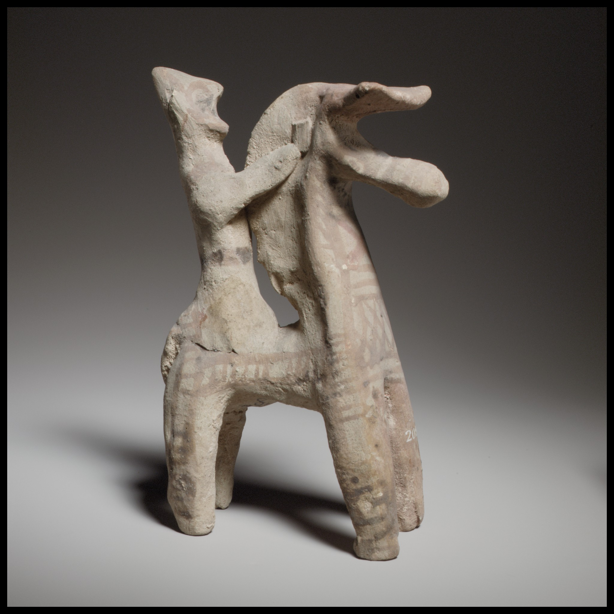

# Human-made Things in the Bible

## License Information

Human-made Things in the Bible © United Bible Societies, 2025. Adapted from: <cite>The Works of Their Hands: Man-made Things in the Bible</cite>, by Ray Pritz © 2009 United Bible Societies. This work is licensed under Creative Commons Attribution-ShareAlike 4.0 International (<a href="https://creativecommons.org/licenses/by-sa/4.0/">https://creativecommons.org/licenses/by-sa/4.0/</a>).

--------------------------------

## 标题：嚼环和辔头（bit and bridle） (id: REALIA:1.2.6)

1\.2\.6 标题：嚼环和辔头（bit and bridle）
================================

经文出处
----

Hebrew 来：מֶתֶג (音译：metheg)

[2KI 19:28](https://ref.ly/2Kgs19:28), [PSA 32:9](https://ref.ly/Ps32:9), [PRO 26:3](https://ref.ly/Prov26:3), [ISA 37:29](https://ref.ly/Isa37:29)

Hebrew 来：רֶסֶן (音译：resen)

[JOB 41:5](https://ref.ly/Job41:5), [PSA 32:9](https://ref.ly/Ps32:9), [ISA 30:28](https://ref.ly/Isa30:28)

Greek 希：χαλινός (音译：chalinos)

[JAS 3:3](https://ref.ly/Jas3:3), [REV 14:20](https://ref.ly/Rev14:20)

Greek 希：χρυσοχάλινος (音译：chrusochalinos)

[2MA 10:29](https://ref.ly/2Macc10:29), [1ES 3:6](https://ref.ly/1Esd3:6)

Greek 希：κόσμος (音译：kosmos)

[2MA 5:3](https://ref.ly/2Macc5:3)

Greek 希：σαγή (音译：sagē)

[2MA 3:25](https://ref.ly/2Macc3:25)

描述
--

*古代青铜马衔 (© Deutsche Bibelgesellschaft, Stuttgart by United Bible Societies)*

嚼环是一根短棍，通常由金属制成，放在马的嘴里。短棍的两端从马嘴的两侧突出来，系上绳索或皮带，这些绳索或皮带套在马的头部就成为辔头。

---

用途
--

*辔头和嚼环 (© Gary Todd \- Wikimedia Commons)*

骑马者或车夫可以通过拉扯辔头左侧或右侧的带子来控制马的行动。

---

翻译
--

*马和骑手展示缰绳的使用 (© Wikimedia Commons)*

希伯来文*metheg* 和*resen* 分别指“嚼环”和“辔头”（虽然RSV (Revised Standard Version (1952)) 在[PRO 26:3](https://ref.ly/Prov26:3) 将*metheg* 译为“bridle”“辔头”）。希腊文*chalinos* 和*chrusochalinos* 既指嚼环也指辔头。如果嚼环和辔头等挽具在当地不为人所知，翻译者可以使用描述性的短语，例如“引导马匹的某物”或“放入马嘴里面以引导它的某物”。

在[ZEC 14:20](https://ref.ly/Zech14:20) 中，希伯来文*mtsilah* 可能是指马的挽具上面会发出某种响声的装饰。在圣经中，这个词只出现在这里。

[REV 14:20](https://ref.ly/Rev14:20) 提到“马的辔头”（“a horse’s bridle”；RSV (Revised Standard Version (1952)) ）仅仅是用来指高度，即辔头离地面的高度，因此我们可以将这个高度译为“约一米半高”（FRCL (French Common Language Version (Bible en français courant)) ）或“约五英尺高”（GNT (Good News Translation (1992)) ）。

[2MA 10:29](https://ref.ly/2Macc10:29) 和[1ES 3:6](https://ref.ly/1Esd3:6) 所用的希腊文词语表明，辔头的金属件是由金子制成的。

* **Associated Passages:** 列王纪下 19:28; 诗篇 32:9; 箴言 26:3; 以赛亚书 37:29; 约伯记 41:5; 以赛亚书 30:28; 雅各书 3:3; 启示录 14:20; 玛加伯下 10:29; 厄斯德拉上 3:6; 玛加伯下 5:3; 玛加伯下 3:25; 撒迦利亚书 14:20

* **Associated ACAI Concepts:** Bit and Bridle (ID: `realia:BitAndBridle`)
