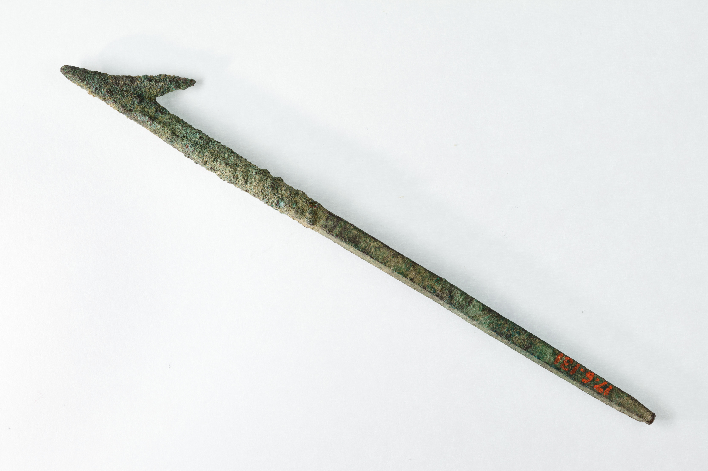

# Human-made Things in the Bible

## License Information

Human-made Things in the Bible © United Bible Societies, 2025. Adapted from: <cite>The Works of Their Hands: Man-made Things in the Bible</cite>, by Ray Pritz © 2009 United Bible Societies. This work is licensed under Creative Commons Attribution-ShareAlike 4.0 International (<a href="https://creativecommons.org/licenses/by-sa/4.0/">https://creativecommons.org/licenses/by-sa/4.0/</a>).

--------------------------------

## 标题：渔业（fishing） (id: REALIA:1.3)

1\.3 标题：渔业（fishing）
===================

小船：参[8\.1 小船、大船(boat, ship)\<REALIA:8\.1\>](#) 。

## 标题：渔网（nets） (id: REALIA:1.3.1)

1\.3\.1 标题：渔网（nets）
===================

## 标题：手抛网（casting net） (id: REALIA:1.3.1.1)

1\.3\.1\.1 标题：手抛网（casting net）
==============================

经文出处
----

Hebrew 来：מִכְמָר, מִכְמֶרֶת, מִכְמֹרֶת (音译：mikmor, mikmereth, mikmoreth)

[PSA 141:10](https://ref.ly/Ps141:10), [ISA 19:8](https://ref.ly/Isa19:8), [HAB 1:15](https://ref.ly/Hab1:15), [HAB 1:16](https://ref.ly/Hab1:16)

Hebrew 来：רֶשֶׁת (音译：resheth)

[EZK 32:3](https://ref.ly/Ezek32:3)

Greek 希：ἀμφιβάλλω, ἀμφίβληστρον (音译：amfiballō（动词）, amfiblēstron)

[MAT 4:18](https://ref.ly/Matt4:18), [MRK 1:16](https://ref.ly/Mark1:16)

Greek 希：δίκτυον (音译：diktuon)

[JHN 21:6](https://ref.ly/John21:6), [JHN 21:8](https://ref.ly/John21:8), [JHN 21:11](https://ref.ly/John21:11), [JHN 21:11](https://ref.ly/John21:11)

描述
--

*渔夫从船上撒网 (© Free Bible Images © David Padfield)*

手抛网是一种圆形的网，边缘有重物和拉绳，直径约6—7\.5米（20—25英尺）。

---

用途
--

*渔夫拉起用网捞获的鱼 (© Free Bible Images © David Padfield)*

渔夫在岸边或船上抓住绳子，以弧形动作将网挥撒出去，这个动作使渔网充分展开后才落在水面上，重物使渔网下沉到水底，将鱼罩住。然后，渔夫拉拽绳子把网收紧，最后把网拉入船中。

---

翻译
--

翻译者没有必要为了在目标语言中充分翻译“手抛网”这个词，而绞尽脑汁地表达出这种撒网方式的所有细节。重点是说明这种网是被抛出去的，而不是以拖拉的方式使用。有些语言没有表示各种渔网的词语，那么可以用“网”这个统称。

希伯来文*resheth* 通常用来指捕捉野兽或鸟类的网（参[1\.4\.2 网、网罗 (net)\<REALIA:1\.4\.2\>](#) ）。在[EZK 32:3](https://ref.ly/Ezek32:3) 中，这个词与希伯来文*cherem* 平行使用；*cherem* 意指“拖网”（参[1\.3\.1\.2 拖网、围网 (dragnet, seine)\<REALIA:1\.3\.1\.2\>](#) ）。与*resheth* 相关的希伯来文动词的意思是“投掷”或“展开”，这个动作与手抛网有关，因此这里包含了这个希伯来文词语。大多数译本都认为这节经文的语境是钓鱼而不是狩猎。但是，多数译本选择使用“网”的统称，而没有尝试指明是哪种类型的渔网。

*正在拉网的人 (George Louis Faber, Public domain, via Wikimedia Commons)*

[HAB 1:15](https://ref.ly/Hab1:15); [HAB 1:16](https://ref.ly/Hab1:16) ：这两节经文中出现了两个表示网的词语（关于另一种网的讨论，参[1\.3\.1\.2 拖网、围网 (dragnet, seine)\<REALIA:1\.3\.1\.2\>](#) ）。如果目标文化对于不同种类的渔网非常熟悉，翻译者可以毫不费力地翻译这些词。如果不是，那么最好使用一个统称来翻译这两种渔网（GNT (Good News Translation (1992)) 译作“nets”“网”）。

[JHN 21:3](https://ref.ly/John21:3) ：当彼得说“我打鱼去”（GNT (Good News Translation (1992)) 直译），有些语言需要明确说明打鱼的方式；例如，彼得是使用鱼钩鱼线，还是用陷阱，还是用网。圣经时期最常见的捕鱼方法是用网，并且这里就是这个意思。

* **Associated Passages:** 诗篇 141:10; 以赛亚书 19:8; 哈巴谷书 1:15; 哈巴谷书 1:16; 以西结书 32:3; 马太福音 4:18; 马可福音 1:16; 约翰福音 21:6; 约翰福音 21:8; 约翰福音 21:11; 约翰福音 21:3

* **Associated ACAI Concepts:** Casting Net (ID: `realia:CastingNet`)

## 标题：拖网、围网（dragnet, seine） (id: REALIA:1.3.1.2)

1\.3\.1\.2 标题：拖网、围网（dragnet, seine）
===================================

经文出处
----

Hebrew 来：חֵרֶם (音译：cherem)

[EZK 26:5](https://ref.ly/Ezek26:5), [EZK 26:14](https://ref.ly/Ezek26:14), [EZK 32:3](https://ref.ly/Ezek32:3), [EZK 47:10](https://ref.ly/Ezek47:10), [HAB 1:15](https://ref.ly/Hab1:15), [HAB 1:16](https://ref.ly/Hab1:16), [HAB 1:17](https://ref.ly/Hab1:17)

Greek 希：σαγήνη (音译：sagēnē)

[MAT 13:47](https://ref.ly/Matt13:47)

描述
--

拖网是垂直悬挂在水中的一张很长的网，上边缘有浮子，下边缘有重物。

---

用途
--

拖网由船上或岸边的人拉拽收网。在拖网的两端都被拉到船上或岸上之后，所围区域里面的鱼就被困住。

---

翻译
--

在不要求区分各种渔网的语言中，可以使用表示“网”的统称。

在[MAT 13:47](https://ref.ly/Matt13:47) ，网的实际样式并不是很重要。重要的是网非常大，能够网住许多不同种类的鱼。

[HAB 1:15](https://ref.ly/Hab1:15); [HAB 1:16](https://ref.ly/Hab1:16); [HAB 1:17](https://ref.ly/Hab1:17) ：参[1\.3\.1\.1 手抛网 (casting net)\<REALIA:1\.3\.1\.1\>](#) 中的注解。

* **Associated Passages:** 以西结书 26:5; 以西结书 26:14; 以西结书 32:3; 以西结书 47:10; 哈巴谷书 1:15; 哈巴谷书 1:16; 哈巴谷书 1:17; 马太福音 13:47

* **Associated ACAI Concepts:** Dragnet (ID: `realia:Dragnet`); Net (ID: `realia:Net`)

## 标题：网、陷阱网（net, trammel net） (id: REALIA:1.3.1.3)

1\.3\.1\.3 标题：网、陷阱网（net, trammel net）
=====================================

经文出处
----

Hebrew 来：מָצוֹד (音译：matsod（另参)

[JOB 19:6](https://ref.ly/Job19:6), [ECC 7:26](https://ref.ly/Eccl7:26)

Hebrew 来：מְצוֹדָה (音译：mtsodah)

[ECC 9:12](https://ref.ly/Eccl9:12)

Greek 希：δίκτυον (音译：diktuon)

[MAT 4:20](https://ref.ly/Matt4:20), [MAT 4:21](https://ref.ly/Matt4:21), [MRK 1:18](https://ref.ly/Mark1:18), [MRK 1:19](https://ref.ly/Mark1:19), [LUK 5:2](https://ref.ly/Luke5:2), [LUK 5:4](https://ref.ly/Luke5:4), [LUK 5:5](https://ref.ly/Luke5:5), [LUK 5:6](https://ref.ly/Luke5:6)

描述
--

*在束缚网里的鱼 (Lindsay G. Thompson, University of Washington, CC0, via Wikimedia Commons)*

陷阱网由两层或三层网组成，通常是中间一张网眼较小的内网，夹在两张网眼较大的外网中间。

---

用途
--

与拖网相似，陷阱网垂直放入水中，通过浮在水面上的浮子和底部带有重物的绳索来固定位置。鱼会通过外网游到里面较细的内网（1），然后推着内网穿过另一侧的外网（2），这样鱼就被卡在网袋里面退不回去了（3）。拖网在张开之后会马上收网；然而陷阱网不一样，需要撒在水中几个小时，等待鱼卡在网袋里面。

---

翻译
--

希伯来文*matsod* 和*mtsodah* 可能泛指“网”，包括渔网和打猎用的网。

在[MAT 4:20](https://ref.ly/Matt4:20); [MAT 4:21](https://ref.ly/Matt4:21) 、[MRK 1:18](https://ref.ly/Mark1:18); [MRK 1:19](https://ref.ly/Mark1:19) 和[LUK 5:2](https://ref.ly/Luke5:2); [LUK 5:4](https://ref.ly/Luke5:4); [LUK 5:5](https://ref.ly/Luke5:5); [LUK 5:6](https://ref.ly/Luke5:6) 中，希腊文*diktuon* 可能指的是拖网（[1\.3\.1\.2 拖网、围网 (dragnet, seine)\<REALIA:1\.3\.1\.2\>](#) ），不过这个词的复数形式又表明它很可能是指陷阱网，因为陷阱网是由多层网组成的。如果目标语言不要求区分各种网，翻译者可以使用“网”的统称。

* **Associated Passages:** 约伯记 19:6; 传道书 7:26; 传道书 9:12; 马太福音 4:20; 马太福音 4:21; 马可福音 1:18; 马可福音 1:19; 路加福音 5:2; 路加福音 5:4; 路加福音 5:5; 路加福音 5:6

## 标题：钩（hook） (id: REALIA:1.3.2)

1\.3\.2 标题：钩（hook）
==================

经文出处
----

Hebrew 来：סִירָה, דּוּגָה (音译：sir dugah)

[AMO 4:2](https://ref.ly/Amos4:2)

Hebrew 来：צֵן (音译：tsinah)

[AMO 4:2](https://ref.ly/Amos4:2)

Greek 希：ἄγκιστρον (音译：agkistron)

[MAT 17:27](https://ref.ly/Matt17:27)

描述
--

*金属鱼钩 (© Olaf Tausch, CC BY 3\.0, via Wikimedia Commons)*

鱼钩是个小的弯钩，用金属、骨头，甚至结实的荆棘制成（事实上，[AMO 4:2](https://ref.ly/Amos4:2) 中的希伯来文*sir* 的意思是“荆棘”）。鱼钩的一头很尖，通常尖头后面还有个倒刺。鱼钩的另一头有个环或弯，可以系上鱼线。

---

用途
--

鱼钩要穿上诱饵来吸引鱼。鱼钩系上鱼线后投到水里。鱼吞下诱饵后，就被钩在鱼钩上了。

---

翻译
--

按字面翻译[MAT 17:27](https://ref.ly/Matt17:27) 可能会使人产生误解，因为字面上只有钩子被扔进水中。有些语言可能需要明确说明文字隐含的意思，通过扩展翻译指出投入水中的东西是一条带有饵钩的线，以避免读者误解。

* **Associated Passages:** 阿摩司书 4:2; 马太福音 17:27

* **Associated ACAI Concepts:** Fishhook (ID: `realia:Fishhook`)

## 标题：鱼叉（fishing spear, harpoon） (id: REALIA:1.3.3)

1\.3\.3 标题：鱼叉（fishing spear, harpoon）
=====================================

经文出处
----

Hebrew 来：חָח, חוֹחַ (音译：chach, choach)

[2KI 19:28](https://ref.ly/2Kgs19:28), [2CH 33:11](https://ref.ly/2Chr33:11), [JOB 40:26](https://ref.ly/Job40:26), [ISA 37:29](https://ref.ly/Isa37:29), [EZK 19:4](https://ref.ly/Ezek19:4), [EZK 19:9](https://ref.ly/Ezek19:9), [EZK 29:4](https://ref.ly/Ezek29:4), [EZK 38:4](https://ref.ly/Ezek38:4)

Hebrew 来：חַכָּה (音译：chakah)

[JOB 40:25](https://ref.ly/Job40:25), [ISA 19:8](https://ref.ly/Isa19:8), [HAB 1:15](https://ref.ly/Hab1:15)

Hebrew 来：מַסָּע (音译：masa‘)

[JOB 41:18](https://ref.ly/Job41:18)

Hebrew 来：שֻׂכָּה (音译：sukah)

[JOB 40:31](https://ref.ly/Job40:31)

Hebrew 来：צִלְצָל (音译：tsiltsal)

[JOB 40:31](https://ref.ly/Job40:31)

描述
--

*捕鱼叉的尖头（青铜或铜合金，埃及，约公元前1550–1070年） (Metropolitan Museum of Art, Public domain)*

鱼叉是一根约有一人高的木杆，一端套上用金属或骨头做成的、带倒刺的尖头，另一端很可能会系上一根绳子，这样投掷者就可以把投出去的鱼叉再拉回来。

---

用途
--

渔夫瞄准鱼或其他水生动物，然后用力掷出鱼叉。倒钩可防止叉头从猎物身上脱落。连接在叉头另一端的绳子使投掷者能够快速收回鱼叉，准备再次投掷，或者防止受伤的猎物拖着鱼叉游走。

---

翻译
--

《〈约伯记〉手册》（*A Handbook on The Book of Job* ）指出，[JOB 40:26](https://ref.ly/Job40:26) （《和》41:2）中的希伯来文*choach* 指的是一种钩子，但这个钩子“比前一节中的鱼钩大得多”（第752页）。这个词最常出现在与对待囚犯有关的描述中，这也是[JOB 40:25](https://ref.ly/Job40:25); [JOB 40:31](https://ref.ly/Job40:31) （《和》41:1，7）用在力威亚探身上的涵义。

在[JOB 41:18](https://ref.ly/Job41:18) （《和》41:26），希伯来文*masa'* 的含义并不确定。从上下文来看，很明显这是一种用来捕猎大型动物的武器，也许是投掷武器。希伯来文本在这节经文的末尾有三个单词，CEV (Contemporary English Version) 将这三个词语简单地统译为“spear”（“矛”）。*Masa'* 一词最常译为“飞镖”（“dart”；RSV (Revised Standard Version (1952)) 、NIV (New International Version (1984)) 、NASB (New American Standard Bible) 、NCV (New Century Version) 、REB (Revised English Bible (1989)) ），不过也有译本译为“飞弹”（“missile”；NJPSV (New Jewish Publication Society Version) ）、“投枪”（“javelin”；NJB (New Jerusalem Bible (1985)) ）和“箭”（“arrow”；GNT (Good News Translation (1992)) ）。尽管英文单词“dart”（“飞镖”）在现代译本中十分常见，但是对那些并不熟悉《钦定本圣经》或莎士比亚英文的现代读者来说，这个词仅仅指在游戏中投掷的小而尖的羽毛飞镖。

* **Associated Passages:** 列王纪下 19:28; 历代志下 33:11; 约伯记 40:26; 以赛亚书 37:29; 以西结书 19:4; 以西结书 19:9; 以西结书 29:4; 以西结书 38:4; 约伯记 40:25; 以赛亚书 19:8; 哈巴谷书 1:15; 约伯记 41:18; 约伯记 40:31

* **Associated ACAI Concepts:** Harpoon (ID: `realia:Harpoon`)
