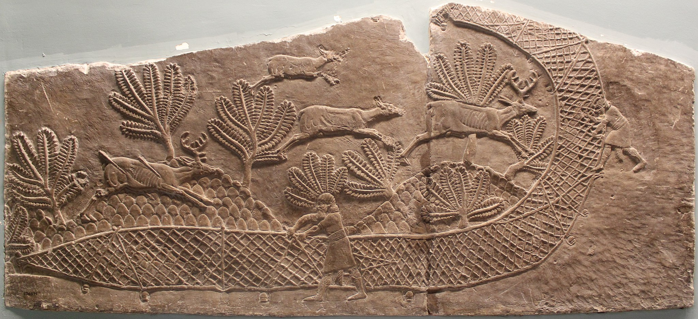

# Human-made Things in the Bible

## License Information

Human-made Things in the Bible © United Bible Societies, 2025. Adapted from: <cite>The Works of Their Hands: Man-made Things in the Bible</cite>, by Ray Pritz © 2009 United Bible Societies. This work is licensed under Creative Commons Attribution-ShareAlike 4.0 International (<a href="https://creativecommons.org/licenses/by-sa/4.0/">https://creativecommons.org/licenses/by-sa/4.0/</a>).

--------------------------------

## 标题：网、网罗（net） (id: REALIA:1.4.2)

1\.4\.2 标题：网、网罗（net）
====================

经文出处
----

Hebrew 来：חֵרֶם (音译：cherem)

[ECC 7:26](https://ref.ly/Eccl7:26), [MIC 7:2](https://ref.ly/Mic7:2)

Hebrew 来：מִכְמָר (音译：mikmar)

[ISA 51:20](https://ref.ly/Isa51:20)

Hebrew 来：מָצוֹד (音译：matsod（参)

[ECC 7:26](https://ref.ly/Eccl7:26)

Hebrew 来：מְצוּדָה (音译：mtsudah)

[PSA 66:11](https://ref.ly/Ps66:11), [EZK 12:13](https://ref.ly/Ezek12:13), [EZK 17:20](https://ref.ly/Ezek17:20)

Hebrew 来：רֶשֶׁת (音译：resheth)

[JOB 18:8](https://ref.ly/Job18:8), [PSA 9:16](https://ref.ly/Ps9:16), [PSA 10:9](https://ref.ly/Ps10:9), [PSA 25:15](https://ref.ly/Ps25:15), [PSA 31:5](https://ref.ly/Ps31:5), [PSA 35:7](https://ref.ly/Ps35:7), [PSA 35:8](https://ref.ly/Ps35:8), [PSA 57:7](https://ref.ly/Ps57:7), [PSA 140:6](https://ref.ly/Ps140:6), [PRO 1:17](https://ref.ly/Prov1:17), [PRO 29:5](https://ref.ly/Prov29:5), [LAM 1:13](https://ref.ly/Lam1:13), [EZK 12:13](https://ref.ly/Ezek12:13), [EZK 17:20](https://ref.ly/Ezek17:20), [EZK 19:8](https://ref.ly/Ezek19:8), [HOS 5:1](https://ref.ly/Hos5:1), [HOS 7:12](https://ref.ly/Hos7:12)

Greek 希：παγίς (音译：pagis)

[LUK 21:35](https://ref.ly/Luke21:35), [ROM 11:9](https://ref.ly/Rom11:9), [1TI 3:7](https://ref.ly/1Tim3:7), [1TI 6:9](https://ref.ly/1Tim6:9), [2TI 2:26](https://ref.ly/2Tim2:26), [TOB 14:10](https://ref.ly/Tob14:10), [TOB 14:10](https://ref.ly/Tob14:10), [WIS 14:11](https://ref.ly/Wis14:11), [SIR 9:3](https://ref.ly/Sir9:3), [SIR 9:13](https://ref.ly/Sir9:13), [SIR 27:20](https://ref.ly/Sir27:20), [SIR 27:26](https://ref.ly/Sir27:26), [SIR 27:29](https://ref.ly/Sir27:29), [SIR 51:2](https://ref.ly/Sir51:2), [1MA 1:35](https://ref.ly/1Macc1:35), [1MA 5:4](https://ref.ly/1Macc5:4)

描述
--

*男子用网捕鹿（亚述巴尼拔（Ashurbanipal）王狩猎狮子的浮雕，尼尼微北宫，S室，第17–18号壁板，约公元前645–635年） (© Zunkir, CC BY\-SA 4\.0, via Wikimedia Commons)*

网是用绳子做成的网状物，或者是带有很大孔眼的软织物。

---

用途
--

网是一种狩猎工具，放置在鸟类或野兽可能会飞入或进入的地方，以将其捉获。网也常用来狩猎，例如，猎人会悄悄跟踪猎物，当足够接近时，就突然把网扔到猎物身上。

---

翻译
--

世界各地的人都会使用陷阱来捕捉鸟类或野兽，因此找到一个合适的词语应该不难。然而，在许多语境中，翻译者无法确定经文提到的网是用来捕捉野兽，还是用来捕捉鸟类。如果目标语言不作区分，那么可以使用“网”这个统称。如果必须要进行区分，翻译者应仔细考察上下文。下述清单列出了哪些经文是指捕捉野兽（包括人类）的网，哪些经文是指捕捉鸟类的网，哪些经文并未清楚表达：

野兽：[PSA 9:16](https://ref.ly/Ps9:16) （《和》9:15），[PSA 35:7](https://ref.ly/Ps35:7); [PSA 35:8](https://ref.ly/Ps35:8) ；[PRO 29:5](https://ref.ly/Prov29:5) ；[ISA 51:20](https://ref.ly/Isa51:20) ；[LAM 1:13](https://ref.ly/Lam1:13) ；[EZK 12:13](https://ref.ly/Ezek12:13) ，[EZK 17:20](https://ref.ly/Ezek17:20) ，[EZK 19:8](https://ref.ly/Ezek19:8) ；[1TI 3:7](https://ref.ly/1Tim3:7) ；（[SIR 9:13](https://ref.ly/Sir9:13) ，[SIR 27:20](https://ref.ly/Sir27:20) ，[SIR 27:26](https://ref.ly/Sir27:26) ，[SIR 27:29](https://ref.ly/Sir27:29) ；[1MA 1:35](https://ref.ly/1Macc1:35) ，[1MA 5:4](https://ref.ly/1Macc5:4) ）

鸟类：[PRO 1:17](https://ref.ly/Prov1:17) ；[HOS 7:12](https://ref.ly/Hos7:12)

不确定：[JOB 18:8](https://ref.ly/Job18:8) ；[PSA 10:9](https://ref.ly/Ps10:9) ，[PSA 25:15](https://ref.ly/Ps25:15) ，[PSA 31:5](https://ref.ly/Ps31:5) （《和》31:4），[PSA 57:7](https://ref.ly/Ps57:7) （《和》57:6），[PSA 140:6](https://ref.ly/Ps140:6) （《和》140:5）；[ECC 7:26](https://ref.ly/Eccl7:26) ；[HOS 5:1](https://ref.ly/Hos5:1) ；[LUK 21:35](https://ref.ly/Luke21:35) ；[ROM 11:9](https://ref.ly/Rom11:9) ；[1TI 6:9](https://ref.ly/1Tim6:9) ；[2TI 2:26](https://ref.ly/2Tim2:26) ；（[TOB 14:10](https://ref.ly/Tob14:10) ；[WIS 14:11](https://ref.ly/Wis14:11) ；[SIR 9:3](https://ref.ly/Sir9:3) ，[SIR 51:2](https://ref.ly/Sir51:2) ）

在[LUK 21:35](https://ref.ly/Luke21:35) ，重点是事件出人意料地发生，而不在于实际的物品；然而，这个物品通常还是会保留在译文中。

如果经文是比喻性的，那么也可以不使用网的比喻，特别是在提到网反而会误导读者的情况下；例如，[MIC 7:2](https://ref.ly/Mic7:2) d可以译作，“每个人都试图诱捕其他人”（NCV (New Century Version) ）。

* **Associated Passages:** 传道书 7:26; 弥迦书 7:2; 以赛亚书 51:20; 诗篇 66:11; 以西结书 12:13; 以西结书 17:20; 约伯记 18:8; 诗篇 9:16; 诗篇 10:9; 诗篇 25:15; 诗篇 31:5; 诗篇 35:7; 诗篇 35:8; 诗篇 57:7; 诗篇 140:6; 箴言 1:17; 箴言 29:5; 耶利米哀歌 1:13; 以西结书 19:8; 何西阿书 5:1; 何西阿书 7:12; 路加福音 21:35; 罗马书 11:9; 提摩太前书 3:7; 提摩太前书 6:9; 提摩太后书 2:26; 多俾亚传 14:10; 智慧篇 14:11; 德训篇 9:3; 德训篇 9:13; 德训篇 27:20; 德训篇 27:26; 德训篇 27:29; 德训篇 51:2; 玛加伯上 1:35; 玛加伯上 5:4

* **Associated ACAI Concepts:** Net (ID: `realia:Net`); Casting Net (ID: `realia:CastingNet`)
