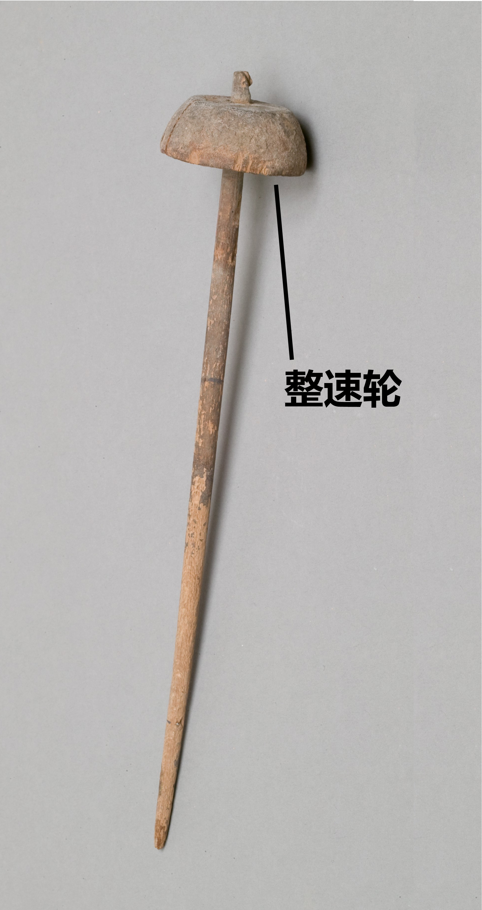

# Human-made Things in the Bible

## License Information

Human-made Things in the Bible © United Bible Societies, 2025. Adapted from: <cite>The Works of Their Hands: Man-made Things in the Bible</cite>, by Ray Pritz © 2009 United Bible Societies. This work is licensed under Creative Commons Attribution-ShareAlike 4.0 International (<a href="https://creativecommons.org/licenses/by-sa/4.0/">https://creativecommons.org/licenses/by-sa/4.0/</a>).

--------------------------------

## 标题：纺锤（spindle） (id: REALIA:1.5.3.2)

1\.5\.3\.2 标题：纺锤（spindle）
=========================

经文出处
----

### **纺锤** ：

Hebrew 来：כִּישׁוֹר (音译：kishor)

[PRO 31:19](https://ref.ly/Prov31:19)

Hebrew 来：פֶּלֶךְ (音译：pelek)

[2SA 3:29](https://ref.ly/2Sam3:29), [PRO 31:19](https://ref.ly/Prov31:19)

描述和用途
-----

*纺锤 (Metropolitan Museum of Art, CC0, MMA)*

在拉出纤维后，将纤维的一端固定到纺锤上，纺锤是一根长椭圆形的短棒，顶部有一个重物（整速轮）。将纺锤悬吊在空中并旋转，就可将附着的纤维纺成线。线越纺越长，绕在纺锤的中部，直到所有纤维都被拉出并纺成线。

藉由纺锤的旋转，即可得到结实的“纺制线”。表示这种纺制或加捻线的希伯来文为*shazar* （总是以*moshzar* 的词形出现），见于[PRO 31:19](https://ref.ly/Prov31:19) ，[EXO 26:31](https://ref.ly/Exod26:31) ，[EXO 26:36](https://ref.ly/Exod26:36) ，[EXO 27:9](https://ref.ly/Exod27:9) ，[EXO 27:16](https://ref.ly/Exod27:16) ，[EXO 27:18](https://ref.ly/Exod27:18) ，[EXO 28:6](https://ref.ly/Exod28:6) ，[EXO 28:8](https://ref.ly/Exod28:8) ，[EXO 28:15](https://ref.ly/Exod28:15) ，[EXO 36:8](https://ref.ly/Exod36:8) ，[EXO 36:35](https://ref.ly/Exod36:35) ，[EXO 36:37](https://ref.ly/Exod36:37) ，[EXO 38:9](https://ref.ly/Exod38:9) ，[EXO 38:16](https://ref.ly/Exod38:16) ，[EXO 38:18](https://ref.ly/Exod38:18) ，[EXO 39:2](https://ref.ly/Exod39:2) ，[EXO 39:5](https://ref.ly/Exod39:5) ，[EXO 39:8](https://ref.ly/Exod39:8) ，[EXO 39:24](https://ref.ly/Exod39:24) ，[EXO 39:28](https://ref.ly/Exod39:28); [EXO 39:29](https://ref.ly/Exod39:29) ；在[SIR 45:10](https://ref.ly/Sir45:10) 中是希腊文*klōthō* 。

---

翻译
--

*使用纺锤的女子 (© Rita Willaert, CC BY 2\.0, via Wikimedia Commons)*

[PRO 31:19](https://ref.ly/Prov31:19) ：这节经文的原文字面意为，“她伸手拿卷线杆，她的手把住纺锤”，RSV (Revised Standard Version (1952)) 采用了直译。但是，对于大多数现代文化中的读者来说，这样翻译没有传递出多少信息。通俗译本一般只描述女子的活动，而不提到她使用的具体工具。GNT (Good News Translation (1992)) 英文直译作，“她纺自己的线，织自己的布”。NCV (New Century Version) 更进一步，描述了纺线的动作，英文直译作“她用手做线，并编织自己的布料”。CEV (Contemporary English Version) 试图进一步简化这节经文，译成“她纺自己的布料”，但这可能太过了。人不是直接“纺”出布料的，即使读者知道线是如何纺出来的，也不能这样翻译。

* **Associated Passages:** 箴言 31:19; 撒母耳记下 3:29; 出埃及记 26:31; 出埃及记 26:36; 出埃及记 27:9; 出埃及记 27:16; 出埃及记 27:18; 出埃及记 28:6; 出埃及记 28:8; 出埃及记 28:15; 出埃及记 36:8; 出埃及记 36:35; 出埃及记 36:37; 出埃及记 38:9; 出埃及记 38:16; 出埃及记 38:18; 出埃及记 39:2; 出埃及记 39:5; 出埃及记 39:8; 出埃及记 39:24; 出埃及记 39:28; 出埃及记 39:29; 德训篇 45:10

