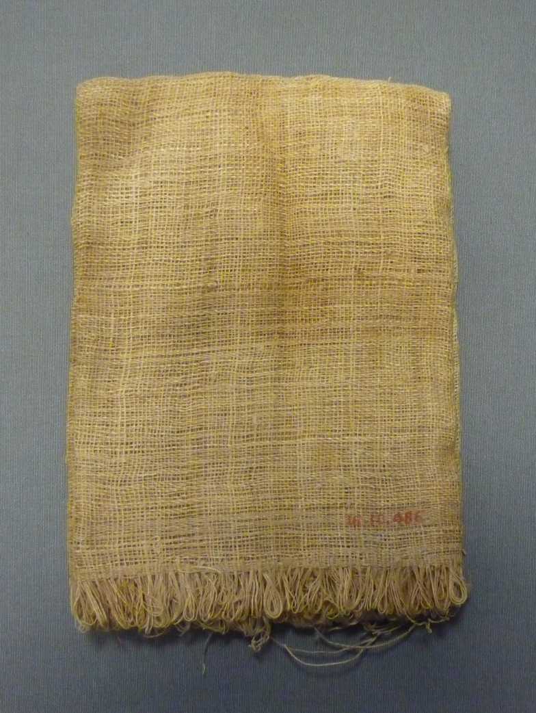

# Human-made Things in the Bible

## License Information

Human-made Things in the Bible © United Bible Societies, 2025. Adapted from: <cite>The Works of Their Hands: Man-made Things in the Bible</cite>, by Ray Pritz © 2009 United Bible Societies. This work is licensed under Creative Commons Attribution-ShareAlike 4.0 International (<a href="https://creativecommons.org/licenses/by-sa/4.0/">https://creativecommons.org/licenses/by-sa/4.0/</a>).

--------------------------------

## 标题：编织或针织材料（woven or knitted material） (id: REALIA:1.5.3.6)

1\.5\.3\.6 标题：编织或针织材料（woven or knitted material）
================================================

经文出处
----

Hebrew 来：דַּלָּה (音译：dalah)

[ISA 38:12](https://ref.ly/Isa38:12)

Hebrew 来：עֵרֶב (音译：‘erev)

[EXO 12:38](https://ref.ly/Exod12:38), [LEV 13:48](https://ref.ly/Lev13:48), [LEV 13:49](https://ref.ly/Lev13:49), [LEV 13:51](https://ref.ly/Lev13:51), [LEV 13:52](https://ref.ly/Lev13:52), [LEV 13:53](https://ref.ly/Lev13:53), [LEV 13:56](https://ref.ly/Lev13:56), [LEV 13:57](https://ref.ly/Lev13:57), [LEV 13:58](https://ref.ly/Lev13:58), [LEV 13:59](https://ref.ly/Lev13:59), [NEH 13:3](https://ref.ly/Neh13:3), [JER 25:20](https://ref.ly/Jer25:20), [JER 50:37](https://ref.ly/Jer50:37), [EZK 30:5](https://ref.ly/Ezek30:5)

Hebrew 来：שְׁתִי (音译：shthi)

[LEV 13:48](https://ref.ly/Lev13:48), [LEV 13:49](https://ref.ly/Lev13:49), [LEV 13:51](https://ref.ly/Lev13:51), [LEV 13:52](https://ref.ly/Lev13:52), [LEV 13:53](https://ref.ly/Lev13:53), [LEV 13:56](https://ref.ly/Lev13:56), [LEV 13:57](https://ref.ly/Lev13:57), [LEV 13:58](https://ref.ly/Lev13:58), [LEV 13:59](https://ref.ly/Lev13:59), [ECC 10:17](https://ref.ly/Eccl10:17)

描述和用途
-----

*编织布 (Source unknown)*

See [1\.5\.3 Cloth manufacture\<REALIA:1\.5\.3\>](#) 参[1\.5\.3 布料生产 (cloth manufacture)\<REALIA:1\.5\.3\>](#) 。

---

翻译
--

以下内容改写自《〈利未记〉手册》（*A Handbook on Leviticus* ，第200页）对[LEV 13:48](https://ref.ly/Lev13:48) 的注解：KJV (King James Version (1611)) 和RSV (Revised Standard Version (1952)) 等较早的译本将希伯来文*shthi* 和*‘erev* 译为“warp”（“经线”）和“woof”（“纬线”），这两个词在现代希伯来文中也是相同的含义。这种译法表示布料上的线具有不同的方向。但是，这不太可能是经文的意思。很难明白为什么一个方向上的线受到霉烂的影响，然而与其成直角的其他线却不受影响。发霉部分需要撕去的要求也没有道理（第56节），因为这样做会破坏整件衣服。这些词的含义可能是“编织或针织材料”（NAB (New American Bible (1970)) 、TOB (Traduction Oecuménique de la Bible (French, 1975)) 、NIV (New International Version (1984)) 直译；AT (American Translation (Goodspeed, 1935)) 的译文类似），不过这种解释并不确定。GNT (Good News Translation (1992)) 将其简化，英文直译为“（衣服的）一块”，但是翻译者应该尽量避免这种简化。

在[ISA 38:12](https://ref.ly/Isa38:12) ，希西家哀叹他的寿命会缩短。他用了织布的比喻，说他的生命就像布料沿着织布机的经线（竖线）被剪断。

* **Associated Passages:** 以赛亚书 38:12; 出埃及记 12:38; 利未记 13:48; 利未记 13:49; 利未记 13:51; 利未记 13:52; 利未记 13:53; 利未记 13:56; 利未记 13:57; 利未记 13:58; 利未记 13:59; 尼希米记 13:3; 耶利米书 25:20; 耶利米书 50:37; 以西结书 30:5; 传道书 10:17

