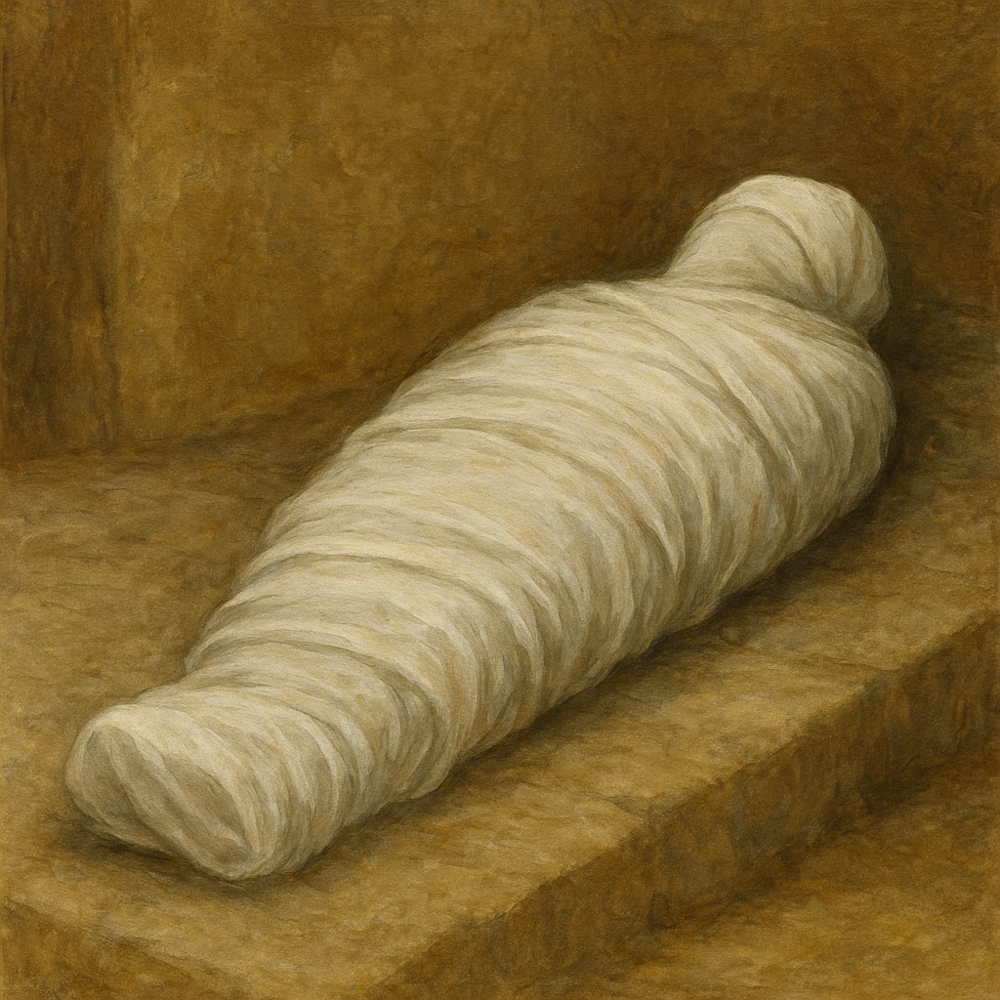

# Human-made Things in the Bible

## License Information

Human-made Things in the Bible © United Bible Societies, 2025. Adapted from: <cite>The Works of Their Hands: Man-made Things in the Bible</cite>, by Ray Pritz © 2009 United Bible Societies. This work is licensed under Creative Commons Attribution-ShareAlike 4.0 International (<a href="https://creativecommons.org/licenses/by-sa/4.0/">https://creativecommons.org/licenses/by-sa/4.0/</a>).

--------------------------------

## 标题：麻、亚麻、细麻布（linen） (id: REALIA:1.5.3.7)

1\.5\.3\.7 标题：麻、亚麻、细麻布（linen）
=============================

经文出处
----

Hebrew 来：אֵטוּן (音译：’etun)

[PRO 7:16](https://ref.ly/Prov7:16)

Hebrew 来：בַּד (音译：bad)

[EXO 28:42](https://ref.ly/Exod28:42), [EXO 39:28](https://ref.ly/Exod39:28), [LEV 6:3](https://ref.ly/Lev6:3), [LEV 6:3](https://ref.ly/Lev6:3), [LEV 16:4](https://ref.ly/Lev16:4), [LEV 16:4](https://ref.ly/Lev16:4), [LEV 16:4](https://ref.ly/Lev16:4), [LEV 16:4](https://ref.ly/Lev16:4), [LEV 16:23](https://ref.ly/Lev16:23), [LEV 16:32](https://ref.ly/Lev16:32), [1SA 2:18](https://ref.ly/1Sam2:18), [1SA 22:18](https://ref.ly/1Sam22:18), [2SA 6:14](https://ref.ly/2Sam6:14), [1CH 15:27](https://ref.ly/1Chr15:27), [EZK 9:3](https://ref.ly/Ezek9:3), [EZK 9:3](https://ref.ly/Ezek9:3), [EZK 9:11](https://ref.ly/Ezek9:11), [EZK 10:2](https://ref.ly/Ezek10:2), [EZK 10:6](https://ref.ly/Ezek10:6), [EZK 10:7](https://ref.ly/Ezek10:7), [DAN 10:5](https://ref.ly/Dan10:5), [DAN 12:6](https://ref.ly/Dan12:6), [DAN 12:7](https://ref.ly/Dan12:7)

Hebrew 来：בּוּץ (音译：buts)

[1CH 4:21](https://ref.ly/1Chr4:21), [1CH 15:27](https://ref.ly/1Chr15:27), [2CH 2:13](https://ref.ly/2Chr2:13), [2CH 3:14](https://ref.ly/2Chr3:14), [2CH 5:12](https://ref.ly/2Chr5:12), [EST 1:6](https://ref.ly/Esth1:6), [EST 8:15](https://ref.ly/Esth8:15), [EZK 27:16](https://ref.ly/Ezek27:16)

Hebrew סָדִין (音译：sadin（参)

[JDG 14:12](https://ref.ly/Judg14:12), [JDG 14:13](https://ref.ly/Judg14:13), [PRO 31:24](https://ref.ly/Prov31:24), [ISA 3:23](https://ref.ly/Isa3:23)

Hebrew 来：פֵּשֶׁת (音译：pishteh)

[LEV 13:48](https://ref.ly/Lev13:48), [LEV 13:52](https://ref.ly/Lev13:52), [LEV 13:59](https://ref.ly/Lev13:59), [DEU 22:11](https://ref.ly/Deut22:11), [JER 13:1](https://ref.ly/Jer13:1), [EZK 44:17](https://ref.ly/Ezek44:17), [EZK 44:18](https://ref.ly/Ezek44:18), [EZK 44:18](https://ref.ly/Ezek44:18)

Hebrew 来：שֵׁשׁ (音译：shesh)

[GEN 41:42](https://ref.ly/Gen41:42), [EXO 25:4](https://ref.ly/Exod25:4), [EXO 26:1](https://ref.ly/Exod26:1), [EXO 26:31](https://ref.ly/Exod26:31), [EXO 26:36](https://ref.ly/Exod26:36), [EXO 27:9](https://ref.ly/Exod27:9), [EXO 27:16](https://ref.ly/Exod27:16), [EXO 27:18](https://ref.ly/Exod27:18), [EXO 28:6](https://ref.ly/Exod28:6), [EXO 28:8](https://ref.ly/Exod28:8), [EXO 28:15](https://ref.ly/Exod28:15), [EXO 28:39](https://ref.ly/Exod28:39), [EXO 28:39](https://ref.ly/Exod28:39), [EXO 35:6](https://ref.ly/Exod35:6), [EXO 35:23](https://ref.ly/Exod35:23), [EXO 35:25](https://ref.ly/Exod35:25), [EXO 35:35](https://ref.ly/Exod35:35), [EXO 36:8](https://ref.ly/Exod36:8), [EXO 36:35](https://ref.ly/Exod36:35), [EXO 36:37](https://ref.ly/Exod36:37), [EXO 38:9](https://ref.ly/Exod38:9), [EXO 38:16](https://ref.ly/Exod38:16), [EXO 38:18](https://ref.ly/Exod38:18), [EXO 38:23](https://ref.ly/Exod38:23), [EXO 39:3](https://ref.ly/Exod39:3), [EXO 39:5](https://ref.ly/Exod39:5), [EXO 39:8](https://ref.ly/Exod39:8), [EXO 39:27](https://ref.ly/Exod39:27), [EXO 39:28](https://ref.ly/Exod39:28), [EXO 39:28](https://ref.ly/Exod39:28), [EXO 39:28](https://ref.ly/Exod39:28), [EXO 39:29](https://ref.ly/Exod39:29), [PRO 31:22](https://ref.ly/Prov31:22), [EZK 16:10](https://ref.ly/Ezek16:10), [EZK 16:13](https://ref.ly/Ezek16:13), [EZK 27:7](https://ref.ly/Ezek27:7)

Greek 希：βύσσινος (音译：bussinos)

[REV 18:12](https://ref.ly/Rev18:12), [REV 18:16](https://ref.ly/Rev18:16), [REV 19:8](https://ref.ly/Rev19:8), [REV 19:8](https://ref.ly/Rev19:8), [REV 19:14](https://ref.ly/Rev19:14), [1ES 3:6](https://ref.ly/1Esd3:6)

Greek 希：βύσσος (音译：bussos)

[LUK 16:19](https://ref.ly/Luke16:19)

Greek 希：λίνον, λινοῦς (音译：linon, linous)

[REV 15:6](https://ref.ly/Rev15:6), [JDT 16:8](https://ref.ly/Jdt16:8)

Greek 希：ὀθόνιον (音译：othonion)

[LUK 24:12](https://ref.ly/Luke24:12), [JHN 19:40](https://ref.ly/John19:40), [JHN 20:5](https://ref.ly/John20:5), [JHN 20:6](https://ref.ly/John20:6), [JHN 20:7](https://ref.ly/John20:7)

Greek 希：σινδών (音译：sindōn)

[MAT 27:59](https://ref.ly/Matt27:59), [MRK 14:51](https://ref.ly/Mark14:51), [MRK 14:52](https://ref.ly/Mark14:52), [MRK 15:46](https://ref.ly/Mark15:46), [MRK 15:46](https://ref.ly/Mark15:46), [LUK 23:53](https://ref.ly/Luke23:53)

描述
--

*(Image generated by ChatGPT using OpenAI technology)*

细麻布是由亚麻植物的茎制成的优质布料，非常结实和凉快。

---

用途
--

以色列大多数的亚麻都是从埃及进口，用于制造多种商品。圣经中提到了床罩、船帆、祭司圣服、帐幕器具、葬衣和其他东西。另参《圣经中的植物和树木》（*Plants and Trees in the Bible* ）中的[5\.1\.7 亚麻（亚麻布）（flax \[linen]）\<FLORA:5\.1\.7\>](#) 。

---

翻译
--

许多语言没有“亚麻”一词，翻译者虽然可以借用外来语，但是在许多情况下，译文最重要的是突出布料的品质，而不在于原材料是什么。因此，许多翻译者使用了“细密的（白）布”或“好布”等短语。在有些语境中，可以将其译成“由一种植物的纤维制成的布”。翻译者可能需要添加脚注来予以解释。

在几处经文中，细麻布的重要特点是：与其他布料相比，人不大容易出汗（参[EXO 39:27](https://ref.ly/Exod39:27); [EXO 39:28](https://ref.ly/Exod39:28); [EXO 39:29](https://ref.ly/Exod39:29) ；[LEV 6:10](https://ref.ly/Lev6:10) ［《和》6:3］，[LEV 16:4](https://ref.ly/Lev16:4) ；[EZK 44:17](https://ref.ly/Ezek44:17); [EZK 44:18](https://ref.ly/Ezek44:18) ）。如果当地人不知道亚麻布，翻译者应选择具有类似特点的布料作为替代。

在[MAT 27:59](https://ref.ly/Matt27:59) 、[MRK 15:46](https://ref.ly/Mark15:46) 和[LUK 23:53](https://ref.ly/Luke23:53) 中，希腊文*sindōn* 是指缠裹耶稣的身体以便安葬的布料。[LUK 24:12](https://ref.ly/Luke24:12) 、[JHN 19:40](https://ref.ly/John19:40) 和[JHN 20:5](https://ref.ly/John20:5); [JHN 20:6](https://ref.ly/John20:6); [JHN 20:7](https://ref.ly/John20:7) 中的希腊文*othonion* 也是这个意思。如果某种语言有专门的词语表示这种“安葬用布”或“裹尸布”，就应该使用该词。

* **Associated Passages:** 箴言 7:16; 出埃及记 28:42; 出埃及记 39:28; 利未记 6:3; 利未记 16:4; 利未记 16:23; 利未记 16:32; 撒母耳记上 2:18; 撒母耳记上 22:18; 撒母耳记下 6:14; 历代志上 15:27; 以西结书 9:3; 以西结书 9:11; 以西结书 10:2; 以西结书 10:6; 以西结书 10:7; 但以理书 10:5; 但以理书 12:6; 但以理书 12:7; 历代志上 4:21; 历代志下 2:13; 历代志下 3:14; 历代志下 5:12; 以斯帖记 1:6; 以斯帖记 8:15; 以西结书 27:16; 士师记 14:12; 士师记 14:13; 箴言 31:24; 以赛亚书 3:23; 利未记 13:48; 利未记 13:52; 利未记 13:59; 申命记 22:11; 耶利米书 13:1; 以西结书 44:17; 以西结书 44:18; 创世记 41:42; 出埃及记 25:4; 出埃及记 26:1; 出埃及记 26:31; 出埃及记 26:36; 出埃及记 27:9; 出埃及记 27:16; 出埃及记 27:18; 出埃及记 28:6; 出埃及记 28:8; 出埃及记 28:15; 出埃及记 28:39; 出埃及记 35:6; 出埃及记 35:23; 出埃及记 35:25; 出埃及记 35:35; 出埃及记 36:8; 出埃及记 36:35; 出埃及记 36:37; 出埃及记 38:9; 出埃及记 38:16; 出埃及记 38:18; 出埃及记 38:23; 出埃及记 39:3; 出埃及记 39:5; 出埃及记 39:8; 出埃及记 39:27; 出埃及记 39:29; 箴言 31:22; 以西结书 16:10; 以西结书 16:13; 以西结书 27:7; 启示录 18:12; 启示录 18:16; 启示录 19:8; 启示录 19:14; 厄斯德拉上 3:6; 路加福音 16:19; 启示录 15:6; 友弟德传 16:8; 路加福音 24:12; 约翰福音 19:40; 约翰福音 20:5; 约翰福音 20:6; 约翰福音 20:7; 马太福音 27:59; 马可福音 14:51; 马可福音 14:52; 马可福音 15:46; 路加福音 23:53; 利未记 6:10

