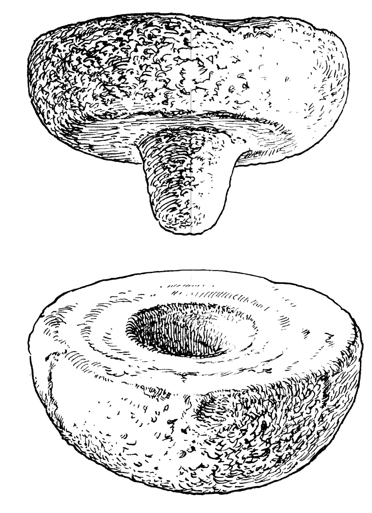
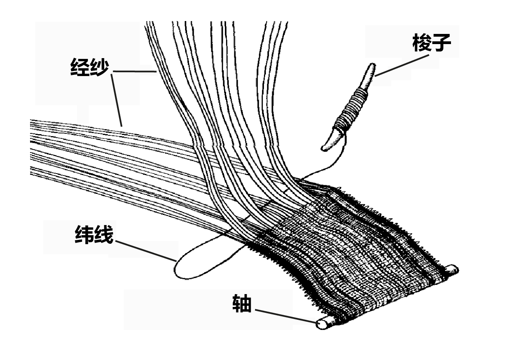
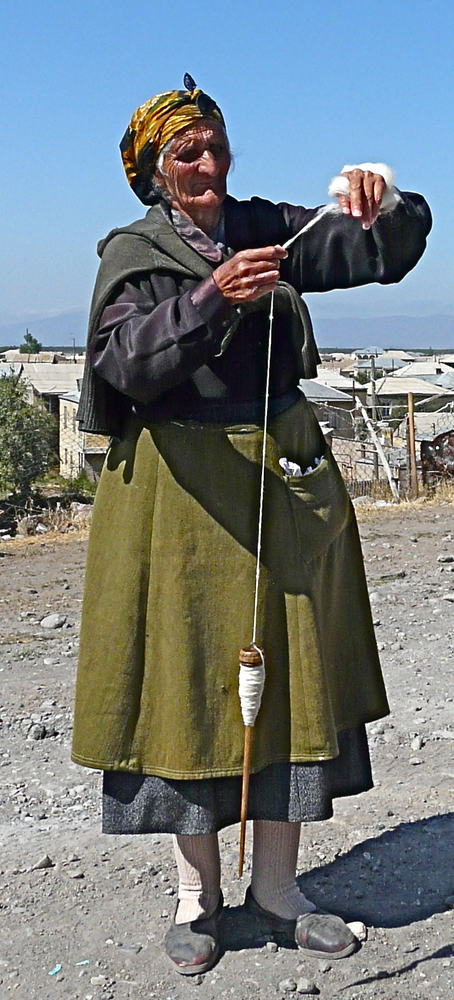
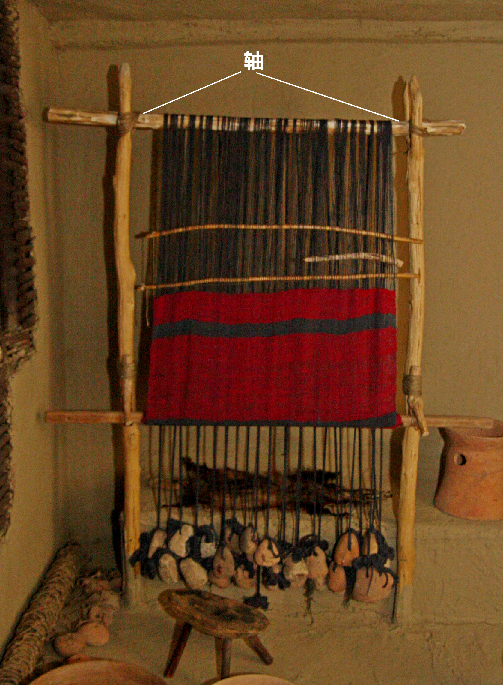

# Human-made Things in the Bible

## License Information

Human-made Things in the Bible © United Bible Societies, 2025. Adapted from: <cite>The Works of Their Hands: Man-made Things in the Bible</cite>, by Ray Pritz © 2009 United Bible Societies. This work is licensed under Creative Commons Attribution-ShareAlike 4.0 International (<a href="https://creativecommons.org/licenses/by-sa/4.0/">https://creativecommons.org/licenses/by-sa/4.0/</a>).

--------------------------------

## 标题：手工业（artisans） (id: REALIA:1.5)

1\.5 标题：手工业（artisans）
=====================

## 标题：窑匠、陶匠（potter） (id: REALIA:1.5.1)

1\.5\.1 标题：窑匠、陶匠（potter）
========================

## 标题：转盘（potter’s wheel） (id: REALIA:1.5.1.1)

1\.5\.1\.1 标题：转盘（potter’s wheel）
================================

经文出处
----

Hebrew 来：אָבְנַיִם (音译：’ovnayim)

[JER 18:3](https://ref.ly/Jer18:3)

Greek 希：τροχός (音译：trochos)

[SIR 38:29](https://ref.ly/Sir38:29)

描述
--

*窑轮（旧约时代） (© Deutsche Bibelgesellschaft, Stuttgart by United Bible Societies)*

在旧约时期，陶匠用的转盘是一个石头做成的水平轮子。石轮底部有一个尖的突起。下面的石轮是固定的，带一个凹坑。上面石轮的尖突起放在下面石轮的凹坑中，就像是一个转轴，上面的石轮绕着这个轴旋转。陶匠用手转动石轮，或者由别人转动石轮。在两约之间以及新约时期，转盘的构造和旧约时期的不同，上面的轮盘改由木头制成，通过一根轴与下边较大的轮盘连接。上面轮盘的高度方便陶匠坐着工作。

---

用途
--

*窑匠用脚转动轮子（新约时代） (The Pictorial New Testament, The Religious Tract Society 1881, Public domain)*

陶匠把一团黏土放在上轮的中央，用手或脚拨动转盘。后来，转盘的构造进一步发展，下面较重转盘的旋转会带动上方的转盘一同旋转。同时，陶匠用手抟弄黏土以塑型。参[SIR 38:29](https://ref.ly/Sir38:29) ，“同样，陶匠坐在他的转盘旁边，用脚转动转盘……”（GNT (Good News Translation (1992)) 直译）。

---

翻译
--

[JER 18:1](https://ref.ly/Jer18:1); [JER 18:2](https://ref.ly/Jer18:2); [JER 18:3](https://ref.ly/Jer18:3); [JER 18:4](https://ref.ly/Jer18:4) 的语境清楚表明，陶匠是在使用“转盘”来制作陶器。但是，翻译者如果觉得“转盘／轮子”的译法会误导读者，那么也可以译成“工作台”。

* **Associated Passages:** 耶利米书 18:3; 德训篇 38:29; 耶利米书 18:1; 耶利米书 18:2; 耶利米书 18:4

* **Associated ACAI Concepts:** Pottery Wheel (ID: `realia:PotteryWheel`)

## 标题：胶（glue） (id: REALIA:1.5.1.2)

1\.5\.1\.2 标题：胶（glue）
=====================

经文出处
----

Greek 希：συγκολλάω (音译：sugkollaō（动词）)

[SIR 22:9](https://ref.ly/Sir22:9)

描述和用途
-----

胶是一种黏性物质，用来将一个东西粘在另一个东西上。

---

翻译
--

几乎所有语言都有表示胶粘剂的词语。不过，[SIR 22:7](https://ref.ly/Sir22:7) 的希腊文本实际上使用的是动词，并且许多译本都描述了将两个东西重新粘到一起的动作；例如，“试图教导愚昧人，就像是把一口破碎的锅重新粘在一起……”（GNT (Good News Translation (1992)) 直译）。有些语言可能会区分不同种类的胶粘剂，这里选择的胶粘剂应该适合粘接陶器。

* **Associated Passages:** 德训篇 22:9; 德训篇 22:7

## 标题：雕工、雕刻师、木雕师（engraver, woodcarver） (id: REALIA:1.5.2)

1\.5\.2 标题：雕工、雕刻师、木雕师（engraver, woodcarver）
===========================================

## 标题：雕刻（engraving, carving） (id: REALIA:1.5.2.1)

1\.5\.2\.1 标题：雕刻（engraving, carving）
====================================

经文出处
----

Hebrew 来：חרשׁ, חָרָשׁ (音译：charash)

[EXO 28:11](https://ref.ly/Exod28:11), [EXO 35:35](https://ref.ly/Exod35:35), [EXO 38:23](https://ref.ly/Exod38:23), [JER 17:1](https://ref.ly/Jer17:1)

Hebrew 来：חֲרֹשֶׁת (音译：charosheth)

[EXO 31:5](https://ref.ly/Exod31:5), [EXO 31:5](https://ref.ly/Exod31:5), [EXO 35:33](https://ref.ly/Exod35:33), [EXO 35:33](https://ref.ly/Exod35:33)

Hebrew 来：פתח (音译：pathach（动词）)

[EXO 28:9](https://ref.ly/Exod28:9), [EXO 28:11](https://ref.ly/Exod28:11), [EXO 28:36](https://ref.ly/Exod28:36), [EXO 39:6](https://ref.ly/Exod39:6), [1KI 7:36](https://ref.ly/1Kgs7:36), [2CH 2:6](https://ref.ly/2Chr2:6), [2CH 2:13](https://ref.ly/2Chr2:13), [2CH 3:7](https://ref.ly/2Chr3:7), [ZEC 3:9](https://ref.ly/Zech3:9)

Hebrew 来：פִּתּוּחַ (音译：pituach)

[EXO 28:11](https://ref.ly/Exod28:11), [EXO 28:21](https://ref.ly/Exod28:21), [EXO 28:36](https://ref.ly/Exod28:36), [EXO 39:6](https://ref.ly/Exod39:6), [EXO 39:14](https://ref.ly/Exod39:14), [EXO 39:30](https://ref.ly/Exod39:30), [2CH 2:6](https://ref.ly/2Chr2:6), [2CH 2:13](https://ref.ly/2Chr2:13), [PSA 74:6](https://ref.ly/Ps74:6), [ZEC 3:9](https://ref.ly/Zech3:9)

Hebrew 来：קלע, מִקְלַעַת (音译：qala‘（动词）, miqla‘ath)

[1KI 6:18](https://ref.ly/1Kgs6:18), [1KI 6:29](https://ref.ly/1Kgs6:29), [1KI 6:29](https://ref.ly/1Kgs6:29), [1KI 6:32](https://ref.ly/1Kgs6:32), [1KI 6:32](https://ref.ly/1Kgs6:32), [1KI 6:35](https://ref.ly/1Kgs6:35), [1KI 7:31](https://ref.ly/1Kgs7:31)

Greek 希：γλύμμα (音译：glumma)

[SIR 38:27](https://ref.ly/Sir38:27), [SIR 45:11](https://ref.ly/Sir45:11)

Greek 希：γλυφή (音译：glufē)

[WIS 18:24](https://ref.ly/Wis18:24)

Greek 希：γλύφω (音译：glufō（动词）)

[WIS 13:13](https://ref.ly/Wis13:13), [SIR 38:27](https://ref.ly/Sir38:27)

Greek 希：ἐγγλύφω (音译：egglufō（动词）)

[1MA 13:29](https://ref.ly/1Macc13:29)

Greek 希：κολάπτω (音译：kolaptō（动词）)

[SIR 45:11](https://ref.ly/Sir45:11), [3MA 2:27](https://ref.ly/3Macc2:27)

描述
--

*戒指上的雕刻 (© The Portable Antiquities Scheme/ The Trustees of the British Museum, CC BY\-SA 2\.0, via Wikimedia Commons)*

雕刻作品是通过在石头、金属或宝石等坚硬表面上刻画线条来完成创作的图画或文字。木雕通常是用木头制成的像，用刀或其他锋利的工具削刻而成。

---

翻译
--

在有些语言中，可能需要根据雕刻表面的材质来选择合适的“雕刻”动词。

在[EXO 31:5](https://ref.ly/Exod31:5) 和[EXO 35:33](https://ref.ly/Exod35:33) 中，希伯来文*charosheth* 指雕刻作品和木雕。

[SIR 38:27](https://ref.ly/Sir38:27) 中描述的具体动作是“刻印”（“engrave seals”，NJB (New Jerusalem Bible (1985)) ；比较更加准确的RSV (Revised Standard Version (1952)) 译法，“cut the signets of seals”“雕刻印章上的印记”；另参[10\.2 印、印章、印戒、打印的戒指、戒指 (seal, signet ring, ring)\<REALIA:10\.2\>](#) 中的讨论）。这段经文的重点是雕刻师的勤奋和精确。如果当地没有准确对应“印”的词语，可以参考其他需要精确做工、样式繁多的手工艺品，以找到合适的译词。

* **Associated Passages:** 出埃及记 28:11; 出埃及记 35:35; 出埃及记 38:23; 耶利米书 17:1; 出埃及记 31:5; 出埃及记 35:33; 出埃及记 28:9; 出埃及记 28:36; 出埃及记 39:6; 列王纪上 7:36; 历代志下 2:6; 历代志下 2:13; 历代志下 3:7; 撒迦利亚书 3:9; 出埃及记 28:21; 出埃及记 39:14; 出埃及记 39:30; 诗篇 74:6; 列王纪上 6:18; 列王纪上 6:29; 列王纪上 6:32; 列王纪上 6:35; 列王纪上 7:31; 德训篇 38:27; 德训篇 45:11; 智慧篇 18:24; 智慧篇 13:13; 玛加伯上 13:29; 玛加伯三书 2:27

* **Associated ACAI Concepts:** Craftsman (ID: `realia:Craftsman`)

## 标题：布料生产（cloth manufacture） (id: REALIA:1.5.3)

1\.5\.3 标题：布料生产（cloth manufacture）
==================================

织布是制作布料的艺术。首先，把纤维纺成线。将一团纤维附着在一个短的尖木（**纺锤** ）上，然后转动纺锤，同时拉出纤维成为细线。这样，纺出的线就缠绕在纺锤上。在纺好线之后，将其成直角相互交织。**织机** 就是以这种方式编织布料的设备。在卧式织机中，将一排纱线绕在一个粗木轴上，然后系在另一个木轴上。这些线（称为经纱）稍微分开并保持绷紧状态，从经线侧面插入另一根线（称为纬线），先是放在第一根经线的上方，然后再插入下一根经线的下方。如此反复，直到纬线穿过所有的经线。为了快速完成这个动作，织布人会把纬线固定在一块小的扁平木头或骨头上，称为**梭子** 。带着纬纱的梭子连续不断地来回穿过经纱，形成经纬交织的布料。

## 标题：线、绳、纱（thread, string, yarn） (id: REALIA:1.5.3.1)

1\.5\.3\.1 标题：线、绳、纱（thread, string, yarn）
=========================================

经文出处
----

Hebrew 来：חוּט (音译：chut)

[GEN 14:23](https://ref.ly/Gen14:23), [JOS 2:18](https://ref.ly/Josh2:18), [JDG 16:12](https://ref.ly/Judg16:12), [ECC 4:12](https://ref.ly/Eccl4:12), [SNG 4:3](https://ref.ly/Song4:3)

Hebrew 来：פָּתִיל (音译：pathil)

[GEN 38:18](https://ref.ly/Gen38:18), [GEN 38:25](https://ref.ly/Gen38:25), [EXO 28:28](https://ref.ly/Exod28:28), [EXO 28:37](https://ref.ly/Exod28:37), [EXO 39:3](https://ref.ly/Exod39:3), [EXO 39:21](https://ref.ly/Exod39:21), [EXO 39:31](https://ref.ly/Exod39:31), [NUM 15:38](https://ref.ly/Num15:38), [NUM 19:15](https://ref.ly/Num19:15), [JDG 16:9](https://ref.ly/Judg16:9), [EZK 40:3](https://ref.ly/Ezek40:3)

描述
--

*一根绳子 (Image generated by ChatGPT using OpenAI technology)*

将纤维在纺锤上旋转扭绕，就可制成编织所用的线或纱线（参[1\.5\.3 布料生产 (cloth manufacture)\<REALIA:1\.5\.3\>](#) ）。以这种方式制造的单股线不是特别结实，但是把许多条这种细股线交织在一起而制成的布料就非常结实，可做许多用途。另参[1\.14 绳、带 (rope, cord)\<REALIA:1\.14\>](#) 。

---

翻译
--

“线”与“带子”或“绳子”之间的根本区别在于其构造，而不是粗细。或者说，绳子是由两根或多根单股线扭绞或编织而成。这里列出了所有出现希伯来文*pathil* 的经文，但是在其中一两处，翻译者可能会认为这个词是指较粗的带子。

在[EXO 39:3](https://ref.ly/Exod39:3) 中，希伯来文*pathil* 是指用金子做成的细“线”（“threads”；RSV (Revised Standard Version (1952)) 、CEV (Contemporary English Version) ）或“缕”（“strands”；NIV (New International Version (1984)) ）。有些语言可能有一个专门用词来表示这种由金属制成的“细丝”。

* **Associated Passages:** 创世记 14:23; 约书亚记 2:18; 士师记 16:12; 传道书 4:12; 雅歌 4:3; 创世记 38:18; 创世记 38:25; 出埃及记 28:28; 出埃及记 28:37; 出埃及记 39:3; 出埃及记 39:21; 出埃及记 39:31; 民数记 15:38; 民数记 19:15; 士师记 16:9; 以西结书 40:3

* **Associated ACAI Concepts:** Thread (ID: `realia:Thread`); Measuring Reed (ID: `realia:MeasuringReed`)

## 标题：纺锤（spindle） (id: REALIA:1.5.3.2)

1\.5\.3\.2 标题：纺锤（spindle）
=========================

经文出处
----

### **纺锤** ：

Hebrew 来：כִּישׁוֹר (音译：kishor)

[PRO 31:19](https://ref.ly/Prov31:19)

Hebrew 来：פֶּלֶךְ (音译：pelek)

[2SA 3:29](https://ref.ly/2Sam3:29), [PRO 31:19](https://ref.ly/Prov31:19)

描述和用途
-----

*纺锤 (Metropolitan Museum of Art, CC0, MMA)*

在拉出纤维后，将纤维的一端固定到纺锤上，纺锤是一根长椭圆形的短棒，顶部有一个重物（整速轮）。将纺锤悬吊在空中并旋转，就可将附着的纤维纺成线。线越纺越长，绕在纺锤的中部，直到所有纤维都被拉出并纺成线。

藉由纺锤的旋转，即可得到结实的“纺制线”。表示这种纺制或加捻线的希伯来文为*shazar* （总是以*moshzar* 的词形出现），见于[PRO 31:19](https://ref.ly/Prov31:19) ，[EXO 26:31](https://ref.ly/Exod26:31) ，[EXO 26:36](https://ref.ly/Exod26:36) ，[EXO 27:9](https://ref.ly/Exod27:9) ，[EXO 27:16](https://ref.ly/Exod27:16) ，[EXO 27:18](https://ref.ly/Exod27:18) ，[EXO 28:6](https://ref.ly/Exod28:6) ，[EXO 28:8](https://ref.ly/Exod28:8) ，[EXO 28:15](https://ref.ly/Exod28:15) ，[EXO 36:8](https://ref.ly/Exod36:8) ，[EXO 36:35](https://ref.ly/Exod36:35) ，[EXO 36:37](https://ref.ly/Exod36:37) ，[EXO 38:9](https://ref.ly/Exod38:9) ，[EXO 38:16](https://ref.ly/Exod38:16) ，[EXO 38:18](https://ref.ly/Exod38:18) ，[EXO 39:2](https://ref.ly/Exod39:2) ，[EXO 39:5](https://ref.ly/Exod39:5) ，[EXO 39:8](https://ref.ly/Exod39:8) ，[EXO 39:24](https://ref.ly/Exod39:24) ，[EXO 39:28](https://ref.ly/Exod39:28); [EXO 39:29](https://ref.ly/Exod39:29) ；在[SIR 45:10](https://ref.ly/Sir45:10) 中是希腊文*klōthō* 。

---

翻译
--

*使用纺锤的女子 (© Rita Willaert, CC BY 2\.0, via Wikimedia Commons)*

[PRO 31:19](https://ref.ly/Prov31:19) ：这节经文的原文字面意为，“她伸手拿卷线杆，她的手把住纺锤”，RSV (Revised Standard Version (1952)) 采用了直译。但是，对于大多数现代文化中的读者来说，这样翻译没有传递出多少信息。通俗译本一般只描述女子的活动，而不提到她使用的具体工具。GNT (Good News Translation (1992)) 英文直译作，“她纺自己的线，织自己的布”。NCV (New Century Version) 更进一步，描述了纺线的动作，英文直译作“她用手做线，并编织自己的布料”。CEV (Contemporary English Version) 试图进一步简化这节经文，译成“她纺自己的布料”，但这可能太过了。人不是直接“纺”出布料的，即使读者知道线是如何纺出来的，也不能这样翻译。

* **Associated Passages:** 箴言 31:19; 撒母耳记下 3:29; 出埃及记 26:31; 出埃及记 26:36; 出埃及记 27:9; 出埃及记 27:16; 出埃及记 27:18; 出埃及记 28:6; 出埃及记 28:8; 出埃及记 28:15; 出埃及记 36:8; 出埃及记 36:35; 出埃及记 36:37; 出埃及记 38:9; 出埃及记 38:16; 出埃及记 38:18; 出埃及记 39:2; 出埃及记 39:5; 出埃及记 39:8; 出埃及记 39:24; 出埃及记 39:28; 出埃及记 39:29; 德训篇 45:10

* **Associated ACAI Concepts:** Spindle (ID: `realia:Spindle`)

## 标题：织布机的轴（weaver’s beam） (id: REALIA:1.5.3.3)

1\.5\.3\.3 标题：织布机的轴（weaver’s beam）
==================================

经文出处
----

Hebrew 来：מָנוֹר, ארג (音译：mnor ’orgim)

[1SA 17:7](https://ref.ly/1Sam17:7), [2SA 21:19](https://ref.ly/2Sam21:19), [1CH 11:23](https://ref.ly/1Chr11:23), [1CH 20:5](https://ref.ly/1Chr20:5)

Greek 希：ἱστός (音译：histos)

[ODA 11:12](https://ref.ly/Odes11:12)

描述
--

*立式织机 (© CristianChirita, CC BY\-SA 3\.0, via Wikimedia Commons)*

织布机的轴是一根直径约5—6厘米（2—2\.5英寸）的木杆，长度不一。经线缠绕在这根轴上；布料越织越长，就直接卷在这根轴上面。

---

用途
--

参[1\.5\.3 布料生产 (cloth manufacture)\<REALIA:1\.5\.3\>](#) 。

---

翻译
--

旧约提到这个物件，用来突出巨人的枪杆非常粗。考虑到手工织布机在现今的西方英语国家已经鲜为人知，所以[1SA 17:7](https://ref.ly/1Sam17:7) 可以不提及织布机的轴，译成“他的矛极其大……”（CEV (Contemporary English Version) 直译）。在手工织布并不常见的地方，翻译者可以采取这种翻译方式。另一种译法是：“他的长矛有普通长矛的两倍粗……。”

在[ODA 11:12](https://ref.ly/Odes11:12) 中，希腊文*histos* 可以指轴或整台织布机。翻译者通常没有必要直译这个词，可以参考“她编织好的一件成品”（NRSV (New Revised Standard Version (1989)) 直译），或“做好的工作”（NJB (New Jerusalem Bible (1985)) 直译）。

* **Associated Passages:** 撒母耳记上 17:7; 撒母耳记下 21:19; 历代志上 11:23; 历代志上 20:5; 颂歌 11:12

* **Associated ACAI Concepts:** Weavers Beam (ID: `realia:WeaversBeam`); Spear (ID: `realia:Spear`)

## 标题：梭（shuttle） (id: REALIA:1.5.3.4)

1\.5\.3\.4 标题：梭（shuttle）
========================

经文出处
----

Hebrew 来：אֶרֶג (音译：’ereg)

[JDG 16:14](https://ref.ly/Judg16:14), [JOB 7:6](https://ref.ly/Job7:6)

描述和用途
-----

梭子是把“纬线”（“横线”）从织布机的一侧牵引到另一侧的小工具。梭子在织布机的“经线”之间快速穿过，将上面系着的纬线拉直。经线在纬线的上方和下方将其压紧，从而固定住纬线。这样，布就又增加了一根线。熟练的织布工能够让梭子不停地来回穿越，很快地增加纬线，直到织成一整匹布。参[1\.5\.3 布料生产 (cloth manufacture)\<REALIA:1\.5\.3\>](#) 和那里的插图。

---

翻译
--

[JDG 16:13](https://ref.ly/Judg16:13); [JDG 16:14](https://ref.ly/Judg16:14) 记载，参孙在睡梦中被惊醒后，他扯碎了大利拉为了编织他的头发而临时架设的织机的所有部件，包括“针”、“梭”和“织物”。大利拉已经把参孙的头发编织到这些部件里面。有些译本将这里的*’ereg* 译为“织布机”（“loom”，RSV (Revised Standard Version (1952)) 、NIV (New International Version (1984)) ），这种译法并不准确。

[JOB 7:6](https://ref.ly/Job7:6) 将一天比作梭子的一次快速穿越。

* **Associated Passages:** 士师记 16:14; 约伯记 7:6; 士师记 16:13

* **Associated ACAI Concepts:** Shuttle (ID: `realia:Shuttle`)

## 标题：压杆、压条、针（beater, batten, pin） (id: REALIA:1.5.3.5)

1\.5\.3\.5 标题：压杆、压条、针（beater, batten, pin）
==========================================

经文出处
----

Hebrew 来：יָתֵד (音译：yathed)

[JDG 16:14](https://ref.ly/Judg16:14), [JDG 16:14](https://ref.ly/Judg16:14)

描述 和翻译
------

在[JDG 16:14](https://ref.ly/Judg16:14) 中，希伯来文*yathed* 出现了两次，学者对这个词有多种理解。大利拉可能试图用帐棚橛将参孙的头发固定在地上，这是该词的一般含义（参[3\.2\.2 帐棚橛、帐棚桩 (tent peg, stake)\<REALIA:3\.2\.2\>](#) ）。然而，*yathed* 在这里似乎更有可能指的是大利拉所用织布机的一部分。一种可能是：这是墙上用来挂竖线的钉子。这种可能性见于CEV (Contemporary English Version) 的译文，英文直译作：“参孙睡着的时候，大利拉把他的辫子编到织布机上的线里面，然后将织布机钉在墙上。然后她喊道，‘参孙，非利士人来捉你了！’参孙醒了过来，将织布机从地里的柱子和墙里的钉子上拽下来，然后他又把头发从织好的布里面拉出来。”也许最有可能的是，*yathed* 这里指的是一种用来将纬线向下压紧的杆（纬线与参孙的头发织在一起）。这种理解反映在RSV (Revised Standard Version (1952)) 的翻译中，英文直译作：“在他睡觉的时候，大利拉把他的七条发绺织在布里面。她用针把头发压紧，然后对他说，‘参孙，非利士人来捉你了！’但他从睡梦中醒来，把针、织机和布全部扯碎。”

* **Associated Passages:** 士师记 16:14

## 标题：编织或针织材料（woven or knitted material） (id: REALIA:1.5.3.6)

1\.5\.3\.6 标题：编织或针织材料（woven or knitted material）
================================================

经文出处
----

Hebrew 来：דַּלָּה (音译：dalah)

[ISA 38:12](https://ref.ly/Isa38:12)

Hebrew 来：עֵרֶב (音译：‘erev)

[EXO 12:38](https://ref.ly/Exod12:38), [LEV 13:48](https://ref.ly/Lev13:48), [LEV 13:49](https://ref.ly/Lev13:49), [LEV 13:51](https://ref.ly/Lev13:51), [LEV 13:52](https://ref.ly/Lev13:52), [LEV 13:53](https://ref.ly/Lev13:53), [LEV 13:56](https://ref.ly/Lev13:56), [LEV 13:57](https://ref.ly/Lev13:57), [LEV 13:58](https://ref.ly/Lev13:58), [LEV 13:59](https://ref.ly/Lev13:59), [NEH 13:3](https://ref.ly/Neh13:3), [JER 25:20](https://ref.ly/Jer25:20), [JER 50:37](https://ref.ly/Jer50:37), [EZK 30:5](https://ref.ly/Ezek30:5)

Hebrew 来：שְׁתִי (音译：shthi)

[LEV 13:48](https://ref.ly/Lev13:48), [LEV 13:49](https://ref.ly/Lev13:49), [LEV 13:51](https://ref.ly/Lev13:51), [LEV 13:52](https://ref.ly/Lev13:52), [LEV 13:53](https://ref.ly/Lev13:53), [LEV 13:56](https://ref.ly/Lev13:56), [LEV 13:57](https://ref.ly/Lev13:57), [LEV 13:58](https://ref.ly/Lev13:58), [LEV 13:59](https://ref.ly/Lev13:59), [ECC 10:17](https://ref.ly/Eccl10:17)

描述和用途
-----

*编织布 (Source unknown)*

See [1\.5\.3 Cloth manufacture\<REALIA:1\.5\.3\>](#) 参[1\.5\.3 布料生产 (cloth manufacture)\<REALIA:1\.5\.3\>](#) 。

---

翻译
--

以下内容改写自《〈利未记〉手册》（*A Handbook on Leviticus* ，第200页）对[LEV 13:48](https://ref.ly/Lev13:48) 的注解：KJV (King James Version (1611)) 和RSV (Revised Standard Version (1952)) 等较早的译本将希伯来文*shthi* 和*‘erev* 译为“warp”（“经线”）和“woof”（“纬线”），这两个词在现代希伯来文中也是相同的含义。这种译法表示布料上的线具有不同的方向。但是，这不太可能是经文的意思。很难明白为什么一个方向上的线受到霉烂的影响，然而与其成直角的其他线却不受影响。发霉部分需要撕去的要求也没有道理（第56节），因为这样做会破坏整件衣服。这些词的含义可能是“编织或针织材料”（NAB (New American Bible (1970)) 、TOB (Traduction Oecuménique de la Bible (French, 1975)) 、NIV (New International Version (1984)) 直译；AT (American Translation (Goodspeed, 1935)) 的译文类似），不过这种解释并不确定。GNT (Good News Translation (1992)) 将其简化，英文直译为“（衣服的）一块”，但是翻译者应该尽量避免这种简化。

在[ISA 38:12](https://ref.ly/Isa38:12) ，希西家哀叹他的寿命会缩短。他用了织布的比喻，说他的生命就像布料沿着织布机的经线（竖线）被剪断。

* **Associated Passages:** 以赛亚书 38:12; 出埃及记 12:38; 利未记 13:48; 利未记 13:49; 利未记 13:51; 利未记 13:52; 利未记 13:53; 利未记 13:56; 利未记 13:57; 利未记 13:58; 利未记 13:59; 尼希米记 13:3; 耶利米书 25:20; 耶利米书 50:37; 以西结书 30:5; 传道书 10:17

* **Associated ACAI Concepts:** Woven or Knitted Material (ID: `realia:WovenOrKnittedMaterial`)

## 标题：麻、亚麻、细麻布（linen） (id: REALIA:1.5.3.7)

1\.5\.3\.7 标题：麻、亚麻、细麻布（linen）
=============================

经文出处
----

Hebrew 来：אֵטוּן (音译：’etun)

[PRO 7:16](https://ref.ly/Prov7:16)

Hebrew 来：בַּד (音译：bad)

[EXO 28:42](https://ref.ly/Exod28:42), [EXO 39:28](https://ref.ly/Exod39:28), [LEV 6:3](https://ref.ly/Lev6:3), [LEV 6:3](https://ref.ly/Lev6:3), [LEV 16:4](https://ref.ly/Lev16:4), [LEV 16:4](https://ref.ly/Lev16:4), [LEV 16:4](https://ref.ly/Lev16:4), [LEV 16:4](https://ref.ly/Lev16:4), [LEV 16:23](https://ref.ly/Lev16:23), [LEV 16:32](https://ref.ly/Lev16:32), [1SA 2:18](https://ref.ly/1Sam2:18), [1SA 22:18](https://ref.ly/1Sam22:18), [2SA 6:14](https://ref.ly/2Sam6:14), [1CH 15:27](https://ref.ly/1Chr15:27), [EZK 9:3](https://ref.ly/Ezek9:3), [EZK 9:3](https://ref.ly/Ezek9:3), [EZK 9:11](https://ref.ly/Ezek9:11), [EZK 10:2](https://ref.ly/Ezek10:2), [EZK 10:6](https://ref.ly/Ezek10:6), [EZK 10:7](https://ref.ly/Ezek10:7), [DAN 10:5](https://ref.ly/Dan10:5), [DAN 12:6](https://ref.ly/Dan12:6), [DAN 12:7](https://ref.ly/Dan12:7)

Hebrew 来：בּוּץ (音译：buts)

[1CH 4:21](https://ref.ly/1Chr4:21), [1CH 15:27](https://ref.ly/1Chr15:27), [2CH 2:13](https://ref.ly/2Chr2:13), [2CH 3:14](https://ref.ly/2Chr3:14), [2CH 5:12](https://ref.ly/2Chr5:12), [EST 1:6](https://ref.ly/Esth1:6), [EST 8:15](https://ref.ly/Esth8:15), [EZK 27:16](https://ref.ly/Ezek27:16)

Hebrew סָדִין (音译：sadin（参)

[JDG 14:12](https://ref.ly/Judg14:12), [JDG 14:13](https://ref.ly/Judg14:13), [PRO 31:24](https://ref.ly/Prov31:24), [ISA 3:23](https://ref.ly/Isa3:23)

Hebrew 来：פֵּשֶׁת (音译：pishteh)

[LEV 13:48](https://ref.ly/Lev13:48), [LEV 13:52](https://ref.ly/Lev13:52), [LEV 13:59](https://ref.ly/Lev13:59), [DEU 22:11](https://ref.ly/Deut22:11), [JER 13:1](https://ref.ly/Jer13:1), [EZK 44:17](https://ref.ly/Ezek44:17), [EZK 44:18](https://ref.ly/Ezek44:18), [EZK 44:18](https://ref.ly/Ezek44:18)

Hebrew 来：שֵׁשׁ (音译：shesh)

[GEN 41:42](https://ref.ly/Gen41:42), [EXO 25:4](https://ref.ly/Exod25:4), [EXO 26:1](https://ref.ly/Exod26:1), [EXO 26:31](https://ref.ly/Exod26:31), [EXO 26:36](https://ref.ly/Exod26:36), [EXO 27:9](https://ref.ly/Exod27:9), [EXO 27:16](https://ref.ly/Exod27:16), [EXO 27:18](https://ref.ly/Exod27:18), [EXO 28:6](https://ref.ly/Exod28:6), [EXO 28:8](https://ref.ly/Exod28:8), [EXO 28:15](https://ref.ly/Exod28:15), [EXO 28:39](https://ref.ly/Exod28:39), [EXO 28:39](https://ref.ly/Exod28:39), [EXO 35:6](https://ref.ly/Exod35:6), [EXO 35:23](https://ref.ly/Exod35:23), [EXO 35:25](https://ref.ly/Exod35:25), [EXO 35:35](https://ref.ly/Exod35:35), [EXO 36:8](https://ref.ly/Exod36:8), [EXO 36:35](https://ref.ly/Exod36:35), [EXO 36:37](https://ref.ly/Exod36:37), [EXO 38:9](https://ref.ly/Exod38:9), [EXO 38:16](https://ref.ly/Exod38:16), [EXO 38:18](https://ref.ly/Exod38:18), [EXO 38:23](https://ref.ly/Exod38:23), [EXO 39:3](https://ref.ly/Exod39:3), [EXO 39:5](https://ref.ly/Exod39:5), [EXO 39:8](https://ref.ly/Exod39:8), [EXO 39:27](https://ref.ly/Exod39:27), [EXO 39:28](https://ref.ly/Exod39:28), [EXO 39:28](https://ref.ly/Exod39:28), [EXO 39:28](https://ref.ly/Exod39:28), [EXO 39:29](https://ref.ly/Exod39:29), [PRO 31:22](https://ref.ly/Prov31:22), [EZK 16:10](https://ref.ly/Ezek16:10), [EZK 16:13](https://ref.ly/Ezek16:13), [EZK 27:7](https://ref.ly/Ezek27:7)

Greek 希：βύσσινος (音译：bussinos)

[REV 18:12](https://ref.ly/Rev18:12), [REV 18:16](https://ref.ly/Rev18:16), [REV 19:8](https://ref.ly/Rev19:8), [REV 19:8](https://ref.ly/Rev19:8), [REV 19:14](https://ref.ly/Rev19:14), [1ES 3:6](https://ref.ly/1Esd3:6)

Greek 希：βύσσος (音译：bussos)

[LUK 16:19](https://ref.ly/Luke16:19)

Greek 希：λίνον, λινοῦς (音译：linon, linous)

[REV 15:6](https://ref.ly/Rev15:6), [JDT 16:8](https://ref.ly/Jdt16:8)

Greek 希：ὀθόνιον (音译：othonion)

[LUK 24:12](https://ref.ly/Luke24:12), [JHN 19:40](https://ref.ly/John19:40), [JHN 20:5](https://ref.ly/John20:5), [JHN 20:6](https://ref.ly/John20:6), [JHN 20:7](https://ref.ly/John20:7)

Greek 希：σινδών (音译：sindōn)

[MAT 27:59](https://ref.ly/Matt27:59), [MRK 14:51](https://ref.ly/Mark14:51), [MRK 14:52](https://ref.ly/Mark14:52), [MRK 15:46](https://ref.ly/Mark15:46), [MRK 15:46](https://ref.ly/Mark15:46), [LUK 23:53](https://ref.ly/Luke23:53)

描述
--

*(Image generated by ChatGPT using OpenAI technology)*

细麻布是由亚麻植物的茎制成的优质布料，非常结实和凉快。

---

用途
--

以色列大多数的亚麻都是从埃及进口，用于制造多种商品。圣经中提到了床罩、船帆、祭司圣服、帐幕器具、葬衣和其他东西。另参《圣经中的植物和树木》（*Plants and Trees in the Bible* ）中的[5\.1\.7 亚麻（亚麻布）（flax \[linen]）\<FLORA:5\.1\.7\>](#) 。

---

翻译
--

许多语言没有“亚麻”一词，翻译者虽然可以借用外来语，但是在许多情况下，译文最重要的是突出布料的品质，而不在于原材料是什么。因此，许多翻译者使用了“细密的（白）布”或“好布”等短语。在有些语境中，可以将其译成“由一种植物的纤维制成的布”。翻译者可能需要添加脚注来予以解释。

在几处经文中，细麻布的重要特点是：与其他布料相比，人不大容易出汗（参[EXO 39:27](https://ref.ly/Exod39:27); [EXO 39:28](https://ref.ly/Exod39:28); [EXO 39:29](https://ref.ly/Exod39:29) ；[LEV 6:10](https://ref.ly/Lev6:10) ［《和》6:3］，[LEV 16:4](https://ref.ly/Lev16:4) ；[EZK 44:17](https://ref.ly/Ezek44:17); [EZK 44:18](https://ref.ly/Ezek44:18) ）。如果当地人不知道亚麻布，翻译者应选择具有类似特点的布料作为替代。

在[MAT 27:59](https://ref.ly/Matt27:59) 、[MRK 15:46](https://ref.ly/Mark15:46) 和[LUK 23:53](https://ref.ly/Luke23:53) 中，希腊文*sindōn* 是指缠裹耶稣的身体以便安葬的布料。[LUK 24:12](https://ref.ly/Luke24:12) 、[JHN 19:40](https://ref.ly/John19:40) 和[JHN 20:5](https://ref.ly/John20:5); [JHN 20:6](https://ref.ly/John20:6); [JHN 20:7](https://ref.ly/John20:7) 中的希腊文*othonion* 也是这个意思。如果某种语言有专门的词语表示这种“安葬用布”或“裹尸布”，就应该使用该词。

* **Associated Passages:** 箴言 7:16; 出埃及记 28:42; 出埃及记 39:28; 利未记 6:3; 利未记 16:4; 利未记 16:23; 利未记 16:32; 撒母耳记上 2:18; 撒母耳记上 22:18; 撒母耳记下 6:14; 历代志上 15:27; 以西结书 9:3; 以西结书 9:11; 以西结书 10:2; 以西结书 10:6; 以西结书 10:7; 但以理书 10:5; 但以理书 12:6; 但以理书 12:7; 历代志上 4:21; 历代志下 2:13; 历代志下 3:14; 历代志下 5:12; 以斯帖记 1:6; 以斯帖记 8:15; 以西结书 27:16; 士师记 14:12; 士师记 14:13; 箴言 31:24; 以赛亚书 3:23; 利未记 13:48; 利未记 13:52; 利未记 13:59; 申命记 22:11; 耶利米书 13:1; 以西结书 44:17; 以西结书 44:18; 创世记 41:42; 出埃及记 25:4; 出埃及记 26:1; 出埃及记 26:31; 出埃及记 26:36; 出埃及记 27:9; 出埃及记 27:16; 出埃及记 27:18; 出埃及记 28:6; 出埃及记 28:8; 出埃及记 28:15; 出埃及记 28:39; 出埃及记 35:6; 出埃及记 35:23; 出埃及记 35:25; 出埃及记 35:35; 出埃及记 36:8; 出埃及记 36:35; 出埃及记 36:37; 出埃及记 38:9; 出埃及记 38:16; 出埃及记 38:18; 出埃及记 38:23; 出埃及记 39:3; 出埃及记 39:5; 出埃及记 39:8; 出埃及记 39:27; 出埃及记 39:29; 箴言 31:22; 以西结书 16:10; 以西结书 16:13; 以西结书 27:7; 启示录 18:12; 启示录 18:16; 启示录 19:8; 启示录 19:14; 厄斯德拉上 3:6; 路加福音 16:19; 启示录 15:6; 友弟德传 16:8; 路加福音 24:12; 约翰福音 19:40; 约翰福音 20:5; 约翰福音 20:6; 约翰福音 20:7; 马太福音 27:59; 马可福音 14:51; 马可福音 14:52; 马可福音 15:46; 路加福音 23:53; 利未记 6:10

* **Associated ACAI Concepts:** Linen (ID: `realia:Linen`)

## 标题：毛、羊毛（wool） (id: REALIA:1.5.3.8)

1\.5\.3\.8 标题：毛、羊毛（wool）
========================

经文出处
----

Hebrew 来：צֶמֶר (音译：tsemer)

[LEV 13:48](https://ref.ly/Lev13:48), [LEV 13:52](https://ref.ly/Lev13:52), [LEV 13:59](https://ref.ly/Lev13:59), [DEU 22:11](https://ref.ly/Deut22:11), [ISA 51:8](https://ref.ly/Isa51:8), [EZK 44:17](https://ref.ly/Ezek44:17)

Greek 希：ἔριον (音译：erion)

[HEB 9:19](https://ref.ly/Heb9:19)

描述
--

毛是绵羊和某些其他动物的波浪形毛发，质地柔软，可编织成布并做成衣服。

---

翻译
--

在有些语言中，翻译者可能需要将“羊毛”译为“用绵羊的毛制成的布料”。

* **Associated Passages:** 利未记 13:48; 利未记 13:52; 利未记 13:59; 申命记 22:11; 以赛亚书 51:8; 以西结书 44:17; 希伯来书 9:19

* **Associated ACAI Concepts:** Wool (ID: `realia:Wool`)

## 标题：丝绸、绸缎、精致衣料（silk） (id: REALIA:1.5.3.9)

1\.5\.3\.9 标题：丝绸、绸缎、精致衣料（silk）
==============================

经文出处
----

Hebrew 来：מֶשִׁי (音译：meshi)

[EZK 16:10](https://ref.ly/Ezek16:10), [EZK 16:13](https://ref.ly/Ezek16:13)

Greek 希：σιρικόν (音译：sirikon)

[REV 18:12](https://ref.ly/Rev18:12)

描述
--

丝绸是一种精细、昂贵的布料，由蚕茧抽出的蚕丝织成。

---

翻译
--

对于[EZK 16:10](https://ref.ly/Ezek16:10); [EZK 16:13](https://ref.ly/Ezek16:13) 中希伯来文*meshi* 的译法，各译本和注释书的意见不一。传统的翻译是“丝绸”（“silk”），并且现今仍有许多译本依循这种译法（KJV (King James Version (1611)) 、RSV (Revised Standard Version (1952)) 、GNT (Good News Translation (1992)) 、NCV (New Century Version) ）。其他译本认为这在以西结的时期不大可能，因为当时丝绸在中东还不为人所知。有人提出，这个词是指女子戴着的一种面纱，遮住她的脸不让别人看到，但是她可以看到外面。通常，不接受“丝绸”为正确译法的译本会选择一个比较一般性的词语。比较“最昂贵的长袍”（“most expensive robes”；CEV (Contemporary English Version) ），“华美的织物”（“rich fabric”；NRSV (New Revised Standard Version (1989)) ），“漂亮的编织长袍”（GECL (German Common Language Version (Gute Nachricht Bibel)) ），“昂贵的布料”（TOB (Traduction Oecuménique de la Bible (French, 1975)) ），以及“细麻布”（“fine linen”；REB (Revised English Bible (1989)) ）。

在主后1世纪的背景下，[REV 18:12](https://ref.ly/Rev18:12) 很可能是指丝绸。然而，从这节经文的语境来看，我们无法确定希腊文*sirikos* 只是指丝绸料子，还是指丝绸做成的衣服。

* **Associated Passages:** 以西结书 16:10; 以西结书 16:13; 启示录 18:12

* **Associated ACAI Concepts:** Silk (ID: `realia:Silk`)

## 标题：紫色布（purple cloth） (id: REALIA:1.5.3.10)

1\.5\.3\.10 标题：紫色布（purple cloth）
================================

经文出处
----

Hebrew 来：אַרְגְּוָן (音译：’argewan)

[2CH 2:6](https://ref.ly/2Chr2:6), [DAN 5:7](https://ref.ly/Dan5:7), [DAN 5:16](https://ref.ly/Dan5:16), [DAN 5:29](https://ref.ly/Dan5:29)

Hebrew 来：אַרְגָּמָן (音译：’argaman)

[EXO 25:4](https://ref.ly/Exod25:4), [EXO 26:1](https://ref.ly/Exod26:1), [EXO 26:31](https://ref.ly/Exod26:31), [EXO 26:36](https://ref.ly/Exod26:36), [EXO 27:16](https://ref.ly/Exod27:16), [EXO 28:6](https://ref.ly/Exod28:6), [EXO 28:8](https://ref.ly/Exod28:8), [EXO 28:15](https://ref.ly/Exod28:15), [EXO 28:33](https://ref.ly/Exod28:33), [EXO 35:6](https://ref.ly/Exod35:6), [EXO 35:23](https://ref.ly/Exod35:23), [EXO 35:25](https://ref.ly/Exod35:25), [EXO 35:35](https://ref.ly/Exod35:35), [EXO 36:8](https://ref.ly/Exod36:8), [EXO 36:35](https://ref.ly/Exod36:35), [EXO 36:37](https://ref.ly/Exod36:37), [EXO 38:18](https://ref.ly/Exod38:18), [EXO 38:23](https://ref.ly/Exod38:23), [EXO 39:3](https://ref.ly/Exod39:3), [EXO 39:8](https://ref.ly/Exod39:8), [EXO 39:24](https://ref.ly/Exod39:24), [EXO 39:29](https://ref.ly/Exod39:29), [NUM 4:13](https://ref.ly/Num4:13), [JDG 8:26](https://ref.ly/Judg8:26), [2CH 2:13](https://ref.ly/2Chr2:13), [2CH 3:14](https://ref.ly/2Chr3:14), [EST 1:6](https://ref.ly/Esth1:6), [EST 8:15](https://ref.ly/Esth8:15), [PRO 31:22](https://ref.ly/Prov31:22), [SNG 3:10](https://ref.ly/Song3:10), [SNG 7:6](https://ref.ly/Song7:6), [JER 10:9](https://ref.ly/Jer10:9), [EZK 27:7](https://ref.ly/Ezek27:7), [EZK 27:16](https://ref.ly/Ezek27:16)

Hebrew 来：חָמוּץ (音译：chamuts)

[ISA 63:1](https://ref.ly/Isa63:1)

Hebrew 来：כַּרְמִיל (音译：karmil)

[2CH 2:6](https://ref.ly/2Chr2:6), [2CH 2:13](https://ref.ly/2Chr2:13), [2CH 3:14](https://ref.ly/2Chr3:14)

Hebrew 来：שָׁנִי (音译：shani)

[GEN 38:28](https://ref.ly/Gen38:28), [GEN 38:30](https://ref.ly/Gen38:30), [JOS 2:18](https://ref.ly/Josh2:18), [JOS 2:21](https://ref.ly/Josh2:21), [2SA 1:24](https://ref.ly/2Sam1:24), [PRO 31:21](https://ref.ly/Prov31:21), [SNG 4:3](https://ref.ly/Song4:3), [ISA 1:18](https://ref.ly/Isa1:18), [JER 4:30](https://ref.ly/Jer4:30)

Hebrew 来：תלע (音译：tala‘)

[NAM 2:4](https://ref.ly/Nah2:4)

Hebrew 来：תּוֹלָע (音译：tola‘)

[ISA 1:18](https://ref.ly/Isa1:18), [LAM 4:5](https://ref.ly/Lam4:5)

Hebrew 来：תּוֹלַעַת, שָׁנִי (音译：tola‘ath shani, shni tola‘ath)

[EXO 25:4](https://ref.ly/Exod25:4), [EXO 26:1](https://ref.ly/Exod26:1), [EXO 26:31](https://ref.ly/Exod26:31), [EXO 26:36](https://ref.ly/Exod26:36), [EXO 27:16](https://ref.ly/Exod27:16), [EXO 28:6](https://ref.ly/Exod28:6), [EXO 28:6](https://ref.ly/Exod28:6), [EXO 28:8](https://ref.ly/Exod28:8), [EXO 28:15](https://ref.ly/Exod28:15), [EXO 28:33](https://ref.ly/Exod28:33), [EXO 35:6](https://ref.ly/Exod35:6), [EXO 35:23](https://ref.ly/Exod35:23), [EXO 35:25](https://ref.ly/Exod35:25), [EXO 35:35](https://ref.ly/Exod35:35), [EXO 36:8](https://ref.ly/Exod36:8), [EXO 36:35](https://ref.ly/Exod36:35), [EXO 36:37](https://ref.ly/Exod36:37), [EXO 38:18](https://ref.ly/Exod38:18), [EXO 38:23](https://ref.ly/Exod38:23), [EXO 39:3](https://ref.ly/Exod39:3), [EXO 39:3](https://ref.ly/Exod39:3), [EXO 39:5](https://ref.ly/Exod39:5), [EXO 39:8](https://ref.ly/Exod39:8), [EXO 39:24](https://ref.ly/Exod39:24), [EXO 39:29](https://ref.ly/Exod39:29), [LEV 14:4](https://ref.ly/Lev14:4), [LEV 14:6](https://ref.ly/Lev14:6), [LEV 14:49](https://ref.ly/Lev14:49), [LEV 14:51](https://ref.ly/Lev14:51), [LEV 14:52](https://ref.ly/Lev14:52), [NUM 4:8](https://ref.ly/Num4:8), [NUM 19:6](https://ref.ly/Num19:6)

Hebrew 来：תְּכֵלֶת (音译：tekeleth)

[EXO 25:4](https://ref.ly/Exod25:4), [EXO 26:1](https://ref.ly/Exod26:1), [EXO 26:4](https://ref.ly/Exod26:4), [EXO 26:31](https://ref.ly/Exod26:31), [EXO 26:36](https://ref.ly/Exod26:36), [EXO 27:16](https://ref.ly/Exod27:16), [EXO 28:6](https://ref.ly/Exod28:6), [EXO 28:8](https://ref.ly/Exod28:8), [EXO 28:15](https://ref.ly/Exod28:15), [EXO 28:28](https://ref.ly/Exod28:28), [EXO 28:31](https://ref.ly/Exod28:31), [EXO 28:33](https://ref.ly/Exod28:33), [EXO 28:37](https://ref.ly/Exod28:37), [EXO 38:18](https://ref.ly/Exod38:18), [EXO 38:23](https://ref.ly/Exod38:23), [EXO 39:3](https://ref.ly/Exod39:3), [EXO 39:5](https://ref.ly/Exod39:5), [EXO 39:8](https://ref.ly/Exod39:8), [EXO 39:22](https://ref.ly/Exod39:22), [EXO 39:24](https://ref.ly/Exod39:24), [EXO 39:29](https://ref.ly/Exod39:29), [EXO 39:31](https://ref.ly/Exod39:31), [NUM 4:7](https://ref.ly/Num4:7), [NUM 4:9](https://ref.ly/Num4:9), [NUM 4:11](https://ref.ly/Num4:11), [NUM 4:12](https://ref.ly/Num4:12), [NUM 15:38](https://ref.ly/Num15:38), [2CH 2:6](https://ref.ly/2Chr2:6), [2CH 2:13](https://ref.ly/2Chr2:13), [2CH 3:14](https://ref.ly/2Chr3:14), [EST 1:6](https://ref.ly/Esth1:6), [EST 8:15](https://ref.ly/Esth8:15), [JER 10:9](https://ref.ly/Jer10:9), [EZK 23:6](https://ref.ly/Ezek23:6), [EZK 27:7](https://ref.ly/Ezek27:7), [EZK 27:24](https://ref.ly/Ezek27:24)

Greek 希：κόκκινος (音译：kokkinos)

[MAT 27:28](https://ref.ly/Matt27:28), [HEB 9:19](https://ref.ly/Heb9:19), [REV 17:4](https://ref.ly/Rev17:4), [REV 18:12](https://ref.ly/Rev18:12), [REV 18:16](https://ref.ly/Rev18:16)

Greek 希：κόκκος (音译：kokkos)

[SIR 45:10](https://ref.ly/Sir45:10)

Greek 希：πορφύρα (音译：porfura)

[MRK 15:17](https://ref.ly/Mark15:17), [MRK 15:20](https://ref.ly/Mark15:20), [LUK 16:19](https://ref.ly/Luke16:19), [REV 18:12](https://ref.ly/Rev18:12), [JDT 10:21](https://ref.ly/Jdt10:21), [SIR 45:10](https://ref.ly/Sir45:10), [LJE 1:71](https://ref.ly/EpJer1:71), [1MA 4:23](https://ref.ly/1Macc4:23), [1MA 8:14](https://ref.ly/1Macc8:14), [1MA 10:20](https://ref.ly/1Macc10:20), [1MA 10:62](https://ref.ly/1Macc10:62), [1MA 10:64](https://ref.ly/1Macc10:64), [1MA 11:58](https://ref.ly/1Macc11:58), [1MA 14:43](https://ref.ly/1Macc14:43), [1MA 14:44](https://ref.ly/1Macc14:44), [2MA 4:38](https://ref.ly/2Macc4:38), [1ES 3:6](https://ref.ly/1Esd3:6)

Greek 希：πορφυροῦς (音译：porfurous)

[JHN 19:2](https://ref.ly/John19:2), [JHN 19:5](https://ref.ly/John19:5), [REV 17:4](https://ref.ly/Rev17:4), [REV 18:16](https://ref.ly/Rev18:16), [LJE 1:11](https://ref.ly/EpJer1:11)

Greek 希：πορφυρόπωλις (音译：porfuropōlis)

[ACT 16:14](https://ref.ly/Acts16:14)

Greek 希：ὑακίνθινος (音译：huakinthinos)

[SIR 6:30](https://ref.ly/Sir6:30), [SIR 40:4](https://ref.ly/Sir40:4)

Greek 希：ὑάκινθος (音译：huakinthos)

[SIR 45:10](https://ref.ly/Sir45:10), [1MA 4:23](https://ref.ly/1Macc4:23)

描述
--

紫色布是一种紫红色的布料，用几种天然材料进行染色。染料的主要来源是骨螺。另一个来源（希伯来文词语的词根是*tla‘* ）是一种小蠕虫。染色后可能会得到多种颜色，从深红色到紫色到蓝色。（参[1\.5\.3\.14 染料 (dye)\<REALIA:1\.5\.3\.14\>](#) 。）

---

用途
--

紫色染料的原材料相对有限，并且染色工艺比较复杂，因此紫色布料非常昂贵，只有君王和最富有的家族才能使用。随着时间的推移，这种颜色逐渐与王室联系起来。不过，一直到圣经时期过去几个世纪之后，才有实际立法禁止王室以外的人穿紫色衣服。

---

翻译
--

有些语言没有专门表示紫红色的词语，因为这种颜色有时被归类为蓝色，有时候与黑色相关。有时可能被描述为“暗红色”甚或“蓝红色”。但是，在所有语言中，将某种颜色与当地的某种花、鸟或其他东西的颜色做比较，可以相对准确地表明颜色。

《出埃及记》的许多经文同时提到这个色系内的三种颜色（如[EXO 25:4](https://ref.ly/Exod25:4) ）。许多译本都译成“蓝色”、“紫色”和“朱红色／红色”。翻译者应该尽量在这个范围内找出三种颜色。《〈出埃及记〉手册》（*A Handbook on Exodus* ，第582页）对[EXO 25:4](https://ref.ly/Exod25:4) 提出了下述很有帮助的注解：“区分这三种颜色可能很难，或者它们是红色和蓝色混合而得的所有颜色。**蓝色** 和**紫色** 这两个词的差异似乎是：第一个带有更多的蓝色，而第二个带有更多的红色。但这两种颜色都是紫色。NJB (New Jerusalem Bible (1985)) 将这两个词语翻译为“violet\-purple”（‘紫罗兰色’）和“red\-purple”（‘红紫色’）。”关于翻译紫色的建议，参《〈马可福音〉手册》（*A Handbook on The Gospel of Mark* ）第482页。

在许多提到紫色布的经文中，重要的不是颜色，而是这种颜色的布料所暗示的高贵身分。翻译者可能更倾向于清楚表达这个信息。例如，[1MA 10:64](https://ref.ly/1Macc10:64) 的原文字面译为“看到他身披紫色”，RSV (Revised Standard Version (1952)) 采用了直译，而GNT (Good News Translation (1992)) 译为“saw him clothed in royal robes”（“看到他身着王袍”）。

如果需要指明是哪种布料被染成紫色，翻译者应该尽可能选择一种暗示高位或尊贵身分的布料。

* **Associated Passages:** 历代志下 2:6; 但以理书 5:7; 但以理书 5:16; 但以理书 5:29; 出埃及记 25:4; 出埃及记 26:1; 出埃及记 26:31; 出埃及记 26:36; 出埃及记 27:16; 出埃及记 28:6; 出埃及记 28:8; 出埃及记 28:15; 出埃及记 28:33; 出埃及记 35:6; 出埃及记 35:23; 出埃及记 35:25; 出埃及记 35:35; 出埃及记 36:8; 出埃及记 36:35; 出埃及记 36:37; 出埃及记 38:18; 出埃及记 38:23; 出埃及记 39:3; 出埃及记 39:8; 出埃及记 39:24; 出埃及记 39:29; 民数记 4:13; 士师记 8:26; 历代志下 2:13; 历代志下 3:14; 以斯帖记 1:6; 以斯帖记 8:15; 箴言 31:22; 雅歌 3:10; 雅歌 7:6; 耶利米书 10:9; 以西结书 27:7; 以西结书 27:16; 以赛亚书 63:1; 创世记 38:28; 创世记 38:30; 约书亚记 2:18; 约书亚记 2:21; 撒母耳记下 1:24; 箴言 31:21; 雅歌 4:3; 以赛亚书 1:18; 耶利米书 4:30; 那鸿书 2:4; 耶利米哀歌 4:5; 出埃及记 39:5; 利未记 14:4; 利未记 14:6; 利未记 14:49; 利未记 14:51; 利未记 14:52; 民数记 4:8; 民数记 19:6; 出埃及记 26:4; 出埃及记 28:28; 出埃及记 28:31; 出埃及记 28:37; 出埃及记 39:22; 出埃及记 39:31; 民数记 4:7; 民数记 4:9; 民数记 4:11; 民数记 4:12; 民数记 15:38; 以西结书 23:6; 以西结书 27:24; 马太福音 27:28; 希伯来书 9:19; 启示录 17:4; 启示录 18:12; 启示录 18:16; 德训篇 45:10; 马可福音 15:17; 马可福音 15:20; 路加福音 16:19; 友弟德传 10:21; 耶利米书信 1:71; 玛加伯上 4:23; 玛加伯上 8:14; 玛加伯上 10:20; 玛加伯上 10:62; 玛加伯上 10:64; 玛加伯上 11:58; 玛加伯上 14:43; 玛加伯上 14:44; 玛加伯下 4:38; 厄斯德拉上 3:6; 约翰福音 19:2; 约翰福音 19:5; 耶利米书信 1:11; 使徒行传 16:14; 德训篇 6:30; 德训篇 40:4

* **Associated ACAI Concepts:** Purple Cloth (ID: `realia:PurpleCloth`); Linen (ID: `realia:Linen`)

## 标题：绣花布、刺绣作品（embroidered cloth, needlework） (id: REALIA:1.5.3.11)

1\.5\.3\.11 标题：绣花布、刺绣作品（embroidered cloth, needlework）
======================================================

经文出处
----

Hebrew 来：מַעֲשֶׂה, רקם (音译：ma‘aseh roqem)

[EXO 26:36](https://ref.ly/Exod26:36), [EXO 27:16](https://ref.ly/Exod27:16), [EXO 28:39](https://ref.ly/Exod28:39), [EXO 36:37](https://ref.ly/Exod36:37), [EXO 38:18](https://ref.ly/Exod38:18), [EXO 39:29](https://ref.ly/Exod39:29)

Hebrew 来：רִקְמָה (音译：riqmah)

[JDG 5:30](https://ref.ly/Judg5:30), [JDG 5:30](https://ref.ly/Judg5:30), [PSA 45:15](https://ref.ly/Ps45:15), [EZK 16:10](https://ref.ly/Ezek16:10), [EZK 16:13](https://ref.ly/Ezek16:13), [EZK 16:18](https://ref.ly/Ezek16:18), [EZK 26:16](https://ref.ly/Ezek26:16), [EZK 27:7](https://ref.ly/Ezek27:7), [EZK 27:16](https://ref.ly/Ezek27:16), [EZK 27:24](https://ref.ly/Ezek27:24)

Greek 希：ποικιλτής (音译：poikiltēs)

[SIR 45:10](https://ref.ly/Sir45:10)

描述
--

*带有羊毛刺绣的亚麻布 (© EgyArt, via Wikimedia Commons)*

绣花布是用手工缝纫出装饰图案的布。绣花布需要花费许多手工，因此比较昂贵。

---

翻译
--

如果目标语言没有“刺绣”一词，翻译者可以使用描述性的表达；例如，“擅长缝纫的人要在上面缝出图案”（NCV (New Century Version) 直译；[EXO 26:36](https://ref.ly/Exod26:36) ），“上面缝着图案的细麻布”（NCV (New Century Version) 直译；[EZK 27:7](https://ref.ly/Ezek27:7) ）。如果这种描述性的表达也很困难，翻译者可以简单地说是“华美的细麻布”或“带装饰的布”。

* **Associated Passages:** 出埃及记 26:36; 出埃及记 27:16; 出埃及记 28:39; 出埃及记 36:37; 出埃及记 38:18; 出埃及记 39:29; 士师记 5:30; 诗篇 45:15; 以西结书 16:10; 以西结书 16:13; 以西结书 16:18; 以西结书 26:16; 以西结书 27:7; 以西结书 27:16; 以西结书 27:24; 德训篇 45:10

* **Associated ACAI Concepts:** Embroidered Cloth (ID: `realia:EmbroideredCloth`)

## 标题：补丁（patch） (id: REALIA:1.5.3.12)

1\.5\.3\.12 标题：补丁（patch）
========================

经文出处
----

Hebrew 来：תלא (音译：tala’（动词）)

[JOS 9:5](https://ref.ly/Josh9:5)

Greek 希：ἐπίβλημα (音译：epiblēma)

[MAT 9:16](https://ref.ly/Matt9:16), [MRK 2:21](https://ref.ly/Mark2:21), [LUK 5:36](https://ref.ly/Luke5:36), [LUK 5:36](https://ref.ly/Luke5:36)

Greek 希：πλήρωμα (音译：plērōma)

[MAT 9:16](https://ref.ly/Matt9:16), [MRK 2:21](https://ref.ly/Mark2:21)

Greek 希：ῥάκος (音译：rhakos)

[MAT 9:16](https://ref.ly/Matt9:16), [MRK 2:21](https://ref.ly/Mark2:21)

描述和用途
-----

*缝在旧水皮上的补丁 (Gary Todd, Israel Museum, CC0, via Wikimedia Commons)*

补丁是缝在衣服或鞋子上的一块布或皮革，用来修补破洞或裂口。

---

翻译
--

[JOS 9:5](https://ref.ly/Josh9:5) ：基遍使者的鞋子被多次“补过”，即用皮革修补。

[MAT 9:16](https://ref.ly/Matt9:16) 和[MRK 2:21](https://ref.ly/Mark2:21) ：“没有人用新布块补缀旧衣服”（GNT (Good News Translation (1992)) 直译），这话在某些社会中是荒谬的或难以置信的，因为人们通常就是用新布块来缝补旧衣服，有时甚至会补到难以分辨最初布料的地步。然而，常译为“新布”的希腊文短语*rhakous agnafou* 的字面意思是“没有缩水的布”，意即还没有洗过，因此还没有缩水的布（DUCL (Dutch Common Language Version) “还没有缩水的补丁”；RSV (Revised Standard Version (1952)) 、REB (Revised English Bible (1989)) 、NJB (New Jerusalem Bible (1985)) 的译法类似）。

* **Associated Passages:** 约书亚记 9:5; 马太福音 9:16; 马可福音 2:21; 路加福音 5:36

* **Associated ACAI Concepts:** Patch (ID: `realia:Patch`)

## 标题：细麻布、大布（linen cloth, sheet） (id: REALIA:1.5.3.13)

1\.5\.3\.13 标题：细麻布、大布（linen cloth, sheet）
=========================================

经文出处
----

Greek 希：ὀθόνη (音译：othonē)

[ACT 10:11](https://ref.ly/Acts10:11), [ACT 11:5](https://ref.ly/Acts11:5)

描述
--

这个词所指的大布通常是用细麻布做的（参[1\.5\.3\.7 麻、亚麻、细麻布 (linen)\<REALIA:1\.5\.3\.7\>](#) ）。

---

翻译
--

希腊文*othonē* 是细麻布的泛称，有多种用途，包括人当作衣服来裹住自己的布，或是船帆。《使徒行传》记载这块布很大，有四个角，可以容纳很多的动物。在翻译时，通常不需要指出这块“布”是用亚麻制成的。

* **Associated Passages:** 使徒行传 10:11; 使徒行传 11:5

* **Associated ACAI Concepts:** Linen Cloth (ID: `realia:LinenCloth`)

## 标题：染料（dye） (id: REALIA:1.5.3.14)

1\.5\.3\.14 标题：染料（dye）
======================

经文出处
----

Hebrew 来：אדם (音译：m’adam)

[EXO 25:5](https://ref.ly/Exod25:5), [EXO 26:14](https://ref.ly/Exod26:14), [EXO 35:7](https://ref.ly/Exod35:7), [EXO 35:23](https://ref.ly/Exod35:23), [EXO 36:19](https://ref.ly/Exod36:19), [EXO 39:34](https://ref.ly/Exod39:34)

Hebrew 来：צֶבַע (音译：tseva‘)

[JDG 5:30](https://ref.ly/Judg5:30), [JDG 5:30](https://ref.ly/Judg5:30), [JDG 5:30](https://ref.ly/Judg5:30)

描述和用途
-----

染料用来给多种物品着色，特别是纺织品。染料常提取自矿物质、植物、昆虫（例如，所有基于希伯来文词根*tla‘* 的染料都来自一种小蠕虫），以及海洋动物（特别是某些软件动物）。

---

翻译
--

翻译者和解经家对希伯来文*m’adam* 的确切含义有不同的意见。大多数人认为这个词的意思是，成年公羊的皮或绵羊皮被“染成红色”（“colored red”，GNT (Good News Translation (1992)) 、NIV (New International Version (1984)) 、NJB (New Jerusalem Bible (1985)) ）或“上成红色”（FRCL (French Common Language Version (Bible en français courant)) 、PV ）；这个词总是用来修饰这两种皮革。但是，RSV (Revised Standard Version (1952)) 、CEV (Contemporary English Version) 和REB (Revised English Bible (1989)) 将其译作“tanned”（“鞣制”；参[1\.13 皮革 (leather)\<REALIA:1\.13\>](#) ）。

* **Associated Passages:** 出埃及记 25:5; 出埃及记 26:14; 出埃及记 35:7; 出埃及记 35:23; 出埃及记 36:19; 出埃及记 39:34; 士师记 5:30

