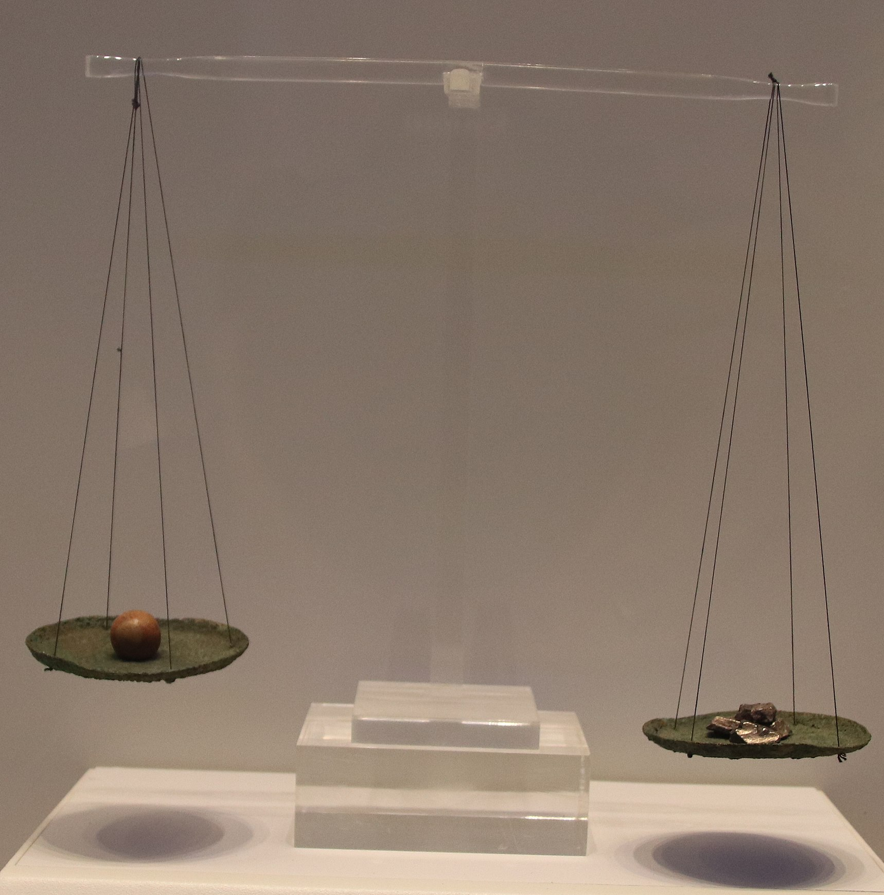

# Human-made Things in the Bible

## License Information

Human-made Things in the Bible © United Bible Societies, 2025. Adapted from: <cite>The Works of Their Hands: Man-made Things in the Bible</cite>, by Ray Pritz © 2009 United Bible Societies. This work is licensed under Creative Commons Attribution-ShareAlike 4.0 International (<a href="https://creativecommons.org/licenses/by-sa/4.0/">https://creativecommons.org/licenses/by-sa/4.0/</a>).

--------------------------------

## 标题：天平（balance scales） (id: REALIA:1.6.1)

1\.6\.1 标题：天平（balance scales）
=============================

经文出处
----

Hebrew 来：מֹאזְנַיִם (音译：m’oznayim)

[LEV 19:36](https://ref.ly/Lev19:36), [JOB 6:2](https://ref.ly/Job6:2), [JOB 31:6](https://ref.ly/Job31:6), [PSA 62:10](https://ref.ly/Ps62:10), [PRO 11:1](https://ref.ly/Prov11:1), [PRO 16:11](https://ref.ly/Prov16:11), [PRO 20:23](https://ref.ly/Prov20:23), [ISA 40:12](https://ref.ly/Isa40:12), [ISA 40:15](https://ref.ly/Isa40:15), [JER 32:10](https://ref.ly/Jer32:10), [EZK 5:1](https://ref.ly/Ezek5:1), [EZK 45:10](https://ref.ly/Ezek45:10), [HOS 12:8](https://ref.ly/Hos12:8), [AMO 8:5](https://ref.ly/Amos8:5), [MIC 6:11](https://ref.ly/Mic6:11)

Aramaic 兰：מֹאזְנֵא (音译：mo’zne’)

[DAN 5:27](https://ref.ly/Dan5:27)

Hebrew 来：פֶּלֶס (音译：peles)

[PRO 16:11](https://ref.ly/Prov16:11), [ISA 40:12](https://ref.ly/Isa40:12)

Hebrew 来：קָנֶה (音译：qaneh)

[ISA 46:6](https://ref.ly/Isa46:6)

Greek 希：ζυγός (音译：zugos)

[REV 6:5](https://ref.ly/Rev6:5), [SIR 21:25](https://ref.ly/Sir21:25), [SIR 28:25](https://ref.ly/Sir28:25), [SIR 42:4](https://ref.ly/Sir42:4)

Greek 希：πλάστιγξ (音译：plastigx)

[WIS 11:22](https://ref.ly/Wis11:22), [2MA 9:8](https://ref.ly/2Macc9:8)

Greek 希：ῥοπή (音译：rhopē)

[SIR 1:22](https://ref.ly/Sir1:22)

Greek 希：σταθμός (音译：stathmion, stathmos)

[SIR 6:15](https://ref.ly/Sir6:15), [SIR 26:15](https://ref.ly/Sir26:15), [SIR 28:25](https://ref.ly/Sir28:25)

Latin 拉：statera

[2ES 3:34](https://ref.ly/2Esd3:34), [2ES 4:36](https://ref.ly/2Esd4:36)

描述
--

*天平秤 (Gary Todd, Israel Museum, CC0, via Wikimedia Commons)*

天平是称量物体重量的工具。古代常见的天平是由一根木杆加上两端的秤盘组成，木杆的中点系着一根绳子或链子，把天平吊起来进行称重。

---

用途
--

使用时，把法码（或砝码）放在天平一端的秤盘内，待称重物品放在另一端的秤盘内。测量者把天平提起来，当木杆与地面平行时，表示两个秤盘里的东西重量相同。

---

翻译
--

在有些语言中，“天平”可以译为“称重工具”或“确定某物的重量所用的器具”。翻译者应避免使用不符合时代的、表示各种现代秤的用词，例如弹簧秤、液压秤等。

*使用天平秤的男人 (Image generated by ChatGPT using OpenAI technology)*

许多考古遗址都曾发现不同时期的法码（也有体积量器），这些法码通常是球形的石头，上面刻有重量标记。这些法码的制作相对粗糙，从现代的标准来看，算不上“精确”或“公平”。但是，在特定的时间和地点，这些法码仍可作为一种规范标准，尽管不同时间地点的标准各异。因此，用现代重量单位翻译的对等词仅仅是近似值。

这种古代天平的工作原理是比较两个物体的相对重量，因此在两约之间的时期，天平成为一种象征，意指考量两种活动或两种选择的相对价值或对错。比较英文惯用语“weigh his actions”（英文直译：“称一称他的行为”）。在[SIR 1:22](https://ref.ly/Sir1:22); [SIR 21:25](https://ref.ly/Sir21:25); [SIR 28:25](https://ref.ly/Sir28:25) 出现了这种比喻用法；[DAN 5:27](https://ref.ly/Dan5:27) 也有一定程度的喻义。很多时候，翻译者可以不提到这种物品，而是按照喻义进行翻译；例如，[SIR 21:25](https://ref.ly/Sir21:25) 可作“聪明人会考虑他们的话语所带来的结果”（GNT (Good News Translation (1992)) 直译）。同样，[SIR 1:22](https://ref.ly/Sir1:22) 的原文字面意为“人的怒气使天平向着他的毁灭倾斜”，RSV (Revised Standard Version (1952)) 采用了直译，然而也可译为“它（怒气）会使你身败名裂”（GNT (Good News Translation (1992)) 英文直译）。

* **Associated Passages:** 利未记 19:36; 约伯记 6:2; 约伯记 31:6; 诗篇 62:10; 箴言 11:1; 箴言 16:11; 箴言 20:23; 以赛亚书 40:12; 以赛亚书 40:15; 耶利米书 32:10; 以西结书 5:1; 以西结书 45:10; 何西阿书 12:8; 阿摩司书 8:5; 弥迦书 6:11; 但以理书 5:27; 以赛亚书 46:6; 启示录 6:5; 德训篇 21:25; 德训篇 28:25; 德训篇 42:4; 智慧篇 11:22; 玛加伯下 9:8; 德训篇 1:22; 德训篇 6:15; 德训篇 26:15; 厄斯德拉下 3:34; 厄斯德拉下 4:36

