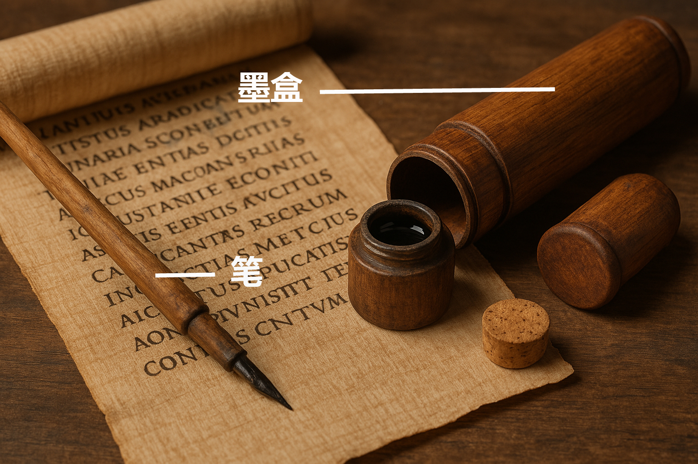

# Human-made Things in the Bible

## License Information

Human-made Things in the Bible © United Bible Societies, 2025. Adapted from: <cite>The Works of Their Hands: Man-made Things in the Bible</cite>, by Ray Pritz © 2009 United Bible Societies. This work is licensed under Creative Commons Attribution-ShareAlike 4.0 International (<a href="https://creativecommons.org/licenses/by-sa/4.0/">https://creativecommons.org/licenses/by-sa/4.0/</a>).

--------------------------------

## 标题：墨盒（writing case） (id: REALIA:1.7.4)

1\.7\.4 标题：墨盒（writing case）
===========================

经文出处
----

Hebrew 来：קֶסֶת, סֹפֵר (音译：qeseth, qeseth sofer)

[EZK 9:2](https://ref.ly/Ezek9:2), [EZK 9:3](https://ref.ly/Ezek9:3), [EZK 9:11](https://ref.ly/Ezek9:11)

描述
--

*盒中的笔（木，象牙，颜料，约公元前1635–1458年，第二中期\-新王国时期早期（Second Intermediate Period–Early New Kingdom），埃及，底比斯（Thebes），阿萨西夫（Asasif）） (Metropolitan Museum of Art, CC0, via Wikimedia Commons)*

墨盒是一个通常用木头做成的小盒子，用来装几支笔（[1\.7\.2 墨 (ink)\<REALIA:1\.7\.2\>](#) ），有时会放一块干墨（[1\.7\.4 墨盒 (writing case)\<REALIA:1\.7\.4\>](#) ）。盒子里面除了几支芦苇笔之外，还有写字时用来调配墨水的容器。通常，人们会把墨盒挂在腰带上。有时，调配墨水的容器形状就像调色板，有两个圆形凹陷，用来放两种颜色的墨块。这个容器可以用绳子挂在身上。

---

翻译
--

*墨盒和笔 (Image generated by ChatGPT using OpenAI technology)*

在许多语言中，与“墨盒”最接近的对等词是“铅笔盒”，但这可能听起来与时代不符。翻译者也可以使用描述性的短语，例如，“装笔的小盒子”或“装着书写用具的小盒子”。

* **Associated Passages:** 以西结书 9:2; 以西结书 9:3; 以西结书 9:11

