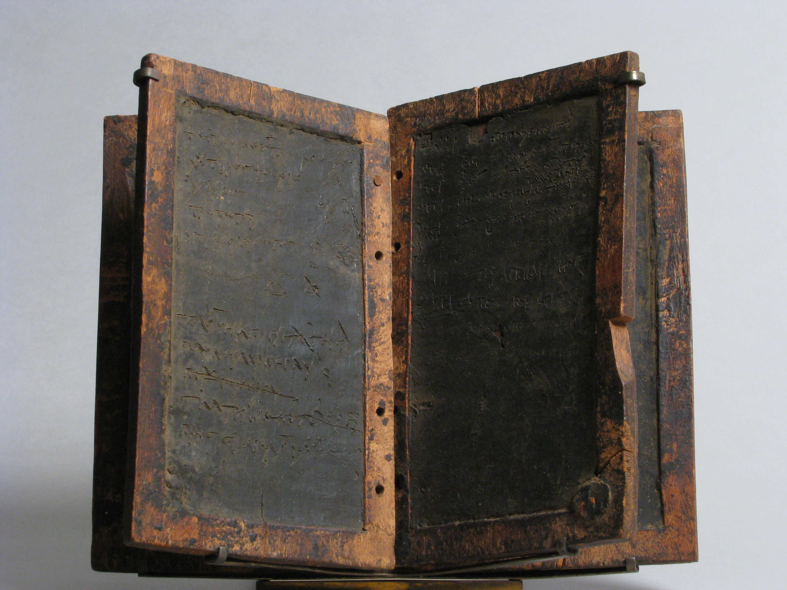

# Human-made Things in the Bible

## License Information

Human-made Things in the Bible © United Bible Societies, 2025. Adapted from: <cite>The Works of Their Hands: Man-made Things in the Bible</cite>, by Ray Pritz © 2009 United Bible Societies. This work is licensed under Creative Commons Attribution-ShareAlike 4.0 International (<a href="https://creativecommons.org/licenses/by-sa/4.0/">https://creativecommons.org/licenses/by-sa/4.0/</a>).

--------------------------------

## 标题：书写版、铜版（writing tablet, tablet of brass/bronze） (id: REALIA:1.7.6)

1\.7\.6 标题：书写版、铜版（writing tablet, tablet of brass/bronze）
=========================================================

经文出处
----

Hebrew 来：גִּלָּיוֹן (音译：gilayon)

[ISA 8:1](https://ref.ly/Isa8:1)

Hebrew 来：לוּחַ (音译：luach)

[EXO 24:12](https://ref.ly/Exod24:12), [EXO 31:18](https://ref.ly/Exod31:18), [EXO 31:18](https://ref.ly/Exod31:18), [EXO 32:15](https://ref.ly/Exod32:15), [EXO 32:15](https://ref.ly/Exod32:15), [EXO 32:16](https://ref.ly/Exod32:16), [EXO 32:16](https://ref.ly/Exod32:16), [EXO 32:19](https://ref.ly/Exod32:19), [EXO 34:1](https://ref.ly/Exod34:1), [EXO 34:1](https://ref.ly/Exod34:1), [EXO 34:1](https://ref.ly/Exod34:1), [EXO 34:4](https://ref.ly/Exod34:4), [EXO 34:4](https://ref.ly/Exod34:4), [EXO 34:28](https://ref.ly/Exod34:28), [EXO 34:29](https://ref.ly/Exod34:29), [DEU 4:13](https://ref.ly/Deut4:13), [DEU 5:22](https://ref.ly/Deut5:22), [DEU 9:9](https://ref.ly/Deut9:9), [DEU 9:9](https://ref.ly/Deut9:9), [DEU 9:10](https://ref.ly/Deut9:10), [DEU 9:11](https://ref.ly/Deut9:11), [DEU 9:11](https://ref.ly/Deut9:11), [DEU 9:15](https://ref.ly/Deut9:15), [DEU 9:17](https://ref.ly/Deut9:17), [DEU 10:1](https://ref.ly/Deut10:1), [DEU 10:2](https://ref.ly/Deut10:2), [DEU 10:2](https://ref.ly/Deut10:2), [DEU 10:3](https://ref.ly/Deut10:3), [DEU 10:3](https://ref.ly/Deut10:3), [DEU 10:4](https://ref.ly/Deut10:4), [DEU 10:5](https://ref.ly/Deut10:5), [1KI 8:9](https://ref.ly/1Kgs8:9), [2CH 5:10](https://ref.ly/2Chr5:10), [PRO 3:3](https://ref.ly/Prov3:3), [PRO 7:3](https://ref.ly/Prov7:3), [ISA 30:8](https://ref.ly/Isa30:8), [JER 17:1](https://ref.ly/Jer17:1), [HAB 2:2](https://ref.ly/Hab2:2)

Greek 希：δέλτος (音译：deltos)

[1MA 8:22](https://ref.ly/1Macc8:22), [1MA 14:18](https://ref.ly/1Macc14:18), [1MA 14:26](https://ref.ly/1Macc14:26), [1MA 14:48](https://ref.ly/1Macc14:48)

Greek 希：πινακίδιον (音译：pinakidion)

[LUK 1:63](https://ref.ly/Luke1:63)

Latin 拉：buxus

[2ES 14:24](https://ref.ly/2Esd14:24)

描述
--

*蜡质写字板 (Metropolitan Museum of Art, CC0, MMA)*

书写版是一块比较小的平板，通常用木头做成。版的一面涂有一层薄薄的蜡，可以用削尖的木条或铁笔在蜡层上划出记号和文字。用完一次之后，可以抹平蜡层然后重新书写。可以将几块书写版用绳子沿着同一条边连接起来，就像是一本书。参[1\.7\.5 铁笔 (stylus)\<REALIA:1\.7\.5\>](#) 中的插图。旧约中提到的书写可能是用坚硬的尖头物品，在黏土、金属或石头制成的版上刻划文字。

《次经‧马加比传上》（《思》《玛加伯上》）中提到的版是由平坦的抛光黄铜或青铜制成，可以在上面刻字。这些版的大小不详，但可能不会很大。

---

翻译
--

翻译者应该避免使用表示现代书写纸“版”的词语。

[PRO 3:3](https://ref.ly/Prov3:3); [PRO 7:3](https://ref.ly/Prov7:3); [JER 17:1](https://ref.ly/Jer17:1) ：在这些经文中，希伯来文*luach* 用作比喻，翻译时可以不必提及书写版这个实物；例如，[PRO 7:3](https://ref.ly/Prov7:3) b可以译为“写在你的心上”（GNT (Good News Translation (1992)) 直译），或“像宝物一样珍藏在你的心里”（ITCL (Italian Common Language Version) 直译）。

有一两处出现希腊文*deltos* 的经文指的是内容为“信件”的书写版，但是一般来说，这些书写版并不是用来写信的。根据[1MA 8:22](https://ref.ly/1Macc8:22) ，这些书写版是特殊的纪念文献，旨在作为“和平与联合的纪念”（RSV (Revised Standard Version (1952)) 直译）。有些文化可能会准备特殊的文件，各方在签订条约或结盟时互相交换。

* **Associated Passages:** 以赛亚书 8:1; 出埃及记 24:12; 出埃及记 31:18; 出埃及记 32:15; 出埃及记 32:16; 出埃及记 32:19; 出埃及记 34:1; 出埃及记 34:4; 出埃及记 34:28; 出埃及记 34:29; 申命记 4:13; 申命记 5:22; 申命记 9:9; 申命记 9:10; 申命记 9:11; 申命记 9:15; 申命记 9:17; 申命记 10:1; 申命记 10:2; 申命记 10:3; 申命记 10:4; 申命记 10:5; 列王纪上 8:9; 历代志下 5:10; 箴言 3:3; 箴言 7:3; 以赛亚书 30:8; 耶利米书 17:1; 哈巴谷书 2:2; 玛加伯上 8:22; 玛加伯上 14:18; 玛加伯上 14:26; 玛加伯上 14:48; 路加福音 1:63; 厄斯德拉下 14:24

