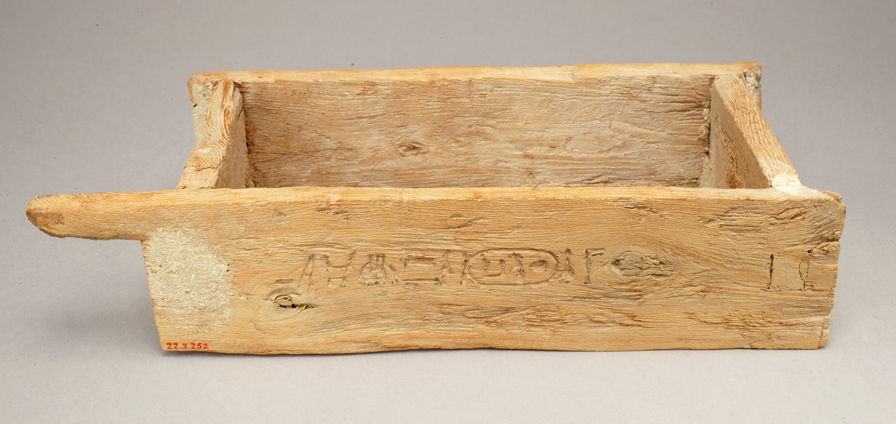

# Human-made Things in the Bible

## License Information

Human-made Things in the Bible © United Bible Societies, 2025. Adapted from: <cite>The Works of Their Hands: Man-made Things in the Bible</cite>, by Ray Pritz © 2009 United Bible Societies. This work is licensed under Creative Commons Attribution-ShareAlike 4.0 International (<a href="https://creativecommons.org/licenses/by-sa/4.0/">https://creativecommons.org/licenses/by-sa/4.0/</a>).

--------------------------------

## 标题：砖模、砖窑（brick mold, brickkiln） (id: REALIA:1.8.1)

1\.8\.1 标题：砖模、砖窑（brick mold, brickkiln）
=======================================

经文出处
----

Hebrew 来：מַלְבֵּן (音译：malben)

[2SA 12:31](https://ref.ly/2Sam12:31), [NAM 3:14](https://ref.ly/Nah3:14)

描述
--

*哈特谢普苏特（Hatshepsut）神庙地基砖模（埃及） (Metropolitan Museum of Art, CC0, via Wikimedia Commons)*

**砖模** ：这是一种长方形的木制容器，不是很大，约20–25×10厘米（8–10×4英寸），用来制作形状和大小完全相同的泥砖（参[1\.8\.2 砖 (brick)\<REALIA:1\.8\.2\>](#) ）。

**砖窑** ：这是一个大型室外烤炉，用来烧砖使其变得坚硬（参[1\.11\.1 窑、炉 (smelting furnace, kiln)\<REALIA:1\.11\.1\>](#) 中的插图）。

---

用途
--

*泥砖（非利士亚实基伦外城门结构的原用泥砖） (© Ian Scott, CC BY\-SA 2\.0, via Wikimedia Commons)*

工人把黏土或其他制砖材料填充在砖模中。待材料定型后，再把砖从模具中脱出并在阳光下晒干。有些地方会把砖放在砖窑里面烘烤使其变硬。

---

翻译
--

[2SA 12:31](https://ref.ly/2Sam12:31) ：希伯来文*malben* 只是马索拉学者认为经文有错误，所以在页旁特别注明的一种读法；不过，这个建议读法未见于任何古代抄本或译本中。但是，现有文本也是读不通的。HOTTP (Hebrew Old Testament Text Project (UBS)) 建议译作“砖窑”，这是大多数译本的译法。GNT (Good News Translation (1992)) 和CEV (Contemporary English Version) 译成“making bricks”（“做砖”），NCV (New Century Version) 译成“build with bricks”（“用砖建造”），NRSV (New Revised Standard Version (1989)) 译成“brickworks”（“砌砖工作”）。

[NAM 3:14](https://ref.ly/Nah3:14) ：下文改述自《〈那鸿书〉、〈哈巴谷书〉和〈西番雅书〉手册》（*A Handbook on The Books of Nahum, Habakkuk, and Zephaniah* ，第55—56页）：这节经文的后半部分讲述了制砖的各个步骤。前两个步骤是“走到黏土里面，踩踏泥浆”（RSV (Revised Standard Version (1952)) 直译），指的是用脚踹踏黏土，使其足够柔软以便成型。GNT (Good News Translation (1992)) 没有采用并列句，只用一个分句来表达做砖的这个环节：“踹泥以制砖。”在黏土足够柔软之后，就被放入到砖模里面。然后，把成型的砖从模具中取出，放在阳光下晒干。那鸿吩咐尼尼微人“抓住砖模”（RSV (Revised Standard Version (1952)) 直译），GNT (Good News Translation (1992)) 的表述更加清楚，英文直译“将砖模准备就绪”。这节经文的后半部分也可以译成，“踩踏用来制砖的黏土，并准备砖模”，或“用你的脚使制砖所用的黏土变得柔软，并准备砖模”。

另参[3\.20\.1 铺道、石板地、铺石地、铺华石处 (pavement, The Pavement)\<REALIA:3\.20\.1\>](#) 中的讨论。

* **Associated Passages:** 撒母耳记下 12:31; 那鸿书 3:14

* **Associated ACAI Concepts:** Brick Mold (ID: `realia:BrickMold`)
