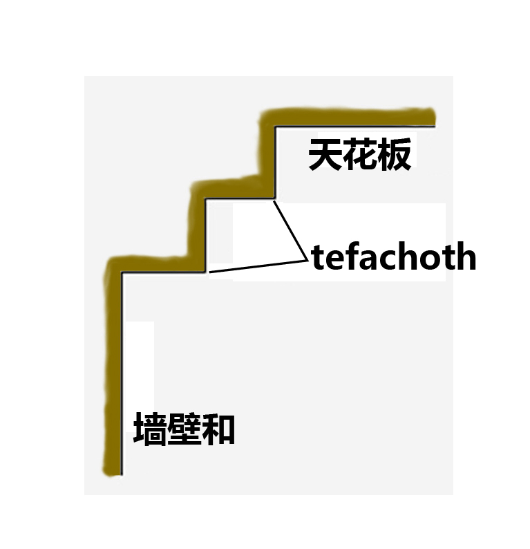

# Human-made Things in the Bible

## License Information

Human-made Things in the Bible © United Bible Societies, 2025. Adapted from: <cite>The Works of Their Hands: Man-made Things in the Bible</cite>, by Ray Pritz © 2009 United Bible Societies. This work is licensed under Creative Commons Attribution-ShareAlike 4.0 International (<a href="https://creativecommons.org/licenses/by-sa/4.0/">https://creativecommons.org/licenses/by-sa/4.0/</a>).

--------------------------------

## 标题：建筑用方石（squared stones for building） (id: REALIA:1.8.4)

1\.8\.4 标题：建筑用方石（squared stones for building）
=============================================

经文出处
----

Hebrew 来：אֶבֶן, גָּזִית (音译：gazith, ’even gazith)

[EXO 20:25](https://ref.ly/Exod20:25), [1KI 5:31](https://ref.ly/1Kgs5:31), [1KI 6:36](https://ref.ly/1Kgs6:36), [1KI 7:9](https://ref.ly/1Kgs7:9), [1KI 7:11](https://ref.ly/1Kgs7:11), [1KI 7:12](https://ref.ly/1Kgs7:12), [1CH 22:2](https://ref.ly/1Chr22:2), [ISA 9:9](https://ref.ly/Isa9:9), [LAM 3:9](https://ref.ly/Lam3:9), [EZK 40:42](https://ref.ly/Ezek40:42), [AMO 5:11](https://ref.ly/Amos5:11)

Greek 希：λίθος, λαξεύω (音译：lithos lelaxeumenos)

[JDT 1:2](https://ref.ly/Jdt1:2)

Greek 希：λίθος, ξυστός (音译：lithos xustos)

[1ES 6:8](https://ref.ly/1Esd6:8), [1ES 6:24](https://ref.ly/1Esd6:24)

Greek 希：λίθος, τετράποδος (音译：lithos tetrapodos)

[1MA 10:11](https://ref.ly/1Macc10:11)

描述和用途
-----

*耶路撒冷西墙的希律时期方形石块 (© Gilabrand, CC BY 3\.0, via Wikimedia Commons)*

方石是切成方形的石块，使其能够堆砌起来，建成墙或建筑物。这些石头通常从基岩中开采。

---

翻译
--

建筑用石的大小差别很大，从一个人可以搬起来的石头，一直到长达几米、重达数十吨的大石头都有。翻译者应避免使用表示砖块或小石块的词语，可以说“非常大的、切成方块的石头”。

*天花板，墙壁和墙顶装饰 (© Ray Pritz by United Bible Societies)*

[1KI 7:9](https://ref.ly/1Kgs7:9) ：这节经文描述了前后都修凿整齐的建筑石材。这些石材用来建造每一面墙壁，从底部到顶部。对于墙的顶部，希伯来文本使用了*tfachoth* 一词，通常译为“屋檐”（“eaves”；GNT (Good News Translation (1992)) 、NIV (New International Version (1984)) ）或“压顶板”（“coping”；RSV (Revised Standard Version (1952)) 、REB (Revised English Bible (1989)) ）。许多语言没有这些建筑术语，或者不为人熟知（如日常英文中不太常用“eaves”和“coping”）。然而，最近有学者提出，*tfachoth* 实际上是墙顶的一种装饰，就像是在天花板和墙壁之间有两个或三个倒置的台阶。

一般来说，翻译者不必使用准确的建筑术语来翻译这种不确定的词语；整节经文可以像CEV (Contemporary English Version) 那样翻译，英文直译为：“从地基一直到顶部，这些建筑物和庭院所用的石头，都是品质最好的，并准确切割成所需要的大小，然后用锯子将每一面都锯齐。”或者借鉴NCV (New Century Version) ，英文直译为：“所有这些建筑物都是用贵重的石块建成。先把石块准确切割成型。然后用锯修整正面和背面。从建筑物的地基到墙壁的顶部，都使用了这种贵重的石块。甚至庭院也是用石块建成的。”

*搬运建筑石材的人 (Image generated by ChatGPT using OpenAI technology)*

[EZK 40:42](https://ref.ly/Ezek40:42) 中提到的“桌子”（希伯来文*shulchan* ）是用石头做成的。参[4\.3\.6 预备祭牲的桌子 (tables for preparing sacrificial victims)\<REALIA:4\.3\.6\>](#) 中的讨论。

* **Associated Passages:** 出埃及记 20:25; 列王纪上 5:31; 列王纪上 6:36; 列王纪上 7:9; 列王纪上 7:11; 列王纪上 7:12; 历代志上 22:2; 以赛亚书 9:9; 耶利米哀歌 3:9; 以西结书 40:42; 阿摩司书 5:11; 友弟德传 1:2; 厄斯德拉上 6:8; 厄斯德拉上 6:24; 玛加伯上 10:11

