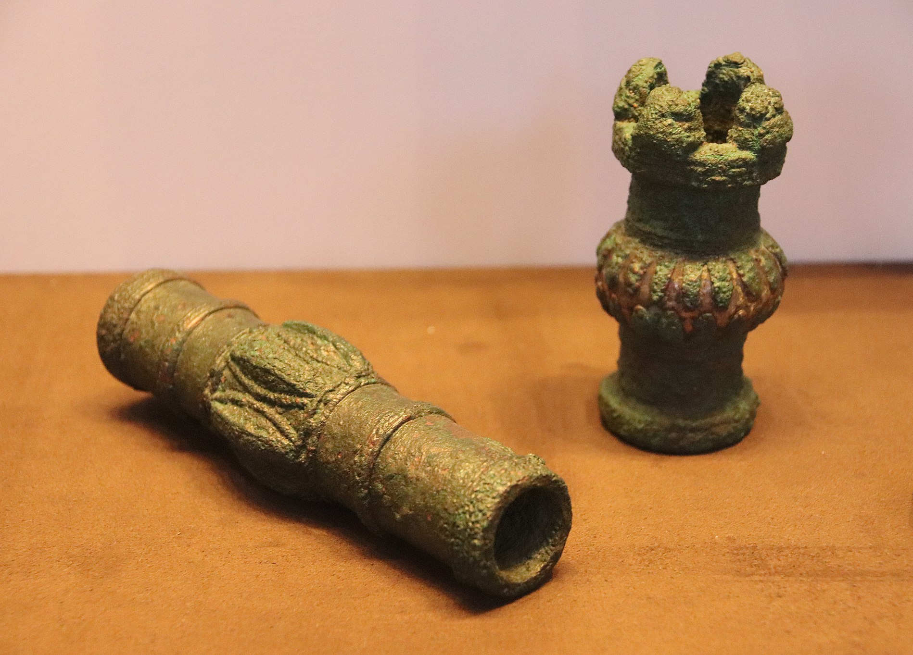

# Human-made Things in the Bible

## License Information

Human-made Things in the Bible © United Bible Societies, 2025. Adapted from: <cite>The Works of Their Hands: Man-made Things in the Bible</cite>, by Ray Pritz © 2009 United Bible Societies. This work is licensed under Creative Commons Attribution-ShareAlike 4.0 International (<a href="https://creativecommons.org/licenses/by-sa/4.0/">https://creativecommons.org/licenses/by-sa/4.0/</a>).

--------------------------------

## 标题：权杖（scepter） (id: REALIA:1.10.3)

1\.10\.3 标题：权杖（scepter）
=======================

经文出处
----

Hebrew 来：חקק (音译：mchoqeq)

[GEN 49:10](https://ref.ly/Gen49:10), [NUM 21:18](https://ref.ly/Num21:18), [PSA 60:9](https://ref.ly/Ps60:9), [PSA 108:9](https://ref.ly/Ps108:9)

Hebrew 来：מַטֶּה (音译：mateh)

[PSA 110:2](https://ref.ly/Ps110:2), [JER 48:17](https://ref.ly/Jer48:17)

Hebrew 来：מַקֵּל (音译：maqel)

[JER 48:17](https://ref.ly/Jer48:17)

Hebrew 来：שֵׁבֶט (音译：shevet)

[GEN 49:10](https://ref.ly/Gen49:10), [NUM 24:17](https://ref.ly/Num24:17), [JDG 5:14](https://ref.ly/Judg5:14), [PSA 45:7](https://ref.ly/Ps45:7), [PSA 45:7](https://ref.ly/Ps45:7), [PSA 125:3](https://ref.ly/Ps125:3), [ISA 14:5](https://ref.ly/Isa14:5), [EZK 19:11](https://ref.ly/Ezek19:11), [EZK 19:14](https://ref.ly/Ezek19:14), [AMO 1:5](https://ref.ly/Amos1:5), [AMO 1:8](https://ref.ly/Amos1:8), [ZEC 10:11](https://ref.ly/Zech10:11)

Hebrew 来：שַׁרְבִיט (音译：sharvit)

[EST 4:11](https://ref.ly/Esth4:11), [EST 5:2](https://ref.ly/Esth5:2), [EST 5:2](https://ref.ly/Esth5:2), [EST 8:4](https://ref.ly/Esth8:4)

Greek 希：ῥάβδος (音译：rhabdos)

[HEB 1:8](https://ref.ly/Heb1:8), [HEB 1:8](https://ref.ly/Heb1:8), [ESG 5:2](https://ref.ly/EsthGr5:2)

Greek 希：σκῆπτρον (音译：skēptron)

[ESG 4:17](https://ref.ly/EsthGr4:17), [WIS 6:21](https://ref.ly/Wis6:21), [WIS 7:8](https://ref.ly/Wis7:8), [WIS 10:14](https://ref.ly/Wis10:14), [SIR 35:21](https://ref.ly/Sir35:21), [LJE 1:12](https://ref.ly/EpJer1:12)

描述和用途
-----

*权杖的头 (Gary Todd, Israel Museum, CC0, via Wikimedia Commons)*

权杖是一根带有装饰的杖，通常至少有一部分是由贵金属制成，象征着统治者的权柄。统治者在行使某些职权时，会手握权杖。另参[1\.2\.4 竿、木棍、牧羊杖 (rod, club, shepherd’s staff)\<REALIA:1\.2\.4\>](#) 。

---

翻译
--

如果目标语言是用与首领相关的某个物品（如手杖、凳子或权杖）作为象征，那么在译文中就可以使用这种象征；例如，[PSA 45:7](https://ref.ly/Ps45:7) （《和》45:6）可以译为，“你的仪杖表明你公正地统治你的百姓。”

在[JER 48:17](https://ref.ly/Jer48:17) 中，希伯来文*mateh* 和*maqel* 是平行关系。然而，翻译者并不一定要用两个相似的词语来再现这种平行关系；例如，这节经文的后半部分可译成，“那大能的杖和荣耀的棍竟然折断了”（RSV (Revised Standard Version (1952)) 直译）；或“它强大的统治已被打破；它的荣耀和力量已不复存在”（GNT (Good News Translation (1992)) 直译）。这节经文是个比喻，所以这里的重点不是权杖这个实物，而是在权柄。

* **Associated Passages:** 创世记 49:10; 民数记 21:18; 诗篇 60:9; 诗篇 108:9; 诗篇 110:2; 耶利米书 48:17; 民数记 24:17; 士师记 5:14; 诗篇 45:7; 诗篇 125:3; 以赛亚书 14:5; 以西结书 19:11; 以西结书 19:14; 阿摩司书 1:5; 阿摩司书 1:8; 撒迦利亚书 10:11; 以斯帖记 4:11; 以斯帖记 5:2; 以斯帖记 8:4; 希伯来书 1:8; 以斯帖记补篇 5:2; 以斯帖记补篇 4:17; 智慧篇 6:21; 智慧篇 7:8; 智慧篇 10:14; 德训篇 35:21; 耶利米书信 1:12

