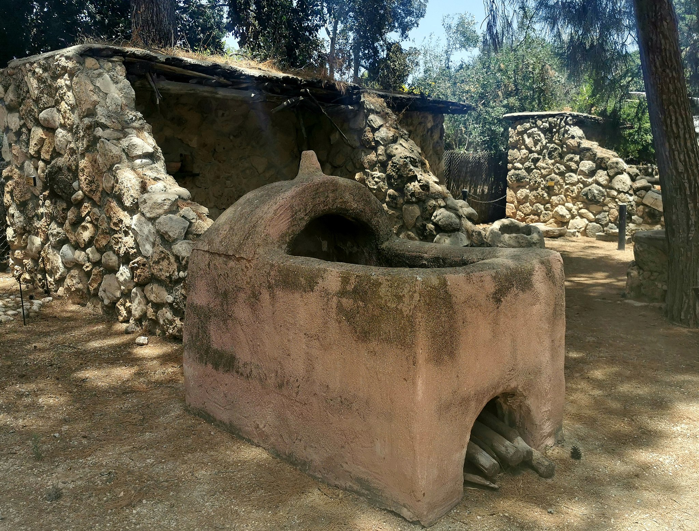

# Human-made Things in the Bible

## License Information

Human-made Things in the Bible © United Bible Societies, 2025. Adapted from: <cite>The Works of Their Hands: Man-made Things in the Bible</cite>, by Ray Pritz © 2009 United Bible Societies. This work is licensed under Creative Commons Attribution-ShareAlike 4.0 International (<a href="https://creativecommons.org/licenses/by-sa/4.0/">https://creativecommons.org/licenses/by-sa/4.0/</a>).

--------------------------------

## 标题：窑、炉（smelting furnace, kiln） (id: REALIA:1.11.1)

1\.11\.1 标题：窑、炉（smelting furnace, kiln）
=======================================

经文出处
----

Aramaic 兰：אַתּוּן (音译：’atun)

[DAN 3:6](https://ref.ly/Dan3:6), [DAN 3:11](https://ref.ly/Dan3:11), [DAN 3:15](https://ref.ly/Dan3:15), [DAN 3:17](https://ref.ly/Dan3:17), [DAN 3:19](https://ref.ly/Dan3:19), [DAN 3:20](https://ref.ly/Dan3:20), [DAN 3:21](https://ref.ly/Dan3:21), [DAN 3:22](https://ref.ly/Dan3:22), [DAN 3:23](https://ref.ly/Dan3:23), [DAN 3:26](https://ref.ly/Dan3:26)

Hebrew 来：כִּבְשָׁן (音译：kivshan)

[GEN 19:28](https://ref.ly/Gen19:28), [EXO 9:8](https://ref.ly/Exod9:8), [EXO 9:10](https://ref.ly/Exod9:10), [EXO 19:18](https://ref.ly/Exod19:18)

Hebrew 来：כּוּר (音译：kur)

[DEU 4:20](https://ref.ly/Deut4:20), [1KI 8:51](https://ref.ly/1Kgs8:51), [PRO 17:3](https://ref.ly/Prov17:3), [PRO 27:21](https://ref.ly/Prov27:21), [ISA 48:10](https://ref.ly/Isa48:10), [JER 11:4](https://ref.ly/Jer11:4), [EZK 22:18](https://ref.ly/Ezek22:18), [EZK 22:20](https://ref.ly/Ezek22:20), [EZK 22:22](https://ref.ly/Ezek22:22)

Hebrew 来：מַצְרֵף (音译：matsref)

[PRO 17:3](https://ref.ly/Prov17:3), [PRO 27:21](https://ref.ly/Prov27:21)

Hebrew 来：עֲלִיל (音译：‘alil)

[PSA 12:7](https://ref.ly/Ps12:7)

Greek 希：κάμινος (音译：kaminos)

[GEN 19:28](https://ref.ly/Gen19:28), [EXO 19:18](https://ref.ly/Exod19:18), [NUM 25:8](https://ref.ly/Num25:8), [DEU 4:20](https://ref.ly/Deut4:20), [JOB 41:12](https://ref.ly/Job41:12), [PRO 16:30](https://ref.ly/Prov16:30), [PRO 17:3](https://ref.ly/Prov17:3), [ISA 48:10](https://ref.ly/Isa48:10), [JER 11:4](https://ref.ly/Jer11:4), [EZK 22:20](https://ref.ly/Ezek22:20), [EZK 22:22](https://ref.ly/Ezek22:22), [DAN 3:6](https://ref.ly/Dan3:6), [DAN 3:11](https://ref.ly/Dan3:11), [DAN 3:15](https://ref.ly/Dan3:15), [DAN 3:17](https://ref.ly/Dan3:17), [DAN 3:19](https://ref.ly/Dan3:19), [DAN 3:20](https://ref.ly/Dan3:20), [DAN 3:21](https://ref.ly/Dan3:21), [DAN 3:22](https://ref.ly/Dan3:22), [DAN 3:23](https://ref.ly/Dan3:23), [DAN 3:46](https://ref.ly/Dan3:46), [DAN 3:47](https://ref.ly/Dan3:47), [DAN 3:48](https://ref.ly/Dan3:48), [DAN 3:49](https://ref.ly/Dan3:49), [DAN 3:49](https://ref.ly/Dan3:49), [DAN 3:50](https://ref.ly/Dan3:50), [DAN 3:51](https://ref.ly/Dan3:51), [DAN 3:88](https://ref.ly/Dan3:88), [DAN 3:93](https://ref.ly/Dan3:93), [MAT 13:42](https://ref.ly/Matt13:42), [MAT 13:50](https://ref.ly/Matt13:50), [REV 1:15](https://ref.ly/Rev1:15), [REV 9:2](https://ref.ly/Rev9:2), [SIR 2:5](https://ref.ly/Sir2:5), [SIR 22:24](https://ref.ly/Sir22:24), [SIR 27:5](https://ref.ly/Sir27:5), [SIR 31:26](https://ref.ly/Sir31:26), [SIR 38:28](https://ref.ly/Sir38:28), [SIR 38:30](https://ref.ly/Sir38:30), [SIR 43:4](https://ref.ly/Sir43:4), [3MA 6:6](https://ref.ly/3Macc6:6), [4MA 13:9](https://ref.ly/4Macc13:9), [4MA 16:3](https://ref.ly/4Macc16:3), [4MA 16:21](https://ref.ly/4Macc16:21), [DAG 3:6](https://ref.ly/INVALID), [DAG 3:11](https://ref.ly/INVALID), [DAG 3:15](https://ref.ly/INVALID), [DAG 3:17](https://ref.ly/INVALID), [DAG 3:19](https://ref.ly/INVALID), [DAG 3:20](https://ref.ly/INVALID), [DAG 3:21](https://ref.ly/INVALID), [DAG 3:22](https://ref.ly/INVALID), [DAG 3:23](https://ref.ly/INVALID), [DAG 3:46](https://ref.ly/INVALID), [DAG 3:47](https://ref.ly/INVALID), [DAG 3:48](https://ref.ly/INVALID), [DAG 3:49](https://ref.ly/INVALID), [DAG 3:49](https://ref.ly/INVALID), [DAG 3:50](https://ref.ly/INVALID), [DAG 3:93](https://ref.ly/INVALID), [DAG 3:88](https://ref.ly/INVALID), [DAG 3:51](https://ref.ly/INVALID)

Greek 希：χωνευτήριον (音译：chōneutērion)

[WIS 3:6](https://ref.ly/Wis3:6)

Latin 拉：fornax

[2ES 4:48](https://ref.ly/2Esd4:48)

Latin 拉：clibanus

[2ES 7:36](https://ref.ly/2Esd7:36)

描述
--

*陶窑横截面 (Encyclopaedia Biblica, 1903, Public domain, via Wikimedia Commons)*

窑是用来冶炼矿石或烧制陶瓷器皿的炉子。这种炉子用硬化黏土或砖制成，各类窑的大小和形状差异非常大。另参[5\.11 炉、火炉、炉灶 (oven)\<REALIA:5\.11\>](#) 。

---

用途
--

*在以色列雷瓦迪姆（Revadim）一个重建的窑 (© Heritage Conservation Outside the City, Pikiwiki Israel, CC BY 2\.5, via Wikimedia Commons)*

在自然界中，几乎所有金属都与其他矿物质结合存在。要除去其他矿物质，需要在窑内将矿石加热到非常高的温度，以进行化学处理。这种加热室也用于烧砖或陶器，以及其他目的。

---

翻译
--

在翻译“炉子”这个词时，重点应放在极高的温度上，而不是放在特定的构造型式上。但是，如果选择了一个表示“炉子”的特定词语，翻译者要记住这个炉子不是由金属制成，而是由砖或硬化黏土砌成。

希伯来文*kur* 始终是在比喻或象征意义上使用，描述人类的苦难。通常，翻译者可以不提及实际物件，而是表达其喻义；例如，[DEU 4:20](https://ref.ly/Deut4:20) 可译为，“但你们是耶和华的子民，因为他引导你们经历火的试炼，并将你们从埃及拯救出来”（CEV (Contemporary English Version) 直译）。

[PSA 12:7](https://ref.ly/Ps12:7) （《和》12:6）：在旧约中，希伯来文*‘alil* 只出现在这里，意思不确定。对于这节经文最后面的比较含糊的分句，似乎最好比较宽泛地翻译；例如，“它们的纯真就像在炉中炼过七次的银子”（GNT (Good News Translation (1992)) 直译），或“如同银子在泥做的炉中炼过七次”（NIV (New International Version (1984)) 直译）。“七次”的意思是“多次”，即除去全部杂质所需的次数。

[PRO 17:3](https://ref.ly/Prov17:3); [PRO 27:21](https://ref.ly/Prov27:21) ：这两节经文提到了两种加热和提炼金属的器具：*matsref* 和*kur* 。如果目标语言有两个词语来表示这两种器具（例如，“鼎”和“炉”），则可以使用这些词。许多译本将这两个词合并；例如，[PRO 17:3](https://ref.ly/Prov17:3) a可译作“金和银被火熬炼”（GNT (Good News Translation (1992)) 直译），或“火炉熬炼金和银”（NCV (New Century Version) 直译）。

[DAN 3:0](https://ref.ly/Dan3:0) ：这里描述的窑可能在顶部有一个开口，在地面上还有一个开口。显然，这个窑非常大，足以让人在里面站着甚至走动。这里“窑”的译词也应该用在[DAG 3:23](https://ref.ly/INVALID); [DAG 3:28](https://ref.ly/INVALID); [DAG 3:66](https://ref.ly/INVALID) 中。

在[MAT 13:42](https://ref.ly/Matt13:42); [MAT 13:50](https://ref.ly/Matt13:50) 中，希腊文*kaminos* 用来喻指地狱。字面意为“火的炉”的短语也可以译为“地狱之火”或“地狱，好像极大的火”。另外，也可以简单地译为“大火”。拉丁文*clibanus* 在[2ES 7:36](https://ref.ly/2Esd7:36) 中也同样喻指地狱的炽热。

这个词条与[5\.11 炉、火炉、炉灶 (oven)\<REALIA:5\.11\>](#) 之间的区别主要是在大小而不在基本结构。当然，炉也有许多用途。如果目标语言的相关词汇不太丰富，不像英文中有“oven”（“烤炉”）、“furnace”（“火炉”）和“kiln”（“窑”）等词，通常只要一个词语就足够了。在这种情况下，有时需要根据上下文指明炉子的相对大小。烤饼的炉可以译成“小炉子”，而把几个人扔进去的火炉可译成“非常大的炉子”。

古代炉子的燃料是木材、压榨后剩下的橄榄渣，或是干了的动物粪便。翻译者应该避免使用“烤箱”一词，因为这种词指的是使用电力、油或煤油等精炼燃料的发热设备。

* **Associated Passages:** 但以理书 3:6; 但以理书 3:11; 但以理书 3:15; 但以理书 3:17; 但以理书 3:19; 但以理书 3:20; 但以理书 3:21; 但以理书 3:22; 但以理书 3:23; 但以理书 3:26; 创世记 19:28; 出埃及记 9:8; 出埃及记 9:10; 出埃及记 19:18; 申命记 4:20; 列王纪上 8:51; 箴言 17:3; 箴言 27:21; 以赛亚书 48:10; 耶利米书 11:4; 以西结书 22:18; 以西结书 22:20; 以西结书 22:22; 诗篇 12:7; 民数记 25:8; 约伯记 41:12; 箴言 16:30; 但以理书 3:46; 但以理书 3:47; 但以理书 3:48; 但以理书 3:49; 但以理书 3:50; 但以理书 3:51; 但以理书 3:88; 但以理书 3:93; 马太福音 13:42; 马太福音 13:50; 启示录 1:15; 启示录 9:2; 德训篇 2:5; 德训篇 22:24; 德训篇 27:5; 德训篇 31:26; 德训篇 38:28; 德训篇 38:30; 德训篇 43:4; 玛加伯三书 6:6; 玛加伯四书 13:9; 玛加伯四书 16:3; 玛加伯四书 16:21; 但以理书（希腊文） 3:6; 但以理书（希腊文） 3:11; 但以理书（希腊文） 3:15; 但以理书（希腊文） 3:17; 但以理书（希腊文） 3:19; 但以理书（希腊文） 3:20; 但以理书（希腊文） 3:21; 但以理书（希腊文） 3:22; 但以理书（希腊文） 3:23; 但以理书（希腊文） 3:46; 但以理书（希腊文） 3:47; 但以理书（希腊文） 3:48; 但以理书（希腊文） 3:49; 但以理书（希腊文） 3:50; 但以理书（希腊文） 3:93; 但以理书（希腊文） 3:88; 但以理书（希腊文） 3:51; 智慧篇 3:6; 厄斯德拉下 4:48; 厄斯德拉下 7:36; 但以理书 3:0; 但以理书（希腊文） 3:28; 但以理书（希腊文） 3:66

* **Associated ACAI Concepts:** Kiln (ID: `realia:Kiln`)

## 标题：风箱（bellows） (id: REALIA:1.11.1.1)

1\.11\.1\.1 标题：风箱（bellows）
==========================

经文出处
----

Hebrew 来：מַפּוּחַ (音译：mapuach)

[JER 6:29](https://ref.ly/Jer6:29)

Greek 希：ζώπυρον, πῦρ (音译：zōpuron tou puros)

[4MA 8:13](https://ref.ly/4Macc8:13)

描述
--

*由工人操作的风箱 (© Le plombier du désert, CC BY\-SA 4\.0, via Wikimedia Commons)*

当需要极高温度的时候，例如冶炼矿石，通常会用风箱将空气吹入火炉底部。有一种风箱是由两个垂直的圆柱体组成，上面覆盖着厚皮革。操作的人站在这些圆柱体上，用皮带将皮革拉起，然后用脚将其踩下，以产生强大的空气流，通过管道吹入到炉内。

---

翻译
--

现今，有很多英文读者不熟悉风箱的结构或操作，所以几种英文通俗译本在[JER 6:29](https://ref.ly/Jer6:29) 中没有使用这个词，而是将这节经文的第一行译为“用风煽动火焰，使其变得更热”（NCV (New Century Version) 直译），“炉子猛烈地燃烧”（GNT (Good News Translation (1992)) 直译），或“在炽热的火炉中”（CEV (Contemporary English Version) 直译）。

* **Associated Passages:** 耶利米书 6:29; 玛加伯四书 8:13

* **Associated ACAI Concepts:** Bellows (ID: `realia:Bellows`)
