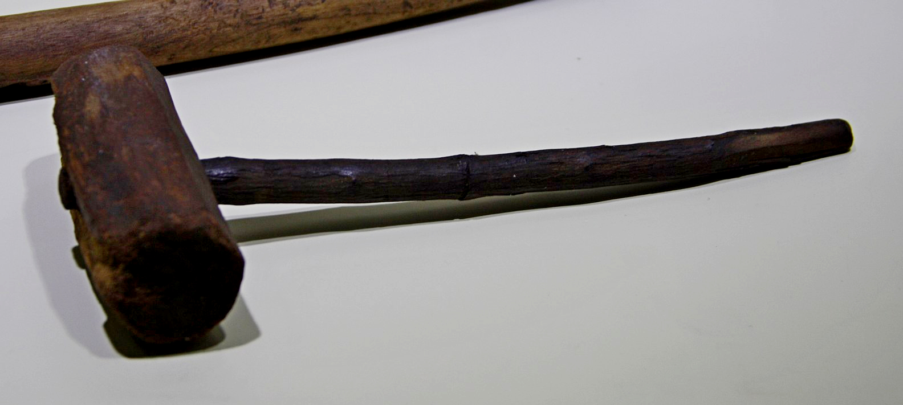

# Human-made Things in the Bible

## License Information

Human-made Things in the Bible © United Bible Societies, 2025. Adapted from: <cite>The Works of Their Hands: Man-made Things in the Bible</cite>, by Ray Pritz © 2009 United Bible Societies. This work is licensed under Creative Commons Attribution-ShareAlike 4.0 International (<a href="https://creativecommons.org/licenses/by-sa/4.0/">https://creativecommons.org/licenses/by-sa/4.0/</a>).

--------------------------------

## 标题：锤子（hammer） (id: REALIA:1.12.1)

1\.12\.1 标题：锤子（hammer）
======================

经文出处
----

Hebrew 来：הַלְמוּת (音译：halmuth)

[JDG 5:26](https://ref.ly/Judg5:26)

Hebrew 来：מַקֶּבֶת (音译：maqavah, maqeveth)

[JDG 4:21](https://ref.ly/Judg4:21), [1KI 6:7](https://ref.ly/1Kgs6:7), [ISA 44:12](https://ref.ly/Isa44:12), [JER 10:4](https://ref.ly/Jer10:4)

Hebrew 来：מִקְשָׁה (音译：miqshah)

[EXO 25:18](https://ref.ly/Exod25:18), [EXO 25:31](https://ref.ly/Exod25:31), [EXO 25:36](https://ref.ly/Exod25:36), [EXO 37:7](https://ref.ly/Exod37:7), [EXO 37:17](https://ref.ly/Exod37:17), [EXO 37:22](https://ref.ly/Exod37:22), [NUM 8:4](https://ref.ly/Num8:4), [NUM 8:4](https://ref.ly/Num8:4), [NUM 10:2](https://ref.ly/Num10:2)

Hebrew 来：פַּטִּישׁ (音译：patish)

[ISA 41:7](https://ref.ly/Isa41:7), [JER 23:29](https://ref.ly/Jer23:29), [JER 50:23](https://ref.ly/Jer50:23)

Hebrew 来：רִקֻּעַ (音译：riqua‘)

[NUM 17:3](https://ref.ly/Num17:3)

Greek 希：ἐλατός (音译：elatos)

[SIR 50:16](https://ref.ly/Sir50:16)

Greek 希：ὁλοσφύρητος (音译：olosfurētos)

[SIR 50:9](https://ref.ly/Sir50:9)

Greek 希：σφῦρα (音译：sfura)

[SIR 38:28](https://ref.ly/Sir38:28)

描述
--

*木锤 (© Giovanni Dall'Orto, Attribution, via Wikimedia Commons)*

锤子是一种工具，长约30厘米（1英尺），有一个通常用木头做成的手柄，手柄上固定着一个石头、木头或金属（不太常见）的头。手柄装在锤头的孔内。

---

用途
--

*用锤子工作的人 (Elbert Boot © United Bible Societies)*

锤子有多种用途，例如砸碎或修整建筑石块、将钉子或橛子敲到木头里面，或将橛子敲入地里。铁匠也用锤子来使热铁成型。

---

翻译
--

希伯来文*miqshah* 的意思不太确定。这个词似乎是指工匠处理金属物件的成果，即“锤打出来的作品”或“打好的工件”。

* **Associated Passages:** 士师记 5:26; 士师记 4:21; 列王纪上 6:7; 以赛亚书 44:12; 耶利米书 10:4; 出埃及记 25:18; 出埃及记 25:31; 出埃及记 25:36; 出埃及记 37:7; 出埃及记 37:17; 出埃及记 37:22; 民数记 8:4; 民数记 10:2; 以赛亚书 41:7; 耶利米书 23:29; 耶利米书 50:23; 民数记 17:3; 德训篇 50:16; 德训篇 50:9; 德训篇 38:28

