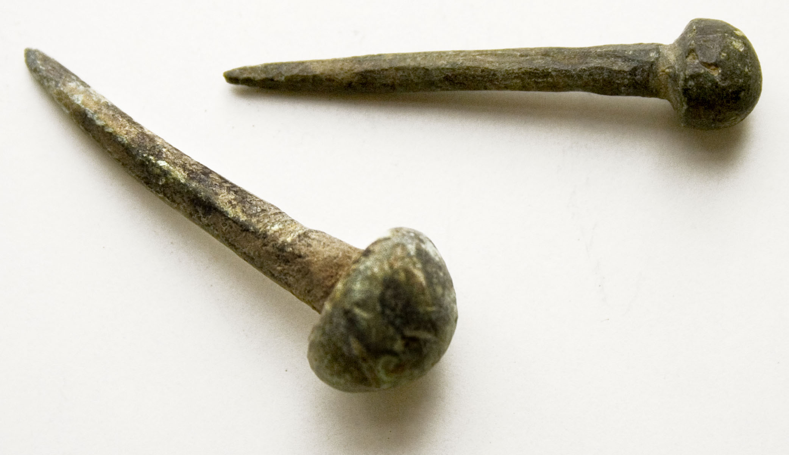

# Human-made Things in the Bible

## License Information

Human-made Things in the Bible © United Bible Societies, 2025. Adapted from: <cite>The Works of Their Hands: Man-made Things in the Bible</cite>, by Ray Pritz © 2009 United Bible Societies. This work is licensed under Creative Commons Attribution-ShareAlike 4.0 International (<a href="https://creativecommons.org/licenses/by-sa/4.0/">https://creativecommons.org/licenses/by-sa/4.0/</a>).

--------------------------------

## 标题：钉子、长钉（nail, spike） (id: REALIA:1.12.2)

1\.12\.2 标题：钉子、长钉（nail, spike）
==============================

经文出处
----

Hebrew 来：מַסְמֵר (音译：masmer)

[1CH 22:3](https://ref.ly/1Chr22:3), [2CH 3:9](https://ref.ly/2Chr3:9), [ISA 41:7](https://ref.ly/Isa41:7), [JER 10:4](https://ref.ly/Jer10:4)

Hebrew 来：מַשְׂמֵרָה (音译：masmerah)

[ECC 12:11](https://ref.ly/Eccl12:11)

Greek 希：ἧλος (音译：hēlos)

[JHN 20:25](https://ref.ly/John20:25), [JHN 20:25](https://ref.ly/John20:25)

描述
--

*踝骨上的钉子 (Gary Todd, Israel Museum, CC0, via Wikimedia Commons)*

钉子是一个细金属件（通常是铁的），一头非常尖锐。它与现代钉子的作用大致相同，可以把木头固定在一起或者固定到地上。

钉十字架所用的长钉是一个非常粗的尖头铁钉，长约20厘米（8英寸），大约有男子的手指那么粗。1968年，考古发掘出土了一个被钉十字架的人的遗骸，仍有一个金属长钉嵌在踝关节处，从侧面横穿而过。

---

翻译
--

有些语言区分了相对较小的钉子和较大的长钉。在谈到钉十字架时，所用的词语应是后者，另外[1CH 22:3](https://ref.ly/1Chr22:3) 所记大门上使用的钉子也应该用后面这个词。译词所指的长钉应该要足够坚固，两三个这种钉子就能够承受一个人的体重。

*罗马时期的铁钉 (© Takkk, CC BY\-SA 3\.0, via Wikimedia Commons)*

[2CH 3:9](https://ref.ly/2Chr3:9) 中提到的钉子是用金子制成，大小差别很大。

* **Associated Passages:** 历代志上 22:3; 历代志下 3:9; 以赛亚书 41:7; 耶利米书 10:4; 传道书 12:11; 约翰福音 20:25

