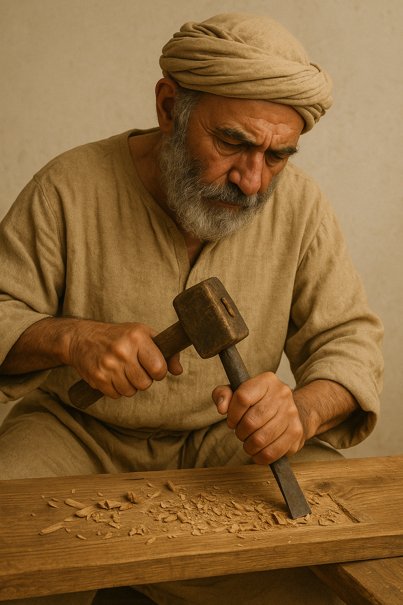

# Human-made Things in the Bible

## License Information

Human-made Things in the Bible © United Bible Societies, 2025. Adapted from: <cite>The Works of Their Hands: Man-made Things in the Bible</cite>, by Ray Pritz © 2009 United Bible Societies. This work is licensed under Creative Commons Attribution-ShareAlike 4.0 International (<a href="https://creativecommons.org/licenses/by-sa/4.0/">https://creativecommons.org/licenses/by-sa/4.0/</a>).

--------------------------------

## 标题：凿子、刨子（chisel, plane） (id: REALIA:1.12.3)

1\.12\.3 标题：凿子、刨子（chisel, plane）
================================

经文出处
----

Hebrew 来：מַקְצוּעָה (音译：maqtsu‘a)

[ISA 44:13](https://ref.ly/Isa44:13)

描述和用途
-----

*用凿子在一块木头上雕刻的人 (Image generated by ChatGPT using OpenAI technology)*

凿子或刨子是一种金属工具，有一条锋利的边，用来塑造木料的形状。

---

翻译
--

[ISA 44:13](https://ref.ly/Isa44:13) ：这节经文提到了木匠用一块木头制作偶像时使用的三种工具。这三种工具仅在圣经此处出现一次，主要依据上下文和词源来确定词的意思。其中两种工具，即*sered* （参[1\.12\.6 铁笔、记号笔 (stylus, marker)\<REALIA:1\.12\.6\>](#) ）和*mchugah* （参[1\.12\.7 圆规、画圆工具 (compass, circle instrument)\<REALIA:1\.12\.7\>](#) ），用来在雕刻木料之前做出标记，而*maqtsu‘a* 则用来切割木料并将其塑造成想要的形状。

GNT (Good News Translation (1992)) 将*maqtsu‘a* 和*mchugah* 合译为“tools”（“工具”）。如果当地文化不知道凿子或刨子，则可以采用这种译法。另外，也可以将*maqtsu‘a* 译为“刀”。

* **Associated Passages:** 以赛亚书 44:13

* **Associated ACAI Concepts:** Chisel (ID: `realia:Chisel`); House (ID: `realia:House`)
