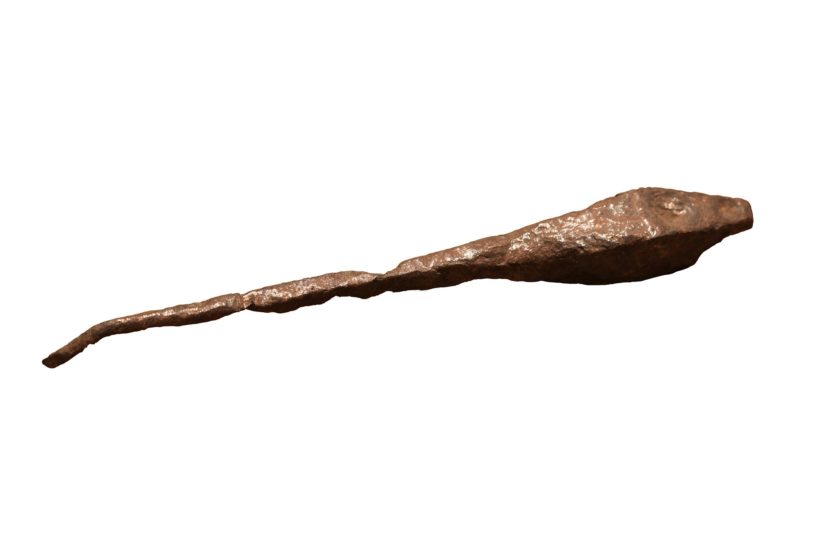

# Human-made Things in the Bible

## License Information

Human-made Things in the Bible © United Bible Societies, 2025. Adapted from: <cite>The Works of Their Hands: Man-made Things in the Bible</cite>, by Ray Pritz © 2009 United Bible Societies. This work is licensed under Creative Commons Attribution-ShareAlike 4.0 International (<a href="https://creativecommons.org/licenses/by-sa/4.0/">https://creativecommons.org/licenses/by-sa/4.0/</a>).

--------------------------------

## 标题：锥子（awl） (id: REALIA:1.12.4)

1\.12\.4 标题：锥子（awl）
===================

经文出处
----

Hebrew 来：מַרְצֵעַ (音译：martsea‘)

[EXO 21:6](https://ref.ly/Exod21:6), [DEU 15:17](https://ref.ly/Deut15:17)

描述和用途
-----

*罗马时期的铁制缝合锥（维迪古罗马博物馆（Vidy Roman Museum），洛桑（Lausanne），瑞士） (© Rama, CC BY\-SA 2\.0 FR, CeCILL or CC BY\-SA 2\.0 FR, via Wikimedia Commons)*

锥子是一种手工工具，带有尖头，用来在木头、皮革或其他材料上钻孔。尖头的材质可能是金属、骨头或石头。有时，锥子会有一个由木头或骨头做成的手柄。

---

翻译
--

圣经只提到这种工具一次，用来刺穿奴隶的耳朵，象征他已经选择终身跟随他的主人。主人可能会在穿刺出来的孔中放置一个表示所有权的环或带子。在翻译时，说明工具的样式比指出工具的名称更加重要。如果没有“锥子”这个词，翻译者可以使用一个表示类似尖头工具的词，例如“钉子”或“刀”。

* **Associated Passages:** 出埃及记 21:6; 申命记 15:17

