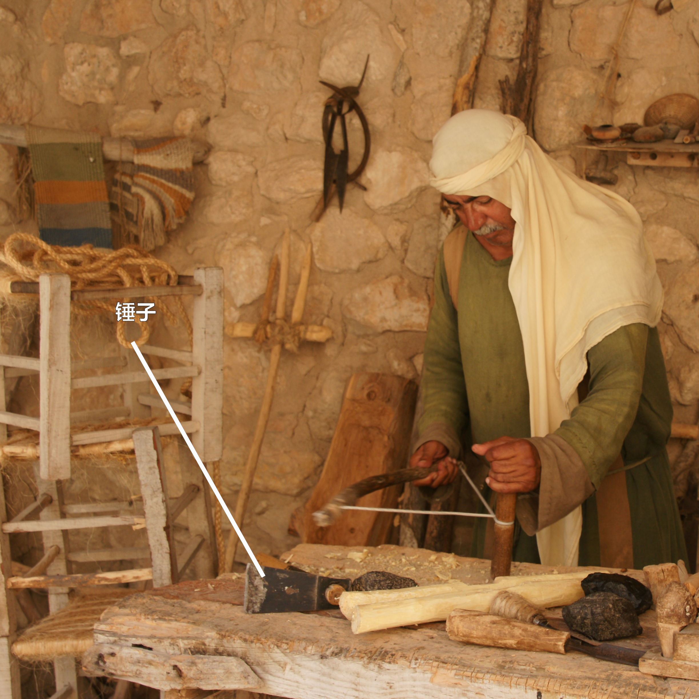
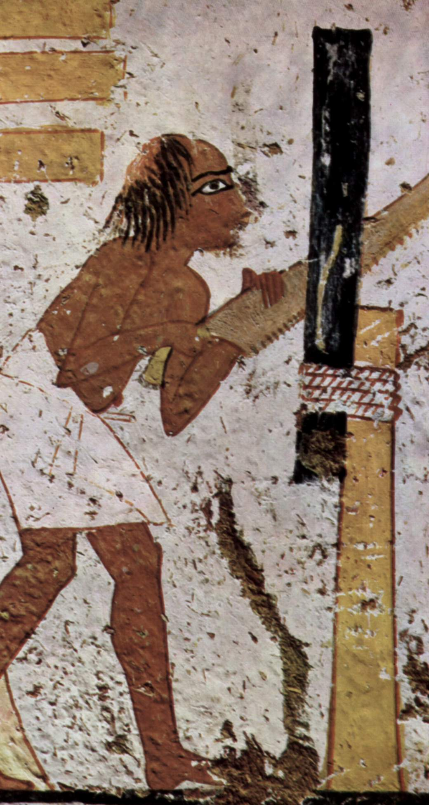

# Human-made Things in the Bible

## License Information

Human-made Things in the Bible © United Bible Societies, 2025. Adapted from: <cite>The Works of Their Hands: Man-made Things in the Bible</cite>, by Ray Pritz © 2009 United Bible Societies. This work is licensed under Creative Commons Attribution-ShareAlike 4.0 International (<a href="https://creativecommons.org/licenses/by-sa/4.0/">https://creativecommons.org/licenses/by-sa/4.0/</a>).

--------------------------------

## 标题：木匠（carpenter） (id: REALIA:1.12)

1\.12 标题：木匠（carpenter）
======================

斧：参[1\.1\.9\.2 叉 (fork)\<REALIA:1\.1\.9\.2\>](#) 。
--------------------------------------------------

## 标题：锤子（hammer） (id: REALIA:1.12.1)

1\.12\.1 标题：锤子（hammer）
======================

经文出处
----

Hebrew 来：הַלְמוּת (音译：halmuth)

[JDG 5:26](https://ref.ly/Judg5:26)

Hebrew 来：מַקֶּבֶת (音译：maqavah, maqeveth)

[JDG 4:21](https://ref.ly/Judg4:21), [1KI 6:7](https://ref.ly/1Kgs6:7), [ISA 44:12](https://ref.ly/Isa44:12), [JER 10:4](https://ref.ly/Jer10:4)

Hebrew 来：מִקְשָׁה (音译：miqshah)

[EXO 25:18](https://ref.ly/Exod25:18), [EXO 25:31](https://ref.ly/Exod25:31), [EXO 25:36](https://ref.ly/Exod25:36), [EXO 37:7](https://ref.ly/Exod37:7), [EXO 37:17](https://ref.ly/Exod37:17), [EXO 37:22](https://ref.ly/Exod37:22), [NUM 8:4](https://ref.ly/Num8:4), [NUM 8:4](https://ref.ly/Num8:4), [NUM 10:2](https://ref.ly/Num10:2)

Hebrew 来：פַּטִּישׁ (音译：patish)

[ISA 41:7](https://ref.ly/Isa41:7), [JER 23:29](https://ref.ly/Jer23:29), [JER 50:23](https://ref.ly/Jer50:23)

Hebrew 来：רִקֻּעַ (音译：riqua‘)

[NUM 17:3](https://ref.ly/Num17:3)

Greek 希：ἐλατός (音译：elatos)

[SIR 50:16](https://ref.ly/Sir50:16)

Greek 希：ὁλοσφύρητος (音译：olosfurētos)

[SIR 50:9](https://ref.ly/Sir50:9)

Greek 希：σφῦρα (音译：sfura)

[SIR 38:28](https://ref.ly/Sir38:28)

描述
--

*木锤 (© Giovanni Dall'Orto, Attribution, via Wikimedia Commons)*

锤子是一种工具，长约30厘米（1英尺），有一个通常用木头做成的手柄，手柄上固定着一个石头、木头或金属（不太常见）的头。手柄装在锤头的孔内。

---

用途
--

*用锤子工作的人 (Elbert Boot © United Bible Societies)*

锤子有多种用途，例如砸碎或修整建筑石块、将钉子或橛子敲到木头里面，或将橛子敲入地里。铁匠也用锤子来使热铁成型。

---

翻译
--

希伯来文*miqshah* 的意思不太确定。这个词似乎是指工匠处理金属物件的成果，即“锤打出来的作品”或“打好的工件”。

* **Associated Passages:** 士师记 5:26; 士师记 4:21; 列王纪上 6:7; 以赛亚书 44:12; 耶利米书 10:4; 出埃及记 25:18; 出埃及记 25:31; 出埃及记 25:36; 出埃及记 37:7; 出埃及记 37:17; 出埃及记 37:22; 民数记 8:4; 民数记 10:2; 以赛亚书 41:7; 耶利米书 23:29; 耶利米书 50:23; 民数记 17:3; 德训篇 50:16; 德训篇 50:9; 德训篇 38:28

* **Associated ACAI Concepts:** Hammer (ID: `realia:Hammer`)

## 标题：钉子、长钉（nail, spike） (id: REALIA:1.12.2)

1\.12\.2 标题：钉子、长钉（nail, spike）
==============================

经文出处
----

Hebrew 来：מַסְמֵר (音译：masmer)

[1CH 22:3](https://ref.ly/1Chr22:3), [2CH 3:9](https://ref.ly/2Chr3:9), [ISA 41:7](https://ref.ly/Isa41:7), [JER 10:4](https://ref.ly/Jer10:4)

Hebrew 来：מַשְׂמֵרָה (音译：masmerah)

[ECC 12:11](https://ref.ly/Eccl12:11)

Greek 希：ἧλος (音译：hēlos)

[JHN 20:25](https://ref.ly/John20:25), [JHN 20:25](https://ref.ly/John20:25)

描述
--

*踝骨上的钉子 (Gary Todd, Israel Museum, CC0, via Wikimedia Commons)*

钉子是一个细金属件（通常是铁的），一头非常尖锐。它与现代钉子的作用大致相同，可以把木头固定在一起或者固定到地上。

钉十字架所用的长钉是一个非常粗的尖头铁钉，长约20厘米（8英寸），大约有男子的手指那么粗。1968年，考古发掘出土了一个被钉十字架的人的遗骸，仍有一个金属长钉嵌在踝关节处，从侧面横穿而过。

---

翻译
--

有些语言区分了相对较小的钉子和较大的长钉。在谈到钉十字架时，所用的词语应是后者，另外[1CH 22:3](https://ref.ly/1Chr22:3) 所记大门上使用的钉子也应该用后面这个词。译词所指的长钉应该要足够坚固，两三个这种钉子就能够承受一个人的体重。

*罗马时期的铁钉 (© Takkk, CC BY\-SA 3\.0, via Wikimedia Commons)*

[2CH 3:9](https://ref.ly/2Chr3:9) 中提到的钉子是用金子制成，大小差别很大。

* **Associated Passages:** 历代志上 22:3; 历代志下 3:9; 以赛亚书 41:7; 耶利米书 10:4; 传道书 12:11; 约翰福音 20:25

* **Associated ACAI Concepts:** Nail (ID: `realia:Nail`)

## 标题：凿子、刨子（chisel, plane） (id: REALIA:1.12.3)

1\.12\.3 标题：凿子、刨子（chisel, plane）
================================

经文出处
----

Hebrew 来：מַקְצוּעָה (音译：maqtsu‘a)

[ISA 44:13](https://ref.ly/Isa44:13)

描述和用途
-----

*用凿子在一块木头上雕刻的人 (Image generated by ChatGPT using OpenAI technology)*

凿子或刨子是一种金属工具，有一条锋利的边，用来塑造木料的形状。

---

翻译
--

[ISA 44:13](https://ref.ly/Isa44:13) ：这节经文提到了木匠用一块木头制作偶像时使用的三种工具。这三种工具仅在圣经此处出现一次，主要依据上下文和词源来确定词的意思。其中两种工具，即*sered* （参[1\.12\.6 铁笔、记号笔 (stylus, marker)\<REALIA:1\.12\.6\>](#) ）和*mchugah* （参[1\.12\.7 圆规、画圆工具 (compass, circle instrument)\<REALIA:1\.12\.7\>](#) ），用来在雕刻木料之前做出标记，而*maqtsu‘a* 则用来切割木料并将其塑造成想要的形状。

GNT (Good News Translation (1992)) 将*maqtsu‘a* 和*mchugah* 合译为“tools”（“工具”）。如果当地文化不知道凿子或刨子，则可以采用这种译法。另外，也可以将*maqtsu‘a* 译为“刀”。

* **Associated Passages:** 以赛亚书 44:13

* **Associated ACAI Concepts:** Chisel (ID: `realia:Chisel`); House (ID: `realia:House`)

## 标题：锥子（awl） (id: REALIA:1.12.4)

1\.12\.4 标题：锥子（awl）
===================

经文出处
----

Hebrew 来：מַרְצֵעַ (音译：martsea‘)

[EXO 21:6](https://ref.ly/Exod21:6), [DEU 15:17](https://ref.ly/Deut15:17)

描述和用途
-----

*罗马时期的铁制缝合锥（维迪古罗马博物馆（Vidy Roman Museum），洛桑（Lausanne），瑞士） (© Rama, CC BY\-SA 2\.0 FR, CeCILL or CC BY\-SA 2\.0 FR, via Wikimedia Commons)*

锥子是一种手工工具，带有尖头，用来在木头、皮革或其他材料上钻孔。尖头的材质可能是金属、骨头或石头。有时，锥子会有一个由木头或骨头做成的手柄。

---

翻译
--

圣经只提到这种工具一次，用来刺穿奴隶的耳朵，象征他已经选择终身跟随他的主人。主人可能会在穿刺出来的孔中放置一个表示所有权的环或带子。在翻译时，说明工具的样式比指出工具的名称更加重要。如果没有“锥子”这个词，翻译者可以使用一个表示类似尖头工具的词，例如“钉子”或“刀”。

* **Associated Passages:** 出埃及记 21:6; 申命记 15:17

* **Associated ACAI Concepts:** Awl (ID: `realia:Awl`)

## 标题：锯（saw） (id: REALIA:1.12.5)

1\.12\.5 标题：锯（saw）
==================

经文出处
----

Greek 希：πρίζω (音译：prizō（动词）)

[HEB 11:37](https://ref.ly/Heb11:37)

描述和用途
-----

*雕刻家内巴蒙（Nebamun）和伊普基（Ipuki）墓室壁画上的木匠图像 (Eloquence, Public domain, via Wikimedia Commons)*

锯是一种带有锯齿状边缘的扁平工具，用来把物件切成两半。锯可以用燧石等硬石，或者用金属制成，有时配有手柄。

---

翻译
--

[HEB 11:37](https://ref.ly/Heb11:37) ：可能没有必要对这种工具做出非常精确的描述。NCV (New Century Version) 的译词“cut in half”（“切成两半”）已经充分表达出了意思。

* **Associated Passages:** 希伯来书 11:37

* **Associated ACAI Concepts:** Saw (ID: `realia:Saw`)

## 标题：铁笔、记号笔（stylus, marker） (id: REALIA:1.12.6)

1\.12\.6 标题：铁笔、记号笔（stylus, marker）
==================================

经文出处
----

Hebrew 来：שֶׂרֶד (音译：sered)

[ISA 44:13](https://ref.ly/Isa44:13)

描述和用途
-----

*(Image generated by ChatGPT using OpenAI technology)*

铁笔是一种用来在木头上做出标记的工具。木匠使用铁笔划出他想要制作出来的形状。

---

翻译
--

[ISA 44:13](https://ref.ly/Isa44:13) ：希伯来文*sered* 可以指两种不同的工具，不过两者的功能相同。一种可能是在木头上刻出标记的尖头工具（“stylus”“铁笔”，NRSV (New Revised Standard Version (1989)) ）；另一种可能是红色的软石头，类似于粉笔，木匠可以用它在木头上做标记（“chalk”“粉笔”，GNT (Good News Translation (1992)) ；“red chalk”“红色粉笔”，NASB (New American Standard Bible) ；“marker”“记号笔”，NIV (New International Version (1984)) ）。CEV (Contemporary English Version) 译作“then draws an outline”（“然后划出一个轮廓”），虽然没有明确提到这种工具，但却清楚地表达出本节第二个分句的意思。另参[1\.12\.3 凿子、刨子 (chisel, plane)\<REALIA:1\.12\.3\>](#) 中的注解。

* **Associated Passages:** 以赛亚书 44:13

* **Associated ACAI Concepts:** Stylus (ID: `realia:Stylus.2`); Compass (ID: `realia:Compass`); Measuring Reed (ID: `realia:MeasuringReed`)

## 标题：圆规、画圆工具（compass, circle instrument） (id: REALIA:1.12.7)

1\.12\.7 标题：圆规、画圆工具（compass, circle instrument）
===============================================

经文出处
----

Hebrew 来：מְחוּגָה (音译：mchugah)

[ISA 44:13](https://ref.ly/Isa44:13)

描述和用途
-----

*罗马指南针（公元1至3世纪） (© Bullenwächter / Andreas Franzkowiak, Halstenbek, CC BY\-SA 3\.0, via Wikimedia Commons; cropped)*

圆规是绘制或标记圆形所用的工具。另外，这种工具也可用于测量。

---

翻译
--

参[1\.12\.3 凿子、刨子 (chisel, plane)\<REALIA:1\.12\.3\>](#) 中的注解。

* **Associated Passages:** 以赛亚书 44:13

* **Associated ACAI Concepts:** Compass (ID: `realia:Compass`); Measuring Reed (ID: `realia:MeasuringReed`)
