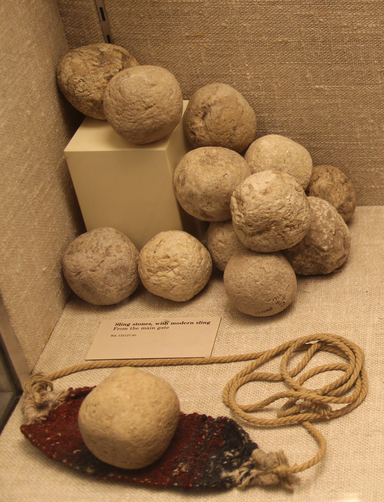

# Human-made Things in the Bible

## License Information

Human-made Things in the Bible © United Bible Societies, 2025. Adapted from: <cite>The Works of Their Hands: Man-made Things in the Bible</cite>, by Ray Pritz © 2009 United Bible Societies. This work is licensed under Creative Commons Attribution-ShareAlike 4.0 International (<a href="https://creativecommons.org/licenses/by-sa/4.0/">https://creativecommons.org/licenses/by-sa/4.0/</a>).

--------------------------------

## 标题：甩石机弦（sling） (id: REALIA:2.2)

2\.2 标题：甩石机弦（sling）
===================

经文出处
----

Hebrew 来：מַרְגֵּמָה (音译：margemah)

[PRO 26:8](https://ref.ly/Prov26:8)

Hebrew 来：קלע, קֶלַע, קַלָּע (音译：qala‘（动词或名词）, qela‘)

[JDG 20:16](https://ref.ly/Judg20:16), [1SA 17:40](https://ref.ly/1Sam17:40), [1SA 17:49](https://ref.ly/1Sam17:49), [1SA 17:50](https://ref.ly/1Sam17:50), [1SA 25:29](https://ref.ly/1Sam25:29), [2KI 3:25](https://ref.ly/2Kgs3:25), [2CH 26:14](https://ref.ly/2Chr26:14), [JOB 41:20](https://ref.ly/Job41:20), [ZEC 9:15](https://ref.ly/Zech9:15)

Greek 希：σφενδόνη, σφενδονήτης (音译：sfendonē, sfendonētēs)

[JDT 6:12](https://ref.ly/Jdt6:12), [JDT 9:7](https://ref.ly/Jdt9:7), [SIR 47:4](https://ref.ly/Sir47:4), [1MA 6:51](https://ref.ly/1Macc6:51), [1MA 9:11](https://ref.ly/1Macc9:11)

描述
--

*投石器和圆形弹弓石（亚述展廊（Assyrian Gallery），大英博物馆） (Gary Todd, worldhistorypics.weebly.com, CC0\)*

在一块不大的长方形或椭圆形皮革或布料两端系上绳索，即制成甩石机弦。皮革或布料比人的手掌略小一点，绳索则大约是人手臂的长度。

---

用途
--

*挥舞甩石机弦的士兵 (© Mike Peel (www.mikepeel.net)., CC BY\-SA 4\.0, via Wikimedia Commons)*

甩石机弦用来将石头高速掷向目标。石头放在皮革或布料形成的小袋内，投掷的人紧握两根绳索的末端，并快速划圈挥舞石头，在算准的时刻放开其中一条绳索，石头就会急速飞向目标。要用甩石机弦精准地掷中目标，需经长期练习。

---

翻译
--

翻译者在选择译词时，应该避免让读者以为甩石机弦是用多根橡胶制成的现代弹弓。在[2CH 26:14](https://ref.ly/2Chr26:14) 、[JOB 41:20](https://ref.ly/Job41:20) （《和》41:28）和[ZEC 9:15](https://ref.ly/Zech9:15) 中，焦点其实是在石头，而不在武器。在这些经文中，翻译者可能要避免提及甩石机弦；例如，[JOB 41:28](https://ref.ly/Job41:28) b（《思》41:20）可以译成，“掷向他的石头就像碎秸一样”（GNT (Good News Translation (1992)) 直译）。

在[JDT 6:12](https://ref.ly/Jdt6:12) 和[1MA 9:11](https://ref.ly/1Macc9:11) 中，希腊文*sfendonētēs* 不是描述甩石机弦这种武器，而是指使用武器的人，即“甩石者”。[JDT 6:12](https://ref.ly/Jdt6:12) 可译作，“用甩石机弦作武器的人”（GNT (Good News Translation (1992)) 直译）。

如果目标读者不知道这种武器，翻译者可以这样表达：“一种用来甩掷石头的特殊武器”。

* **Associated Passages:** 箴言 26:8; 士师记 20:16; 撒母耳记上 17:40; 撒母耳记上 17:49; 撒母耳记上 17:50; 撒母耳记上 25:29; 列王纪下 3:25; 历代志下 26:14; 约伯记 41:20; 撒迦利亚书 9:15; 友弟德传 6:12; 友弟德传 9:7; 德训篇 47:4; 玛加伯上 6:51; 玛加伯上 9:11; 约伯记 41:28

