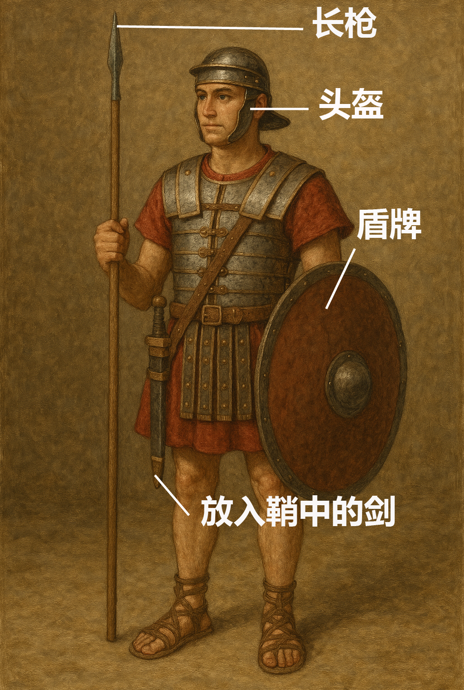

# Human-made Things in the Bible

## License Information

Human-made Things in the Bible © United Bible Societies, 2025. Adapted from: <cite>The Works of Their Hands: Man-made Things in the Bible</cite>, by Ray Pritz © 2009 United Bible Societies. This work is licensed under Creative Commons Attribution-ShareAlike 4.0 International (<a href="https://creativecommons.org/licenses/by-sa/4.0/">https://creativecommons.org/licenses/by-sa/4.0/</a>).

--------------------------------

## 标题：鞘（sheath, scabbard） (id: REALIA:2.3.1)

2\.3\.1 标题：鞘（sheath, scabbard）
==============================

经文出处
----

Hebrew 来：נָדָן (音译：nadan)

[1CH 21:27](https://ref.ly/1Chr21:27)

Hebrew 来：תַּעַר (音译：ta‘ar)

[1SA 17:51](https://ref.ly/1Sam17:51), [2SA 20:8](https://ref.ly/2Sam20:8), [JER 47:6](https://ref.ly/Jer47:6), [EZK 21:8](https://ref.ly/Ezek21:8), [EZK 21:9](https://ref.ly/Ezek21:9), [EZK 21:10](https://ref.ly/Ezek21:10), [EZK 21:35](https://ref.ly/Ezek21:35)

Greek 希：θήκη (音译：thēkē)

[JHN 18:11](https://ref.ly/John18:11)

描述
--

*武装的士兵 (Image generated by ChatGPT using OpenAI technology)*

鞘是一个护套或袋子，与剑的大小和形状相近，用来包裹和携带剑。鞘通常用皮革制成，但也有用布、金属，甚至木材制成的。鞘一般会系在一根皮带上，然后把皮带背在肩上或系在腰间。在旧约较晚时期，只用一根腰带无法携带沉重的铁剑，因此剑鞘会同时固定在腰带和肩带上。

---

用途
--

鞘包裹着剑的锋刃，除了用来保护锋刃外，也保护携剑的人和周围的人不被意外刺伤。

---

翻译
--

在有些语言中，“鞘”可以翻译成“装剑的皮袋”、“剑的护套”，或“把剑放在里面以便携带的东西”。

* **Associated Passages:** 历代志上 21:27; 撒母耳记上 17:51; 撒母耳记下 20:8; 耶利米书 47:6; 以西结书 21:8; 以西结书 21:9; 以西结书 21:10; 以西结书 21:35; 约翰福音 18:11

