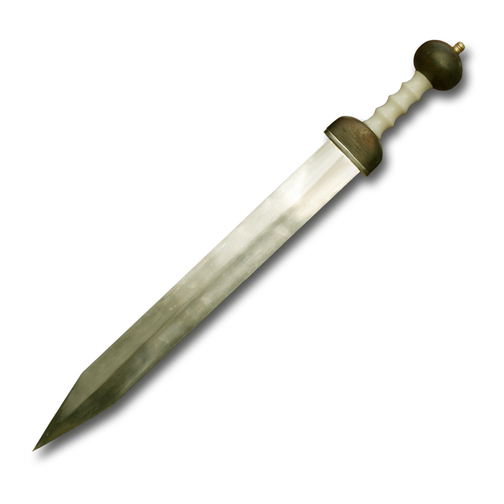
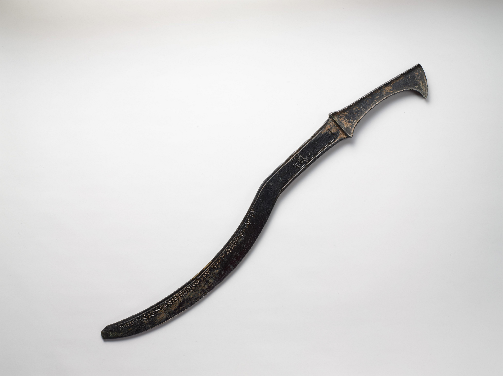
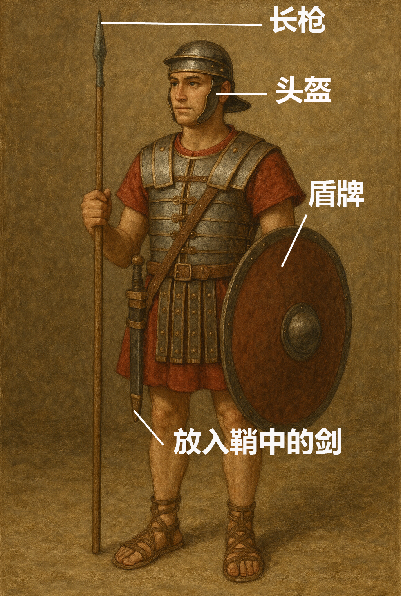

# Human-made Things in the Bible

## License Information

Human-made Things in the Bible © United Bible Societies, 2025. Adapted from: <cite>The Works of Their Hands: Man-made Things in the Bible</cite>, by Ray Pritz © 2009 United Bible Societies. This work is licensed under Creative Commons Attribution-ShareAlike 4.0 International (<a href="https://creativecommons.org/licenses/by-sa/4.0/">https://creativecommons.org/licenses/by-sa/4.0/</a>).

--------------------------------

## 标题：刀剑（sword） (id: REALIA:2.3)

2\.3 标题：刀剑（sword）
=================

经文出处
----

Hebrew 来：חֶרֶב (音译：cherev)

GEN 3:24, GEN 27:40, GEN 31:26, GEN 34:25, GEN 34:26, GEN 48:22, EXO 5:3, EXO 5:21, EXO 15:9, EXO 17:13, EXO 18:4, EXO 20:25, EXO 22:23, EXO 32:27, LEV 26:6, LEV 26:7, LEV 26:8, LEV 26:25, LEV 26:33, LEV 26:36, LEV 26:37, NUM 14:3, NUM 14:43, NUM 19:16, NUM 20:18, NUM 21:24, NUM 22:23, NUM 22:29, NUM 22:31, NUM 31:8, DEU 13:16, DEU 13:16, DEU 20:13, DEU 28:22, DEU 32:25, DEU 32:41, DEU 32:42, DEU 33:29, JOS 5:2, JOS 5:3, JOS 5:13, JOS 6:21, JOS 8:24, JOS 8:24, JOS 10:11, JOS 10:28, JOS 10:30, JOS 10:32, JOS 10:35, JOS 10:37, JOS 10:39, JOS 11:10, JOS 11:11, JOS 11:12, JOS 11:14, JOS 13:22, JOS 19:47, JOS 24:12, JDG 1:8, JDG 1:25, JDG 3:16, JDG 3:21, JDG 3:22, JDG 4:15, JDG 4:16, JDG 7:14, JDG 7:20, JDG 7:22, JDG 8:10, JDG 8:20, JDG 9:54, JDG 18:27, JDG 20:2, JDG 20:15, JDG 20:17, JDG 20:25, JDG 20:35, JDG 20:37, JDG 20:46, JDG 20:48, JDG 21:10, 1SA 13:19, 1SA 13:22, 1SA 14:20, 1SA 15:8, 1SA 15:33, 1SA 17:39, 1SA 17:45, 1SA 17:47, 1SA 17:50, 1SA 17:51, 1SA 18:4, 1SA 21:9, 1SA 21:9, 1SA 21:10, 1SA 22:10, 1SA 22:13, 1SA 22:19, 1SA 22:19, 1SA 25:13, 1SA 25:13, 1SA 25:13, 1SA 31:4, 1SA 31:4, 1SA 31:5, 2SA 1:12, 2SA 1:22, 2SA 2:16, 2SA 2:26, 2SA 3:29, 2SA 11:25, 2SA 12:9, 2SA 12:9, 2SA 12:10, 2SA 15:14, 2SA 18:8, 2SA 20:8, 2SA 20:10, 2SA 23:10, 2SA 24:9, 1KI 1:51, 1KI 2:8, 1KI 2:32, 1KI 3:24, 1KI 3:24, 1KI 18:28, 1KI 19:1, 1KI 19:10, 1KI 19:14, 1KI 19:17, 1KI 19:17, 2KI 3:26, 2KI 6:22, 2KI 8:12, 2KI 10:25, 2KI 11:15, 2KI 11:20, 2KI 19:7, 2KI 19:37, 1CH 5:18, 1CH 10:4, 1CH 10:4, 1CH 10:5, 1CH 21:5, 1CH 21:5, 1CH 21:12, 1CH 21:12, 1CH 21:16, 1CH 21:27, 1CH 21:30, 2CH 20:9, 2CH 21:4, 2CH 23:14, 2CH 23:21, 2CH 29:9, 2CH 32:21, 2CH 34:6, 2CH 36:17, 2CH 36:20, EZR 9:7, NEH 4:7, NEH 4:12, EST 9:5, JOB 1:15, JOB 1:17, JOB 5:15, JOB 5:20, JOB 15:22, JOB 19:29, JOB 19:29, JOB 27:14, JOB 39:22, JOB 40:19, JOB 41:18, PSA 7:13, PSA 17:13, PSA 22:21, PSA 37:14, PSA 37:15, PSA 44:4, PSA 44:7, PSA 45:4, PSA 57:5, PSA 59:8, PSA 63:11, PSA 64:4, PSA 76:4, PSA 78:62, PSA 78:64, PSA 89:44, PSA 144:10, PSA 149:6, PRO 5:4, PRO 12:18, PRO 25:18, PRO 30:14, SNG 3:8, SNG 3:8, ISA 1:20, ISA 2:4, ISA 2:4, ISA 3:25, ISA 13:15, ISA 14:19, ISA 21:15, ISA 21:15, ISA 22:2, ISA 27:1, ISA 31:8, ISA 31:8, ISA 31:8, ISA 34:5, ISA 34:6, ISA 37:7, ISA 37:38, ISA 41:2, ISA 49:2, ISA 51:19, ISA 65:12, ISA 66:16, JER 2:30, JER 4:10, JER 5:12, JER 5:17, JER 6:25, JER 9:15, JER 11:22, JER 12:12, JER 14:12, JER 14:13, JER 14:15, JER 14:15, JER 14:16, JER 14:18, JER 15:2, JER 15:2, JER 15:3, JER 15:9, JER 16:4, JER 18:21, JER 18:21, JER 19:7, JER 20:4, JER 20:4, JER 21:7, JER 21:7, JER 21:9, JER 24:10, JER 25:16, JER 25:27, JER 25:29, JER 25:31, JER 26:23, JER 27:8, JER 27:13, JER 29:17, JER 29:18, JER 31:2, JER 32:24, JER 32:36, JER 33:4, JER 34:4, JER 34:17, JER 38:2, JER 39:18, JER 41:2, JER 42:16, JER 42:17, JER 42:22, JER 43:11, JER 43:11, JER 44:12, JER 44:12, JER 44:13, JER 44:18, JER 44:27, JER 44:28, JER 46:10, JER 46:14, JER 46:16, JER 47:6, JER 48:2, JER 48:10, JER 49:37, JER 50:16, JER 50:35, JER 50:36, JER 50:36, JER 50:37, JER 50:37, JER 51:50, LAM 1:20, LAM 2:21, LAM 4:9, LAM 5:9, EZK 5:1, EZK 5:2, EZK 5:2, EZK 5:12, EZK 5:12, EZK 5:17, EZK 6:3, EZK 6:8, EZK 6:11, EZK 6:12, EZK 7:15, EZK 7:15, EZK 11:8, EZK 11:8, EZK 11:10, EZK 12:14, EZK 12:16, EZK 14:17, EZK 14:17, EZK 14:21, EZK 16:40, EZK 17:21, EZK 21:8, EZK 21:9, EZK 21:10, EZK 21:14, EZK 21:14, EZK 21:16, EZK 21:17, EZK 21:19, EZK 21:19, EZK 21:19, EZK 21:20, EZK 21:24, EZK 21:25, EZK 21:33, EZK 21:33, EZK 23:10, EZK 23:25, EZK 23:47, EZK 24:21, EZK 25:13, EZK 26:6, EZK 26:8, EZK 26:9, EZK 26:11, EZK 28:7, EZK 28:23, EZK 29:8, EZK 30:4, EZK 30:5, EZK 30:6, EZK 30:11, EZK 30:17, EZK 30:21, EZK 30:22, EZK 30:24, EZK 30:25, EZK 31:17, EZK 31:18, EZK 32:10, EZK 32:11, EZK 32:12, EZK 32:20, EZK 32:20, EZK 32:21, EZK 32:22, EZK 32:23, EZK 32:24, EZK 32:25, EZK 32:26, EZK 32:27, EZK 32:28, EZK 32:29, EZK 32:30, EZK 32:31, EZK 32:32, EZK 33:2, EZK 33:3, EZK 33:4, EZK 33:6, EZK 33:6, EZK 33:26, EZK 33:27, EZK 35:5, EZK 35:8, EZK 38:4, EZK 38:8, EZK 38:21, EZK 38:21, EZK 39:23, DAN 11:33, HOS 1:7, HOS 2:20, HOS 7:16, HOS 11:6, HOS 14:1, JOL 4:10, AMO 1:11, AMO 4:10, AMO 7:9, AMO 7:11, AMO 7:17, AMO 9:1, AMO 9:4, AMO 9:10, MIC 4:3, MIC 4:3, MIC 5:5, MIC 6:14, NAM 2:14, NAM 3:3, NAM 3:15, ZEP 2:12, HAG 2:22, ZEC 9:13, ZEC 11:17, ZEC 13:7

Hebrew 来：מְכֵרָה (音译：mkerah)

GEN 49:5

Hebrew 来：פְּתִיחָה (音译：pthichah)

PSA 55:22

Greek 希：ἀκινάκης (音译：akinakēs)

JDT 13:6, JDT 16:9

Greek 希：μάχαιρα (音译：machaira)

MAT 10:34, MAT 26:47, MAT 26:52, MAT 26:52, MAT 26:52, MAT 26:55, MRK 14:43, MRK 14:47, MRK 14:48, LUK 21:24, LUK 22:36, LUK 22:38, LUK 22:49, LUK 22:52, JHN 18:10, JHN 18:11, ACT 12:2, ACT 16:27, ROM 8:35, ROM 13:4, GAL 6:17, HEB 4:12, HEB 11:34, HEB 11:37, REV 6:4, REV 13:10, REV 13:10, REV 13:14, ESG 3:13, SIR 28:18, BEL 1:25, 1MA 3:12, 1MA 4:6, 1MA 10:85, 2MA 5:2, 1ES 3:22, ODA 1:9, ODA 2:25, ODA 2:41, ODA 2:42, PSA 151:7

Greek 希：ξιφηφόρος (音译：xifēforos)

4MA 16:20

Greek 希：ξίφος (音译：xifos)

WIS 18:15, 2MA 12:22, 2MA 14:41

Greek 希：ῥομφαία (音译：rhomfaia)

LUK 2:35, REV 1:16, REV 2:12, REV 2:16, REV 6:8, REV 19:15, REV 19:21, JDT 1:12, JDT 2:27, JDT 7:14, JDT 8:19, JDT 9:2, JDT 11:10, JDT 16:4, WIS 5:20, SIR 21:3, SIR 22:21, SIR 26:28, SIR 39:30, SIR 40:9, SIR 46:2, BAR 2:25, SUS 1:59, 1MA 2:9, 1MA 3:3, 1MA 4:15, 1MA 4:33, 1MA 5:28, 1MA 5:51, 1MA 7:38, 1MA 7:46, 1MA 8:23, 1MA 9:73, 1MA 12:48, 2MA 15:15, 2MA 15:16, 1ES 1:50, 1ES 1:53, 1ES 4:23, 1ES 8:74, PSS 13:2, PSS 15:7

Greek 希：σίδηρος (音译：sidēros)

JDT 6:6, JDT 9:8

Greek 希：συγκεντέω (音译：sugkenteō（动词）)

2MA 12:23

Greek 希：συνεκκεντέω (音译：sunekkenteō（动词）)

2MA 5:26

Latin 拉：gladius

2ES 12:27, 2ES 12:28, 2ES 15:5, 2ES 15:15, 2ES 15:19, 2ES 15:35, 2ES 15:49, 2ES 15:57, 2ES 16:3, 2ES 16:22, 2ES 16:23

Latin 拉：romphea

2ES 15:15, 2ES 15:22, 2ES 15:41, 2ES 15:57, 2ES 16:32

描述和用途
-----

*直剑 (© Rama, Wikimedia Commons, CC BY\-SA 2\.0 FR, via Wikimedia Commons)*

在不同时期和不同国家，剑的长度和形状差别很大。然而，剑的基本概念保持不变：剑是一柄长而重的刀，用金属制成，先是用青铜，后来是用铁等更加坚硬的金属。在圣经时代的较早期，剑的锋刃主要用来切割，曲线与镰刀相似（参[1\.1\.6 镰刀(sickle)\<REALIA:1\.1\.6\>](#) ），但锋利的刃是在外侧，而镰刀的锋刃是在内侧。这种剑（或刀）主要用来劈砍，用于戳刺的剑尖并不被重视。在旧约时代的较晚时候，剑更多是用来戳刺。开始时，这些剑比较短，只有大约30—40厘米（12—16英寸），剑身相对宽阔，两边开刃，并且有剑尖。到了以色列王国时期，剑身变得较长和相对较窄。

---

翻译
--

*亚述弯曲或镰刀剑（约公元前1307–1275年） (Metropolitan Museum of Art, CC0, MMA)*

在有些语言中，表示“剑”的词语就是“大的刀”；但在某些地区，“剑”可能被称为“用来杀戮的大砍刀”或“战刀”。

希伯来文*cherev* 是一个统称，没有特别指明剑的长短。如果目标语言用不同的词语分别表示长剑和短剑，那么通常应该译作“短剑”。在新约中，希腊文*machaira* 指短剑，而*rhomfaia* 则指长剑。短语“用剑的刃”在圣经中出现超过30次，一半以上在《约书亚记》和《士师记》，通常是指较早期的弧形剑，只一面有刃。翻译者通常不需要直译这个短语，译成“用剑”就足够了。

很多经文出现“被刀杀灭”、“被刀剑灭绝”、“遭刀剑而死”或“死在刀下”这个短语（如JOB 36:12 ；JER 5:12 ，JER 21:9 ；EZK 31:17 ；MAT 26:52 ）。这是一个希伯来文惯用语，意思是因暴力而死。这个短语一般（但不是每次；比较1SA 2:33 ）表示战死，翻译者很多时候可以将其表达为“在战争中被杀”（GNT (Good News Translation (1992)) 直译；JER 16:4 ），或“在战斗中死亡”。在这些情况下，该词通常不是表示英勇地死亡。如果目标语言有特别的词语或短语表示“战士英勇阵亡”，翻译者只有在经文确实是表达这种意思时，才可使用该词语或短语。如果经文不是表达战死的意思，翻译者可以将之译成“横死”或“被杀”。翻译者不应使用现代武器的名称来翻译“刀剑”；例如，“被枪击毙”这种表达就不符合当时的时代。

在一些经文中，“刀剑”这个词仅仅代表战争（如JER 5:12 ；ROM 8:35 ；REV 6:8 ）。JOS 24:12 原文字面意思是：“我派遣大黄蜂在你们前面，将亚摩利人的两个王从你们面前赶出，［但］不是靠你们的剑或你们的弓”（NASB (New American Standard Bible) 采用了直译）。在翻译这节经文的最后一句时，有些语言可能不必提及具体的武器：“你们的武器和力量对战争的结果毫无影响。”这句经文也可以用一个肯定陈述句和一个否定陈述句来翻译：“我为你们打败他们，这不是你们自己的武器和力量做成的。”

短语“拿刀的”出现在多处经文中（JDG 8:10; JDG 8:20 （6次）；2SA 24:9 ；1CH 21:5 ）。这是一句惯用语，意指“士兵”，GNT (Good News Translation (1992)) 在JDG 8:10 把这个短语译为“soldiers”（“士兵”）。

短语“举刀”在ISA 2:4 和MIC 4:3 中出现，意思是“进入战斗”或“开战”。GNT (Good News Translation (1992)) 提供了正确的英文对等表达，把这两节经文的倒数第二行翻译为“Nations will never again go to war”（英文直译：“国家之间从此不再开战”）。在一些语言中，直译“举刀”这个希伯来文惯用语会得到“投降”、“获胜”等非常不同的含义；这些都不是经文的意思，需要避免产生这样的误解。

希伯来文短语*cherev pifiyoth* （PSA 149:6 ）或*cherev piyoth* （PRO 5:4 ）指一柄两边的锋刃都磨利了的剑，即“两刃的剑”或“两刃的刀”（RSV (Revised Standard Version (1952)) 直译；比较HEB 4:12; REV 1:16; REV 2:12; SIR 21:3 ）。这是在旧约较晚时期以及之后所使用的直剑。

在GEN 49:5 ，希伯来文*mkerah* 的意思并不确定。大部分翻译者把雅各的话与GEN 34:25; GEN 34:26 描述的事件关联起来，把*mkerah* 理解为一种武器，很可能与那些经文中的“刀剑”（希伯来文*cherev* ）对应。

在PSA 55:22 （《和》55:21），希伯来文*pthichoth* 指被“拔出”（直译“打开”）的刀剑，意即准备使用。因此，这节经文的最后一行可译成，“他已准备好挥剑攻击”（CEV (Contemporary English Version) 直译）。另外也可以采用比喻；例如，“它们（即他的话）像利剑切割”（GNT (Good News Translation (1992)) 直译），“……像刀切割”（NCV (New Century Version) 直译）。

在LUK 2:35 ，“剑”喻指痛楚或极度痛苦，翻译者一般可以采用字面直译。有时候，使用明喻比较合适；例如，这节经文的前半节可以译成：“至于你的心，必如同被剑刺透。”有些情况下，不必出现“剑”字就可实现意思相同的表达，例如“你的心也将被刺透”（NEB (New English Bible (1970)) 直译）。翻译者也可以使用非比喻式的表达，例如“你将经历极度的痛苦”。这节经文完全没有战死沙场的含义，翻译者应该避免使用任何带有这种含义的词语。

* **Associated Passages:** 创世记 3:24; 创世记 27:40; 创世记 31:26; 创世记 34:25; 创世记 34:26; 创世记 48:22; 出埃及记 5:3; 出埃及记 5:21; 出埃及记 15:9; 出埃及记 17:13; 出埃及记 18:4; 出埃及记 20:25; 出埃及记 22:23; 出埃及记 32:27; 利未记 26:6; 利未记 26:7; 利未记 26:8; 利未记 26:25; 利未记 26:33; 利未记 26:36; 利未记 26:37; 民数记 14:3; 民数记 14:43; 民数记 19:16; 民数记 20:18; 民数记 21:24; 民数记 22:23; 民数记 22:29; 民数记 22:31; 民数记 31:8; 申命记 13:16; 申命记 20:13; 申命记 28:22; 申命记 32:25; 申命记 32:41; 申命记 32:42; 申命记 33:29; 约书亚记 5:2; 约书亚记 5:3; 约书亚记 5:13; 约书亚记 6:21; 约书亚记 8:24; 约书亚记 10:11; 约书亚记 10:28; 约书亚记 10:30; 约书亚记 10:32; 约书亚记 10:35; 约书亚记 10:37; 约书亚记 10:39; 约书亚记 11:10; 约书亚记 11:11; 约书亚记 11:12; 约书亚记 11:14; 约书亚记 13:22; 约书亚记 19:47; 约书亚记 24:12; 士师记 1:8; 士师记 1:25; 士师记 3:16; 士师记 3:21; 士师记 3:22; 士师记 4:15; 士师记 4:16; 士师记 7:14; 士师记 7:20; 士师记 7:22; 士师记 8:10; 士师记 8:20; 士师记 9:54; 士师记 18:27; 士师记 20:2; 士师记 20:15; 士师记 20:17; 士师记 20:25; 士师记 20:35; 士师记 20:37; 士师记 20:46; 士师记 20:48; 士师记 21:10; 撒母耳记上 13:19; 撒母耳记上 13:22; 撒母耳记上 14:20; 撒母耳记上 15:8; 撒母耳记上 15:33; 撒母耳记上 17:39; 撒母耳记上 17:45; 撒母耳记上 17:47; 撒母耳记上 17:50; 撒母耳记上 17:51; 撒母耳记上 18:4; 撒母耳记上 21:9; 撒母耳记上 21:10; 撒母耳记上 22:10; 撒母耳记上 22:13; 撒母耳记上 22:19; 撒母耳记上 25:13; 撒母耳记上 31:4; 撒母耳记上 31:5; 撒母耳记下 1:12; 撒母耳记下 1:22; 撒母耳记下 2:16; 撒母耳记下 2:26; 撒母耳记下 3:29; 撒母耳记下 11:25; 撒母耳记下 12:9; 撒母耳记下 12:10; 撒母耳记下 15:14; 撒母耳记下 18:8; 撒母耳记下 20:8; 撒母耳记下 20:10; 撒母耳记下 23:10; 撒母耳记下 24:9; 列王纪上 1:51; 列王纪上 2:8; 列王纪上 2:32; 列王纪上 3:24; 列王纪上 18:28; 列王纪上 19:1; 列王纪上 19:10; 列王纪上 19:14; 列王纪上 19:17; 列王纪下 3:26; 列王纪下 6:22; 列王纪下 8:12; 列王纪下 10:25; 列王纪下 11:15; 列王纪下 11:20; 列王纪下 19:7; 列王纪下 19:37; 历代志上 5:18; 历代志上 10:4; 历代志上 10:5; 历代志上 21:5; 历代志上 21:12; 历代志上 21:16; 历代志上 21:27; 历代志上 21:30; 历代志下 20:9; 历代志下 21:4; 历代志下 23:14; 历代志下 23:21; 历代志下 29:9; 历代志下 32:21; 历代志下 34:6; 历代志下 36:17; 历代志下 36:20; 以斯拉记 9:7; 尼希米记 4:7; 尼希米记 4:12; 以斯帖记 9:5; 约伯记 1:15; 约伯记 1:17; 约伯记 5:15; 约伯记 5:20; 约伯记 15:22; 约伯记 19:29; 约伯记 27:14; 约伯记 39:22; 约伯记 40:19; 约伯记 41:18; 诗篇 7:13; 诗篇 17:13; 诗篇 22:21; 诗篇 37:14; 诗篇 37:15; 诗篇 44:4; 诗篇 44:7; 诗篇 45:4; 诗篇 57:5; 诗篇 59:8; 诗篇 63:11; 诗篇 64:4; 诗篇 76:4; 诗篇 78:62; 诗篇 78:64; 诗篇 89:44; 诗篇 144:10; 诗篇 149:6; 箴言 5:4; 箴言 12:18; 箴言 25:18; 箴言 30:14; 雅歌 3:8; 以赛亚书 1:20; 以赛亚书 2:4; 以赛亚书 3:25; 以赛亚书 13:15; 以赛亚书 14:19; 以赛亚书 21:15; 以赛亚书 22:2; 以赛亚书 27:1; 以赛亚书 31:8; 以赛亚书 34:5; 以赛亚书 34:6; 以赛亚书 37:7; 以赛亚书 37:38; 以赛亚书 41:2; 以赛亚书 49:2; 以赛亚书 51:19; 以赛亚书 65:12; 以赛亚书 66:16; 耶利米书 2:30; 耶利米书 4:10; 耶利米书 5:12; 耶利米书 5:17; 耶利米书 6:25; 耶利米书 9:15; 耶利米书 11:22; 耶利米书 12:12; 耶利米书 14:12; 耶利米书 14:13; 耶利米书 14:15; 耶利米书 14:16; 耶利米书 14:18; 耶利米书 15:2; 耶利米书 15:3; 耶利米书 15:9; 耶利米书 16:4; 耶利米书 18:21; 耶利米书 19:7; 耶利米书 20:4; 耶利米书 21:7; 耶利米书 21:9; 耶利米书 24:10; 耶利米书 25:16; 耶利米书 25:27; 耶利米书 25:29; 耶利米书 25:31; 耶利米书 26:23; 耶利米书 27:8; 耶利米书 27:13; 耶利米书 29:17; 耶利米书 29:18; 耶利米书 31:2; 耶利米书 32:24; 耶利米书 32:36; 耶利米书 33:4; 耶利米书 34:4; 耶利米书 34:17; 耶利米书 38:2; 耶利米书 39:18; 耶利米书 41:2; 耶利米书 42:16; 耶利米书 42:17; 耶利米书 42:22; 耶利米书 43:11; 耶利米书 44:12; 耶利米书 44:13; 耶利米书 44:18; 耶利米书 44:27; 耶利米书 44:28; 耶利米书 46:10; 耶利米书 46:14; 耶利米书 46:16; 耶利米书 47:6; 耶利米书 48:2; 耶利米书 48:10; 耶利米书 49:37; 耶利米书 50:16; 耶利米书 50:35; 耶利米书 50:36; 耶利米书 50:37; 耶利米书 51:50; 耶利米哀歌 1:20; 耶利米哀歌 2:21; 耶利米哀歌 4:9; 耶利米哀歌 5:9; 以西结书 5:1; 以西结书 5:2; 以西结书 5:12; 以西结书 5:17; 以西结书 6:3; 以西结书 6:8; 以西结书 6:11; 以西结书 6:12; 以西结书 7:15; 以西结书 11:8; 以西结书 11:10; 以西结书 12:14; 以西结书 12:16; 以西结书 14:17; 以西结书 14:21; 以西结书 16:40; 以西结书 17:21; 以西结书 21:8; 以西结书 21:9; 以西结书 21:10; 以西结书 21:14; 以西结书 21:16; 以西结书 21:17; 以西结书 21:19; 以西结书 21:20; 以西结书 21:24; 以西结书 21:25; 以西结书 21:33; 以西结书 23:10; 以西结书 23:25; 以西结书 23:47; 以西结书 24:21; 以西结书 25:13; 以西结书 26:6; 以西结书 26:8; 以西结书 26:9; 以西结书 26:11; 以西结书 28:7; 以西结书 28:23; 以西结书 29:8; 以西结书 30:4; 以西结书 30:5; 以西结书 30:6; 以西结书 30:11; 以西结书 30:17; 以西结书 30:21; 以西结书 30:22; 以西结书 30:24; 以西结书 30:25; 以西结书 31:17; 以西结书 31:18; 以西结书 32:10; 以西结书 32:11; 以西结书 32:12; 以西结书 32:20; 以西结书 32:21; 以西结书 32:22; 以西结书 32:23; 以西结书 32:24; 以西结书 32:25; 以西结书 32:26; 以西结书 32:27; 以西结书 32:28; 以西结书 32:29; 以西结书 32:30; 以西结书 32:31; 以西结书 32:32; 以西结书 33:2; 以西结书 33:3; 以西结书 33:4; 以西结书 33:6; 以西结书 33:26; 以西结书 33:27; 以西结书 35:5; 以西结书 35:8; 以西结书 38:4; 以西结书 38:8; 以西结书 38:21; 以西结书 39:23; 但以理书 11:33; 何西阿书 1:7; 何西阿书 2:20; 何西阿书 7:16; 何西阿书 11:6; 何西阿书 14:1; 约珥书 4:10; 阿摩司书 1:11; 阿摩司书 4:10; 阿摩司书 7:9; 阿摩司书 7:11; 阿摩司书 7:17; 阿摩司书 9:1; 阿摩司书 9:4; 阿摩司书 9:10; 弥迦书 4:3; 弥迦书 5:5; 弥迦书 6:14; 那鸿书 2:14; 那鸿书 3:3; 那鸿书 3:15; 西番雅书 2:12; 哈该书 2:22; 撒迦利亚书 9:13; 撒迦利亚书 11:17; 撒迦利亚书 13:7; 创世记 49:5; 诗篇 55:22; 友弟德传 13:6; 友弟德传 16:9; 马太福音 10:34; 马太福音 26:47; 马太福音 26:52; 马太福音 26:55; 马可福音 14:43; 马可福音 14:47; 马可福音 14:48; 路加福音 21:24; 路加福音 22:36; 路加福音 22:38; 路加福音 22:49; 路加福音 22:52; 约翰福音 18:10; 约翰福音 18:11; 使徒行传 12:2; 使徒行传 16:27; 罗马书 8:35; 罗马书 13:4; 加拉太书 6:17; 希伯来书 4:12; 希伯来书 11:34; 希伯来书 11:37; 启示录 6:4; 启示录 13:10; 启示录 13:14; 以斯帖记补篇 3:13; 德训篇 28:18; 彼勒与大龙 1:25; 玛加伯上 3:12; 玛加伯上 4:6; 玛加伯上 10:85; 玛加伯下 5:2; 厄斯德拉上 3:22; 颂歌 1:9; 颂歌 2:25; 颂歌 2:41; 颂歌 2:42; 玛加伯四书 16:20; 智慧篇 18:15; 玛加伯下 12:22; 玛加伯下 14:41; 路加福音 2:35; 启示录 1:16; 启示录 2:12; 启示录 2:16; 启示录 6:8; 启示录 19:15; 启示录 19:21; 友弟德传 1:12; 友弟德传 2:27; 友弟德传 7:14; 友弟德传 8:19; 友弟德传 9:2; 友弟德传 11:10; 友弟德传 16:4; 智慧篇 5:20; 德训篇 21:3; 德训篇 22:21; 德训篇 26:28; 德训篇 39:30; 德训篇 40:9; 德训篇 46:2; 巴路克 2:25; 苏撒拿传 1:59; 玛加伯上 2:9; 玛加伯上 3:3; 玛加伯上 4:15; 玛加伯上 4:33; 玛加伯上 5:28; 玛加伯上 5:51; 玛加伯上 7:38; 玛加伯上 7:46; 玛加伯上 8:23; 玛加伯上 9:73; 玛加伯上 12:48; 玛加伯下 15:15; 玛加伯下 15:16; 厄斯德拉上 1:50; 厄斯德拉上 1:53; 厄斯德拉上 4:23; 厄斯德拉上 8:74; 所罗门诗篇 13:2; 所罗门诗篇 15:7; 友弟德传 6:6; 友弟德传 9:8; 玛加伯下 12:23; 玛加伯下 5:26; 厄斯德拉下 12:27; 厄斯德拉下 12:28; 厄斯德拉下 15:5; 厄斯德拉下 15:15; 厄斯德拉下 15:19; 厄斯德拉下 15:35; 厄斯德拉下 15:49; 厄斯德拉下 15:57; 厄斯德拉下 16:3; 厄斯德拉下 16:22; 厄斯德拉下 16:23; 厄斯德拉下 15:22; 厄斯德拉下 15:41; 厄斯德拉下 16:32; 约伯记 36:12; 撒母耳记上 2:33

* **Associated ACAI Concepts:** Sword (ID: `realia:Sword`)

## 标题：鞘（sheath, scabbard） (id: REALIA:2.3.1)

2\.3\.1 标题：鞘（sheath, scabbard）
==============================

经文出处
----

Hebrew 来：נָדָן (音译：nadan)

1CH 21:27

Hebrew 来：תַּעַר (音译：ta‘ar)

1SA 17:51, 2SA 20:8, JER 47:6, EZK 21:8, EZK 21:9, EZK 21:10, EZK 21:35

Greek 希：θήκη (音译：thēkē)

JHN 18:11

描述
--

*武装的士兵 (Image generated by ChatGPT using OpenAI technology)*

鞘是一个护套或袋子，与剑的大小和形状相近，用来包裹和携带剑。鞘通常用皮革制成，但也有用布、金属，甚至木材制成的。鞘一般会系在一根皮带上，然后把皮带背在肩上或系在腰间。在旧约较晚时期，只用一根腰带无法携带沉重的铁剑，因此剑鞘会同时固定在腰带和肩带上。

---

用途
--

鞘包裹着剑的锋刃，除了用来保护锋刃外，也保护携剑的人和周围的人不被意外刺伤。

---

翻译
--

在有些语言中，“鞘”可以翻译成“装剑的皮袋”、“剑的护套”，或“把剑放在里面以便携带的东西”。

* **Associated Passages:** 历代志上 21:27; 撒母耳记上 17:51; 撒母耳记下 20:8; 耶利米书 47:6; 以西结书 21:8; 以西结书 21:9; 以西结书 21:10; 以西结书 21:35; 约翰福音 18:11

* **Associated ACAI Concepts:** Sheath (ID: `realia:Sheath`)
