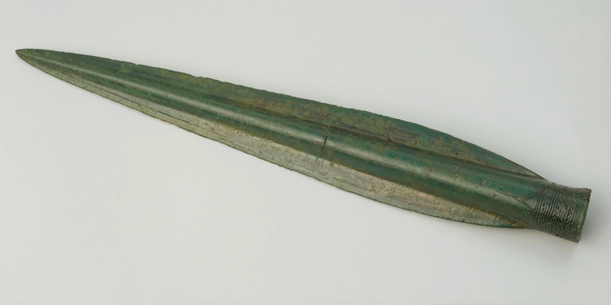

# Human-made Things in the Bible

## License Information

Human-made Things in the Bible © United Bible Societies, 2025. Adapted from: <cite>The Works of Their Hands: Man-made Things in the Bible</cite>, by Ray Pritz © 2009 United Bible Societies. This work is licensed under Creative Commons Attribution-ShareAlike 4.0 International (<a href="https://creativecommons.org/licenses/by-sa/4.0/">https://creativecommons.org/licenses/by-sa/4.0/</a>).

--------------------------------

## 标题：投枪、标枪、短枪（javelin） (id: REALIA:2.6)

2\.6 标题：投枪、标枪、短枪（javelin）
=========================

经文出处
----

Hebrew 来：כִּידוֹן (音译：kidon)

[JOS 8:18](https://ref.ly/Josh8:18), [JOS 8:18](https://ref.ly/Josh8:18), [JOS 8:26](https://ref.ly/Josh8:26), [1SA 17:6](https://ref.ly/1Sam17:6), [1SA 17:45](https://ref.ly/1Sam17:45), [JOB 39:23](https://ref.ly/Job39:23), [JOB 41:21](https://ref.ly/Job41:21), [JER 6:23](https://ref.ly/Jer6:23), [JER 50:42](https://ref.ly/Jer50:42)

Hebrew 来：שִׁרְיָה (音译：shiryah)

[JOB 41:18](https://ref.ly/Job41:18)

Greek 希：ὕσσος (音译：hussos)

[JHN 19:29](https://ref.ly/John19:29)

描述和用途
-----

*用于狩猎和战斗的标枪或长矛 (© Unknown \- Wikimedia Commons)*

投枪是一种短矛或大箭（参[2\.14\.2 箭 (arrow)\<REALIA:2\.14\.2\>](#) ），比枪轻一些，适合投掷。持枪的人可以站立着，或骑在马上，或在战车上，向敌人投掷。投枪的杆用木头或芦苇制成。和长枪一样，投枪也带有一个金属尖头，固定方式也和固定枪头相同（参[2\.5\.1 枪头 (spearhead)\<REALIA:2\.5\.1\>](#) ）。投枪枪杆的中间位置通常缠着一根绳子，并套在抛掷者的手指上。投枪掷出后，绳子松开使投枪旋转，从而飞行更加稳定、准确，而且飞得更远。

---

翻译
--

“投枪”可以翻译为“投掷的枪”或“轻巧的枪”。

罗兰‧沃克斯（Roland de Vaux）提出，希伯来文*kidon* 是指一种长剑或弯刀。GECL (German Common Language Version (Gute Nachricht Bibel)) 、CEV (Contemporary English Version) 和NJB (New Jerusalem Bible (1985)) 在上列一些经文中采纳了这种解释。REB (Revised English Bible (1989)) 在[JOB 41:21](https://ref.ly/Job41:21) （《和》41:29）中译作“sabre”（“弯刀”），但REB (Revised English Bible (1989)) 在[JOS 8:26](https://ref.ly/Josh8:26) 把这种武器翻译成小很多的“dagger”（“匕首”）。不过，大部分译本都译作“投枪”、“枪”或“长矛”。

在[JOB 41:18](https://ref.ly/Job41:18) （《和》41:26）中，希伯来文*shiryah* 是指一种武器，但具体所指不详。许多译本将这个词译为“投枪、标枪”（“javelin”；RSV (Revised Standard Version (1952)) 、NIV (New International Version (1984)) 、《和》、《和修》），GNT (Good News Translation (1992)) 作“lance”（“长矛”），NLT (New Living Translation) 译成“pointed shaft”（“尖头杆”）。

在[JHN 19:29](https://ref.ly/John19:29) ，希腊文*hussos* 是一个异文，有些学者接受这个异文，而不接受证据更加有力的*hussōpos* （“牛膝草”），但大部分学者拒绝这个异文。

* **Associated Passages:** 约书亚记 8:18; 约书亚记 8:26; 撒母耳记上 17:6; 撒母耳记上 17:45; 约伯记 39:23; 约伯记 41:21; 耶利米书 6:23; 耶利米书 50:42; 约伯记 41:18; 约翰福音 19:29

