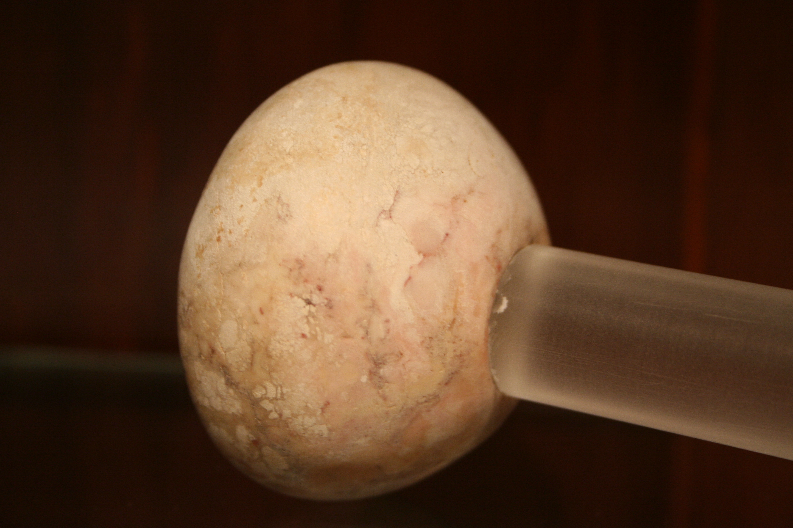

# Human-made Things in the Bible

## License Information

Human-made Things in the Bible © United Bible Societies, 2025. Adapted from: <cite>The Works of Their Hands: Man-made Things in the Bible</cite>, by Ray Pritz © 2009 United Bible Societies. This work is licensed under Creative Commons Attribution-ShareAlike 4.0 International (<a href="https://creativecommons.org/licenses/by-sa/4.0/">https://creativecommons.org/licenses/by-sa/4.0/</a>).

--------------------------------

## 标题：棍、战棒、钉头锤、重击武器（club, war club, mace, shattering weapon） (id: REALIA:2.7)

2\.7 标题：棍、战棒、钉头锤、重击武器（club, war club, mace, shattering weapon）
==============================================================

经文出处
----

Hebrew 来：כְּלִי, מַפָּץ (音译：kli mapats)

[EZK 9:2](https://ref.ly/Ezek9:2)

Hebrew 来：מַפֵּץ (音译：mapets)

[JER 51:20](https://ref.ly/Jer51:20)

Hebrew 来：מַקֵּל, יָד (音译：maqel yad)

[EZK 39:9](https://ref.ly/Ezek39:9)

Hebrew 来：תּוֹתָח (音译：tothach)

[JOB 41:21](https://ref.ly/Job41:21)

Greek 希：ξύλον (音译：xulos)

[MAT 26:47](https://ref.ly/Matt26:47), [MAT 26:55](https://ref.ly/Matt26:55), [MRK 14:43](https://ref.ly/Mark14:43), [MRK 14:48](https://ref.ly/Mark14:48), [LUK 22:52](https://ref.ly/Luke22:52)

Greek 希：ράβδος (音译：rhabdos)

[BEL 1:25](https://ref.ly/Bel1:25)

描述
--

*埃及钉头锤的头，莱比锡大学古埃及博物馆（Ägyptisches Museum der Universität Leipzig） (© Einsamer Schütze, via Wikimedia Commons)*

战棒是一根比较短的木棍，在肉搏时用来击打敌人。战棒可以单手握持，击打敌人身体的各个部位，尤其是那些没有盔甲保护的部位。钉头锤通常会装上一个沉重的头，用石头或金属制成。这个头楔入棒的一端，用绳索绑牢或用棍棒的锥形来固定。握持部分也可能会逐渐变粗，从而使握持更牢靠。握柄有时会做成弧形。

---

翻译
--

希伯来文*tothach* 只在[JOB 41:21](https://ref.ly/Job41:21) （《和》41:29）出现过一次，大部分学者同意这个词指“棍棒”。有学者提出，这个词也可能指箭的杆，不过我们查阅的译本都没有采用这种解释。

在[EZK 9:2](https://ref.ly/Ezek9:2) ，重点是武器的可怕威力。有些译本专注于表达这个意思，而不是试图在目标语言中寻找一件准确对应的武器。因此，CEV (Contemporary English Version) 译作“deadly weapon”（“致命的武器”），NCV (New Century Version) 作“powerful weapon”（“威力强大的武器”），FRCL (French Common Language Version (Bible en français courant)) 则译成“毁灭性的武器”。

[EZK 39:9](https://ref.ly/Ezek39:9) ：很多译本把这里的希伯来文短语*maqel yad* （直译：手棍、手杖）译作“棍棒”（“clubs”；GNT (Good News Translation (1992)) ）或“战棒”（“war clubs”；NCV (New Century Version) ）；但也有其他译法，例如译作“枪”（GECL (German Common Language Version (Gute Nachricht Bibel)) ）或“投枪”（SPCL (Spanish Common Language Version (Dios Habla Hoy)) ）。巴埃斯卡马戈（G. Baez\-Camargo）提出，这是一种回力飞镖（比较REB (Revised English Bible (1989)) 的“throwing\-sticks”“抛掷棒”，这个译词可以有几种含意）。由于经文旨在表达将来会有大量木制武器被废弃，并当作木柴来烧火，因此可以把这节经文列出的几种兵器合并表达，归在一个比较大的兵器类别之下；例如：ITCL (Italian Common Language Version) 把*maqel yad* 和“枪”合并为“矛枪”，CEV (Contemporary English Version) 把两种盾一并称为“shields”（“盾牌”）。

在[MAT 26:47](https://ref.ly/Matt26:47); [MAT 26:55](https://ref.ly/Matt26:55) 、[MRK 14:43](https://ref.ly/Mark14:43); [MRK 14:48](https://ref.ly/Mark14:48) 和[LUK 22:52](https://ref.ly/Luke22:52) 中，希腊文*xulos* 直译作“木头”，在这里关于一群暴民行使私刑的语境中，这个词可以简单地理解为“棍子”。不过，我们查阅的所有译本都把它译作“棒”或同义词语。

* **Associated Passages:** 以西结书 9:2; 耶利米书 51:20; 以西结书 39:9; 约伯记 41:21; 马太福音 26:47; 马太福音 26:55; 马可福音 14:43; 马可福音 14:48; 路加福音 22:52; 彼勒与大龙 1:25

