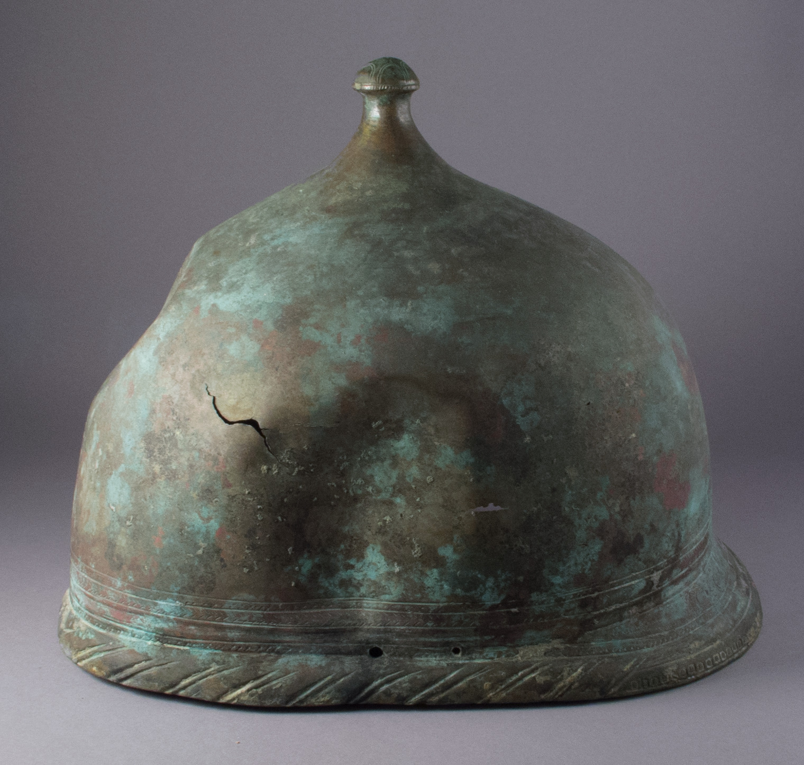

# Human-made Things in the Bible

## License Information

Human-made Things in the Bible © United Bible Societies, 2025. Adapted from: <cite>The Works of Their Hands: Man-made Things in the Bible</cite>, by Ray Pritz © 2009 United Bible Societies. This work is licensed under Creative Commons Attribution-ShareAlike 4.0 International (<a href="https://creativecommons.org/licenses/by-sa/4.0/">https://creativecommons.org/licenses/by-sa/4.0/</a>).

--------------------------------

## 标题：头盔（helmet） (id: REALIA:2.9)

2\.9 标题：头盔（helmet）
==================

经文出处
----

Hebrew 来：כּוֹבַע (音译：kova‘)

[1SA 17:5](https://ref.ly/1Sam17:5), [2CH 26:14](https://ref.ly/2Chr26:14), [ISA 59:17](https://ref.ly/Isa59:17), [JER 46:4](https://ref.ly/Jer46:4), [EZK 27:10](https://ref.ly/Ezek27:10), [EZK 38:5](https://ref.ly/Ezek38:5)

Hebrew 来：מָעוֹז, רֹאשׁ (音译：ma‘oz ro’sh)

[PSA 60:9](https://ref.ly/Ps60:9), [PSA 108:9](https://ref.ly/Ps108:9)

Hebrew 来：קוֹבַע (音译：qova‘)

[1SA 17:38](https://ref.ly/1Sam17:38), [EZK 23:24](https://ref.ly/Ezek23:24)

Greek 希：περικεφαλαία (音译：perikefalaia)

[EPH 6:17](https://ref.ly/Eph6:17), [1TH 5:8](https://ref.ly/1Thess5:8), [1MA 6:35](https://ref.ly/1Macc6:35)

Greek 希：κόρυς (音译：korus)

[WIS 5:18](https://ref.ly/Wis5:18)

描述
--

*头盔 (© Public Domain \- Wikimedia Commons)*

头盔是保护头部的护甲。有些头盔设计有垂边，延伸至耳朵甚至颈部。以色列人和他们的邻邦所使用的头盔通常用皮革制成。金属头盔非常罕有，一般是从东面和北面的一些国家进口。参[2\.3\.1 鞘 (sheath, scabbard)\<REALIA:2\.3\.1\>](#) 中的插图。

---

翻译
--

*士兵戴的头盔 (© Jona Lendering \- Wikimedia Commons)*

如果目标语言没有表示“头盔”的词语，翻译者可以采用描述性的同义词，例如“保护头部的装备”或“战斗时戴的头套”。在[ISA 59:17](https://ref.ly/Isa59:17) 和[EPH 6:17](https://ref.ly/Eph6:17) 中，“救恩的头盔”这个比喻可以译为“救恩好像头部的护具”。

* **Associated Passages:** 撒母耳记上 17:5; 历代志下 26:14; 以赛亚书 59:17; 耶利米书 46:4; 以西结书 27:10; 以西结书 38:5; 诗篇 60:9; 诗篇 108:9; 撒母耳记上 17:38; 以西结书 23:24; 以弗所书 6:17; 帖撒罗尼迦前书 5:8; 玛加伯上 6:35; 智慧篇 5:18

