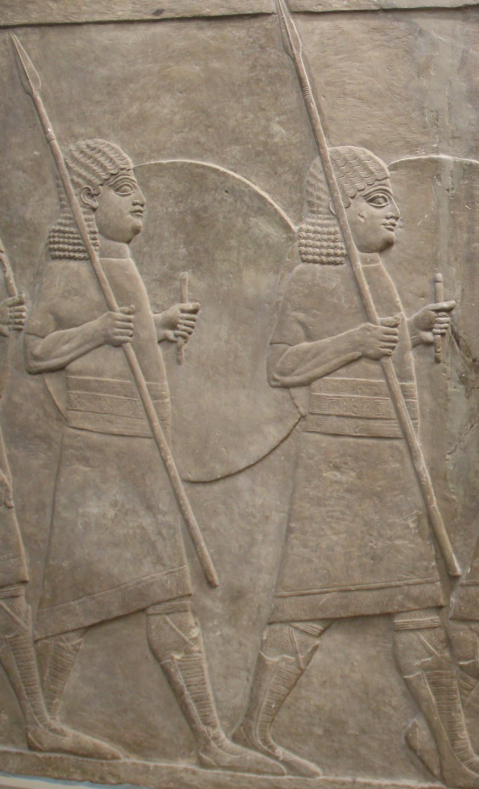

# Human-made Things in the Bible

## License Information

Human-made Things in the Bible © United Bible Societies, 2025. Adapted from: <cite>The Works of Their Hands: Man-made Things in the Bible</cite>, by Ray Pritz © 2009 United Bible Societies. This work is licensed under Creative Commons Attribution-ShareAlike 4.0 International (<a href="https://creativecommons.org/licenses/by-sa/4.0/">https://creativecommons.org/licenses/by-sa/4.0/</a>).

--------------------------------

## 标题：小盾、小圆盾（small shield, buckler） (id: REALIA:2.10.2)

2\.10\.2 标题：小盾、小圆盾（small shield, buckler）
=========================================

经文出处
----

Hebrew 来：מָגֵן (音译：magen)

[GEN 15:1](https://ref.ly/Gen15:1), [DEU 33:29](https://ref.ly/Deut33:29), [JDG 5:8](https://ref.ly/Judg5:8), [2SA 1:21](https://ref.ly/2Sam1:21), [2SA 1:21](https://ref.ly/2Sam1:21), [2SA 22:3](https://ref.ly/2Sam22:3), [2SA 22:31](https://ref.ly/2Sam22:31), [2SA 22:36](https://ref.ly/2Sam22:36), [1KI 10:17](https://ref.ly/1Kgs10:17), [1KI 10:17](https://ref.ly/1Kgs10:17), [1KI 14:26](https://ref.ly/1Kgs14:26), [1KI 14:27](https://ref.ly/1Kgs14:27), [2KI 19:32](https://ref.ly/2Kgs19:32), [1CH 5:18](https://ref.ly/1Chr5:18), [2CH 9:16](https://ref.ly/2Chr9:16), [2CH 9:16](https://ref.ly/2Chr9:16), [2CH 12:9](https://ref.ly/2Chr12:9), [2CH 12:10](https://ref.ly/2Chr12:10), [2CH 14:7](https://ref.ly/2Chr14:7), [2CH 17:17](https://ref.ly/2Chr17:17), [2CH 23:9](https://ref.ly/2Chr23:9), [2CH 26:14](https://ref.ly/2Chr26:14), [2CH 32:5](https://ref.ly/2Chr32:5), [2CH 32:27](https://ref.ly/2Chr32:27), [NEH 4:10](https://ref.ly/Neh4:10), [JOB 15:26](https://ref.ly/Job15:26), [JOB 41:7](https://ref.ly/Job41:7), [PSA 3:4](https://ref.ly/Ps3:4), [PSA 7:11](https://ref.ly/Ps7:11), [PSA 18:3](https://ref.ly/Ps18:3), [PSA 18:31](https://ref.ly/Ps18:31), [PSA 18:36](https://ref.ly/Ps18:36), [PSA 28:7](https://ref.ly/Ps28:7), [PSA 33:20](https://ref.ly/Ps33:20), [PSA 35:2](https://ref.ly/Ps35:2), [PSA 47:10](https://ref.ly/Ps47:10), [PSA 59:12](https://ref.ly/Ps59:12), [PSA 76:4](https://ref.ly/Ps76:4), [PSA 84:10](https://ref.ly/Ps84:10), [PSA 84:12](https://ref.ly/Ps84:12), [PSA 89:19](https://ref.ly/Ps89:19), [PSA 115:9](https://ref.ly/Ps115:9), [PSA 115:10](https://ref.ly/Ps115:10), [PSA 115:11](https://ref.ly/Ps115:11), [PSA 119:114](https://ref.ly/Ps119:114), [PSA 144:2](https://ref.ly/Ps144:2), [PRO 2:7](https://ref.ly/Prov2:7), [PRO 6:11](https://ref.ly/Prov6:11), [PRO 24:34](https://ref.ly/Prov24:34), [PRO 30:5](https://ref.ly/Prov30:5), [SNG 4:4](https://ref.ly/Song4:4), [ISA 21:5](https://ref.ly/Isa21:5), [ISA 22:6](https://ref.ly/Isa22:6), [ISA 37:33](https://ref.ly/Isa37:33), [JER 46:3](https://ref.ly/Jer46:3), [JER 46:9](https://ref.ly/Jer46:9), [EZK 23:24](https://ref.ly/Ezek23:24), [EZK 27:10](https://ref.ly/Ezek27:10), [EZK 38:4](https://ref.ly/Ezek38:4), [EZK 38:5](https://ref.ly/Ezek38:5), [EZK 39:9](https://ref.ly/Ezek39:9), [NAM 2:4](https://ref.ly/Nah2:4)

Hebrew 来：עֲגָלָה (音译：‘agalah)

[PSA 46:10](https://ref.ly/Ps46:10)

Hebrew 来：שֶׁלֶט (音译：shelet)

[2SA 8:7](https://ref.ly/2Sam8:7), [2KI 11:10](https://ref.ly/2Kgs11:10), [1CH 18:7](https://ref.ly/1Chr18:7), [2CH 23:9](https://ref.ly/2Chr23:9), [SNG 4:4](https://ref.ly/Song4:4), [JER 51:11](https://ref.ly/Jer51:11), [EZK 27:11](https://ref.ly/Ezek27:11)

Hebrew 来：שֶׁמֶשׁ (音译：shemesh)

[PSA 84:12](https://ref.ly/Ps84:12), [ISA 54:12](https://ref.ly/Isa54:12)

描述
--

*手持圆盾的士兵（新亚述猎狮浅浮雕，亚述展廊（Assyrian Gallery），大英博物馆）。 (Gary Todd, British Museum, CC0, Flickr)*

和大盾一样，这种盾可以是木制（有时包上皮革）或金属制成的。小盾的形状不一，但一般是圆形的。木盾经常会用金属钉加固或包上金属片。

---

用途
--

参[2\.10\.1 大盾 (large shield)\<REALIA:2\.10\.1\>](#) 。

---

翻译
--

参[2\.10\.1 大盾 (large shield)\<REALIA:2\.10\.1\>](#) 。[2SA 1:21](https://ref.ly/2Sam1:21) 和[ISA 21:5](https://ref.ly/Isa21:5) 提到为盾牌抹油。用皮革包裹的盾需要定期抹油，以防皮革龟裂。抹油也能防止金属盾生锈。如果读者不太理解为何给盾牌抹油，那么[ISA 21:5](https://ref.ly/Isa21:5) 的最后一部分可以译成“准备好盾牌！”（GNT (Good News Translation (1992)) 直译；NCV (New Century Version) 类似），或者“握紧盾牌”（CEV (Contemporary English Version) 直译），甚或“拿起武器！”（GECL (German Common Language Version (Gute Nachricht Bibel)) 直译）。

在很多经文中，特别是在《诗篇》，上帝被比喻为“盾牌”。如果这种比喻可能会被误解，那么翻译者可以采用一个陈述句，把上帝称为保护者或护卫者；例如，在[GEN 15:1](https://ref.ly/Gen15:1) ，原文字面意为“我是你的盾牌”的这个分句可以译为“我必护卫你”（如NCV (New Century Version) ）。在这些情况下，翻译者也可以扩展译文；例如，对于[2SA 22:3](https://ref.ly/2Sam22:3) 字面意为“我的盾牌”的希伯来文词语，RSV (Revised Standard Version (1952)) 采用了直译，然而也可译为“他像盾牌那样保护我”（如GNT (Good News Translation (1992)) ）。这个比喻也出现在以下经文中：[GEN 15:1](https://ref.ly/Gen15:1); [DEU 33:29](https://ref.ly/Deut33:29); [2SA 22:3](https://ref.ly/2Sam22:3); [2SA 22:31](https://ref.ly/2Sam22:31); [2SA 22:36](https://ref.ly/2Sam22:36); [PSA 3:4](https://ref.ly/Ps3:4); [PSA 7:11](https://ref.ly/Ps7:11); [PSA 18:3](https://ref.ly/Ps18:3); [PSA 18:31](https://ref.ly/Ps18:31); [PSA 18:36](https://ref.ly/Ps18:36); [PSA 28:7](https://ref.ly/Ps28:7); [PSA 33:20](https://ref.ly/Ps33:20); [PSA 59:12](https://ref.ly/Ps59:12); [PSA 84:10](https://ref.ly/Ps84:10); [PSA 84:12](https://ref.ly/Ps84:12); [PSA 89:19](https://ref.ly/Ps89:19); [PSA 115:9](https://ref.ly/Ps115:9); [PSA 115:10](https://ref.ly/Ps115:10); [PSA 115:11](https://ref.ly/Ps115:11); [PSA 119:114](https://ref.ly/Ps119:114); [PSA 144:2](https://ref.ly/Ps144:2); [PRO 2:7](https://ref.ly/Prov2:7); [PRO 30:5](https://ref.ly/Prov30:5) 。

[PSA 46:10](https://ref.ly/Ps46:10) （《和》46:9）：有些译本把希伯来文*‘agaloth* 译作“战车”，但大部分学者认为这个词并不是指“战车”，而更可能是指“盾牌”。*‘Agaloth* 一词和意为“圆形”的希伯来文词语有关，因此可能是指比较小的圆形盾牌。古代的盾一般是用木头和皮革制成，经常要涂抹橄榄油，因此很容易燃烧。如果某个文化只知道用金属制成的盾，建议翻译者加上注解来说明盾牌为什么能够燃烧。

希伯来文*shemesh* 一般指“太阳”，另外也有圆形盾牌的意思，作为城墙顶部防御的一部分（参[2\.19\.3 射击台、攻城塔 (firing platform, siege tower)\<REALIA:2\.19\.3\>](#) 中的插图）。因此，[PSA 84:12](https://ref.ly/Ps84:12) （《和》84:11）中的短语“太阳和盾牌”是论到两种盾牌。大多数现代译本错误地保留了“太阳”，但参照NJB (New Jerusalem Bible (1985)) ，该译本译作“rampart and shield”（“壁垒和盾牌”）。NJPSV (New Jewish Publication Society Version) 在旁注中加上“bulwark”（“堡垒”）。GNT (Good News Translation (1992)) 译作“Protector and glorious king”（“保护者和荣耀的王”），用“荣耀的王”来保留“太阳”的含意，但把两个希伯来文词语的先后次序颠倒了。

* **Associated Passages:** 创世记 15:1; 申命记 33:29; 士师记 5:8; 撒母耳记下 1:21; 撒母耳记下 22:3; 撒母耳记下 22:31; 撒母耳记下 22:36; 列王纪上 10:17; 列王纪上 14:26; 列王纪上 14:27; 列王纪下 19:32; 历代志上 5:18; 历代志下 9:16; 历代志下 12:9; 历代志下 12:10; 历代志下 14:7; 历代志下 17:17; 历代志下 23:9; 历代志下 26:14; 历代志下 32:5; 历代志下 32:27; 尼希米记 4:10; 约伯记 15:26; 约伯记 41:7; 诗篇 3:4; 诗篇 7:11; 诗篇 18:3; 诗篇 18:31; 诗篇 18:36; 诗篇 28:7; 诗篇 33:20; 诗篇 35:2; 诗篇 47:10; 诗篇 59:12; 诗篇 76:4; 诗篇 84:10; 诗篇 84:12; 诗篇 89:19; 诗篇 115:9; 诗篇 115:10; 诗篇 115:11; 诗篇 119:114; 诗篇 144:2; 箴言 2:7; 箴言 6:11; 箴言 24:34; 箴言 30:5; 雅歌 4:4; 以赛亚书 21:5; 以赛亚书 22:6; 以赛亚书 37:33; 耶利米书 46:3; 耶利米书 46:9; 以西结书 23:24; 以西结书 27:10; 以西结书 38:4; 以西结书 38:5; 以西结书 39:9; 那鸿书 2:4; 诗篇 46:10; 撒母耳记下 8:7; 列王纪下 11:10; 历代志上 18:7; 耶利米书 51:11; 以西结书 27:11; 以赛亚书 54:12

* **Associated ACAI Concepts:** Small Shield (ID: `realia:SmallShield`)
