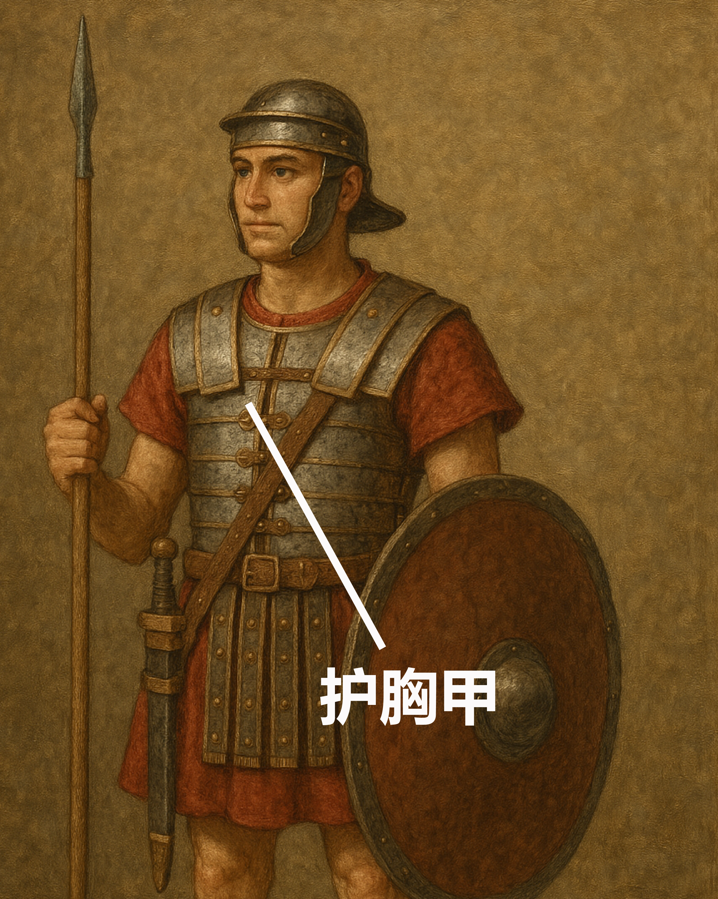

# Human-made Things in the Bible

## License Information

Human-made Things in the Bible © United Bible Societies, 2025. Adapted from: <cite>The Works of Their Hands: Man-made Things in the Bible</cite>, by Ray Pritz © 2009 United Bible Societies. This work is licensed under Creative Commons Attribution-ShareAlike 4.0 International (<a href="https://creativecommons.org/licenses/by-sa/4.0/">https://creativecommons.org/licenses/by-sa/4.0/</a>).

--------------------------------

## 标题：护胸甲（breastplate, chest protector） (id: REALIA:2.12)

2\.12 标题：护胸甲（breastplate, chest protector）
==========================================

经文出处
----

Hebrew 来：שִׁרְיוֹן (音译：shiryan)

[1KI 22:34](https://ref.ly/1Kgs22:34), [2CH 18:33](https://ref.ly/2Chr18:33), [ISA 59:17](https://ref.ly/Isa59:17)

Greek 希：θώραξ (音译：thorax)

[EPH 6:14](https://ref.ly/Eph6:14), [1TH 5:8](https://ref.ly/1Thess5:8), [REV 9:9](https://ref.ly/Rev9:9), [REV 9:9](https://ref.ly/Rev9:9), [REV 9:17](https://ref.ly/Rev9:17), [WIS 5:18](https://ref.ly/Wis5:18), [SIR 43:20](https://ref.ly/Sir43:20), [1MA 3:3](https://ref.ly/1Macc3:3), [1MA 6:2](https://ref.ly/1Macc6:2), [1MA 6:43](https://ref.ly/1Macc6:43)

描述和用途
-----

*护胸甲 (Image generated by ChatGPT using OpenAI technology)*

护胸甲是一件遮护胸部的盔甲（有时也遮护背部），保护胸（背）部不受近战兵器和弓箭所伤。护胸甲一般是用金属或用金属加固的厚皮革制成，遮盖颈部和腰部之间的胸部，用系带绕过背部来固定。

---

翻译
--

在[EPH 6:14](https://ref.ly/Eph6:14) 和[1TH 5:8](https://ref.ly/1Thess5:8) 中，护胸甲是一个比喻，为要指出一些基督徒美德具有保护的能力（比较[WIS 5:18](https://ref.ly/Wis5:18) ）。因此，这种比喻可以译作：“我们必须用信和爱保护自己，就像穿上盔甲一样”（SPCL (Spanish Common Language Version (Dios Habla Hoy)) 直译；[1TH 5:8](https://ref.ly/1Thess5:8) b），或“生活正直如你胸膛上的保护”（NCV (New Century Version) 直译；[EPH 6:14](https://ref.ly/Eph6:14) c）。

在[REV 9:9](https://ref.ly/Rev9:9) ，护胸甲是给马戴的。有时，人们会给战马戴上护胸甲来保护它们免受敌人刀枪的伤害。这节经文的前半节可译为：“它们有鳞像铁制的胸甲”（RSV (Revised Standard Version (1952)) 英文直译），或“它们穿着甲胄，好像铁制的胸甲”（NJB (New Jerusalem Bible (1985)) ），或“它们的身体被一种铁甲覆盖”（SPCL (Spanish Common Language Version (Dios Habla Hoy)) ），或“它们的身体覆盖着东西，像是保护人胸部的金属片”。

* **Associated Passages:** 列王纪上 22:34; 历代志下 18:33; 以赛亚书 59:17; 以弗所书 6:14; 帖撒罗尼迦前书 5:8; 启示录 9:9; 启示录 9:17; 智慧篇 5:18; 德训篇 43:20; 玛加伯上 3:3; 玛加伯上 6:2; 玛加伯上 6:43

