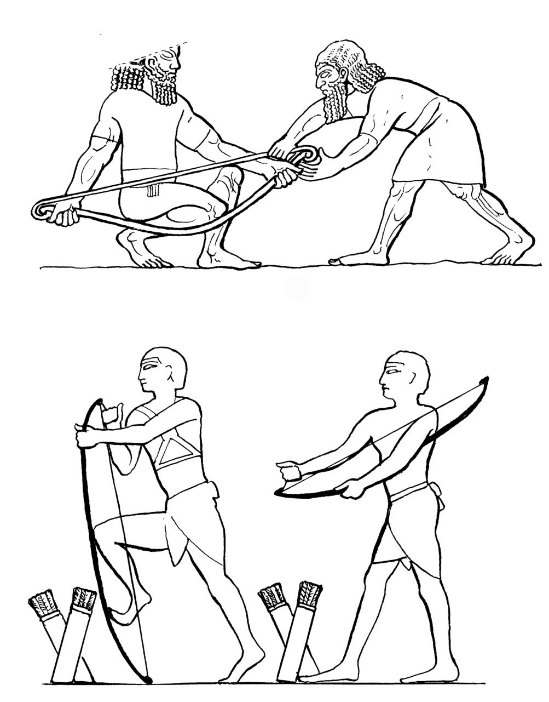

# Human-made Things in the Bible

## License Information

Human-made Things in the Bible © United Bible Societies, 2025. Adapted from: <cite>The Works of Their Hands: Man-made Things in the Bible</cite>, by Ray Pritz © 2009 United Bible Societies. This work is licensed under Creative Commons Attribution-ShareAlike 4.0 International (<a href="https://creativecommons.org/licenses/by-sa/4.0/">https://creativecommons.org/licenses/by-sa/4.0/</a>).

--------------------------------

## 标题：射箭术（archery） (id: REALIA:2.14)

2\.14 标题：射箭术（archery）
=====================

## 标题：弓（bow） (id: REALIA:2.14.1)

2\.14\.1 标题：弓（bow）
==================

经文出处
----

Hebrew 来：קֶשֶׁת, קַשָּׁת (音译：qesheth, qashath)

[GEN 9:13](https://ref.ly/Gen9:13), [GEN 9:14](https://ref.ly/Gen9:14), [GEN 9:16](https://ref.ly/Gen9:16), [GEN 21:16](https://ref.ly/Gen21:16), [GEN 21:20](https://ref.ly/Gen21:20), [GEN 27:3](https://ref.ly/Gen27:3), [GEN 48:22](https://ref.ly/Gen48:22), [GEN 49:24](https://ref.ly/Gen49:24), [JOS 24:12](https://ref.ly/Josh24:12), [1SA 2:4](https://ref.ly/1Sam2:4), [1SA 18:4](https://ref.ly/1Sam18:4), [1SA 31:3](https://ref.ly/1Sam31:3), [2SA 1:18](https://ref.ly/2Sam1:18), [2SA 1:22](https://ref.ly/2Sam1:22), [2SA 22:35](https://ref.ly/2Sam22:35), [1KI 22:34](https://ref.ly/1Kgs22:34), [2KI 6:22](https://ref.ly/2Kgs6:22), [2KI 9:24](https://ref.ly/2Kgs9:24), [2KI 13:15](https://ref.ly/2Kgs13:15), [2KI 13:15](https://ref.ly/2Kgs13:15), [2KI 13:16](https://ref.ly/2Kgs13:16), [1CH 5:18](https://ref.ly/1Chr5:18), [1CH 8:40](https://ref.ly/1Chr8:40), [1CH 10:3](https://ref.ly/1Chr10:3), [1CH 12:2](https://ref.ly/1Chr12:2), [1CH 12:2](https://ref.ly/1Chr12:2), [2CH 14:7](https://ref.ly/2Chr14:7), [2CH 17:17](https://ref.ly/2Chr17:17), [2CH 18:33](https://ref.ly/2Chr18:33), [2CH 26:14](https://ref.ly/2Chr26:14), [NEH 4:7](https://ref.ly/Neh4:7), [NEH 4:10](https://ref.ly/Neh4:10), [JOB 20:24](https://ref.ly/Job20:24), [JOB 29:20](https://ref.ly/Job29:20), [JOB 41:20](https://ref.ly/Job41:20), [PSA 7:13](https://ref.ly/Ps7:13), [PSA 11:2](https://ref.ly/Ps11:2), [PSA 18:35](https://ref.ly/Ps18:35), [PSA 37:14](https://ref.ly/Ps37:14), [PSA 37:15](https://ref.ly/Ps37:15), [PSA 44:7](https://ref.ly/Ps44:7), [PSA 46:10](https://ref.ly/Ps46:10), [PSA 76:4](https://ref.ly/Ps76:4), [PSA 78:9](https://ref.ly/Ps78:9), [PSA 78:57](https://ref.ly/Ps78:57), [ISA 5:28](https://ref.ly/Isa5:28), [ISA 7:24](https://ref.ly/Isa7:24), [ISA 13:18](https://ref.ly/Isa13:18), [ISA 21:15](https://ref.ly/Isa21:15), [ISA 21:17](https://ref.ly/Isa21:17), [ISA 22:3](https://ref.ly/Isa22:3), [ISA 41:2](https://ref.ly/Isa41:2), [ISA 66:19](https://ref.ly/Isa66:19), [JER 4:29](https://ref.ly/Jer4:29), [JER 6:23](https://ref.ly/Jer6:23), [JER 9:2](https://ref.ly/Jer9:2), [JER 46:9](https://ref.ly/Jer46:9), [JER 49:35](https://ref.ly/Jer49:35), [JER 50:14](https://ref.ly/Jer50:14), [JER 50:29](https://ref.ly/Jer50:29), [JER 50:42](https://ref.ly/Jer50:42), [JER 51:3](https://ref.ly/Jer51:3), [JER 51:56](https://ref.ly/Jer51:56), [LAM 2:4](https://ref.ly/Lam2:4), [LAM 3:12](https://ref.ly/Lam3:12), [EZK 1:28](https://ref.ly/Ezek1:28), [EZK 39:3](https://ref.ly/Ezek39:3), [EZK 39:9](https://ref.ly/Ezek39:9), [HOS 1:5](https://ref.ly/Hos1:5), [HOS 1:7](https://ref.ly/Hos1:7), [HOS 2:20](https://ref.ly/Hos2:20), [HOS 7:16](https://ref.ly/Hos7:16), [AMO 2:15](https://ref.ly/Amos2:15), [HAB 3:9](https://ref.ly/Hab3:9), [ZEC 9:10](https://ref.ly/Zech9:10), [ZEC 9:13](https://ref.ly/Zech9:13), [ZEC 10:4](https://ref.ly/Zech10:4)

Greek 希：τόξον (音译：toxon)

[REV 6:2](https://ref.ly/Rev6:2), [JDT 9:7](https://ref.ly/Jdt9:7), [WIS 5:21](https://ref.ly/Wis5:21)

Latin 拉：arcus

[2ES 16:13](https://ref.ly/2Esd16:13)

经文出处
----

### **弓弦** ：

Hebrew 来：יֶתֶר (音译：yether)

[JDG 16:7](https://ref.ly/Judg16:7), [JDG 16:8](https://ref.ly/Judg16:8), [JDG 16:9](https://ref.ly/Judg16:9), [JOB 30:11](https://ref.ly/Job30:11), [PSA 11:2](https://ref.ly/Ps11:2)

Hebrew 来：מֵיתָר (音译：meythar)

[PSA 21:13](https://ref.ly/Ps21:13)

经文出处
----

### **弓箭手** ：

Hebrew 来：ירה (音译：yarah（动词）)

[1SA 31:3](https://ref.ly/1Sam31:3), [2SA 11:24](https://ref.ly/2Sam11:24), [2SA 11:24](https://ref.ly/2Sam11:24), [1CH 10:3](https://ref.ly/1Chr10:3), [2CH 35:23](https://ref.ly/2Chr35:23)

Hebrew 来：רַב (音译：rav)

[JOB 16:13](https://ref.ly/Job16:13), [PRO 26:10](https://ref.ly/Prov26:10), [JER 50:29](https://ref.ly/Jer50:29)

Greek 希：τοξότης (音译：toxotēs)

[JDT 2:15](https://ref.ly/Jdt2:15), [1MA 9:11](https://ref.ly/1Macc9:11)

Latin 拉：sagittarius

[2ES 16:7](https://ref.ly/2Esd16:7), [2ES 16:16](https://ref.ly/2Esd16:16)

描述
--

*勇士张弓射箭 (Image generated by ChatGPT using OpenAI technology)*

弓是一件弧形的武器，用木材或其他有弹性的材料制成，两端由一根弓弦连起来并将弓身拉弯。古时的弓有两种，比较简单且威力较小的一种是三角形的弓，木制弓身由两根直的构件组成。另一种威力和效率大得多的弓是复合弓，这种弓是用不同材料（通常是木材和动物的角）一层层交替黏合而成。古时的弓长度不一，从大约80厘米（30英寸）到超过1米（40英寸）都有。弓弦通常是用亚麻或大麻捻搓而成。

---

用途
--

*弓箭手用膝盖弯弓，第二个人上弦（上图），埃及士兵上弦（下图） (© Deutsche Bibelgesellschaft, Stuttgart by United Bible Societies)*

弓箭手用一只手握住木制弓身的中间部位，用另一只手把箭尾处的凹槽架在弓弦上，手指捏住弓弦和箭尾把箭向后拉。当拉住弓弦的手指突然放开，箭就会急速射向目标。在战斗中，射箭的目的是用锐利的箭头来杀伤敌人。使用这种武器，士兵不需要近距离接触敌人的身体就可以进行攻击。

---

翻译
--

在不知道弓箭的文化中，可能需要将弓译成“武器”或“用来发射飞镖（或投掷物）的武器”，而不用具体指明是什么武器；同时，翻译者要小心避免让读者以为这是一把使用火药来发射子弹的手枪。译文应该让读者明白，这种武器是在战斗中使用的，并且是由一个人操作的。

短语“弯弓”（或“开弓”、“拉弓”、“张弓”、“将弓上弦”）经常出现（[2SA 22:35](https://ref.ly/2Sam22:35); [PSA 7:13](https://ref.ly/Ps7:13); [PSA 11:2](https://ref.ly/Ps11:2); [PSA 18:35](https://ref.ly/Ps18:35); [PSA 37:14](https://ref.ly/Ps37:14); [ISA 5:28](https://ref.ly/Isa5:28); [ISA 21:15](https://ref.ly/Isa21:15); [JER 9:2](https://ref.ly/Jer9:2); [JER 46:9](https://ref.ly/Jer46:9); [JER 50:14](https://ref.ly/Jer50:14); [JER 50:29](https://ref.ly/Jer50:29); [JER 51:3](https://ref.ly/Jer51:3); [LAM 2:4](https://ref.ly/Lam2:4); [LAM 3:12](https://ref.ly/Lam3:12); [ZEC 9:13](https://ref.ly/Zech9:13) ），但意思往往不是指拉开弓准备射箭，而是指把没有装弦的弓压弯，好把弓弦滑到弓的两端装好。复合弓尤其硬挺，不容易装弦。“弯弓”的含意是把弓准备好以便作战。“弯弓”也可以译成“给弓装弦”或“预备好弓”。[JER 51:3](https://ref.ly/Jer51:3) a可译作“不要让巴比伦士兵准备好弓来射箭”（NCV (New Century Version) 直译）。

在有些经文中，“弓”象征战争。参[2\.3 刀剑 (sword)\<REALIA:2\.3\>](#) 关于[JOS 24:12](https://ref.ly/Josh24:12) 的讨论。

[2SA 22:35](https://ref.ly/2Sam22:35) ；[JOB 20:24](https://ref.ly/Job20:24) ；[PSA 18:35](https://ref.ly/Ps18:35) （《和》18:34）：将[JOB 20:24](https://ref.ly/Job20:24) a可译为“青铜箭要将他射透”（如RSV (Revised Standard Version (1952)) ）。“青铜箭”的希伯来文直译为“青铜弓”，可是弓并不是用青铜制成的，而且一把青铜弓也不能把箭射出去。诗人把箭所产生的效果赋予弓。RSV (Revised Standard Version (1952)) 改译作“bronze arrow”（“青铜箭”），但GNT (Good News Translation (1992)) 保留了“bronze bow”（“青铜弓”）。FRCL (French Common Language Version (Bible en français courant)) 将其翻译为“青铜尖端”，即“青铜箭头”。这行诗句可能需要调整为：“带青铜尖头的箭要射中他”，或“敌人将用带有青铜尖头的箭射中他”。如果目标读者不知道青铜，可以译为“铁”或“金属”。沃克斯（De Vaux）提出，“青铜弓”是指弓上有金属包层，以加固一些木制的弓。因此，“青铜弓”可以译为“最坚固的弓”（“strongest bow”；GNT (Good News Translation (1992)) ；[2SA 22:35](https://ref.ly/2Sam22:35) 、[PSA 18:35](https://ref.ly/Ps18:35) ［《和》18:34］）。

[JER 9:2](https://ref.ly/Jer9:2) （《和》9:3）：这节经文的第一行诗句可以翻译为，“他们弯起舌头像弓一样”（RSV (Revised Standard Version (1952)) 直译），对于很多语言来说，这句话的意思非常含糊。CEV (Contemporary English Version) 把弯曲的弓理解为实际上把箭射出去，因此将前半节经文进行了重组，英文直译为：“谎言从我百姓的口中出来，好像箭从弓上射出。”GNT (Good News Translation (1992)) 认为弯曲的弓意指准备好使用，并且没有使用比喻，英文直译为：“他们随口说谎。”

* **Associated Passages:** 创世记 9:13; 创世记 9:14; 创世记 9:16; 创世记 21:16; 创世记 21:20; 创世记 27:3; 创世记 48:22; 创世记 49:24; 约书亚记 24:12; 撒母耳记上 2:4; 撒母耳记上 18:4; 撒母耳记上 31:3; 撒母耳记下 1:18; 撒母耳记下 1:22; 撒母耳记下 22:35; 列王纪上 22:34; 列王纪下 6:22; 列王纪下 9:24; 列王纪下 13:15; 列王纪下 13:16; 历代志上 5:18; 历代志上 8:40; 历代志上 10:3; 历代志上 12:2; 历代志下 14:7; 历代志下 17:17; 历代志下 18:33; 历代志下 26:14; 尼希米记 4:7; 尼希米记 4:10; 约伯记 20:24; 约伯记 29:20; 约伯记 41:20; 诗篇 7:13; 诗篇 11:2; 诗篇 18:35; 诗篇 37:14; 诗篇 37:15; 诗篇 44:7; 诗篇 46:10; 诗篇 76:4; 诗篇 78:9; 诗篇 78:57; 以赛亚书 5:28; 以赛亚书 7:24; 以赛亚书 13:18; 以赛亚书 21:15; 以赛亚书 21:17; 以赛亚书 22:3; 以赛亚书 41:2; 以赛亚书 66:19; 耶利米书 4:29; 耶利米书 6:23; 耶利米书 9:2; 耶利米书 46:9; 耶利米书 49:35; 耶利米书 50:14; 耶利米书 50:29; 耶利米书 50:42; 耶利米书 51:3; 耶利米书 51:56; 耶利米哀歌 2:4; 耶利米哀歌 3:12; 以西结书 1:28; 以西结书 39:3; 以西结书 39:9; 何西阿书 1:5; 何西阿书 1:7; 何西阿书 2:20; 何西阿书 7:16; 阿摩司书 2:15; 哈巴谷书 3:9; 撒迦利亚书 9:10; 撒迦利亚书 9:13; 撒迦利亚书 10:4; 启示录 6:2; 友弟德传 9:7; 智慧篇 5:21; 厄斯德拉下 16:13; 士师记 16:7; 士师记 16:8; 士师记 16:9; 约伯记 30:11; 诗篇 21:13; 撒母耳记下 11:24; 历代志下 35:23; 约伯记 16:13; 箴言 26:10; 友弟德传 2:15; 玛加伯上 9:11; 厄斯德拉下 16:7; 厄斯德拉下 16:16

* **Associated ACAI Concepts:** Bow (ID: `realia:Bow`)

## 标题：箭（arrow） (id: REALIA:2.14.2)

2\.14\.2 标题：箭（arrow）
====================

经文出处
----

Hebrew 来：בֵּן, אַשְׁפָּה (音译：ben ’ashpah)

[LAM 3:13](https://ref.ly/Lam3:13)

Hebrew 来：בֵּן, קֶשֶׁת (音译：ben qesheth)

[JOB 41:20](https://ref.ly/Job41:20)

Hebrew 来：חֵץ, חֵץִי (音译：chets, chetsi)

[GEN 49:23](https://ref.ly/Gen49:23), [NUM 24:8](https://ref.ly/Num24:8), [DEU 32:23](https://ref.ly/Deut32:23), [DEU 32:42](https://ref.ly/Deut32:42), [1SA 17:7](https://ref.ly/1Sam17:7), [1SA 20:20](https://ref.ly/1Sam20:20), [1SA 20:21](https://ref.ly/1Sam20:21), [1SA 20:21](https://ref.ly/1Sam20:21), [1SA 20:22](https://ref.ly/1Sam20:22), [1SA 20:36](https://ref.ly/1Sam20:36), [1SA 20:38](https://ref.ly/1Sam20:38), [2SA 22:15](https://ref.ly/2Sam22:15), [2KI 13:15](https://ref.ly/2Kgs13:15), [2KI 13:15](https://ref.ly/2Kgs13:15), [2KI 13:17](https://ref.ly/2Kgs13:17), [2KI 13:17](https://ref.ly/2Kgs13:17), [2KI 13:18](https://ref.ly/2Kgs13:18), [2KI 19:32](https://ref.ly/2Kgs19:32), [1CH 12:2](https://ref.ly/1Chr12:2), [2CH 26:15](https://ref.ly/2Chr26:15), [JOB 6:4](https://ref.ly/Job6:4), [JOB 34:6](https://ref.ly/Job34:6), [PSA 7:14](https://ref.ly/Ps7:14), [PSA 11:2](https://ref.ly/Ps11:2), [PSA 18:15](https://ref.ly/Ps18:15), [PSA 38:3](https://ref.ly/Ps38:3), [PSA 45:6](https://ref.ly/Ps45:6), [PSA 57:5](https://ref.ly/Ps57:5), [PSA 58:8](https://ref.ly/Ps58:8), [PSA 58:8](https://ref.ly/Ps58:8), [PSA 64:4](https://ref.ly/Ps64:4), [PSA 64:8](https://ref.ly/Ps64:8), [PSA 77:18](https://ref.ly/Ps77:18), [PSA 91:5](https://ref.ly/Ps91:5), [PSA 120:4](https://ref.ly/Ps120:4), [PSA 127:4](https://ref.ly/Ps127:4), [PSA 144:6](https://ref.ly/Ps144:6), [PRO 7:23](https://ref.ly/Prov7:23), [PRO 25:18](https://ref.ly/Prov25:18), [PRO 26:18](https://ref.ly/Prov26:18), [ISA 5:28](https://ref.ly/Isa5:28), [ISA 7:24](https://ref.ly/Isa7:24), [ISA 37:33](https://ref.ly/Isa37:33), [ISA 49:2](https://ref.ly/Isa49:2), [JER 9:7](https://ref.ly/Jer9:7), [JER 50:9](https://ref.ly/Jer50:9), [JER 50:14](https://ref.ly/Jer50:14), [JER 51:11](https://ref.ly/Jer51:11), [LAM 3:12](https://ref.ly/Lam3:12), [EZK 5:16](https://ref.ly/Ezek5:16), [EZK 21:26](https://ref.ly/Ezek21:26), [EZK 39:3](https://ref.ly/Ezek39:3), [EZK 39:9](https://ref.ly/Ezek39:9), [HAB 3:11](https://ref.ly/Hab3:11), [ZEC 9:14](https://ref.ly/Zech9:14)

Hebrew 来：מַטֶּה (音译：mateh)

[HAB 3:9](https://ref.ly/Hab3:9)

Hebrew 来：רֶשֶׁף (音译：reshef)

[PSA 76:4](https://ref.ly/Ps76:4)

Greek 希：βέλος (音译：belos)

[EPH 6:16](https://ref.ly/Eph6:16), [WIS 5:12](https://ref.ly/Wis5:12), [SIR 19:12](https://ref.ly/Sir19:12), [SIR 26:12](https://ref.ly/Sir26:12), [1MA 6:51](https://ref.ly/1Macc6:51), [2MA 5:3](https://ref.ly/2Macc5:3), [2MA 12:27](https://ref.ly/2Macc12:27), [ODA 2:23](https://ref.ly/Odes2:23), [ODA 2:42](https://ref.ly/Odes2:42)

Greek 希：σχίζα (音译：schiza)

[1MA 10:80](https://ref.ly/1Macc10:80)

Greek 希：τόξευμα (音译：toxeuma)

[2MA 10:30](https://ref.ly/2Macc10:30)

Latin 拉：sagitta

[2ES 16:7](https://ref.ly/2Esd16:7), [2ES 16:13](https://ref.ly/2Esd16:13), [2ES 16:16](https://ref.ly/2Esd16:16)

描述
--

*箭 (© Deutsche Bibelgesellschaft, Stuttgart by United Bible Societies)*

箭是一支纤细的直杆，用芦苇或木材制成，长约50—70厘米（20—28英寸）。箭的一端固定有一个石头或金属做的尖头，另一端则切出一个凹槽，好嵌入弓弦。箭的凹槽端有时会绑上两根或更多根羽毛，使射出的箭在飞行时更加稳定。

---

用途
--

参[2\.14\.1 弓 (bow)\<REALIA:2\.14\.1\>](#) 。

---

翻译
--

希伯来文*reshef* 通常指一些燃烧着的或者像火一样的东西（如火花、闪电等；参[JOB 5:7](https://ref.ly/Job5:7) ；[PSA 78:48](https://ref.ly/Ps78:48) ；[SNG 8:6](https://ref.ly/Song8:6) ）。在[PSA 76:4](https://ref.ly/Ps76:4) （《和》76:3），这个词与“弓”平行，很可能指某种燃烧着的箭。

[LAM 3:13](https://ref.ly/Lam3:13) ：参[2\.14\.3 箭袋、箭囊 (quiver)\<REALIA:2\.14\.3\>](#) 中的注解。

希伯来文*mateh* 通常指杆、棍棒或牧羊人的杖（参[1\.2\.4 竿、木棍、牧羊杖 (rod, club, shepherd’s staff)\<REALIA:1\.2\.4\>](#) ），但在[HAB 3:9](https://ref.ly/Hab3:9) 中，很多译本将这个词译为“箭”（“arrows”；RSV (Revised Standard Version (1952)) 、GNT (Good News Translation (1992)) ；HOTTP (Hebrew Old Testament Text Project (UBS)) 和《〈那鸿书〉、〈哈巴谷书〉和〈西番雅书〉手册》［*A Handbook on The Books of Nahum, Habakkuk, and Zephaniah* ］支持这种译法。）这节经文的希伯来原文非常含糊。

* **Associated Passages:** 耶利米哀歌 3:13; 约伯记 41:20; 创世记 49:23; 民数记 24:8; 申命记 32:23; 申命记 32:42; 撒母耳记上 17:7; 撒母耳记上 20:20; 撒母耳记上 20:21; 撒母耳记上 20:22; 撒母耳记上 20:36; 撒母耳记上 20:38; 撒母耳记下 22:15; 列王纪下 13:15; 列王纪下 13:17; 列王纪下 13:18; 列王纪下 19:32; 历代志上 12:2; 历代志下 26:15; 约伯记 6:4; 约伯记 34:6; 诗篇 7:14; 诗篇 11:2; 诗篇 18:15; 诗篇 38:3; 诗篇 45:6; 诗篇 57:5; 诗篇 58:8; 诗篇 64:4; 诗篇 64:8; 诗篇 77:18; 诗篇 91:5; 诗篇 120:4; 诗篇 127:4; 诗篇 144:6; 箴言 7:23; 箴言 25:18; 箴言 26:18; 以赛亚书 5:28; 以赛亚书 7:24; 以赛亚书 37:33; 以赛亚书 49:2; 耶利米书 9:7; 耶利米书 50:9; 耶利米书 50:14; 耶利米书 51:11; 耶利米哀歌 3:12; 以西结书 5:16; 以西结书 21:26; 以西结书 39:3; 以西结书 39:9; 哈巴谷书 3:11; 撒迦利亚书 9:14; 哈巴谷书 3:9; 诗篇 76:4; 以弗所书 6:16; 智慧篇 5:12; 德训篇 19:12; 德训篇 26:12; 玛加伯上 6:51; 玛加伯下 5:3; 玛加伯下 12:27; 颂歌 2:23; 颂歌 2:42; 玛加伯上 10:80; 玛加伯下 10:30; 厄斯德拉下 16:7; 厄斯德拉下 16:13; 厄斯德拉下 16:16; 约伯记 5:7; 诗篇 78:48; 雅歌 8:6

* **Associated ACAI Concepts:** Arrow (ID: `realia:Arrow`); Arrow (ID: `keyterm:Arrow`)

## 标题：箭袋、箭囊（quiver） (id: REALIA:2.14.3)

2\.14\.3 标题：箭袋、箭囊（quiver）
=========================

经文出处
----

Hebrew 来：אַשְׁפָּה (音译：’ashpah)

[JOB 39:23](https://ref.ly/Job39:23), [PSA 127:5](https://ref.ly/Ps127:5), [ISA 22:6](https://ref.ly/Isa22:6), [ISA 49:2](https://ref.ly/Isa49:2), [JER 5:16](https://ref.ly/Jer5:16), [LAM 3:13](https://ref.ly/Lam3:13)

Hebrew 来：תְּלִי (音译：tli)

[GEN 27:3](https://ref.ly/Gen27:3)

Greek 希：φαρέτρα (音译：faretra)

[SIR 26:12](https://ref.ly/Sir26:12)

描述和用途
-----

*弓、箭和箭袋 (Image generated by ChatGPT using OpenAI technology)*

箭袋是一个用皮革制成的圆柱状容器，一端密封，用来装箭。箭袋比箭略短，弓箭手用带子把箭袋绑在背上，好空出双手来拉弓。箭袋一般能装20至30支箭。

---

翻译
--

“箭袋”可以翻译为“装箭的容器”或“箭盒”。

下文改写自《〈耶利米哀歌〉手册》（*A Handbook on Lamentations* ，第81页）关于[LAM 3:13](https://ref.ly/Lam3:13) 的讨论：希伯来文短语*bene ’ashpah* （直译：“箭袋的儿子”）是指箭。就这里描述的上帝的攻击来说，箭袋作为装箭的容器不是重点，翻译者对这个表达的处理方法有几种；例如，GNT (Good News Translation (1992)) 省略了“箭袋”这个词，认为在谈及“他的箭”所发生的动作时不必提及箭袋（同样地，FRCL (French Common Language Version (Bible en français courant)) 译作“他所有的箭”，GECL (German Common Language Version (Gute Nachricht Bibel)) 译作“一箭接一箭”）。然而，那些希望展示诗歌体裁的翻译者可能想保留“箭袋”一词，可将整节经文翻译如下：“他的箭袋射出（或译：发出）箭来，刺入我心。”

在[SIR 26:12](https://ref.ly/Sir26:12) ，“箭袋”是一种委婉的说法，表示女性的下阴。这节经文后半节的原文字面意为：“她会坐在每个帐棚橛的前面，打开她的箭袋给箭”，NRSV (New Revised Standard Version (1989)) 采用了直译。GNT (Good News Translation (1992)) 的英文直译为：“她会在任何地方分开她的腿，给任何想要她的男人。”有些翻译者可能认为GNT (Good News Translation (1992)) 的表达过于露骨。如果可能的话，翻译者应该寻找一种适宜的表达方式，既表明这女人的淫荡，又不会露骨到超过读者可以承受的程度；例如，可以译成“她愿意和任何遇上的人交合”。如果找不到合适的委婉表达，可能需要保留直译，并用脚注来解释箭筒和箭的比喻是指放纵的性行为。

* **Associated Passages:** 约伯记 39:23; 诗篇 127:5; 以赛亚书 22:6; 以赛亚书 49:2; 耶利米书 5:16; 耶利米哀歌 3:13; 创世记 27:3; 德训篇 26:12

* **Associated ACAI Concepts:** Quiver (ID: `realia:Quiver`)
