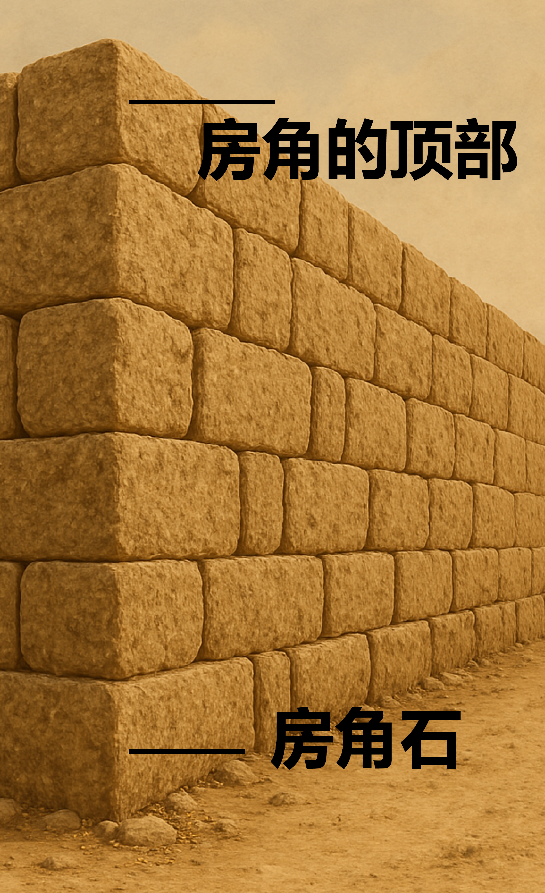

# Human-made Things in the Bible

## License Information

Human-made Things in the Bible © United Bible Societies, 2025. Adapted from: <cite>The Works of Their Hands: Man-made Things in the Bible</cite>, by Ray Pritz © 2009 United Bible Societies. This work is licensed under Creative Commons Attribution-ShareAlike 4.0 International (<a href="https://creativecommons.org/licenses/by-sa/4.0/">https://creativecommons.org/licenses/by-sa/4.0/</a>).

--------------------------------

## 标题：房角石、拱心石、压顶石（cornerstone, keystone, capstone） (id: REALIA:3.1.1.1)

3\.1\.1\.1 标题：房角石、拱心石、压顶石（cornerstone, keystone, capstone）
==========================================================

经文出处
----

Hebrew 来：אֶבֶן, פִנָּה (音译：’even pinah)

[JOB 38:6](https://ref.ly/Job38:6)

Hebrew 来：אֶבֶן, רֹאשָׁה (音译：’even ro’shah)

[ZEC 4:7](https://ref.ly/Zech4:7)

Hebrew 来：פִנָּה (音译：pinah)

[ISA 28:16](https://ref.ly/Isa28:16), [ZEC 10:4](https://ref.ly/Zech10:4)

Hebrew 来：רֹאשׁ פִּנָּה (音译：ro’sh pinah)

[PSA 118:22](https://ref.ly/Ps118:22)

Greek 希：ἀκρογωνιαῖος (音译：akrogōniaios)

[EPH 2:20](https://ref.ly/Eph2:20), [1PE 2:6](https://ref.ly/1Pet2:6)

Greek 希：κεφαλή, γωνία (音译：kefalē gōnias)

[MAT 21:42](https://ref.ly/Matt21:42), [MRK 12:10](https://ref.ly/Mark12:10), [LUK 20:17](https://ref.ly/Luke20:17), [ACT 4:11](https://ref.ly/Acts4:11), [1PE 2:7](https://ref.ly/1Pet2:7)

描述和用途
-----

*拱心石 (© Ray Pritz by United Bible Societies)*

在石头建筑物中，房角石是奠基的第一块石头（参[3\.1\.1 地基、根基、基础 (foundation)\<REALIA:3\.1\.1\>](#) 中的插图）。它的朝向决定了整个建筑的方向，而它在地基中的位置则意味着它为整个建筑物提供支撑。

拱心石或压顶石是拱门等建筑结构最后放置的一块石头。曾经有一个时期，建筑物的石头并不是靠砂浆或其他材料粘结在一起的，放置在关键位置的拱心石使整个建筑结构成为一个稳固的整体。

---

翻译
--

在大多数情况下，我们很难准确说明以上所列希伯来文和希腊文词语指的是哪种石头。所论石头可能是指古代建筑中，延伸到建筑物拐角转角的大石头。还有些人认为这些词语指的是“拱心石”，即拱门顶端的那块石头。（事实上，这些词语很可能是指耶路撒冷圣殿所用的那种石头，因此它们更有可能是指房角石，而不是尖顶或拱门上的压顶石。）

*房角石，房角的顶部 (Image generated by ChatGPT using OpenAI technology)*

新约中的希腊文*kefalē gōnias* 引自旧约中的[PSA 118:22](https://ref.ly/Ps118:22) ，无论这个短语的确切含义是什么，它的基本意思都是毫无疑问的；基督被比作建筑物中最重要的那块石头，为整座建筑提供凝聚力和支撑。因此在大多数语言中，最好把这个短语译为“最重要的石头”或“使整座建筑稳固的石头”。这些译法描述了*kefalē gōnias* 的功能和意义，而又没有试图指明具体的位置和形式。

当翻译者使用这种扩展译法时，用隐喻或明喻来进行翻译会容易得多，因为比喻能清楚表明比较的内容。[EPH 2:20](https://ref.ly/Eph2:20) 可以译为，“你们也是建筑物的一部分。使徒和先知奠定了建筑物的根基，而使建筑物稳固的石头就是基督耶稣自己。”或者译为，“你们也好像是使徒和先知立定根基的建筑物的一部分，而基督耶稣是保证建筑物稳固的那块重要石头。”

[JOB 38:6](https://ref.ly/Job38:6) ：在房角石不为人知的地方，可以把这节经文的第二行译为，“谁把它放在了合适的位置？”或“谁预备好了该放置它的地方？”

[ZEC 10:4](https://ref.ly/Zech10:4) ：有人认为希伯来文*pinah* （字面意为“角落”）在这里指的是城墙上的角楼或碉堡（比较[2CH 26:15](https://ref.ly/2Chr26:15) ；[NEH 3:24](https://ref.ly/Neh3:24) ）。但在我们查阅的译本中，没有任何一个译本依循这种解释。有些译本（如DUCL (Dutch Common Language Version) ）认为该词是指军事领袖，并据此进行翻译。在很早以前，人们就认为这节经文是预表弥赛亚。有些英文译本试图通过首字母大写（Cornerstone，“房角石”）来反映这一点。这种视觉上的暗示对大多数读者来说都是不明显的，而且对于聆听经文的听者来说，这种视觉暗示毫无作用。如果按照字面意思来翻译这节经文开头的两个希伯来文词语（“房角石必从他们而出”；如RSV (Revised Standard Version (1952)) 的译法），这在有些语言中是无法理解的。译文最好能够表明，该预言与一个领袖有关。可以译为“统治者、领袖和官长必从他们而出，治理我的百姓”（GNT (Good News Translation (1992)) 直译）、“必有领袖从这群羊而出，他们必如房角石、帐棚橛和争战的兵器那样坚强有力”（CEV (Contemporary English Version) 直译），两者都是这节经文的翻译范例。

* **Associated Passages:** 约伯记 38:6; 撒迦利亚书 4:7; 以赛亚书 28:16; 撒迦利亚书 10:4; 诗篇 118:22; 以弗所书 2:20; 彼得前书 2:6; 马太福音 21:42; 马可福音 12:10; 路加福音 20:17; 使徒行传 4:11; 彼得前书 2:7; 历代志下 26:15; 尼希米记 3:24

