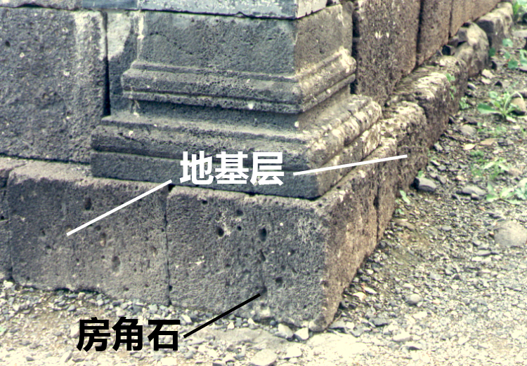
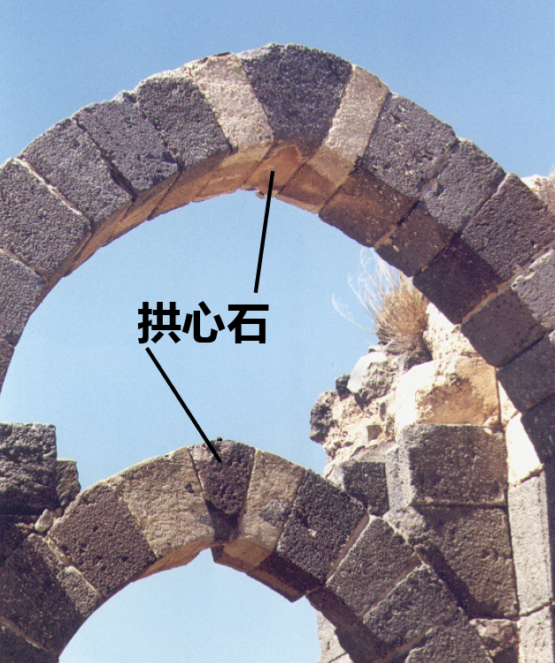

# Human-made Things in the Bible

## License Information

Human-made Things in the Bible © United Bible Societies, 2025. Adapted from: <cite>The Works of Their Hands: Man-made Things in the Bible</cite>, by Ray Pritz © 2009 United Bible Societies. This work is licensed under Creative Commons Attribution-ShareAlike 4.0 International (<a href="https://creativecommons.org/licenses/by-sa/4.0/">https://creativecommons.org/licenses/by-sa/4.0/</a>).

--------------------------------

## 标题：地基、根基、基础（foundation） (id: REALIA:3.1.1)

3\.1\.1 标题：地基、根基、基础（foundation）
===============================

经文出处
----

Aramaic 兰：אֹשׁ (音译：’osh)

[EZR 4:12](https://ref.ly/Ezra4:12), [EZR 5:16](https://ref.ly/Ezra5:16), [EZR 6:3](https://ref.ly/Ezra6:3)

Hebrew 来：אָשְׁיָה (音译：’oshyah)

[JER 50:15](https://ref.ly/Jer50:15)

Hebrew 来：יסד, יְסוֹד, יְסוּדָה, מוֹסָד, מוֹסָדָה, מוּסָדָה, מַסָּד (音译：yasad（动词）, ysod, ysudah, mosad, musad, mosadah, musadah, masad)

[DEU 32:22](https://ref.ly/Deut32:22), [JOS 6:26](https://ref.ly/Josh6:26), [2SA 22:8](https://ref.ly/2Sam22:8), [2SA 22:16](https://ref.ly/2Sam22:16), [1KI 5:31](https://ref.ly/1Kgs5:31), [1KI 6:37](https://ref.ly/1Kgs6:37), [1KI 7:9](https://ref.ly/1Kgs7:9), [1KI 7:10](https://ref.ly/1Kgs7:10), [1KI 16:34](https://ref.ly/1Kgs16:34)

Hebrew 来：מָכוֹן (音译：makon)

[PSA 104:5](https://ref.ly/Ps104:5)

Hebrew 来：סַף (音译：saf)

[AMO 9:1](https://ref.ly/Amos9:1)

Greek 希：θεμέλιον, θεμέλιος, θεμελιόω (音译：themelion, themelios, themelioō（动词）)

[MAT 7:25](https://ref.ly/Matt7:25), [LUK 6:48](https://ref.ly/Luke6:48), [LUK 6:49](https://ref.ly/Luke6:49), [LUK 14:29](https://ref.ly/Luke14:29)

Greek 希：ὑποβάλλω (音译：hupoballō（动词）)

[1ES 2:14](https://ref.ly/1Esd2:14)

Latin 拉：fundamentum

[2ES 16:12](https://ref.ly/2Esd16:12), [2ES 6:15](https://ref.ly/2Esd6:15), [2ES 10:27](https://ref.ly/2Esd10:27), [2ES 10:53](https://ref.ly/2Esd10:53), [2ES 15:23](https://ref.ly/2Esd15:23), [2ES 16:12](https://ref.ly/2Esd16:12)

描述
--

*地基的房角石 (© Ray Pritz by United Bible Societies)*

地基是一个坚固的支撑层，建筑物的墙或整个建筑物就在其上建造起来。地基是由并排安放的大石头所建成。

---

翻译
--

在有些语言中，可以把古代典型的“地基”描述为“墙下面的大石头”。然而，在其他一些语言中，这种表述可能毫无意义，因为只有把桩子深深打入地下才能使地基稳固。在这些语言中，翻译者最好从功能的角度来描述地基，比如“使墙稳固的东西”、“使墙不移动的东西”或“在墙下面的东西”。

在世界上的许多地方，人们在建造房屋时，通常并不奠定地基，也不使用石头或砖。因此，在翻译新约中“根基”的比喻时，可能会遇到一些困难。在这些情况下，“根基”可以译为“在其上建造房屋的坚固（或牢固）基础”、“人们在建造石头房子前打好的基础”或“房屋的根基”。

[JER 50:15](https://ref.ly/Jer50:15) ：这节经文中的希伯来文*’ashwiyoth* 可以译为“堡垒”（“bulwarks”；RSV (Revised Standard Version (1952)) 、NRSV (New Revised Standard Version (1989)) ）、“塔楼”（“towers”；NCV (New Century Version) 、NIV (New International Version (1984)) 、CEV (Contemporary English Version) ）。GNT (Good News Translation (1992)) 未译出该词，而是在脚注中说明该希伯来文词语的意思不确定。关于这个词语的意思，解经家们有不同的意见。一些解经家建议使用“地基”一词，并把它与[EZR 4:12](https://ref.ly/Ezra4:12) 、[EZR 5:16](https://ref.ly/Ezra5:16) 中的相关亚兰文词语进行比较。其他解经家则指出，说地基会“坍塌”是不正确的。这些解经家认为，最好把*’ashwiyoth* 看作一个泛指城市“防御工事”的词语。

[AMO 9:1](https://ref.ly/Amos9:1) ：这节经文中的希伯来文*sipim* 意思不确定。在希伯来文本中，这里明显是指某个东西因为受到击打而震动，但被震动的东西到底是什么，不同译本的理解非常不同：“门槛”（“thresholds”；RSV (Revised Standard Version (1952)) 、AT (American Translation (Goodspeed, 1935)) ）、“门楣”（“lintels”；TOT ）、“门柱”（“doorjambs”；NAB (New American Bible (1970)) ）、“天花板”（“ceiling”；Mft (Moffatt Translation (1926)) ）、“整个门廊”（“whole porch”；NEB (New English Bible (1970)) ），以及“地基”（“foundation”；GNT (Good News Translation (1992)) ）。这个希伯来文词语可能是指地基或屋顶结构。然而，这节经文描绘了整栋建筑从屋顶到地基都在震动直至倒塌的情景。翻译者必须清楚表达这一点，具体的措辞则取决于后续经文的翻译。

* **Associated Passages:** 以斯拉记 4:12; 以斯拉记 5:16; 以斯拉记 6:3; 耶利米书 50:15; 申命记 32:22; 约书亚记 6:26; 撒母耳记下 22:8; 撒母耳记下 22:16; 列王纪上 5:31; 列王纪上 6:37; 列王纪上 7:9; 列王纪上 7:10; 列王纪上 16:34; 诗篇 104:5; 阿摩司书 9:1; 马太福音 7:25; 路加福音 6:48; 路加福音 6:49; 路加福音 14:29; 厄斯德拉上 2:14; 厄斯德拉下 16:12; 厄斯德拉下 6:15; 厄斯德拉下 10:27; 厄斯德拉下 10:53; 厄斯德拉下 15:23

## 标题：房角石、拱心石、压顶石（cornerstone, keystone, capstone） (id: REALIA:3.1.1.1)

3\.1\.1\.1 标题：房角石、拱心石、压顶石（cornerstone, keystone, capstone）
==========================================================

经文出处
----

Hebrew 来：אֶבֶן, פִנָּה (音译：’even pinah)

[JOB 38:6](https://ref.ly/Job38:6)

Hebrew 来：אֶבֶן, רֹאשָׁה (音译：’even ro’shah)

[ZEC 4:7](https://ref.ly/Zech4:7)

Hebrew 来：פִנָּה (音译：pinah)

[ISA 28:16](https://ref.ly/Isa28:16), [ZEC 10:4](https://ref.ly/Zech10:4)

Hebrew 来：רֹאשׁ פִּנָּה (音译：ro’sh pinah)

[PSA 118:22](https://ref.ly/Ps118:22)

Greek 希：ἀκρογωνιαῖος (音译：akrogōniaios)

[EPH 2:20](https://ref.ly/Eph2:20), [1PE 2:6](https://ref.ly/1Pet2:6)

Greek 希：κεφαλή, γωνία (音译：kefalē gōnias)

[MAT 21:42](https://ref.ly/Matt21:42), [MRK 12:10](https://ref.ly/Mark12:10), [LUK 20:17](https://ref.ly/Luke20:17), [ACT 4:11](https://ref.ly/Acts4:11), [1PE 2:7](https://ref.ly/1Pet2:7)

描述和用途
-----

*拱心石 (© Ray Pritz by United Bible Societies)*

在石头建筑物中，房角石是奠基的第一块石头（参[3\.1\.1 地基、根基、基础 (foundation)\<REALIA:3\.1\.1\>](#) 中的插图）。它的朝向决定了整个建筑的方向，而它在地基中的位置则意味着它为整个建筑物提供支撑。

拱心石或压顶石是拱门等建筑结构最后放置的一块石头。曾经有一个时期，建筑物的石头并不是靠砂浆或其他材料粘结在一起的，放置在关键位置的拱心石使整个建筑结构成为一个稳固的整体。

---

翻译
--

在大多数情况下，我们很难准确说明以上所列希伯来文和希腊文词语指的是哪种石头。所论石头可能是指古代建筑中，延伸到建筑物拐角转角的大石头。还有些人认为这些词语指的是“拱心石”，即拱门顶端的那块石头。（事实上，这些词语很可能是指耶路撒冷圣殿所用的那种石头，因此它们更有可能是指房角石，而不是尖顶或拱门上的压顶石。）

*房角石，房角的顶部 (Image generated by ChatGPT using OpenAI technology)*

新约中的希腊文*kefalē gōnias* 引自旧约中的[PSA 118:22](https://ref.ly/Ps118:22) ，无论这个短语的确切含义是什么，它的基本意思都是毫无疑问的；基督被比作建筑物中最重要的那块石头，为整座建筑提供凝聚力和支撑。因此在大多数语言中，最好把这个短语译为“最重要的石头”或“使整座建筑稳固的石头”。这些译法描述了*kefalē gōnias* 的功能和意义，而又没有试图指明具体的位置和形式。

当翻译者使用这种扩展译法时，用隐喻或明喻来进行翻译会容易得多，因为比喻能清楚表明比较的内容。[EPH 2:20](https://ref.ly/Eph2:20) 可以译为，“你们也是建筑物的一部分。使徒和先知奠定了建筑物的根基，而使建筑物稳固的石头就是基督耶稣自己。”或者译为，“你们也好像是使徒和先知立定根基的建筑物的一部分，而基督耶稣是保证建筑物稳固的那块重要石头。”

[JOB 38:6](https://ref.ly/Job38:6) ：在房角石不为人知的地方，可以把这节经文的第二行译为，“谁把它放在了合适的位置？”或“谁预备好了该放置它的地方？”

[ZEC 10:4](https://ref.ly/Zech10:4) ：有人认为希伯来文*pinah* （字面意为“角落”）在这里指的是城墙上的角楼或碉堡（比较[2CH 26:15](https://ref.ly/2Chr26:15) ；[NEH 3:24](https://ref.ly/Neh3:24) ）。但在我们查阅的译本中，没有任何一个译本依循这种解释。有些译本（如DUCL (Dutch Common Language Version) ）认为该词是指军事领袖，并据此进行翻译。在很早以前，人们就认为这节经文是预表弥赛亚。有些英文译本试图通过首字母大写（Cornerstone，“房角石”）来反映这一点。这种视觉上的暗示对大多数读者来说都是不明显的，而且对于聆听经文的听者来说，这种视觉暗示毫无作用。如果按照字面意思来翻译这节经文开头的两个希伯来文词语（“房角石必从他们而出”；如RSV (Revised Standard Version (1952)) 的译法），这在有些语言中是无法理解的。译文最好能够表明，该预言与一个领袖有关。可以译为“统治者、领袖和官长必从他们而出，治理我的百姓”（GNT (Good News Translation (1992)) 直译）、“必有领袖从这群羊而出，他们必如房角石、帐棚橛和争战的兵器那样坚强有力”（CEV (Contemporary English Version) 直译），两者都是这节经文的翻译范例。

* **Associated Passages:** 约伯记 38:6; 撒迦利亚书 4:7; 以赛亚书 28:16; 撒迦利亚书 10:4; 诗篇 118:22; 以弗所书 2:20; 彼得前书 2:6; 马太福音 21:42; 马可福音 12:10; 路加福音 20:17; 使徒行传 4:11; 彼得前书 2:7; 历代志下 26:15; 尼希米记 3:24

