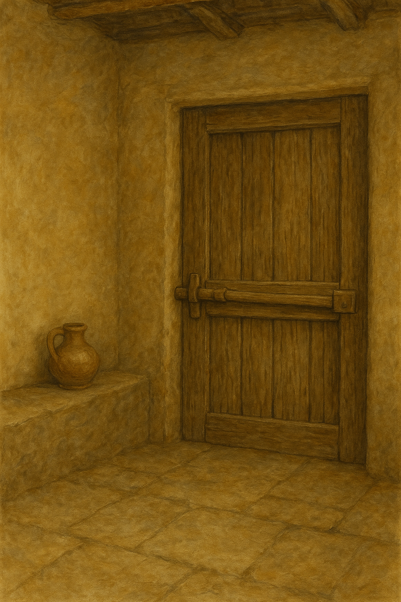

# Human-made Things in the Bible

## License Information

Human-made Things in the Bible © United Bible Societies, 2025. Adapted from: <cite>The Works of Their Hands: Man-made Things in the Bible</cite>, by Ray Pritz © 2009 United Bible Societies. This work is licensed under Creative Commons Attribution-ShareAlike 4.0 International (<a href="https://creativecommons.org/licenses/by-sa/4.0/">https://creativecommons.org/licenses/by-sa/4.0/</a>).

--------------------------------

## 标题：锁（lock） (id: REALIA:3.1.2.1)

3\.1\.2\.1 标题：锁（lock）
=====================

经文出处
----

Hebrew 来：כַּף, מַנְעוּל (音译：kaf man‘ul)

[SNG 5:5](https://ref.ly/Song5:5)

Hebrew 来：נעל (音译：na‘al)

[JDG 3:23](https://ref.ly/Judg3:23), [JDG 3:24](https://ref.ly/Judg3:24), [2SA 13:17](https://ref.ly/2Sam13:17), [2SA 13:18](https://ref.ly/2Sam13:18)

Hebrew 来：סגר (音译：sagar)

[JDG 9:51](https://ref.ly/Judg9:51)

Greek 希：κλεῖθρον (音译：kleithron)

[LJE 1:17](https://ref.ly/EpJer1:17)

Greek 希：κλείω (音译：kleiō)

[MAT 25:10](https://ref.ly/Matt25:10), [LUK 11:7](https://ref.ly/Luke11:7), [JHN 20:19](https://ref.ly/John20:19), [JHN 20:26](https://ref.ly/John20:26), [ACT 5:23](https://ref.ly/Acts5:23), [ACT 21:30](https://ref.ly/Acts21:30), [SIR 42:6](https://ref.ly/Sir42:6), [BEL 1:14](https://ref.ly/Bel1:14)

描述和用途
-----

锁是一种用来固定门的装置，只有使用一把特殊的钥匙才能将锁打开（参[3\.1\.2\.2 钥匙 (key)\<REALIA:3\.1\.2\.2\>](#) ）。

---

翻译
--

在[SNG 5:5](https://ref.ly/Song5:5) 中，希伯来文短语*kaf man‘ul* 可能是指一个木制突起物或一根绳子，用来拉开门闩，使门打开。可以译为“门的把手”（“handle of the door”；GNT (Good News Translation (1992)) ），或“门闩的把手”（“handles of the bolt”；RSV (Revised Standard Version (1952)) 、NASB (New American Standard Bible) ），或“锁的把手”（“handles of the lock”；KJV (King James Version (1611)) ），也可以简单地译为“门”（“door”；CEV (Contemporary English Version) ）。

*门和门闩 (Image generated by ChatGPT using OpenAI technology)*

[LJE 1:18](https://ref.ly/EpJer1:18) 使用了这个不常见的希腊文，可以指锁（如RSV (Revised Standard Version (1952)) ），也可以指横着挡住门的闩（如GNT (Good News Translation (1992)) ）。

* **Associated Passages:** 雅歌 5:5; 士师记 3:23; 士师记 3:24; 撒母耳记下 13:17; 撒母耳记下 13:18; 士师记 9:51; 耶利米书信 1:17; 马太福音 25:10; 路加福音 11:7; 约翰福音 20:19; 约翰福音 20:26; 使徒行传 5:23; 使徒行传 21:30; 德训篇 42:6; 彼勒与大龙 1:14; 耶利米书信 1:18

