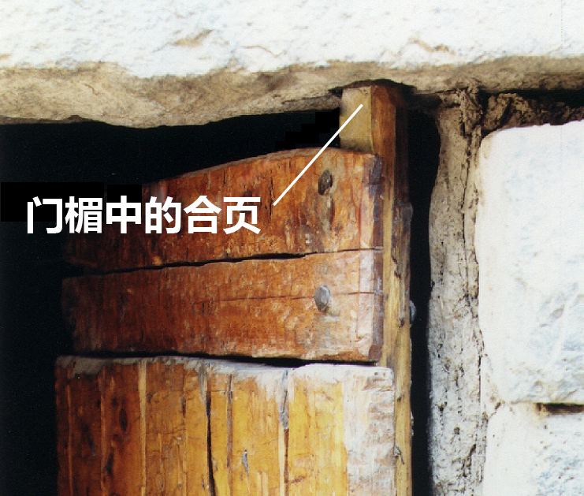

# Human-made Things in the Bible

## License Information

Human-made Things in the Bible © United Bible Societies, 2025. Adapted from: <cite>The Works of Their Hands: Man-made Things in the Bible</cite>, by Ray Pritz © 2009 United Bible Societies. This work is licensed under Creative Commons Attribution-ShareAlike 4.0 International (<a href="https://creativecommons.org/licenses/by-sa/4.0/">https://creativecommons.org/licenses/by-sa/4.0/</a>).

--------------------------------

## 标题：合页（hinge） (id: REALIA:3.1.2.3)

3\.1\.2\.3 标题：合页（hinge）
=======================

经文出处
----

Hebrew 来：גָּלִיל (音译：galil)

[1KI 6:34](https://ref.ly/1Kgs6:34), [1KI 6:34](https://ref.ly/1Kgs6:34)

Hebrew 来：פֹּת (音译：poth)

[1KI 7:50](https://ref.ly/1Kgs7:50)

Hebrew 来：צִיר (音译：tsir)

[PRO 26:14](https://ref.ly/Prov26:14)

描述和用途
-----

*房门或闸门上的金属铰链 (© Ray Pritz by United Bible Societies)*

合页是连接两个物件，使其可以自由地相对转动的装置。就门这个物件来说，合页是指门扇在顶部（门楣）和底部（门槛）进行固定的点，或者与门柱（如果有的话）固定的点，这样门扇就可以转动打开或关上。对于简单的住宅，门的合页通常只是木门一侧的上下两端的突出部分，插在石头门楣或门槛的凹坑中。比较大的门的合页是用金属做的。金属合页由三部分组成：两个页片，一片固定在门上，另一片固定在墙上或门柱上，两个页片由一根金属插销固定在一起。

翻译
--

*木合页 (© Ray Pritz by United Bible Societies)*

希伯来文*galil* 在[1KI 6:34](https://ref.ly/1Kgs6:34) 中的意思不确定。这个词与意为“旋转”的希伯来文动词有关。REB (Revised English Bible (1989)) 将这个词语解作“swivel\-pin”（“铰接销”），即合页的一种。许多译本在翻译这节令人费解的经文时，并不在译文中指明*galil* 所表示的物件具体是什么，例如把整节经文译为“有两扇松木折叠门”（GNT (Good News Translation (1992)) 直译）。

* **Associated Passages:** 列王纪上 6:34; 列王纪上 7:50; 箴言 26:14

