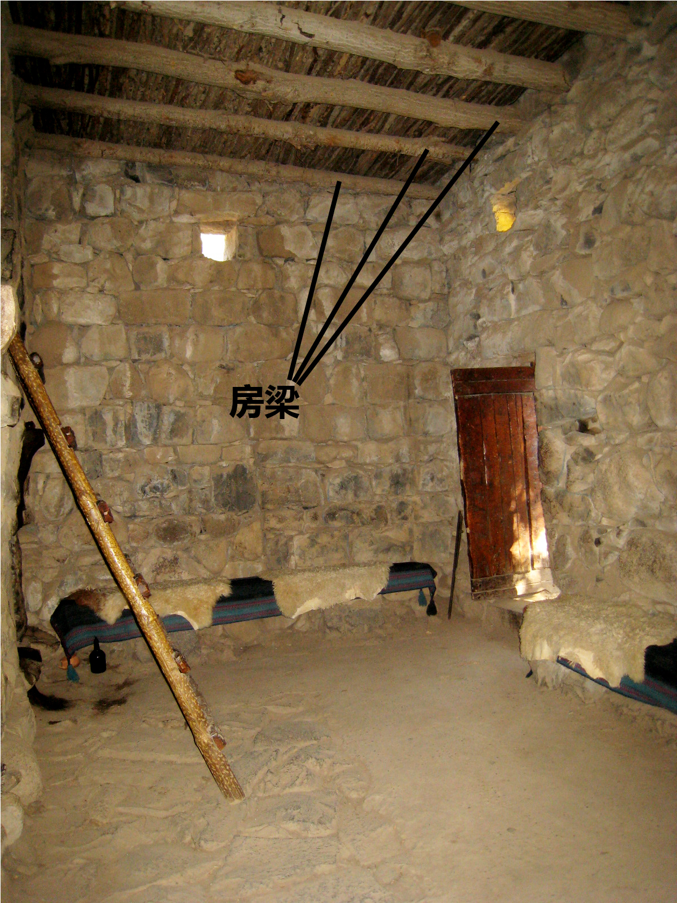

# Human-made Things in the Bible

## License Information

Human-made Things in the Bible © United Bible Societies, 2025. Adapted from: <cite>The Works of Their Hands: Man-made Things in the Bible</cite>, by Ray Pritz © 2009 United Bible Societies. This work is licensed under Creative Commons Attribution-ShareAlike 4.0 International (<a href="https://creativecommons.org/licenses/by-sa/4.0/">https://creativecommons.org/licenses/by-sa/4.0/</a>).

--------------------------------

## 标题：大梁、梁木、椽子（crossbeam, rafter） (id: REALIA:3.1.5.3)

3\.1\.5\.3 标题：大梁、梁木、椽子（crossbeam, rafter）
=========================================

经文出处
----

Aramaic 兰：אָע (音译：’a‘)

[EZR 6:11](https://ref.ly/Ezra6:11)

Hebrew 来：גֵּב (音译：gev)

[1KI 6:9](https://ref.ly/1Kgs6:9)

Hebrew 来：כָּפִיס (音译：kafis)

[HAB 2:11](https://ref.ly/Hab2:11)

Hebrew 来：קרה, קוֹרָה (音译：qarah（动词）, qorah)

[2CH 3:7](https://ref.ly/2Chr3:7), [SNG 1:17](https://ref.ly/Song1:17), [2CH 34:11](https://ref.ly/2Chr34:11)

Hebrew 来：רָהִיט (音译：rachit)

[SNG 1:17](https://ref.ly/Song1:17)

Hebrew 来：שְׂדֵרָה (音译：sderah)

[1KI 6:9](https://ref.ly/1Kgs6:9)

Greek 希：δοκός (音译：dokos)

[SIR 29:22](https://ref.ly/Sir29:22), [LJE 1:19](https://ref.ly/EpJer1:19), [LJE 1:54](https://ref.ly/EpJer1:54)

Greek 希：ἱμάντωσις (音译：himantōsis)

[SIR 22:16](https://ref.ly/Sir22:16)

Greek 希：ξύλον (音译：xulon)

[1ES 6:31](https://ref.ly/1Esd6:31)

描述和用途
-----

*房梁 (© Hagit Baldar, CC BY, via Wikimedia Commons)*

以色列人房屋的屋顶由三四层材料组成。首先，在两面墙之间铺上粗木梁。这些木梁插入到墙的顶部，是墙结构的一部分。如果木梁被取出，墙就会严重毁坏。这些“梁木”或“椽子”的间距约有一个人的前臂那么长。在横梁上面垂直铺放一层较细的木条，木条的直径约3—4厘米（1—2英寸）。木条并排放在一起，形成一个平面。这些木条可能就是[1KI 6:9](https://ref.ly/1Kgs6:9) 中提到的*sderoth* （*sderah* 的复数）。细木条上面再铺撒一层土，有时土上面会铺一层瓦。

---

翻译
--

虽然希伯来文*gev* 在[1KI 6:9](https://ref.ly/1Kgs6:9) 中的意思不确定，但我们查阅的所有译本都把它译为“梁木”。另参[3\.1\.6 房间 (room)\<REALIA:3\.1\.6\>](#) 关于该词的讨论。

在[SNG 1:17](https://ref.ly/Song1:17) 中，希伯来文*rachit* 是比喻用法，这里也有一个文本问题。参《〈雅歌〉手册》（*A Handbook on Song of Songs* ）第49页关于这节经文的讨论。

[HAB 2:11](https://ref.ly/Hab2:11) ：希伯来文*kafis* 在整本圣经中仅出现在此处。但大多数译本都认为它指的是房子里面的一根椽子或横梁。但是，也有译本把这节经文的最后一行译为：“灰泥必从木构件上回应”（NRSV (New Revised Standard Version (1989)) 直译）。巴比伦人的房屋通常是用砖而不是石头建造的，在这节经文中，先知是用他熟悉的、以色列地的建筑材料，来描写巴比伦人的房屋。有些翻译者可能也要采取类似的做法，用他们所在地区的常用建筑材料（例如黏土和木头，或木头和茅草）来翻译，而不是试图对“横梁”或“椽子”进行描述。例如，他们可以译成：“房顶上的木头（或茅草／黏土）必呼喊着回应（或译：应和这呼叫）。”有些语言不能说建筑材料像人一样呼叫。在这种情况下，翻译者可以使用比喻，把整节经文译为，“甚至你们房屋的石头和木头也要来作证控告你们的恶行。”

横梁为建筑物提供必不可少的支撑。在[EZR 6:11](https://ref.ly/Ezra6:11) 和[1ES 6:31](https://ref.ly/1Esd6:31) 中，把某人房屋的横梁拔掉肯定会导致房屋倒塌。因此，这节经文的中间部分也可以译成，“他的房屋必被拆毁，其中一根横梁必穿过他的身体。”

* **Associated Passages:** 以斯拉记 6:11; 列王纪上 6:9; 哈巴谷书 2:11; 历代志下 3:7; 雅歌 1:17; 历代志下 34:11; 德训篇 29:22; 耶利米书信 1:19; 耶利米书信 1:54; 德训篇 22:16; 厄斯德拉上 6:31

