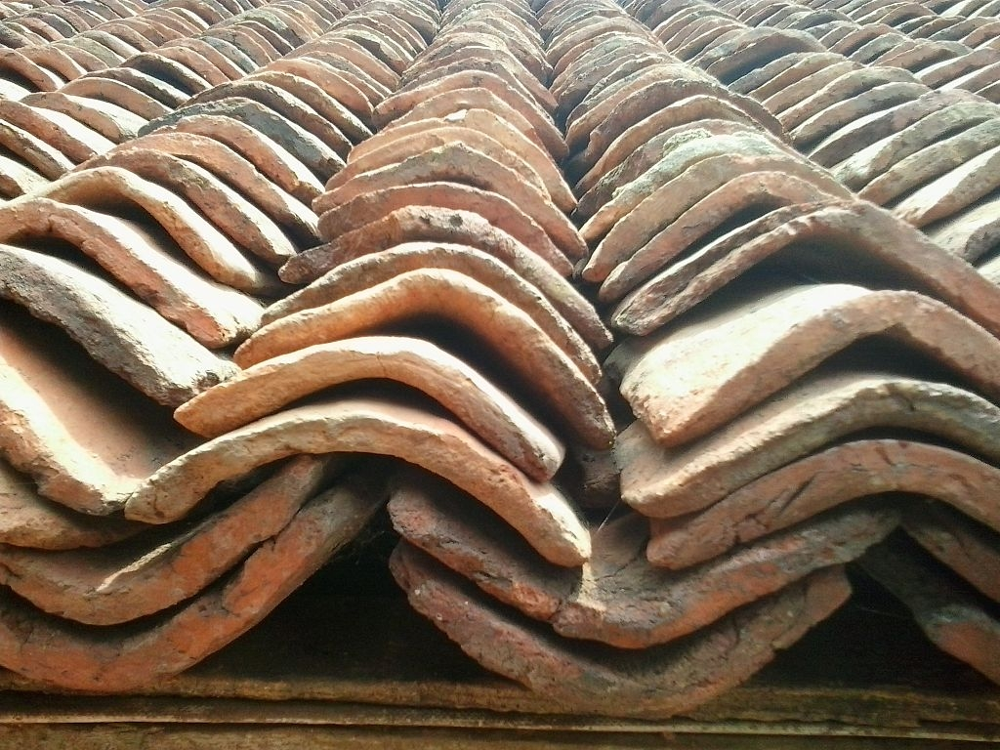

# Human-made Things in the Bible

## License Information

Human-made Things in the Bible © United Bible Societies, 2025. Adapted from: <cite>The Works of Their Hands: Man-made Things in the Bible</cite>, by Ray Pritz © 2009 United Bible Societies. This work is licensed under Creative Commons Attribution-ShareAlike 4.0 International (<a href="https://creativecommons.org/licenses/by-sa/4.0/">https://creativecommons.org/licenses/by-sa/4.0/</a>).

--------------------------------

## 标题：屋顶、房顶（roof, housetop） (id: REALIA:3.1.5)

3\.1\.5 标题：屋顶、房顶（roof, housetop）
================================

经文出处
----

Hebrew 来：גָּג (音译：gag)

[DEU 22:8](https://ref.ly/Deut22:8), [JOS 2:6](https://ref.ly/Josh2:6), [JOS 2:6](https://ref.ly/Josh2:6), [JOS 2:8](https://ref.ly/Josh2:8), [JDG 9:51](https://ref.ly/Judg9:51), [JDG 16:27](https://ref.ly/Judg16:27), [1SA 9:25](https://ref.ly/1Sam9:25), [1SA 9:26](https://ref.ly/1Sam9:26), [2SA 11:2](https://ref.ly/2Sam11:2), [2SA 11:2](https://ref.ly/2Sam11:2), [2SA 16:22](https://ref.ly/2Sam16:22), [2SA 18:24](https://ref.ly/2Sam18:24), [2KI 19:26](https://ref.ly/2Kgs19:26), [2KI 23:12](https://ref.ly/2Kgs23:12), [NEH 8:16](https://ref.ly/Neh8:16), [PSA 102:8](https://ref.ly/Ps102:8), [PSA 129:6](https://ref.ly/Ps129:6), [PRO 21:9](https://ref.ly/Prov21:9), [PRO 25:24](https://ref.ly/Prov25:24), [ISA 15:3](https://ref.ly/Isa15:3), [ISA 22:1](https://ref.ly/Isa22:1), [ISA 37:27](https://ref.ly/Isa37:27), [JER 19:13](https://ref.ly/Jer19:13), [JER 32:29](https://ref.ly/Jer32:29), [JER 48:38](https://ref.ly/Jer48:38), [EZK 40:13](https://ref.ly/Ezek40:13), [EZK 40:13](https://ref.ly/Ezek40:13), [ZEP 1:5](https://ref.ly/Zeph1:5)

Hebrew 来：מְקָרֶה (音译：mqareh)

[ECC 10:18](https://ref.ly/Eccl10:18)

Hebrew 来：קוֹרָה (音译：qorah)

[GEN 19:8](https://ref.ly/Gen19:8)

Greek 希：δῶμα (音译：dōma)

[MAT 10:27](https://ref.ly/Matt10:27), [MAT 24:17](https://ref.ly/Matt24:17), [MRK 13:15](https://ref.ly/Mark13:15), [LUK 5:19](https://ref.ly/Luke5:19), [LUK 12:3](https://ref.ly/Luke12:3), [LUK 17:31](https://ref.ly/Luke17:31), [ACT 10:9](https://ref.ly/Acts10:9), [JDT 8:5](https://ref.ly/Jdt8:5)

Greek 希：ὄροφος (音译：orofos)

[WIS 17:2](https://ref.ly/Wis17:2)

Greek 希：στέγη (音译：stegē)

[MAT 8:8](https://ref.ly/Matt8:8), [MRK 2:4](https://ref.ly/Mark2:4), [LUK 7:6](https://ref.ly/Luke7:6), [4MA 17:3](https://ref.ly/4Macc17:3), [1ES 6:4](https://ref.ly/1Esd6:4)

描述
--

圣经时期的房屋屋顶是平的。为防止人或东西掉落，屋顶通常会用矮墙或女儿墙围起来（参[3\.1\.5\.1 女儿墙、挡土墙 (parapet, retaining wall)\<REALIA:3\.1\.5\.1\>](#) ）。屋顶的基础是粗重的木梁。在这些木梁上面摆放树枝或草，然后再铺上泥土，有时会在泥土中混入石灰或碎石，然后把泥土夯平或用重石辊压平。通常，房子外墙上面会有阶梯，可以通到屋顶。参[3\.1 房子、永久性住所 (house, permanent dwelling)\<REALIA:3\.1\>](#) 和[3\.1\.5\.3 大梁、梁木、椽子 (crossbeam, rafter)\<REALIA:3\.1\.5\.3\>](#) 中的插图。

---

用途
--

屋顶有几个用途。太阳好的时候，可以在屋顶上晾晒一些农产品。晚上，人们有时会坐在屋顶上，在炎热的一天快结束时享受凉爽的微风。屋顶还可以用来存放东西。在今天的许多文化中，屋顶也经常是举行活动的地方，然而使用的频率远远比不上圣经时期的巴勒斯坦。

---

翻译
--

由于圣经提到人们在屋顶上进行多种活动，在有些语言中，翻译者可能要在文本或脚注中指出这些屋顶是平的，而且通常很容易就可以上去。尤其是在以下经文中：[JOS 2:6](https://ref.ly/Josh2:6); [JOS 2:8](https://ref.ly/Josh2:8); [JDG 16:27](https://ref.ly/Judg16:27); [2SA 11:2](https://ref.ly/2Sam11:2); [2SA 16:22](https://ref.ly/2Sam16:22); [JER 19:13](https://ref.ly/Jer19:13); [JER 32:29](https://ref.ly/Jer32:29); [MAT 24:17](https://ref.ly/Matt24:17); [MRK 13:15](https://ref.ly/Mark13:15); [LUK 17:31](https://ref.ly/Luke17:31); [ACT 10:9](https://ref.ly/Acts10:9) 。

在一些地方，“屋顶”一词通常是指倾斜的屋顶，此时翻译者需要采用描述性的短语，例如“房子的顶部”或“平的屋顶”。

[GEN 19:8](https://ref.ly/Gen19:8) ：读者可能不理解这节经文结尾处“他们已经来到我屋梁的影子之下”的含意。这句话的含意是：作为罗得的客人，他们都在他的保护之下。在有些语言中，即使译为“他们已经来到我屋顶的遮蔽（或保护）之下”（如RSV (Revised Standard Version (1952)) ），可能也不太清楚，或者说没有充分表达出原文的意思。GNT (Good News Translation (1992)) 把这个希伯来文短语进行了扩展翻译，英文意为：“他们是我家的客人，我必须保护他们。”

在旧约中，有几节经文提到在屋顶上生长的草。为了方便读者理解，翻译者可能要在脚注中解释屋顶是如何建造的。有三段旧约经文把人比作“屋顶上的草”（[2KI 19:26](https://ref.ly/2Kgs19:26); [PSA 129:6](https://ref.ly/Ps129:6); [ISA 37:27](https://ref.ly/Isa37:27) ），以此表示人的生命稍纵即逝。然而，在许多文化中，草是盖屋顶的材料，这种茅草屋顶选用的正是那些寿命长、非常坚韧的草。在有些语言中，如果按照字面翻译会使某些读者难以理解，翻译者应设法找到一个不含“屋顶”一词、更为自然的表达方式，例如，“檐沟里的草”或“墙上长的草”。

[MAT 10:27](https://ref.ly/Matt10:27); [LUK 12:3](https://ref.ly/Luke12:3) ：“在屋顶上宣扬出来”（[MAT 10:27](https://ref.ly/Matt10:27) ）是一个惯用语，意思是“公开宣告”。比较《〈马太福音〉手册》（*A Handbook on The Gospel of Matthew* ，第306页）中的下述例子：“你必须向全世界宣告。”

关于如何翻译“房顶”或“屋顶”的更多讨论，参约翰·埃林顿（John Ellington）的文章《屋顶之上》（“Up on the Housetop”）。

* **Associated Passages:** 申命记 22:8; 约书亚记 2:6; 约书亚记 2:8; 士师记 9:51; 士师记 16:27; 撒母耳记上 9:25; 撒母耳记上 9:26; 撒母耳记下 11:2; 撒母耳记下 16:22; 撒母耳记下 18:24; 列王纪下 19:26; 列王纪下 23:12; 尼希米记 8:16; 诗篇 102:8; 诗篇 129:6; 箴言 21:9; 箴言 25:24; 以赛亚书 15:3; 以赛亚书 22:1; 以赛亚书 37:27; 耶利米书 19:13; 耶利米书 32:29; 耶利米书 48:38; 以西结书 40:13; 西番雅书 1:5; 传道书 10:18; 创世记 19:8; 马太福音 10:27; 马太福音 24:17; 马可福音 13:15; 路加福音 5:19; 路加福音 12:3; 路加福音 17:31; 使徒行传 10:9; 友弟德传 8:5; 智慧篇 17:2; 马太福音 8:8; 马可福音 2:4; 路加福音 7:6; 玛加伯四书 17:3; 厄斯德拉上 6:4

* **Associated ACAI Concepts:** Housetop (ID: `realia:Housetop`)

## 标题：女儿墙、挡土墙（parapet, retaining wall） (id: REALIA:3.1.5.1)

3\.1\.5\.1 标题：女儿墙、挡土墙（parapet, retaining wall）
==============================================

经文出处
----

Hebrew 来：מַעֲקֶה (音译：ma‘aqeh)

[DEU 22:8](https://ref.ly/Deut22:8)

描述和用途
-----

女儿墙是绕着房屋的平顶一圈建造的低矮石墙，用来防止人或物品从上面掉下来。参[3\.1 房子、永久性住所 (house, permanent dwelling)\<REALIA:3\.1\>](#) 中的插图。

---

翻译
--

大多数译本都使用单个词语来翻译希伯来文*ma‘aqeh* ，例如“女儿墙”（“parapet”；RSV (Revised Standard Version (1952)) ）和“栏杆”（“railing”；GNT (Good News Translation (1992)) ）。NCV (New Century Version) 、CEV (Contemporary English Version) 的“矮墙”（“low wall”）和SPCL (Spanish Common Language Version (Dios Habla Hoy)) 的“防护墙”都是很好的翻译。[DEU 22:8](https://ref.ly/Deut22:8) 的上下文清楚说明了女儿墙的目的，正如GNT (Good News Translation (1992)) 的译法，英文意为：“你建造新房子时，要确保在屋顶的边缘一周安上栏杆。这样，即使有人摔下来死了，你也不用负责任。”在可能和必要的情况下，最好添加一个脚注，说明以色列人屋顶的样式和用途（参[3\.1\.5 屋顶、房顶 (roof, housetop)\<REALIA:3\.1\.5\>](#) ）。

* **Associated Passages:** 申命记 22:8

## 标题：屋瓦（roof tile） (id: REALIA:3.1.5.2)

3\.1\.5\.2 标题：屋瓦（roof tile）
===========================

经文出处
----

Greek 希：κέραμος (音译：keramos)

[LUK 5:19](https://ref.ly/Luke5:19)

描述和用途
-----

*粘土屋顶瓦片 (© Arivumathi, CC BY\-SA 4\.0, via Wikimedia Commons)*

屋瓦是用黏土烧制而成的薄板或弧形片，用来覆盖斜屋顶。[LUK 5:19](https://ref.ly/Luke5:19) 也有可能是指薄而平的石头片。

---

翻译
--

*屋顶上的粘土瓦 (© Ray Pritz by United Bible Societies)*

一般来说，以色列人的房屋不铺瓦片，但[LUK 5:19](https://ref.ly/Luke5:19) 特别提到了屋瓦。瓦虽然是希腊人先使用的，但是到了新约时期，在以色列地也已经广为人知了。关于经文中此一不寻常的现象，人们提出了许多种说法来解释，但翻译者应该按照文本的原样来进行翻译。

“屋瓦”可译为“扁平的石头”，或者是更笼统的“覆盖物”或“屋顶覆盖物”。如果有些地方的人更熟悉其他铺屋面材料，翻译者可能需要调整“穿过瓦片，他们用床把他缒下去”这句话，例如译成，“他们扒开（竹片做的）屋顶，用床把他放下去”，或者不必提到覆盖屋顶所用的材料，译为“他们弄开了屋顶，用床把他放下去”。NCV (New Century Version) 没有提到挖洞，英文意为：“他们……用垫子把那个人从房顶放下去。”

* **Associated Passages:** 路加福音 5:19

* **Associated ACAI Concepts:** Tile (ID: `realia:Tile`); Housetop (ID: `realia:Housetop`)

## 标题：大梁、梁木、椽子（crossbeam, rafter） (id: REALIA:3.1.5.3)

3\.1\.5\.3 标题：大梁、梁木、椽子（crossbeam, rafter）
=========================================

经文出处
----

Aramaic 兰：אָע (音译：’a‘)

[EZR 6:11](https://ref.ly/Ezra6:11)

Hebrew 来：גֵּב (音译：gev)

[1KI 6:9](https://ref.ly/1Kgs6:9)

Hebrew 来：כָּפִיס (音译：kafis)

[HAB 2:11](https://ref.ly/Hab2:11)

Hebrew 来：קרה, קוֹרָה (音译：qarah（动词）, qorah)

[2CH 3:7](https://ref.ly/2Chr3:7), [SNG 1:17](https://ref.ly/Song1:17), [2CH 34:11](https://ref.ly/2Chr34:11)

Hebrew 来：רָהִיט (音译：rachit)

[SNG 1:17](https://ref.ly/Song1:17)

Hebrew 来：שְׂדֵרָה (音译：sderah)

[1KI 6:9](https://ref.ly/1Kgs6:9)

Greek 希：δοκός (音译：dokos)

[SIR 29:22](https://ref.ly/Sir29:22), [LJE 1:19](https://ref.ly/EpJer1:19), [LJE 1:54](https://ref.ly/EpJer1:54)

Greek 希：ἱμάντωσις (音译：himantōsis)

[SIR 22:16](https://ref.ly/Sir22:16)

Greek 希：ξύλον (音译：xulon)

[1ES 6:31](https://ref.ly/1Esd6:31)

描述和用途
-----

*房梁 (© Hagit Baldar, CC BY, via Wikimedia Commons)*

以色列人房屋的屋顶由三四层材料组成。首先，在两面墙之间铺上粗木梁。这些木梁插入到墙的顶部，是墙结构的一部分。如果木梁被取出，墙就会严重毁坏。这些“梁木”或“椽子”的间距约有一个人的前臂那么长。在横梁上面垂直铺放一层较细的木条，木条的直径约3—4厘米（1—2英寸）。木条并排放在一起，形成一个平面。这些木条可能就是[1KI 6:9](https://ref.ly/1Kgs6:9) 中提到的*sderoth* （*sderah* 的复数）。细木条上面再铺撒一层土，有时土上面会铺一层瓦。

---

翻译
--

虽然希伯来文*gev* 在[1KI 6:9](https://ref.ly/1Kgs6:9) 中的意思不确定，但我们查阅的所有译本都把它译为“梁木”。另参[3\.1\.6 房间 (room)\<REALIA:3\.1\.6\>](#) 关于该词的讨论。

在[SNG 1:17](https://ref.ly/Song1:17) 中，希伯来文*rachit* 是比喻用法，这里也有一个文本问题。参《〈雅歌〉手册》（*A Handbook on Song of Songs* ）第49页关于这节经文的讨论。

[HAB 2:11](https://ref.ly/Hab2:11) ：希伯来文*kafis* 在整本圣经中仅出现在此处。但大多数译本都认为它指的是房子里面的一根椽子或横梁。但是，也有译本把这节经文的最后一行译为：“灰泥必从木构件上回应”（NRSV (New Revised Standard Version (1989)) 直译）。巴比伦人的房屋通常是用砖而不是石头建造的，在这节经文中，先知是用他熟悉的、以色列地的建筑材料，来描写巴比伦人的房屋。有些翻译者可能也要采取类似的做法，用他们所在地区的常用建筑材料（例如黏土和木头，或木头和茅草）来翻译，而不是试图对“横梁”或“椽子”进行描述。例如，他们可以译成：“房顶上的木头（或茅草／黏土）必呼喊着回应（或译：应和这呼叫）。”有些语言不能说建筑材料像人一样呼叫。在这种情况下，翻译者可以使用比喻，把整节经文译为，“甚至你们房屋的石头和木头也要来作证控告你们的恶行。”

横梁为建筑物提供必不可少的支撑。在[EZR 6:11](https://ref.ly/Ezra6:11) 和[1ES 6:31](https://ref.ly/1Esd6:31) 中，把某人房屋的横梁拔掉肯定会导致房屋倒塌。因此，这节经文的中间部分也可以译成，“他的房屋必被拆毁，其中一根横梁必穿过他的身体。”

* **Associated Passages:** 以斯拉记 6:11; 列王纪上 6:9; 哈巴谷书 2:11; 历代志下 3:7; 雅歌 1:17; 历代志下 34:11; 德训篇 29:22; 耶利米书信 1:19; 耶利米书信 1:54; 德训篇 22:16; 厄斯德拉上 6:31

