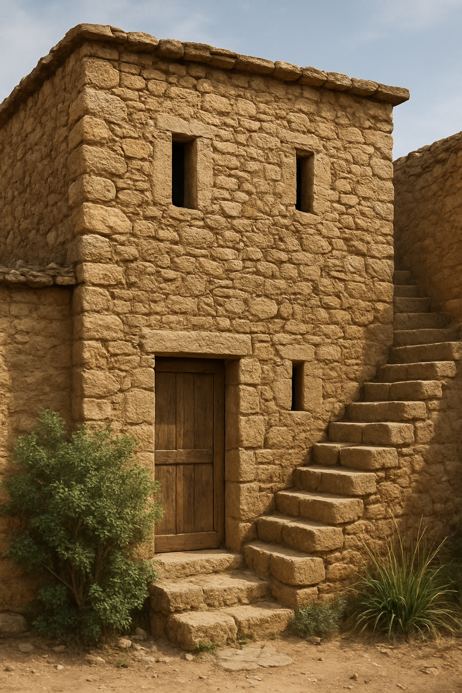

# Human-made Things in the Bible

## License Information

Human-made Things in the Bible © United Bible Societies, 2025. Adapted from: <cite>The Works of Their Hands: Man-made Things in the Bible</cite>, by Ray Pritz © 2009 United Bible Societies. This work is licensed under Creative Commons Attribution-ShareAlike 4.0 International (<a href="https://creativecommons.org/licenses/by-sa/4.0/">https://creativecommons.org/licenses/by-sa/4.0/</a>).

--------------------------------

## 标题：楼上的房间、楼房、屋顶的房间（upper room, roof chamber） (id: REALIA:3.1.6.4)

3\.1\.6\.4 标题：楼上的房间、楼房、屋顶的房间（upper room, roof chamber）
======================================================

经文出处
----

Hebrew 来：עֲלִיָּה (音译：‘aliyah)

[JDG 3:20](https://ref.ly/Judg3:20), [JDG 3:23](https://ref.ly/Judg3:23), [JDG 3:24](https://ref.ly/Judg3:24), [JDG 3:25](https://ref.ly/Judg3:25), [2SA 19:1](https://ref.ly/2Sam19:1), [1KI 17:19](https://ref.ly/1Kgs17:19), [1KI 17:23](https://ref.ly/1Kgs17:23), [2KI 1:2](https://ref.ly/2Kgs1:2), [2KI 4:10](https://ref.ly/2Kgs4:10), [2KI 4:11](https://ref.ly/2Kgs4:11), [2KI 23:12](https://ref.ly/2Kgs23:12), [1CH 28:11](https://ref.ly/1Chr28:11), [2CH 3:9](https://ref.ly/2Chr3:9), [NEH 3:31](https://ref.ly/Neh3:31), [NEH 3:32](https://ref.ly/Neh3:32), [PSA 104:3](https://ref.ly/Ps104:3), [PSA 104:13](https://ref.ly/Ps104:13), [JER 22:13](https://ref.ly/Jer22:13), [JER 22:14](https://ref.ly/Jer22:14)

Aramaic 兰：עִלִּי (音译：‘ili)

[DAN 6:11](https://ref.ly/Dan6:11)

Hebrew 来：מַעֲלָה (音译：ma‘alah)

[AMO 9:6](https://ref.ly/Amos9:6)

Greek 希：ἀνάγαιον (音译：anagaion)

[MRK 14:15](https://ref.ly/Mark14:15), [LUK 22:12](https://ref.ly/Luke22:12)

Greek 希：ὑπερῷον (音译：huperōion)

[ACT 1:13](https://ref.ly/Acts1:13), [ACT 9:37](https://ref.ly/Acts9:37), [ACT 9:39](https://ref.ly/Acts9:39), [ACT 20:8](https://ref.ly/Acts20:8), [TOB 3:10](https://ref.ly/Tob3:10), [TOB 3:17](https://ref.ly/Tob3:17)

描述
--

*带上层房间的房子 (Image generated by ChatGPT using OpenAI technology)*

楼上的房间是指在底层（地面层）上面一层的房间（该层在美式英语中为第二层，在其他大多数语言中为第一层）。楼上房间通常不会占整个楼层的面积，而是只占屋顶的一部分。

---

翻译
--

在[JDG 3:20](https://ref.ly/Judg3:20) 中，希伯来文短语*‘aliyath mqerah* （在[JDG 3:24](https://ref.ly/Judg3:24) 中也叫做*cheder mqerah* ）指专门为乘凉而建造的一间楼房。由于位置比较高，所以风相对较大，而且可能是朝北的，因此受到的日晒较少。

[1KI 6:6](https://ref.ly/1Kgs6:6); [1KI 6:8](https://ref.ly/1Kgs6:8) 提到围绕圣殿外侧建造的二楼和三楼（美式英语）。[1KI 6:8](https://ref.ly/1Kgs6:8) 指的是“中间层的入口”（NRSV (New Revised Standard Version (1989)) 直译）。HOTTP (Hebrew Old Testament Text Project (UBS)) 对此提出以下注解：“这些楼层可能是 开放式 的拱廊或走廊。因此，经文可以不必提到开放式的地面层的入口，但有必要提到第一（或中间）和第二（或最高）层的入口。”这个注解是根据希伯来文本得出的结论，因为经文清楚提到中间层有入口，并且有楼梯通向中间层，又从中间层上到顶层。然而，《七十士译本》和一个古老的犹太亚兰文译本（《他尔根》）都认为，在第8节末尾出现了两次的希伯来文形容词*tikonah* （“中间”）都是指中间层；但是，第一次其实是指最下面一层。NJB (New Jerusalem Bible (1985)) 赞同这个意见，英文意为：“通往最下层的入口是在殿的右边转角；通过一条螺旋楼梯上到中间层，再从中间层上到第三层。”

[PSA 104:3](https://ref.ly/Ps104:3); [PSA 104:13](https://ref.ly/Ps104:13) ：希伯来文*‘aliyoth* 在这些经文中指上帝的居所。许多译本都没有按字面翻译。CEV (Contemporary English Version) 在两处都译为“home”（“家”），而GNT (Good News Translation (1992)) 在第3节译为“home”（“家”），在第13节译为“the sky”（“天”）。NJB (New Jerusalem Bible (1985)) 分别译为“palace”（“宫殿”）和“halls”（“大厅”）。

* **Associated Passages:** 士师记 3:20; 士师记 3:23; 士师记 3:24; 士师记 3:25; 撒母耳记下 19:1; 列王纪上 17:19; 列王纪上 17:23; 列王纪下 1:2; 列王纪下 4:10; 列王纪下 4:11; 列王纪下 23:12; 历代志上 28:11; 历代志下 3:9; 尼希米记 3:31; 尼希米记 3:32; 诗篇 104:3; 诗篇 104:13; 耶利米书 22:13; 耶利米书 22:14; 但以理书 6:11; 阿摩司书 9:6; 马可福音 14:15; 路加福音 22:12; 使徒行传 1:13; 使徒行传 9:37; 使徒行传 9:39; 使徒行传 20:8; 多俾亚传 3:10; 多俾亚传 3:17; 列王纪上 6:6; 列王纪上 6:8

