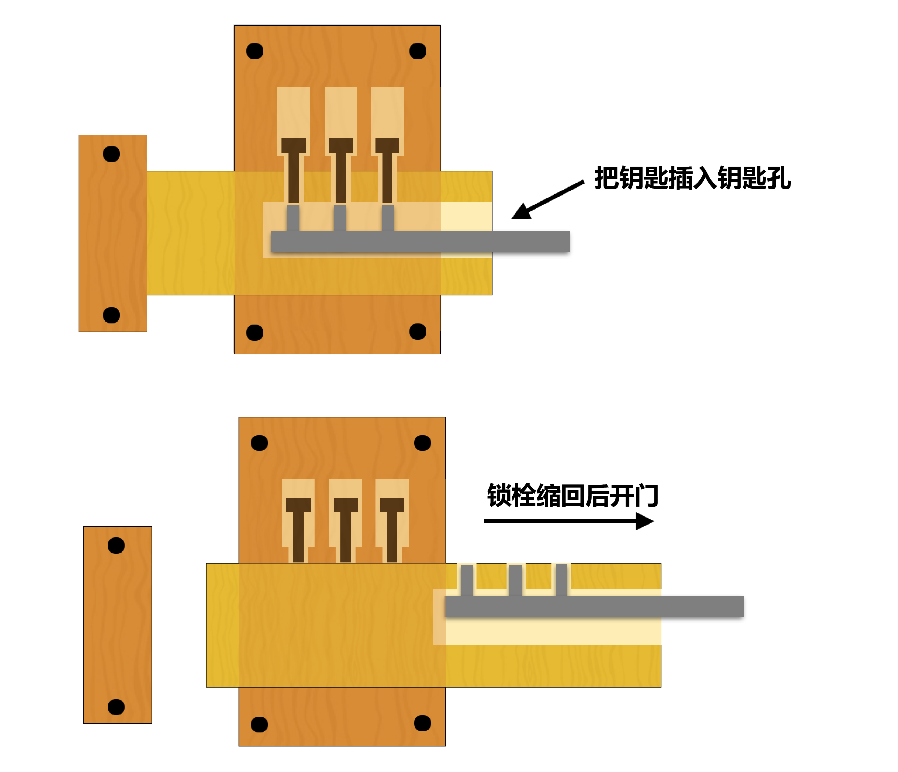
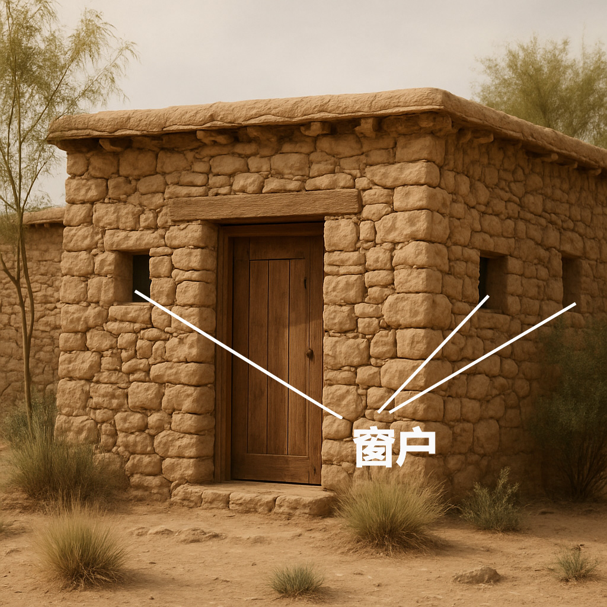

# Human-made Things in the Bible

## License Information

Human-made Things in the Bible © United Bible Societies, 2025. Adapted from: <cite>The Works of Their Hands: Man-made Things in the Bible</cite>, by Ray Pritz © 2009 United Bible Societies. This work is licensed under Creative Commons Attribution-ShareAlike 4.0 International (<a href="https://creativecommons.org/licenses/by-sa/4.0/">https://creativecommons.org/licenses/by-sa/4.0/</a>).

--------------------------------

## 标题：房子、永久性住所（house, permanent dwelling） (id: REALIA:3.1)

3\.1 标题：房子、永久性住所（house, permanent dwelling）
===========================================

经文出处
----

Hebrew 来：בַּיִת (音译：bayith)

[GEN 7:1](https://ref.ly/Gen7:1), [GEN 12:1](https://ref.ly/Gen12:1), [GEN 14:14](https://ref.ly/Gen14:14), [GEN 15:2](https://ref.ly/Gen15:2), [GEN 15:3](https://ref.ly/Gen15:3), [GEN 17:13](https://ref.ly/Gen17:13), [GEN 17:13](https://ref.ly/Gen17:13), [GEN 17:23](https://ref.ly/Gen17:23), [GEN 17:23](https://ref.ly/Gen17:23), [GEN 17:27](https://ref.ly/Gen17:27), [GEN 17:27](https://ref.ly/Gen17:27), [GEN 18:19](https://ref.ly/Gen18:19), [GEN 19:4](https://ref.ly/Gen19:4), [GEN 19:10](https://ref.ly/Gen19:10), [GEN 19:11](https://ref.ly/Gen19:11)

Greek 希：οἰκία, οἶκος (音译：oikia, oikos)

[MAT 2:11](https://ref.ly/Matt2:11), [MAT 5:15](https://ref.ly/Matt5:15), [MAT 7:24](https://ref.ly/Matt7:24), [MAT 7:25](https://ref.ly/Matt7:25), [MAT 7:26](https://ref.ly/Matt7:26), [MAT 7:27](https://ref.ly/Matt7:27), [MAT 8:6](https://ref.ly/Matt8:6), [MAT 8:14](https://ref.ly/Matt8:14), [MAT 9:6](https://ref.ly/Matt9:6), [MAT 9:7](https://ref.ly/Matt9:7)

Latin 拉：domus

[2ES 1:7](https://ref.ly/2Esd1:7), [2ES 1:35](https://ref.ly/2Esd1:35), [2ES 9:24](https://ref.ly/2Esd9:24), [2ES 10:51](https://ref.ly/2Esd10:51), [2ES 12:46](https://ref.ly/2Esd12:46), [2ES 12:49](https://ref.ly/2Esd12:49), [2ES 14:13](https://ref.ly/2Esd14:13)

描述和用途
-----

*房屋 (Image generated by ChatGPT using OpenAI technology)*

圣经时期的普通家庭住宅都很小，可能不超过40—50平方米（400—500平方英尺）。随着地点和时代的不同，房子的形状和建造材料也不同。例如，以色列人出埃及之前，在埃及的房子就不同于后来先知时期在美索不达米亚的房子，而后者又不同于新约时期在加利利的房子。如果当地有一个通称表示独户住宅，那么该词可以在整本圣经中使用。如果某种语言必须要对房屋进行具体的说明，例如，房子是用什么材料建造的，形状是什么样的，下面的讨论可以提供一些帮助。

在族长时期，埃及和迦南的房子是用泥砖建造的。这些房子是长方形的，只有一层，通常只有一个房间。地面就是夯实的干土。美索不达米亚地区的人也使用泥砖来建造房屋，一直使用到圣经时期的晚期。有时，泥砖墙会建造在石头地基上。

在王国时期，以色列人不再使用泥土建造房屋，而是改用当地的石头；不过可能在很早之前，石头就是丘陵地区的主要建筑材料。这些石头都很粗糙，没有进行加工，即未经切割或人工塑形；人们把石头一块块堆砌起来，然后用泥浆将其固定在一起。有些时候，居住区房屋的内墙会涂上灰泥，但外墙通常不做处理。

---

翻译
--

有些语言会根据住房的大小和重要性，在用词上进行明确的区分。因此，在翻译上述希伯来文、希腊文和拉丁文统称时，有必要使用一些基本等同于以下中英文单词的不同词语：“村舍”（“cottage”）、“房屋”（“house”）、“官邸”（“official residence”）、“宫殿”（“palace”）和“神庙”（“temple”）等。另参[3\.4 宫殿 (palace)\<REALIA:3\.4\>](#) 和[3\.14\.1 犹太人的圣殿 (Jewish Temple)\<REALIA:3\.14\.1\>](#) 。

在有些语言中，翻译者必须仔细区分房屋和家。“房屋”可以用来指任何居住用的建筑物，而“家”是指某人比较固定的住所。例如，在[MRK 2:1](https://ref.ly/Mark2:1) 中，瘫子被人从房顶缒下来的那所房子就是耶稣当时住的地方；也就是说，耶稣那时是“在家里”（“at home”；RSV (Revised Standard Version (1952)) 、GNT (Good News Translation (1992)) ），翻译者需要指出这一点。

下文所述的一些条目（例如地基、门楣、楼梯）是永久性私人住宅和其他建筑物的一些常见结构特征。为了方便起见，我们将其统一放在“地基、根基、基础”这个标题下面。

* **Associated Passages:** 创世记 7:1; 创世记 12:1; 创世记 14:14; 创世记 15:2; 创世记 15:3; 创世记 17:13; 创世记 17:23; 创世记 17:27; 创世记 18:19; 创世记 19:4; 创世记 19:10; 创世记 19:11; 马太福音 2:11; 马太福音 5:15; 马太福音 7:24; 马太福音 7:25; 马太福音 7:26; 马太福音 7:27; 马太福音 8:6; 马太福音 8:14; 马太福音 9:6; 马太福音 9:7; 厄斯德拉下 1:7; 厄斯德拉下 1:35; 厄斯德拉下 9:24; 厄斯德拉下 10:51; 厄斯德拉下 12:46; 厄斯德拉下 12:49; 厄斯德拉下 14:13; 马可福音 2:1

* **Associated ACAI Concepts:** House (ID: `realia:House`)

## 标题：地基、根基、基础（foundation） (id: REALIA:3.1.1)

3\.1\.1 标题：地基、根基、基础（foundation）
===============================

经文出处
----

Aramaic 兰：אֹשׁ (音译：’osh)

[EZR 4:12](https://ref.ly/Ezra4:12), [EZR 5:16](https://ref.ly/Ezra5:16), [EZR 6:3](https://ref.ly/Ezra6:3)

Hebrew 来：אָשְׁיָה (音译：’oshyah)

[JER 50:15](https://ref.ly/Jer50:15)

Hebrew 来：יסד, יְסוֹד, יְסוּדָה, מוֹסָד, מוֹסָדָה, מוּסָדָה, מַסָּד (音译：yasad（动词）, ysod, ysudah, mosad, musad, mosadah, musadah, masad)

[DEU 32:22](https://ref.ly/Deut32:22), [JOS 6:26](https://ref.ly/Josh6:26), [2SA 22:8](https://ref.ly/2Sam22:8), [2SA 22:16](https://ref.ly/2Sam22:16), [1KI 5:31](https://ref.ly/1Kgs5:31), [1KI 6:37](https://ref.ly/1Kgs6:37), [1KI 7:9](https://ref.ly/1Kgs7:9), [1KI 7:10](https://ref.ly/1Kgs7:10), [1KI 16:34](https://ref.ly/1Kgs16:34)

Hebrew 来：מָכוֹן (音译：makon)

[PSA 104:5](https://ref.ly/Ps104:5)

Hebrew 来：סַף (音译：saf)

[AMO 9:1](https://ref.ly/Amos9:1)

Greek 希：θεμέλιον, θεμέλιος, θεμελιόω (音译：themelion, themelios, themelioō（动词）)

[MAT 7:25](https://ref.ly/Matt7:25), [LUK 6:48](https://ref.ly/Luke6:48), [LUK 6:49](https://ref.ly/Luke6:49), [LUK 14:29](https://ref.ly/Luke14:29)

Greek 希：ὑποβάλλω (音译：hupoballō（动词）)

[1ES 2:14](https://ref.ly/1Esd2:14)

Latin 拉：fundamentum

[2ES 16:12](https://ref.ly/2Esd16:12), [2ES 6:15](https://ref.ly/2Esd6:15), [2ES 10:27](https://ref.ly/2Esd10:27), [2ES 10:53](https://ref.ly/2Esd10:53), [2ES 15:23](https://ref.ly/2Esd15:23), [2ES 16:12](https://ref.ly/2Esd16:12)

描述
--

*地基的房角石 (© Ray Pritz by United Bible Societies)*

地基是一个坚固的支撑层，建筑物的墙或整个建筑物就在其上建造起来。地基是由并排安放的大石头所建成。

---

翻译
--

在有些语言中，可以把古代典型的“地基”描述为“墙下面的大石头”。然而，在其他一些语言中，这种表述可能毫无意义，因为只有把桩子深深打入地下才能使地基稳固。在这些语言中，翻译者最好从功能的角度来描述地基，比如“使墙稳固的东西”、“使墙不移动的东西”或“在墙下面的东西”。

在世界上的许多地方，人们在建造房屋时，通常并不奠定地基，也不使用石头或砖。因此，在翻译新约中“根基”的比喻时，可能会遇到一些困难。在这些情况下，“根基”可以译为“在其上建造房屋的坚固（或牢固）基础”、“人们在建造石头房子前打好的基础”或“房屋的根基”。

[JER 50:15](https://ref.ly/Jer50:15) ：这节经文中的希伯来文*’ashwiyoth* 可以译为“堡垒”（“bulwarks”；RSV (Revised Standard Version (1952)) 、NRSV (New Revised Standard Version (1989)) ）、“塔楼”（“towers”；NCV (New Century Version) 、NIV (New International Version (1984)) 、CEV (Contemporary English Version) ）。GNT (Good News Translation (1992)) 未译出该词，而是在脚注中说明该希伯来文词语的意思不确定。关于这个词语的意思，解经家们有不同的意见。一些解经家建议使用“地基”一词，并把它与[EZR 4:12](https://ref.ly/Ezra4:12) 、[EZR 5:16](https://ref.ly/Ezra5:16) 中的相关亚兰文词语进行比较。其他解经家则指出，说地基会“坍塌”是不正确的。这些解经家认为，最好把*’ashwiyoth* 看作一个泛指城市“防御工事”的词语。

[AMO 9:1](https://ref.ly/Amos9:1) ：这节经文中的希伯来文*sipim* 意思不确定。在希伯来文本中，这里明显是指某个东西因为受到击打而震动，但被震动的东西到底是什么，不同译本的理解非常不同：“门槛”（“thresholds”；RSV (Revised Standard Version (1952)) 、AT (American Translation (Goodspeed, 1935)) ）、“门楣”（“lintels”；TOT ）、“门柱”（“doorjambs”；NAB (New American Bible (1970)) ）、“天花板”（“ceiling”；Mft (Moffatt Translation (1926)) ）、“整个门廊”（“whole porch”；NEB (New English Bible (1970)) ），以及“地基”（“foundation”；GNT (Good News Translation (1992)) ）。这个希伯来文词语可能是指地基或屋顶结构。然而，这节经文描绘了整栋建筑从屋顶到地基都在震动直至倒塌的情景。翻译者必须清楚表达这一点，具体的措辞则取决于后续经文的翻译。

* **Associated Passages:** 以斯拉记 4:12; 以斯拉记 5:16; 以斯拉记 6:3; 耶利米书 50:15; 申命记 32:22; 约书亚记 6:26; 撒母耳记下 22:8; 撒母耳记下 22:16; 列王纪上 5:31; 列王纪上 6:37; 列王纪上 7:9; 列王纪上 7:10; 列王纪上 16:34; 诗篇 104:5; 阿摩司书 9:1; 马太福音 7:25; 路加福音 6:48; 路加福音 6:49; 路加福音 14:29; 厄斯德拉上 2:14; 厄斯德拉下 16:12; 厄斯德拉下 6:15; 厄斯德拉下 10:27; 厄斯德拉下 10:53; 厄斯德拉下 15:23

* **Associated ACAI Concepts:** Foundation (ID: `realia:Foundation`)

## 标题：房角石、拱心石、压顶石（cornerstone, keystone, capstone） (id: REALIA:3.1.1.1)

3\.1\.1\.1 标题：房角石、拱心石、压顶石（cornerstone, keystone, capstone）
==========================================================

经文出处
----

Hebrew 来：אֶבֶן, פִנָּה (音译：’even pinah)

[JOB 38:6](https://ref.ly/Job38:6)

Hebrew 来：אֶבֶן, רֹאשָׁה (音译：’even ro’shah)

[ZEC 4:7](https://ref.ly/Zech4:7)

Hebrew 来：פִנָּה (音译：pinah)

[ISA 28:16](https://ref.ly/Isa28:16), [ZEC 10:4](https://ref.ly/Zech10:4)

Hebrew 来：רֹאשׁ פִּנָּה (音译：ro’sh pinah)

[PSA 118:22](https://ref.ly/Ps118:22)

Greek 希：ἀκρογωνιαῖος (音译：akrogōniaios)

[EPH 2:20](https://ref.ly/Eph2:20), [1PE 2:6](https://ref.ly/1Pet2:6)

Greek 希：κεφαλή, γωνία (音译：kefalē gōnias)

[MAT 21:42](https://ref.ly/Matt21:42), [MRK 12:10](https://ref.ly/Mark12:10), [LUK 20:17](https://ref.ly/Luke20:17), [ACT 4:11](https://ref.ly/Acts4:11), [1PE 2:7](https://ref.ly/1Pet2:7)

描述和用途
-----

*拱心石 (© Ray Pritz by United Bible Societies)*

在石头建筑物中，房角石是奠基的第一块石头（参[3\.1\.1 地基、根基、基础 (foundation)\<REALIA:3\.1\.1\>](#) 中的插图）。它的朝向决定了整个建筑的方向，而它在地基中的位置则意味着它为整个建筑物提供支撑。

拱心石或压顶石是拱门等建筑结构最后放置的一块石头。曾经有一个时期，建筑物的石头并不是靠砂浆或其他材料粘结在一起的，放置在关键位置的拱心石使整个建筑结构成为一个稳固的整体。

---

翻译
--

在大多数情况下，我们很难准确说明以上所列希伯来文和希腊文词语指的是哪种石头。所论石头可能是指古代建筑中，延伸到建筑物拐角转角的大石头。还有些人认为这些词语指的是“拱心石”，即拱门顶端的那块石头。（事实上，这些词语很可能是指耶路撒冷圣殿所用的那种石头，因此它们更有可能是指房角石，而不是尖顶或拱门上的压顶石。）

*房角石，房角的顶部 (Image generated by ChatGPT using OpenAI technology)*

新约中的希腊文*kefalē gōnias* 引自旧约中的[PSA 118:22](https://ref.ly/Ps118:22) ，无论这个短语的确切含义是什么，它的基本意思都是毫无疑问的；基督被比作建筑物中最重要的那块石头，为整座建筑提供凝聚力和支撑。因此在大多数语言中，最好把这个短语译为“最重要的石头”或“使整座建筑稳固的石头”。这些译法描述了*kefalē gōnias* 的功能和意义，而又没有试图指明具体的位置和形式。

当翻译者使用这种扩展译法时，用隐喻或明喻来进行翻译会容易得多，因为比喻能清楚表明比较的内容。[EPH 2:20](https://ref.ly/Eph2:20) 可以译为，“你们也是建筑物的一部分。使徒和先知奠定了建筑物的根基，而使建筑物稳固的石头就是基督耶稣自己。”或者译为，“你们也好像是使徒和先知立定根基的建筑物的一部分，而基督耶稣是保证建筑物稳固的那块重要石头。”

[JOB 38:6](https://ref.ly/Job38:6) ：在房角石不为人知的地方，可以把这节经文的第二行译为，“谁把它放在了合适的位置？”或“谁预备好了该放置它的地方？”

[ZEC 10:4](https://ref.ly/Zech10:4) ：有人认为希伯来文*pinah* （字面意为“角落”）在这里指的是城墙上的角楼或碉堡（比较[2CH 26:15](https://ref.ly/2Chr26:15) ；[NEH 3:24](https://ref.ly/Neh3:24) ）。但在我们查阅的译本中，没有任何一个译本依循这种解释。有些译本（如DUCL (Dutch Common Language Version) ）认为该词是指军事领袖，并据此进行翻译。在很早以前，人们就认为这节经文是预表弥赛亚。有些英文译本试图通过首字母大写（Cornerstone，“房角石”）来反映这一点。这种视觉上的暗示对大多数读者来说都是不明显的，而且对于聆听经文的听者来说，这种视觉暗示毫无作用。如果按照字面意思来翻译这节经文开头的两个希伯来文词语（“房角石必从他们而出”；如RSV (Revised Standard Version (1952)) 的译法），这在有些语言中是无法理解的。译文最好能够表明，该预言与一个领袖有关。可以译为“统治者、领袖和官长必从他们而出，治理我的百姓”（GNT (Good News Translation (1992)) 直译）、“必有领袖从这群羊而出，他们必如房角石、帐棚橛和争战的兵器那样坚强有力”（CEV (Contemporary English Version) 直译），两者都是这节经文的翻译范例。

* **Associated Passages:** 约伯记 38:6; 撒迦利亚书 4:7; 以赛亚书 28:16; 撒迦利亚书 10:4; 诗篇 118:22; 以弗所书 2:20; 彼得前书 2:6; 马太福音 21:42; 马可福音 12:10; 路加福音 20:17; 使徒行传 4:11; 彼得前书 2:7; 历代志下 26:15; 尼希米记 3:24

* **Associated ACAI Concepts:** Cornerstone (ID: `realia:Cornerstone`)

## 标题：门、门口（door, doorway） (id: REALIA:3.1.2)

3\.1\.2 标题：门、门口（door, doorway）
==============================

经文出处
----

Hebrew 来：דַּל, דֶּלֶת (音译：dal, dalah, deleth)

[GEN 19:6](https://ref.ly/Gen19:6), [GEN 19:9](https://ref.ly/Gen19:9), [GEN 19:10](https://ref.ly/Gen19:10), [EXO 21:6](https://ref.ly/Exod21:6)

Hebrew 来：סַף (音译：saf)

[2KI 12:10](https://ref.ly/2Kgs12:10), [2KI 22:4](https://ref.ly/2Kgs22:4), [2KI 23:4](https://ref.ly/2Kgs23:4), [2KI 25:18](https://ref.ly/2Kgs25:18), [1CH 9:19](https://ref.ly/1Chr9:19), [1CH 9:22](https://ref.ly/1Chr9:22), [2CH 23:4](https://ref.ly/2Chr23:4), [2CH 34:9](https://ref.ly/2Chr34:9), [EST 2:21](https://ref.ly/Esth2:21), [EST 6:2](https://ref.ly/Esth6:2), [ISA 6:4](https://ref.ly/Isa6:4), [JER 35:4](https://ref.ly/Jer35:4), [JER 52:24](https://ref.ly/Jer52:24), [EZK 41:16](https://ref.ly/Ezek41:16), [EZK 41:16](https://ref.ly/Ezek41:16)

Hebrew 来：ספף (音译：safaf（动词）)

[PSA 84:11](https://ref.ly/Ps84:11)

Hebrew 来：פֶּתַח (音译：pethach)

[GEN 4:7](https://ref.ly/Gen4:7), [GEN 6:16](https://ref.ly/Gen6:16), [GEN 18:1](https://ref.ly/Gen18:1), [GEN 18:2](https://ref.ly/Gen18:2), [GEN 18:10](https://ref.ly/Gen18:10), [GEN 19:6](https://ref.ly/Gen19:6), [GEN 19:11](https://ref.ly/Gen19:11), [GEN 19:11](https://ref.ly/Gen19:11), [GEN 43:19](https://ref.ly/Gen43:19), [EXO 12:22](https://ref.ly/Exod12:22), [EXO 12:23](https://ref.ly/Exod12:23), [EXO 26:36](https://ref.ly/Exod26:36), [EXO 29:4](https://ref.ly/Exod29:4), [EXO 29:11](https://ref.ly/Exod29:11), [EXO 29:32](https://ref.ly/Exod29:32), [EXO 29:42](https://ref.ly/Exod29:42), [EXO 33:8](https://ref.ly/Exod33:8), [EXO 33:9](https://ref.ly/Exod33:9), [EXO 33:10](https://ref.ly/Exod33:10), [EXO 33:10](https://ref.ly/Exod33:10), [EXO 35:15](https://ref.ly/Exod35:15), [EXO 35:15](https://ref.ly/Exod35:15), [EXO 36:37](https://ref.ly/Exod36:37), [EXO 38:8](https://ref.ly/Exod38:8), [EXO 38:30](https://ref.ly/Exod38:30), [EXO 39:38](https://ref.ly/Exod39:38), [EXO 40:5](https://ref.ly/Exod40:5), [EXO 40:6](https://ref.ly/Exod40:6), [EXO 40:12](https://ref.ly/Exod40:12), [EXO 40:28](https://ref.ly/Exod40:28), [EXO 40:29](https://ref.ly/Exod40:29), [LEV 1:3](https://ref.ly/Lev1:3), [LEV 1:5](https://ref.ly/Lev1:5), [LEV 3:2](https://ref.ly/Lev3:2), [LEV 4:4](https://ref.ly/Lev4:4), [LEV 4:7](https://ref.ly/Lev4:7), [LEV 4:18](https://ref.ly/Lev4:18), [LEV 8:3](https://ref.ly/Lev8:3), [LEV 8:4](https://ref.ly/Lev8:4), [LEV 8:31](https://ref.ly/Lev8:31), [LEV 8:33](https://ref.ly/Lev8:33), [LEV 8:35](https://ref.ly/Lev8:35), [LEV 10:7](https://ref.ly/Lev10:7), [LEV 12:6](https://ref.ly/Lev12:6), [LEV 14:11](https://ref.ly/Lev14:11), [LEV 14:23](https://ref.ly/Lev14:23), [LEV 14:38](https://ref.ly/Lev14:38), [LEV 15:14](https://ref.ly/Lev15:14), [LEV 15:29](https://ref.ly/Lev15:29), [LEV 16:7](https://ref.ly/Lev16:7), [LEV 17:4](https://ref.ly/Lev17:4), [LEV 17:5](https://ref.ly/Lev17:5), [LEV 17:6](https://ref.ly/Lev17:6), [LEV 17:9](https://ref.ly/Lev17:9), [LEV 19:21](https://ref.ly/Lev19:21), [NUM 3:25](https://ref.ly/Num3:25), [NUM 3:26](https://ref.ly/Num3:26), [NUM 4:25](https://ref.ly/Num4:25), [NUM 6:10](https://ref.ly/Num6:10), [NUM 6:13](https://ref.ly/Num6:13), [NUM 6:18](https://ref.ly/Num6:18), [NUM 10:3](https://ref.ly/Num10:3), [NUM 11:10](https://ref.ly/Num11:10), [NUM 12:5](https://ref.ly/Num12:5), [NUM 16:18](https://ref.ly/Num16:18), [NUM 16:19](https://ref.ly/Num16:19), [NUM 16:27](https://ref.ly/Num16:27), [NUM 17:15](https://ref.ly/Num17:15), [NUM 20:6](https://ref.ly/Num20:6), [NUM 25:6](https://ref.ly/Num25:6), [NUM 27:2](https://ref.ly/Num27:2), [DEU 22:21](https://ref.ly/Deut22:21), [DEU 31:15](https://ref.ly/Deut31:15), [JOS 19:51](https://ref.ly/Josh19:51), [JDG 4:20](https://ref.ly/Judg4:20), [JDG 9:52](https://ref.ly/Judg9:52), [JDG 19:26](https://ref.ly/Judg19:26), [JDG 19:27](https://ref.ly/Judg19:27), [1SA 2:22](https://ref.ly/1Sam2:22), [2SA 11:9](https://ref.ly/2Sam11:9), [1KI 6:8](https://ref.ly/1Kgs6:8), [1KI 6:31](https://ref.ly/1Kgs6:31), [1KI 6:33](https://ref.ly/1Kgs6:33), [1KI 7:5](https://ref.ly/1Kgs7:5), [1KI 14:6](https://ref.ly/1Kgs14:6), [1KI 14:27](https://ref.ly/1Kgs14:27), [1KI 19:13](https://ref.ly/1Kgs19:13), [2KI 4:15](https://ref.ly/2Kgs4:15), [2KI 5:9](https://ref.ly/2Kgs5:9), [1CH 9:21](https://ref.ly/1Chr9:21), [2CH 4:22](https://ref.ly/2Chr4:22), [2CH 12:10](https://ref.ly/2Chr12:10), [NEH 3:20](https://ref.ly/Neh3:20), [NEH 3:21](https://ref.ly/Neh3:21), [EST 5:1](https://ref.ly/Esth5:1), [JOB 31:9](https://ref.ly/Job31:9), [JOB 31:34](https://ref.ly/Job31:34), [PSA 24:7](https://ref.ly/Ps24:7), [PSA 24:9](https://ref.ly/Ps24:9), [PRO 5:8](https://ref.ly/Prov5:8), [PRO 8:3](https://ref.ly/Prov8:3), [PRO 8:34](https://ref.ly/Prov8:34), [PRO 9:14](https://ref.ly/Prov9:14), [PRO 17:19](https://ref.ly/Prov17:19), [SNG 7:14](https://ref.ly/Song7:14), [JER 43:9](https://ref.ly/Jer43:9), [EZK 8:7](https://ref.ly/Ezek8:7), [EZK 8:8](https://ref.ly/Ezek8:8), [EZK 8:16](https://ref.ly/Ezek8:16), [EZK 33:30](https://ref.ly/Ezek33:30), [EZK 40:38](https://ref.ly/Ezek40:38), [EZK 41:2](https://ref.ly/Ezek41:2), [EZK 41:2](https://ref.ly/Ezek41:2), [EZK 41:3](https://ref.ly/Ezek41:3), [EZK 41:3](https://ref.ly/Ezek41:3), [EZK 41:3](https://ref.ly/Ezek41:3), [EZK 41:11](https://ref.ly/Ezek41:11), [EZK 41:11](https://ref.ly/Ezek41:11), [EZK 41:11](https://ref.ly/Ezek41:11), [EZK 41:17](https://ref.ly/Ezek41:17), [EZK 41:20](https://ref.ly/Ezek41:20), [EZK 42:2](https://ref.ly/Ezek42:2), [EZK 42:4](https://ref.ly/Ezek42:4), [EZK 42:11](https://ref.ly/Ezek42:11), [EZK 42:12](https://ref.ly/Ezek42:12), [EZK 42:12](https://ref.ly/Ezek42:12), [EZK 47:1](https://ref.ly/Ezek47:1), [HOS 2:17](https://ref.ly/Hos2:17)

Aramaic 兰：תְּרַע (音译：tra‘)

[DAN 3:26](https://ref.ly/Dan3:26)

Greek 希：θύρα (音译：thura)

[MAT 6:6](https://ref.ly/Matt6:6), [MAT 24:33](https://ref.ly/Matt24:33), [MAT 25:10](https://ref.ly/Matt25:10), [MRK 1:33](https://ref.ly/Mark1:33), [MRK 2:2](https://ref.ly/Mark2:2), [MRK 11:4](https://ref.ly/Mark11:4), [MRK 13:29](https://ref.ly/Mark13:29), [LUK 11:7](https://ref.ly/Luke11:7), [LUK 13:24](https://ref.ly/Luke13:24), [LUK 13:25](https://ref.ly/Luke13:25), [LUK 13:25](https://ref.ly/Luke13:25), [JHN 10:1](https://ref.ly/John10:1), [JHN 10:2](https://ref.ly/John10:2), [JHN 10:7](https://ref.ly/John10:7), [JHN 10:9](https://ref.ly/John10:9), [JHN 18:16](https://ref.ly/John18:16), [JHN 20:19](https://ref.ly/John20:19), [JHN 20:26](https://ref.ly/John20:26), [ACT 5:9](https://ref.ly/Acts5:9), [ACT 5:19](https://ref.ly/Acts5:19), [ACT 5:23](https://ref.ly/Acts5:23), [ACT 12:6](https://ref.ly/Acts12:6), [ACT 12:13](https://ref.ly/Acts12:13), [ACT 14:27](https://ref.ly/Acts14:27), [ACT 16:26](https://ref.ly/Acts16:26), [ACT 16:27](https://ref.ly/Acts16:27), [ACT 21:30](https://ref.ly/Acts21:30), [1CO 16:9](https://ref.ly/1Cor16:9), [2CO 2:12](https://ref.ly/2Cor2:12), [COL 4:3](https://ref.ly/Col4:3), [JAS 5:9](https://ref.ly/Jas5:9), [REV 3:8](https://ref.ly/Rev3:8), [REV 3:20](https://ref.ly/Rev3:20), [REV 3:20](https://ref.ly/Rev3:20), [REV 4:1](https://ref.ly/Rev4:1)

Greek 希：θύρωμα (音译：thurōma)

[SIR 14:23](https://ref.ly/Sir14:23), [LJE 1:17](https://ref.ly/EpJer1:17), [2MA 14:43](https://ref.ly/2Macc14:43)

Greek 希：θυρωρός (音译：thurōros)

[MRK 13:34](https://ref.ly/Mark13:34), [JHN 18:16](https://ref.ly/John18:16), [JHN 18:17](https://ref.ly/John18:17)

Greek 希：θυρόω (音译：thuroō（动词）)

[1MA 4:57](https://ref.ly/1Macc4:57)

描述和用途
-----

门是进入建筑物或构筑物的入口，或掩盖入口的板。门通常是木制的。门的一边固定在一根木杠上，木杠长度略微超出门的顶部和底部，将木杠两端突出的部分削尖或削成圆形，然后插在石头门楣和门槛上的凹坑或洞里，这样就可以开门或关门了。有时，门扇也会悬挂在皮革或金属做的合页上。

---

翻译
--

在有些经文中，“门”的意思只是“开口”或“门口”，不是指真正的门（参[JOB 3:10](https://ref.ly/Job3:10) ，[JOB 41:6](https://ref.ly/Job41:6) （《和》41:14）；[PSA 78:23](https://ref.ly/Ps78:23) ）。希伯来文*pethach* 一词尤其是这种用法。

“门”偶尔也用来比喻“被关在外面”；例如，CEV (Contemporary English Version) 在[JOB 38:8](https://ref.ly/Job38:8) 中译作“boundaries”（“界限”），那里上帝说要限制海的范围。同样地，诗篇作者在[PSA 141:3](https://ref.ly/Ps141:3) 中祈求主“把守我嘴唇的门”（RSV (Revised Standard Version (1952)) 直译）。在有些语言中，翻译这一行诗句时最好不要使用比喻；例如，译作“请帮助我留意我所说的话”（NCV (New Century Version) 直译）；整节经文可以合宜地译为，“每当我说话时，请帮助我警戒我的言语”（CEV (Contemporary English Version) 直译）。

*门 (Image generated by ChatGPT using OpenAI technology)*

[1KI 6:34](https://ref.ly/1Kgs6:34) 似乎有个文本上的问题，这节经文的希伯来文本提到，圣殿中有两个由两块“帷幕”构成的门。学者进行了一个很小的修订，把“帷幕”改成了“门扇”，这是大多数译本首选的读文。然而，即使在这样修订之后，文本的意思依然不清楚。许多译本解决这个难题的方法如下：“有两扇松木做的折叠门”（GNT (Good News Translation (1992)) 直译）。也有译法比较贴近字面意思，作“他还做了两道松木门，每道都有两扇，插在凹坑里面转动”（NIV (New International Version (1984)) 直译）。

亚兰文*tra‘* 在[DAN 3:26](https://ref.ly/Dan3:26) 的意思是“大门”或“门”。有些译本译为“门”（“door”；RSV (Revised Standard Version (1952)) 、GNT (Good News Translation (1992)) 、NASB (New American Standard Bible) ），有些译本译为“开口”（“opening”；NIV (New International Version (1984)) 、NCV (New Century Version) ）。这个开口有可能位于烈火窑的顶部，但更可能是在烈火窑的侧面，作为某种“门口”。

在[JHN 10:7](https://ref.ly/John10:7); [JHN 10:9](https://ref.ly/John10:9) 中，希腊文*thura* 用来喻指耶稣是获得救恩的途径。这两节经文的重点在于“门”是通道，而不在于它是封闭入口的物件。按照原文字面译成“我是羊的门”（如RSV (Revised Standard Version (1952)) ）常常会导致误解，因为这个表述指的可能是门板，而不是门口或入口，从而暗示耶稣基督的主要职能是阻止通过，而不是提供进入的通道。翻译者应该使用类似下文的表达：“我是羊进入羊圈的门／入口。”

* **Associated Passages:** 创世记 19:6; 创世记 19:9; 创世记 19:10; 出埃及记 21:6; 列王纪下 12:10; 列王纪下 22:4; 列王纪下 23:4; 列王纪下 25:18; 历代志上 9:19; 历代志上 9:22; 历代志下 23:4; 历代志下 34:9; 以斯帖记 2:21; 以斯帖记 6:2; 以赛亚书 6:4; 耶利米书 35:4; 耶利米书 52:24; 以西结书 41:16; 诗篇 84:11; 创世记 4:7; 创世记 6:16; 创世记 18:1; 创世记 18:2; 创世记 18:10; 创世记 19:11; 创世记 43:19; 出埃及记 12:22; 出埃及记 12:23; 出埃及记 26:36; 出埃及记 29:4; 出埃及记 29:11; 出埃及记 29:32; 出埃及记 29:42; 出埃及记 33:8; 出埃及记 33:9; 出埃及记 33:10; 出埃及记 35:15; 出埃及记 36:37; 出埃及记 38:8; 出埃及记 38:30; 出埃及记 39:38; 出埃及记 40:5; 出埃及记 40:6; 出埃及记 40:12; 出埃及记 40:28; 出埃及记 40:29; 利未记 1:3; 利未记 1:5; 利未记 3:2; 利未记 4:4; 利未记 4:7; 利未记 4:18; 利未记 8:3; 利未记 8:4; 利未记 8:31; 利未记 8:33; 利未记 8:35; 利未记 10:7; 利未记 12:6; 利未记 14:11; 利未记 14:23; 利未记 14:38; 利未记 15:14; 利未记 15:29; 利未记 16:7; 利未记 17:4; 利未记 17:5; 利未记 17:6; 利未记 17:9; 利未记 19:21; 民数记 3:25; 民数记 3:26; 民数记 4:25; 民数记 6:10; 民数记 6:13; 民数记 6:18; 民数记 10:3; 民数记 11:10; 民数记 12:5; 民数记 16:18; 民数记 16:19; 民数记 16:27; 民数记 17:15; 民数记 20:6; 民数记 25:6; 民数记 27:2; 申命记 22:21; 申命记 31:15; 约书亚记 19:51; 士师记 4:20; 士师记 9:52; 士师记 19:26; 士师记 19:27; 撒母耳记上 2:22; 撒母耳记下 11:9; 列王纪上 6:8; 列王纪上 6:31; 列王纪上 6:33; 列王纪上 7:5; 列王纪上 14:6; 列王纪上 14:27; 列王纪上 19:13; 列王纪下 4:15; 列王纪下 5:9; 历代志上 9:21; 历代志下 4:22; 历代志下 12:10; 尼希米记 3:20; 尼希米记 3:21; 以斯帖记 5:1; 约伯记 31:9; 约伯记 31:34; 诗篇 24:7; 诗篇 24:9; 箴言 5:8; 箴言 8:3; 箴言 8:34; 箴言 9:14; 箴言 17:19; 雅歌 7:14; 耶利米书 43:9; 以西结书 8:7; 以西结书 8:8; 以西结书 8:16; 以西结书 33:30; 以西结书 40:38; 以西结书 41:2; 以西结书 41:3; 以西结书 41:11; 以西结书 41:17; 以西结书 41:20; 以西结书 42:2; 以西结书 42:4; 以西结书 42:11; 以西结书 42:12; 以西结书 47:1; 何西阿书 2:17; 但以理书 3:26; 马太福音 6:6; 马太福音 24:33; 马太福音 25:10; 马可福音 1:33; 马可福音 2:2; 马可福音 11:4; 马可福音 13:29; 路加福音 11:7; 路加福音 13:24; 路加福音 13:25; 约翰福音 10:1; 约翰福音 10:2; 约翰福音 10:7; 约翰福音 10:9; 约翰福音 18:16; 约翰福音 20:19; 约翰福音 20:26; 使徒行传 5:9; 使徒行传 5:19; 使徒行传 5:23; 使徒行传 12:6; 使徒行传 12:13; 使徒行传 14:27; 使徒行传 16:26; 使徒行传 16:27; 使徒行传 21:30; 哥林多前书 16:9; 哥林多后书 2:12; 歌罗西书 4:3; 雅各书 5:9; 启示录 3:8; 启示录 3:20; 启示录 4:1; 德训篇 14:23; 耶利米书信 1:17; 玛加伯下 14:43; 马可福音 13:34; 约翰福音 18:17; 玛加伯上 4:57; 约伯记 3:10; 约伯记 41:6; 诗篇 78:23; 约伯记 38:8; 诗篇 141:3; 列王纪上 6:34

## 标题：锁（lock） (id: REALIA:3.1.2.1)

3\.1\.2\.1 标题：锁（lock）
=====================

经文出处
----

Hebrew 来：כַּף, מַנְעוּל (音译：kaf man‘ul)

[SNG 5:5](https://ref.ly/Song5:5)

Hebrew 来：נעל (音译：na‘al)

[JDG 3:23](https://ref.ly/Judg3:23), [JDG 3:24](https://ref.ly/Judg3:24), [2SA 13:17](https://ref.ly/2Sam13:17), [2SA 13:18](https://ref.ly/2Sam13:18)

Hebrew 来：סגר (音译：sagar)

[JDG 9:51](https://ref.ly/Judg9:51)

Greek 希：κλεῖθρον (音译：kleithron)

[LJE 1:17](https://ref.ly/EpJer1:17)

Greek 希：κλείω (音译：kleiō)

[MAT 25:10](https://ref.ly/Matt25:10), [LUK 11:7](https://ref.ly/Luke11:7), [JHN 20:19](https://ref.ly/John20:19), [JHN 20:26](https://ref.ly/John20:26), [ACT 5:23](https://ref.ly/Acts5:23), [ACT 21:30](https://ref.ly/Acts21:30), [SIR 42:6](https://ref.ly/Sir42:6), [BEL 1:14](https://ref.ly/Bel1:14)

描述和用途
-----

锁是一种用来固定门的装置，只有使用一把特殊的钥匙才能将锁打开（参[3\.1\.2\.2 钥匙 (key)\<REALIA:3\.1\.2\.2\>](#) ）。

---

翻译
--

在[SNG 5:5](https://ref.ly/Song5:5) 中，希伯来文短语*kaf man‘ul* 可能是指一个木制突起物或一根绳子，用来拉开门闩，使门打开。可以译为“门的把手”（“handle of the door”；GNT (Good News Translation (1992)) ），或“门闩的把手”（“handles of the bolt”；RSV (Revised Standard Version (1952)) 、NASB (New American Standard Bible) ），或“锁的把手”（“handles of the lock”；KJV (King James Version (1611)) ），也可以简单地译为“门”（“door”；CEV (Contemporary English Version) ）。

*门和门闩 (Image generated by ChatGPT using OpenAI technology)*

[LJE 1:18](https://ref.ly/EpJer1:18) 使用了这个不常见的希腊文，可以指锁（如RSV (Revised Standard Version (1952)) ），也可以指横着挡住门的闩（如GNT (Good News Translation (1992)) ）。

* **Associated Passages:** 雅歌 5:5; 士师记 3:23; 士师记 3:24; 撒母耳记下 13:17; 撒母耳记下 13:18; 士师记 9:51; 耶利米书信 1:17; 马太福音 25:10; 路加福音 11:7; 约翰福音 20:19; 约翰福音 20:26; 使徒行传 5:23; 使徒行传 21:30; 德训篇 42:6; 彼勒与大龙 1:14; 耶利米书信 1:18

## 标题：钥匙（key） (id: REALIA:3.1.2.2)

3\.1\.2\.2 标题：钥匙（key）
=====================

经文出处
----

Hebrew 来：מַפְתֵּחַ (音译：mafteach)

[JDG 3:25](https://ref.ly/Judg3:25), [ISA 22:22](https://ref.ly/Isa22:22)

Greek 希：κλείς (音译：kleis)

[MAT 16:19](https://ref.ly/Matt16:19), [LUK 11:52](https://ref.ly/Luke11:52), [REV 1:18](https://ref.ly/Rev1:18), [REV 3:7](https://ref.ly/Rev3:7), [REV 9:1](https://ref.ly/Rev9:1), [REV 20:1](https://ref.ly/Rev20:1)

描述和用途
-----

*罗马时代钥匙 (© Hermann Junghans, CC BY\-SA 3\.0, via Wikimedia Commons)*

钥匙是用来锁门和开门的工具。古代的钥匙通常比现在的钥匙要大很多。

---

翻译
--

*古罗马钥匙（鲁芬霍芬考古公园（Archaeological park Ruffenhofen）: 利姆塞姆（Limeseum）） (© Wolfgang Sauber, CC BY\-SA 3\.0, via Wikimedia Commons)*

钥匙并非所有人都熟知，因此，有些翻译者可能需要使用描述性的短语，例如“控制门开关的物件”。有时可以从钥匙的功能角度来翻译，例如“开锁器”或“打开锁的工具”。

除了[JDG 3:25](https://ref.ly/Judg3:25) ，上面所有提到“钥匙”的经文都是象征性的。然而，我们查阅的所有译本仍然全部使用了“钥匙”这个词。请注意，ITCL (Italian Common Language Version) 在[ISA 22:22](https://ref.ly/Isa22:22) 中扩展了译文；原文文本的字面意思是“我必将大卫家的钥匙放在他的肩上”（如RSV (Revised Standard Version (1952)) 的译法），ITCL (Italian Common Language Version) 的意大利文本意思是：“大卫宫殿中的所有权柄都必赐给他，钥匙必交给他掌管。”NLT (New Living Translation) 的译法类似，英文意为：“我必把大卫家的钥匙——王宫中最高的职位——赐给他。”

有些时候，可能无法采用“某个地方的钥匙”这种表述，例如[REV 9:1](https://ref.ly/Rev9:1) 中的“深渊”（“the abyss”；GNT (Good News Translation (1992)) ），或[MAT 16:19](https://ref.ly/Matt16:19) 中的“天国”（“the kingdom of heaven”；RSV (Revised Standard Version (1952)) ）。在这些情况下，翻译者可能需要说“……的入口的钥匙”，或者“用来打开或关闭……的门的钥匙”。

* **Associated Passages:** 士师记 3:25; 以赛亚书 22:22; 马太福音 16:19; 路加福音 11:52; 启示录 1:18; 启示录 3:7; 启示录 9:1; 启示录 20:1

* **Associated ACAI Concepts:** Key (ID: `realia:Key`)

## 标题：合页（hinge） (id: REALIA:3.1.2.3)

3\.1\.2\.3 标题：合页（hinge）
=======================

经文出处
----

Hebrew 来：גָּלִיל (音译：galil)

[1KI 6:34](https://ref.ly/1Kgs6:34), [1KI 6:34](https://ref.ly/1Kgs6:34)

Hebrew 来：פֹּת (音译：poth)

[1KI 7:50](https://ref.ly/1Kgs7:50)

Hebrew 来：צִיר (音译：tsir)

[PRO 26:14](https://ref.ly/Prov26:14)

描述和用途
-----

*房门或闸门上的金属铰链 (© Ray Pritz by United Bible Societies)*

合页是连接两个物件，使其可以自由地相对转动的装置。就门这个物件来说，合页是指门扇在顶部（门楣）和底部（门槛）进行固定的点，或者与门柱（如果有的话）固定的点，这样门扇就可以转动打开或关上。对于简单的住宅，门的合页通常只是木门一侧的上下两端的突出部分，插在石头门楣或门槛的凹坑中。比较大的门的合页是用金属做的。金属合页由三部分组成：两个页片，一片固定在门上，另一片固定在墙上或门柱上，两个页片由一根金属插销固定在一起。

翻译
--

*木合页 (© Ray Pritz by United Bible Societies)*

希伯来文*galil* 在[1KI 6:34](https://ref.ly/1Kgs6:34) 中的意思不确定。这个词与意为“旋转”的希伯来文动词有关。REB (Revised English Bible (1989)) 将这个词语解作“swivel\-pin”（“铰接销”），即合页的一种。许多译本在翻译这节令人费解的经文时，并不在译文中指明*galil* 所表示的物件具体是什么，例如把整节经文译为“有两扇松木折叠门”（GNT (Good News Translation (1992)) 直译）。

* **Associated Passages:** 列王纪上 6:34; 列王纪上 7:50; 箴言 26:14

* **Associated ACAI Concepts:** Hinge (ID: `realia:Hinge`)

## 标题：门柱（doorpost） (id: REALIA:3.1.2.4)

3\.1\.2\.4 标题：门柱（doorpost）
==========================

经文出处
----

Hebrew 来：אַמָּה (音译：’amah)

[ISA 6:4](https://ref.ly/Isa6:4)

Hebrew 来：אֹמְנָה (音译：’omnah)

[2KI 18:16](https://ref.ly/2Kgs18:16)

Hebrew 来：מְזוּזָה (音译：mzuzah)

[EXO 12:7](https://ref.ly/Exod12:7), [EXO 12:22](https://ref.ly/Exod12:22), [EXO 12:23](https://ref.ly/Exod12:23), [EXO 21:6](https://ref.ly/Exod21:6), [DEU 6:9](https://ref.ly/Deut6:9), [DEU 11:20](https://ref.ly/Deut11:20), [JDG 16:3](https://ref.ly/Judg16:3), [1SA 1:9](https://ref.ly/1Sam1:9), [1KI 6:31](https://ref.ly/1Kgs6:31), [1KI 6:33](https://ref.ly/1Kgs6:33), [1KI 7:5](https://ref.ly/1Kgs7:5), [PRO 8:34](https://ref.ly/Prov8:34), [ISA 57:8](https://ref.ly/Isa57:8), [EZK 41:21](https://ref.ly/Ezek41:21), [EZK 43:8](https://ref.ly/Ezek43:8), [EZK 43:8](https://ref.ly/Ezek43:8), [EZK 45:19](https://ref.ly/Ezek45:19), [EZK 45:19](https://ref.ly/Ezek45:19), [EZK 46:2](https://ref.ly/Ezek46:2)

Hebrew 来：סַף (音译：saf)

[2CH 3:7](https://ref.ly/2Chr3:7)

描述和用途
-----

*门柱和门楣 (Image generated by ChatGPT using OpenAI technology)*

房门和大门这类入口为长方形。门口的两侧有时会衬上木头，这样门的合页就可以固定在木头上。门柱就是门口两侧的这些柱子。门柱还可支撑门口上方的结构。

---

翻译
--

如果目标语言没有表示门框各个部分的专业词语，翻译者可以使用描述性短语，例如，[EXO 12:22](https://ref.ly/Exod12:22) 可译为“门楣和两根门柱”（RSV (Revised Standard Version (1952)) 直译），或“门框的两侧和顶部”（NCV (New Century Version) 直译）。

[2KI 18:16](https://ref.ly/2Kgs18:16) ：希伯来文*’omnah* 在整本圣经中只出现在这一处，意思不确定。其动词词根的意思是“携带、支撑”，既可以指一个大房间中的支柱，也可以指支撑门口的柱子。大多数译本都采用第二种解释，译为“门柱”。

* **Associated Passages:** 以赛亚书 6:4; 列王纪下 18:16; 出埃及记 12:7; 出埃及记 12:22; 出埃及记 12:23; 出埃及记 21:6; 申命记 6:9; 申命记 11:20; 士师记 16:3; 撒母耳记上 1:9; 列王纪上 6:31; 列王纪上 6:33; 列王纪上 7:5; 箴言 8:34; 以赛亚书 57:8; 以西结书 41:21; 以西结书 43:8; 以西结书 45:19; 以西结书 46:2; 历代志下 3:7

* **Associated ACAI Concepts:** Doorpost (ID: `realia:Doorpost`)

## 标题：门楣（lintel） (id: REALIA:3.1.2.5)

3\.1\.2\.5 标题：门楣（lintel）
========================

经文出处
----

Hebrew 来：מַשְׁקוֹף (音译：mashqof)

[EXO 12:7](https://ref.ly/Exod12:7), [EXO 12:22](https://ref.ly/Exod12:22), [EXO 12:23](https://ref.ly/Exod12:23)

描述
--

门楣是门框的顶梁（参[3\.1\.2 门、门口 (door, doorway)\<REALIA:3\.1\.2\>](#) ）。参[3\.1\.2\.4 门柱 (doorpost)\<REALIA:3\.1\.2\.4\>](#) 中的插图。

---

翻译
--

参[3\.1\.2\.4 门柱 (doorpost)\<REALIA:3\.1\.2\.4\>](#) 中的讨论。

* **Associated Passages:** 出埃及记 12:7; 出埃及记 12:22; 出埃及记 12:23

## 标题：门槛（threshold, doorsill） (id: REALIA:3.1.2.6)

3\.1\.2\.6 标题：门槛（threshold, doorsill）
=====================================

经文出处
----

Hebrew 来：סַף (音译：saf)

[JDG 19:27](https://ref.ly/Judg19:27), [1KI 14:17](https://ref.ly/1Kgs14:17), [EZK 40:6](https://ref.ly/Ezek40:6), [EZK 40:6](https://ref.ly/Ezek40:6), [EZK 40:7](https://ref.ly/Ezek40:7), [EZK 41:16](https://ref.ly/Ezek41:16), [EZK 41:16](https://ref.ly/Ezek41:16), [EZK 43:8](https://ref.ly/Ezek43:8), [EZK 43:8](https://ref.ly/Ezek43:8), [ZEP 2:14](https://ref.ly/Zeph2:14)

Hebrew 来：מִפְתָּן (音译：miftan)

[1SA 5:4](https://ref.ly/1Sam5:4), [1SA 5:5](https://ref.ly/1Sam5:5), [EZK 9:3](https://ref.ly/Ezek9:3), [EZK 10:4](https://ref.ly/Ezek10:4), [EZK 10:18](https://ref.ly/Ezek10:18), [EZK 46:2](https://ref.ly/Ezek46:2), [EZK 47:1](https://ref.ly/Ezek47:1), [ZEP 1:9](https://ref.ly/Zeph1:9)

Greek 希：χελώνις (音译：chelōnis)

[JDT 14:15](https://ref.ly/Jdt14:15)

描述
--

*门槛 (© Dietmar Rabich, CC BY\-SA 4\.0, via Wikimedia Commons)*

门槛位于门框的底部（参[3\.1\.2 门、门口 (door, doorway)\<REALIA:3\.1\.2\>](#) ），水平放置在地面上，通常用石头做成。

---

翻译
--

如果没有“门槛”的专用名称，或者人们一般不理解这个词，翻译者可能需要使用一个描述性短语；例如，[EZK 9:3](https://ref.ly/Ezek9:3) 可译为“门打开的地方”（NCV (New Century Version) 直译）。

[ZEP 1:9](https://ref.ly/Zeph1:9) ：在这节经文中，原文字面意为“所有跳过（或译：跳上）门槛的人”的短语有些含糊，并且在不同译本中的译法也很不同。该词可能是指非利士人的宗教习俗，[1SA 5:4](https://ref.ly/1Sam5:4); [1SA 5:5](https://ref.ly/1Sam5:5) 叙述了这个习俗的起源。为了反映这一点，CEV (Contemporary English Version) 译为“worshipers of pagan gods”（“敬拜异教神明的人”），并添加了一个脚注。NCV (New Century Version) 更加具体，译为“those who worship Dagon”（“那些敬拜大衮的人”），但没有添加脚注。FRCL (French Common Language Version (Bible en français courant)) 提供了另一种处理方法，将其扩展译为：“所有像异教徒一样跳过圣殿门槛的人。”FRCL (French Common Language Version (Bible en français courant)) 在脚注中包含了另一种译法：“所有登上（神圣的）平台的人。”另参《〈那鸿书〉、〈哈巴谷书〉和〈西番雅书〉手册》（*A Handbook on The Books of Nahum, Habakkuk, and Zephaniah* ）第152—153页的讨论。

*门槛 (Image generated by ChatGPT using OpenAI technology)*

[JDT 14:15](https://ref.ly/Jdt14:15) 中的希腊文*chelōnis* 意思比较模糊。NJB (New Jerusalem Bible (1985)) 译作“threshold”（“门槛”），这也是利德尔—斯科特（Liddell\&Scott）给出的定义。我们从[JDT 13:9](https://ref.ly/Jdt13:9) 中知道，友弟德把敖罗斐乃的尸体从床上翻下来，也就是说尸体是躺在地上的。因此，许多译本在《次经‧犹滴传》14:15（《思》《友弟德传》）中把*chelōnis* 译为“地板”（“floor”；ITCL (Italian Common Language Version) 、NAB (New American Bible (1970)) ），这种译法似乎更可取。

* **Associated Passages:** 士师记 19:27; 列王纪上 14:17; 以西结书 40:6; 以西结书 40:7; 以西结书 41:16; 以西结书 43:8; 西番雅书 2:14; 撒母耳记上 5:4; 撒母耳记上 5:5; 以西结书 9:3; 以西结书 10:4; 以西结书 10:18; 以西结书 46:2; 以西结书 47:1; 西番雅书 1:9; 友弟德传 14:15; 友弟德传 13:9

## 标题：房屋或建筑群的大门或大门入口（gate or gateway to house or building complex） (id: REALIA:3.1.3)

3\.1\.3 标题：房屋或建筑群的大门或大门入口（gate or gateway to house or building complex）
=======================================================================

经文出处
----

Hebrew 来：אַיִל (音译：’ayil)

[1KI 6:31](https://ref.ly/1Kgs6:31), [EZK 40:9](https://ref.ly/Ezek40:9), [EZK 40:9](https://ref.ly/Ezek40:9), [EZK 40:10](https://ref.ly/Ezek40:10), [EZK 40:14](https://ref.ly/Ezek40:14), [EZK 40:14](https://ref.ly/Ezek40:14), [EZK 40:16](https://ref.ly/Ezek40:16), [EZK 40:16](https://ref.ly/Ezek40:16), [EZK 40:21](https://ref.ly/Ezek40:21), [EZK 40:21](https://ref.ly/Ezek40:21), [EZK 40:24](https://ref.ly/Ezek40:24), [EZK 40:24](https://ref.ly/Ezek40:24), [EZK 40:26](https://ref.ly/Ezek40:26), [EZK 40:26](https://ref.ly/Ezek40:26), [EZK 40:29](https://ref.ly/Ezek40:29), [EZK 40:29](https://ref.ly/Ezek40:29), [EZK 40:31](https://ref.ly/Ezek40:31), [EZK 40:31](https://ref.ly/Ezek40:31), [EZK 40:33](https://ref.ly/Ezek40:33), [EZK 40:34](https://ref.ly/Ezek40:34), [EZK 40:34](https://ref.ly/Ezek40:34), [EZK 40:36](https://ref.ly/Ezek40:36), [EZK 40:36](https://ref.ly/Ezek40:36), [EZK 40:37](https://ref.ly/Ezek40:37), [EZK 40:37](https://ref.ly/Ezek40:37), [EZK 40:37](https://ref.ly/Ezek40:37), [EZK 40:37](https://ref.ly/Ezek40:37), [EZK 40:38](https://ref.ly/Ezek40:38), [EZK 40:48](https://ref.ly/Ezek40:48), [EZK 40:49](https://ref.ly/Ezek40:49), [EZK 41:1](https://ref.ly/Ezek41:1), [EZK 41:3](https://ref.ly/Ezek41:3)

Hebrew 来：פֶּתַח (音译：pethach)

[2SA 11:9](https://ref.ly/2Sam11:9), [1KI 14:27](https://ref.ly/1Kgs14:27), [2CH 12:10](https://ref.ly/2Chr12:10), [JER 43:9](https://ref.ly/Jer43:9), [EZK 8:7](https://ref.ly/Ezek8:7)

Hebrew 来：פֶּתֶח, שַׁעַר (音译：pethach sha‘ar)

[JDG 18:16](https://ref.ly/Judg18:16), [JDG 18:17](https://ref.ly/Judg18:17), [JER 36:10](https://ref.ly/Jer36:10), [EZK 8:3](https://ref.ly/Ezek8:3), [EZK 8:14](https://ref.ly/Ezek8:14), [EZK 10:19](https://ref.ly/Ezek10:19), [EZK 11:1](https://ref.ly/Ezek11:1), [EZK 40:11](https://ref.ly/Ezek40:11), [EZK 40:40](https://ref.ly/Ezek40:40), [EZK 46:3](https://ref.ly/Ezek46:3)

Hebrew 来：שַׁעַר (音译：sha‘ar)

[EST 2:19](https://ref.ly/Esth2:19), [EST 2:21](https://ref.ly/Esth2:21), [EST 3:2](https://ref.ly/Esth3:2), [EST 3:3](https://ref.ly/Esth3:3), [EST 4:2](https://ref.ly/Esth4:2), [EST 4:2](https://ref.ly/Esth4:2), [EST 4:6](https://ref.ly/Esth4:6), [EST 5:9](https://ref.ly/Esth5:9), [EST 5:13](https://ref.ly/Esth5:13), [EST 6:10](https://ref.ly/Esth6:10), [EST 6:12](https://ref.ly/Esth6:12), [EZK 40:3](https://ref.ly/Ezek40:3), [EZK 40:6](https://ref.ly/Ezek40:6), [EZK 40:6](https://ref.ly/Ezek40:6), [EZK 40:8](https://ref.ly/Ezek40:8), [EZK 40:11](https://ref.ly/Ezek40:11), [EZK 40:11](https://ref.ly/Ezek40:11), [EZK 40:14](https://ref.ly/Ezek40:14)

Hebrew 来：שַׁעַר, אִיתוֹן (音译：sha‘ar ’iton)

[EZK 40:15](https://ref.ly/Ezek40:15)

Greek 希：προαύλιον (音译：proaulion)

[MRK 14:68](https://ref.ly/Mark14:68)

Greek 希：πυλών (音译：pulōn)

[MAT 26:71](https://ref.ly/Matt26:71), [LUK 16:20](https://ref.ly/Luke16:20), [ACT 10:17](https://ref.ly/Acts10:17), [ACT 12:13](https://ref.ly/Acts12:13), [ACT 12:14](https://ref.ly/Acts12:14), [ACT 12:14](https://ref.ly/Acts12:14)

描述
--

大门入口是指进入房屋或其他建筑物庭院的入口区域。

---

翻译
--

[EZK 40:0](https://ref.ly/Ezek40:0) —[EZK 41:0](https://ref.ly/Ezek41:0) ：这两章经文详细描述了在以西结的异象中，进入圣殿的一个很大的入口建筑群。这个入口建筑群由9到10个不同的房间或区域组成，其中一些房间或区域用了不止一个词语来描述。如果没有图表的帮助，读者可能很难理解作者对入口建筑群和整座圣殿的叙事性描述。翻译者应考虑使用类似本手册提供的以西结圣殿的示意图（参[3\.14\.1 犹太人的圣殿 (Jewish Temple)\<REALIA:3\.14\.1\>](#) ）。

希伯来文*’ayil* 在[EZK 40:0](https://ref.ly/Ezek40:0) —[EZK 41:0](https://ref.ly/Ezek41:0) 中的意思存在争议。有些译本把它理解为与墙或入口两边齐平的一根柱子；例如，RSV (Revised Standard Version (1952)) 译为“jambs”（“门的侧柱”；参[3\.1\.2\.4 门柱 (doorpost)\<REALIA:3\.1\.2\.4\>](#) ）。在这种情况下，它只构成入口的一部分，但可以理解为它代表整个入口。

在[MAT 26:71](https://ref.ly/Matt26:71) 中，RSV (Revised Standard Version (1952)) 把希腊文*pulōn* 译为“porch”（“门廊”）。对于美式英语的读者来说，这种译法可能会让读者产生误解。GNT (Good News Translation (1992)) 译为“entrance of the courtyard”（“庭院入口”）是更好的。此外也可以译成“入口”或“通道”。

[ACT 12:13](https://ref.ly/Acts12:13) ：在这节经文中，彼得敲“*pulōn* 门”，然后在外面等人把门打开。这个门或者是从街道进入内院的门，或者是大门主门旁边的一道小门，从而不需要打开主门便可进去。NASB (New American Standard Bible) 译成“the door of the gate”（“大门的门”）虽然准确，但不太清楚。大多数译本将这个词译为“外门”或“外面的门”。有些语言可能有专门称呼这种特殊的门的词语，例如，GECL (German Common Language Version (Gute Nachricht Bibel)) 使用了一个意为“庭院门”的德文词语。SPCL (Spanish Common Language Version (Dios Habla Hoy)) 的“街道入口”也可以作为翻译范例。

* **Associated Passages:** 列王纪上 6:31; 以西结书 40:9; 以西结书 40:10; 以西结书 40:14; 以西结书 40:16; 以西结书 40:21; 以西结书 40:24; 以西结书 40:26; 以西结书 40:29; 以西结书 40:31; 以西结书 40:33; 以西结书 40:34; 以西结书 40:36; 以西结书 40:37; 以西结书 40:38; 以西结书 40:48; 以西结书 40:49; 以西结书 41:1; 以西结书 41:3; 撒母耳记下 11:9; 列王纪上 14:27; 历代志下 12:10; 耶利米书 43:9; 以西结书 8:7; 士师记 18:16; 士师记 18:17; 耶利米书 36:10; 以西结书 8:3; 以西结书 8:14; 以西结书 10:19; 以西结书 11:1; 以西结书 40:11; 以西结书 40:40; 以西结书 46:3; 以斯帖记 2:19; 以斯帖记 2:21; 以斯帖记 3:2; 以斯帖记 3:3; 以斯帖记 4:2; 以斯帖记 4:6; 以斯帖记 5:9; 以斯帖记 5:13; 以斯帖记 6:10; 以斯帖记 6:12; 以西结书 40:3; 以西结书 40:6; 以西结书 40:8; 以西结书 40:15; 马可福音 14:68; 马太福音 26:71; 路加福音 16:20; 使徒行传 10:17; 使徒行传 12:13; 使徒行传 12:14; 以西结书 40:0; 以西结书 41:0

## 标题：窗户（window） (id: REALIA:3.1.4)

3\.1\.4 标题：窗户（window）
=====================

经文出处
----

Hebrew 来：אֲרֻבָּה (音译：’arubah)

[GEN 7:11](https://ref.ly/Gen7:11), [GEN 8:2](https://ref.ly/Gen8:2), [2KI 7:2](https://ref.ly/2Kgs7:2), [2KI 7:19](https://ref.ly/2Kgs7:19), [ECC 12:3](https://ref.ly/Eccl12:3), [ISA 24:18](https://ref.ly/Isa24:18), [ISA 60:8](https://ref.ly/Isa60:8), [HOS 13:3](https://ref.ly/Hos13:3), [MAL 3:10](https://ref.ly/Mal3:10)

Hebrew 来：חַלּוֹן (音译：chalon)

[GEN 8:6](https://ref.ly/Gen8:6), [GEN 26:8](https://ref.ly/Gen26:8), [JOS 2:15](https://ref.ly/Josh2:15), [JOS 2:18](https://ref.ly/Josh2:18), [JOS 2:21](https://ref.ly/Josh2:21)

Aramaic 兰：כַּוָּה (音译：kawah)

[DAN 6:11](https://ref.ly/Dan6:11)

Hebrew 来：צֹהַר (音译：tsohar)

[GEN 6:16](https://ref.ly/Gen6:16)

Hebrew 来：שֶׁקֶף, שְׁקֻפִים (音译：sheqef, shqufim)

[1KI 6:4](https://ref.ly/1Kgs6:4), [1KI 7:4](https://ref.ly/1Kgs7:4), [1KI 7:5](https://ref.ly/1Kgs7:5)

Greek 希：θυρίς (音译：thuris)

[ACT 20:9](https://ref.ly/Acts20:9), [2CO 11:33](https://ref.ly/2Cor11:33), [TOB 3:11](https://ref.ly/Tob3:11), [SIR 14:23](https://ref.ly/Sir14:23), [2MA 3:19](https://ref.ly/2Macc3:19), [DAG 6:11](https://ref.ly/INVALID)

描述和用途
-----

*窗户 (Image generated by ChatGPT using OpenAI technology)*

窗户是墙上的一个开口，可以让光和空气进来，也可以让人看到里面或外面。

---

翻译
--

在有些语言中，那些可以用玻璃或百叶窗关上的窗户，与那些只是作为开口的窗户是有区别的。[HOS 13:3](https://ref.ly/Hos13:3) 、[ACT 20:9](https://ref.ly/Acts20:9) 和[2CO 11:33](https://ref.ly/2Cor11:33) 中提到的可能是后者，而[GEN 6:16](https://ref.ly/Gen6:16); [GEN 8:6](https://ref.ly/Gen8:6) 和[DAN 6:11](https://ref.ly/Dan6:11) （《和》6:10）显然是指前者。一般来说，翻译者应该避免使用表示用玻璃做成的“窗户”的词语，因为古代世界的窗户不是玻璃做的。

希伯来文*’arubah* 出现在短语“windows of heaven”（“天的窗户”；[GEN 7:11](https://ref.ly/Gen7:11); [GEN 8:2](https://ref.ly/Gen8:2); [ISA 24:18](https://ref.ly/Isa24:18); [MAL 3:10](https://ref.ly/Mal3:10) ）和“windows in heaven”（“天上的窗户”；[2KI 7:2](https://ref.ly/2Kgs7:2); [2KI 7:19](https://ref.ly/2Kgs7:19) ）中。GNT (Good News Translation (1992)) 对这些短语采用了字面直译，但翻译者不一定要这样。在[GEN 7:11](https://ref.ly/Gen7:11); [GEN 8:2](https://ref.ly/Gen8:2) 中，GNT (Good News Translation (1992)) 把第一个短语译为“floodgates of the sky”（“天空的闸门”），在[ISA 24:18](https://ref.ly/Isa24:18) 中译为“Torrents of rain …… from the sky”（“从天而降的瓢泼大雨”）。对于[2KI 7:2](https://ref.ly/2Kgs7:2) 中字面意思为“耶和华若亲自在天上打开窗户”的短语，GNT (Good News Translation (1992)) 译为“even if the LORD himself were to send grain”（“即使耶和华亲自送来粮食”）。

关于[2KI 7:2](https://ref.ly/2Kgs7:2) 中*’arubah* 的意思，学者意见不一。有些译本按照原文字面翻译为“那些从窗户往外看的（女）人”（如SPCL (Spanish Common Language Version (Dios Habla Hoy)) 、TOB (Traduction Oecuménique de la Bible (French, 1975)) 、NIV (New International Version (1984)) ），而其他译本则认为该词是指眼睛（CEV (Contemporary English Version) 直译“你的视线”；GNT (Good News Translation (1992)) 、NCV (New Century Version) 、GECL (German Common Language Version (Gute Nachricht Bibel)) 直译“你的眼睛”）。

[1KI 6:4](https://ref.ly/1Kgs6:4) 中的希伯来文短语*chalone shqufim ’atumim* 有多种理解。有些译本使用了表示某种特定建筑特征的专业术语；例如，把整节经文译为“他为殿做了漏斗状的斜面墙”（REB (Revised English Bible (1989)) 直译），或“他在殿里做了窄天窗”（NIV (New International Version (1984)) 直译）。从建筑学角度来说，这两个例子使用的词语是正确的，但对读者来说晦涩难懂，因此通俗译本应该避免这种译法。音译希伯来文词语也会是差不多的结果。有些译本认为这些窗户上覆盖着某种“格子”、“网格”或“格栅”（比较SPCL (Spanish Common Language Version (Dios Habla Hoy)) ）。还有译本认为这个短语描述的是墙上窗户的结构；例如，“殿的墙上有开口，开口的外面比里面窄”（GNT (Good News Translation (1992)) 直译），或“窗户的外面窄、里面宽”（CEV (Contemporary English Version) 直译）。有译本认为这里描述的是窗户的某种“框架”：“他为圣殿的窗户做了嵌入式框架”（RSV (Revised Standard Version (1952)) 直译）。NJB (New Jerusalem Bible (1985)) 把上述两种元素结合起来，英文意为“他给圣殿窗户做了框架和格子”。翻译者要记住，这些开口的目的是让圣殿内部更亮一些，否则里面会比较昏暗。许多译本添加了脚注，指出这里的希伯来文意思不确定。

* **Associated Passages:** 创世记 7:11; 创世记 8:2; 列王纪下 7:2; 列王纪下 7:19; 传道书 12:3; 以赛亚书 24:18; 以赛亚书 60:8; 何西阿书 13:3; 玛拉基书 3:10; 创世记 8:6; 创世记 26:8; 约书亚记 2:15; 约书亚记 2:18; 约书亚记 2:21; 但以理书 6:11; 创世记 6:16; 列王纪上 6:4; 列王纪上 7:4; 列王纪上 7:5; 使徒行传 20:9; 哥林多后书 11:33; 多俾亚传 3:11; 德训篇 14:23; 玛加伯下 3:19; 但以理书（希腊文） 6:11

* **Associated ACAI Concepts:** Window (ID: `realia:Window`)

## 标题：屋顶、房顶（roof, housetop） (id: REALIA:3.1.5)

3\.1\.5 标题：屋顶、房顶（roof, housetop）
================================

经文出处
----

Hebrew 来：גָּג (音译：gag)

[DEU 22:8](https://ref.ly/Deut22:8), [JOS 2:6](https://ref.ly/Josh2:6), [JOS 2:6](https://ref.ly/Josh2:6), [JOS 2:8](https://ref.ly/Josh2:8), [JDG 9:51](https://ref.ly/Judg9:51), [JDG 16:27](https://ref.ly/Judg16:27), [1SA 9:25](https://ref.ly/1Sam9:25), [1SA 9:26](https://ref.ly/1Sam9:26), [2SA 11:2](https://ref.ly/2Sam11:2), [2SA 11:2](https://ref.ly/2Sam11:2), [2SA 16:22](https://ref.ly/2Sam16:22), [2SA 18:24](https://ref.ly/2Sam18:24), [2KI 19:26](https://ref.ly/2Kgs19:26), [2KI 23:12](https://ref.ly/2Kgs23:12), [NEH 8:16](https://ref.ly/Neh8:16), [PSA 102:8](https://ref.ly/Ps102:8), [PSA 129:6](https://ref.ly/Ps129:6), [PRO 21:9](https://ref.ly/Prov21:9), [PRO 25:24](https://ref.ly/Prov25:24), [ISA 15:3](https://ref.ly/Isa15:3), [ISA 22:1](https://ref.ly/Isa22:1), [ISA 37:27](https://ref.ly/Isa37:27), [JER 19:13](https://ref.ly/Jer19:13), [JER 32:29](https://ref.ly/Jer32:29), [JER 48:38](https://ref.ly/Jer48:38), [EZK 40:13](https://ref.ly/Ezek40:13), [EZK 40:13](https://ref.ly/Ezek40:13), [ZEP 1:5](https://ref.ly/Zeph1:5)

Hebrew 来：מְקָרֶה (音译：mqareh)

[ECC 10:18](https://ref.ly/Eccl10:18)

Hebrew 来：קוֹרָה (音译：qorah)

[GEN 19:8](https://ref.ly/Gen19:8)

Greek 希：δῶμα (音译：dōma)

[MAT 10:27](https://ref.ly/Matt10:27), [MAT 24:17](https://ref.ly/Matt24:17), [MRK 13:15](https://ref.ly/Mark13:15), [LUK 5:19](https://ref.ly/Luke5:19), [LUK 12:3](https://ref.ly/Luke12:3), [LUK 17:31](https://ref.ly/Luke17:31), [ACT 10:9](https://ref.ly/Acts10:9), [JDT 8:5](https://ref.ly/Jdt8:5)

Greek 希：ὄροφος (音译：orofos)

[WIS 17:2](https://ref.ly/Wis17:2)

Greek 希：στέγη (音译：stegē)

[MAT 8:8](https://ref.ly/Matt8:8), [MRK 2:4](https://ref.ly/Mark2:4), [LUK 7:6](https://ref.ly/Luke7:6), [4MA 17:3](https://ref.ly/4Macc17:3), [1ES 6:4](https://ref.ly/1Esd6:4)

描述
--

圣经时期的房屋屋顶是平的。为防止人或东西掉落，屋顶通常会用矮墙或女儿墙围起来（参[3\.1\.5\.1 女儿墙、挡土墙 (parapet, retaining wall)\<REALIA:3\.1\.5\.1\>](#) ）。屋顶的基础是粗重的木梁。在这些木梁上面摆放树枝或草，然后再铺上泥土，有时会在泥土中混入石灰或碎石，然后把泥土夯平或用重石辊压平。通常，房子外墙上面会有阶梯，可以通到屋顶。参[3\.1 房子、永久性住所 (house, permanent dwelling)\<REALIA:3\.1\>](#) 和[3\.1\.5\.3 大梁、梁木、椽子 (crossbeam, rafter)\<REALIA:3\.1\.5\.3\>](#) 中的插图。

---

用途
--

屋顶有几个用途。太阳好的时候，可以在屋顶上晾晒一些农产品。晚上，人们有时会坐在屋顶上，在炎热的一天快结束时享受凉爽的微风。屋顶还可以用来存放东西。在今天的许多文化中，屋顶也经常是举行活动的地方，然而使用的频率远远比不上圣经时期的巴勒斯坦。

---

翻译
--

由于圣经提到人们在屋顶上进行多种活动，在有些语言中，翻译者可能要在文本或脚注中指出这些屋顶是平的，而且通常很容易就可以上去。尤其是在以下经文中：[JOS 2:6](https://ref.ly/Josh2:6); [JOS 2:8](https://ref.ly/Josh2:8); [JDG 16:27](https://ref.ly/Judg16:27); [2SA 11:2](https://ref.ly/2Sam11:2); [2SA 16:22](https://ref.ly/2Sam16:22); [JER 19:13](https://ref.ly/Jer19:13); [JER 32:29](https://ref.ly/Jer32:29); [MAT 24:17](https://ref.ly/Matt24:17); [MRK 13:15](https://ref.ly/Mark13:15); [LUK 17:31](https://ref.ly/Luke17:31); [ACT 10:9](https://ref.ly/Acts10:9) 。

在一些地方，“屋顶”一词通常是指倾斜的屋顶，此时翻译者需要采用描述性的短语，例如“房子的顶部”或“平的屋顶”。

[GEN 19:8](https://ref.ly/Gen19:8) ：读者可能不理解这节经文结尾处“他们已经来到我屋梁的影子之下”的含意。这句话的含意是：作为罗得的客人，他们都在他的保护之下。在有些语言中，即使译为“他们已经来到我屋顶的遮蔽（或保护）之下”（如RSV (Revised Standard Version (1952)) ），可能也不太清楚，或者说没有充分表达出原文的意思。GNT (Good News Translation (1992)) 把这个希伯来文短语进行了扩展翻译，英文意为：“他们是我家的客人，我必须保护他们。”

在旧约中，有几节经文提到在屋顶上生长的草。为了方便读者理解，翻译者可能要在脚注中解释屋顶是如何建造的。有三段旧约经文把人比作“屋顶上的草”（[2KI 19:26](https://ref.ly/2Kgs19:26); [PSA 129:6](https://ref.ly/Ps129:6); [ISA 37:27](https://ref.ly/Isa37:27) ），以此表示人的生命稍纵即逝。然而，在许多文化中，草是盖屋顶的材料，这种茅草屋顶选用的正是那些寿命长、非常坚韧的草。在有些语言中，如果按照字面翻译会使某些读者难以理解，翻译者应设法找到一个不含“屋顶”一词、更为自然的表达方式，例如，“檐沟里的草”或“墙上长的草”。

[MAT 10:27](https://ref.ly/Matt10:27); [LUK 12:3](https://ref.ly/Luke12:3) ：“在屋顶上宣扬出来”（[MAT 10:27](https://ref.ly/Matt10:27) ）是一个惯用语，意思是“公开宣告”。比较《〈马太福音〉手册》（*A Handbook on The Gospel of Matthew* ，第306页）中的下述例子：“你必须向全世界宣告。”

关于如何翻译“房顶”或“屋顶”的更多讨论，参约翰·埃林顿（John Ellington）的文章《屋顶之上》（“Up on the Housetop”）。

* **Associated Passages:** 申命记 22:8; 约书亚记 2:6; 约书亚记 2:8; 士师记 9:51; 士师记 16:27; 撒母耳记上 9:25; 撒母耳记上 9:26; 撒母耳记下 11:2; 撒母耳记下 16:22; 撒母耳记下 18:24; 列王纪下 19:26; 列王纪下 23:12; 尼希米记 8:16; 诗篇 102:8; 诗篇 129:6; 箴言 21:9; 箴言 25:24; 以赛亚书 15:3; 以赛亚书 22:1; 以赛亚书 37:27; 耶利米书 19:13; 耶利米书 32:29; 耶利米书 48:38; 以西结书 40:13; 西番雅书 1:5; 传道书 10:18; 创世记 19:8; 马太福音 10:27; 马太福音 24:17; 马可福音 13:15; 路加福音 5:19; 路加福音 12:3; 路加福音 17:31; 使徒行传 10:9; 友弟德传 8:5; 智慧篇 17:2; 马太福音 8:8; 马可福音 2:4; 路加福音 7:6; 玛加伯四书 17:3; 厄斯德拉上 6:4

* **Associated ACAI Concepts:** Housetop (ID: `realia:Housetop`)

## 标题：女儿墙、挡土墙（parapet, retaining wall） (id: REALIA:3.1.5.1)

3\.1\.5\.1 标题：女儿墙、挡土墙（parapet, retaining wall）
==============================================

经文出处
----

Hebrew 来：מַעֲקֶה (音译：ma‘aqeh)

[DEU 22:8](https://ref.ly/Deut22:8)

描述和用途
-----

女儿墙是绕着房屋的平顶一圈建造的低矮石墙，用来防止人或物品从上面掉下来。参[3\.1 房子、永久性住所 (house, permanent dwelling)\<REALIA:3\.1\>](#) 中的插图。

---

翻译
--

大多数译本都使用单个词语来翻译希伯来文*ma‘aqeh* ，例如“女儿墙”（“parapet”；RSV (Revised Standard Version (1952)) ）和“栏杆”（“railing”；GNT (Good News Translation (1992)) ）。NCV (New Century Version) 、CEV (Contemporary English Version) 的“矮墙”（“low wall”）和SPCL (Spanish Common Language Version (Dios Habla Hoy)) 的“防护墙”都是很好的翻译。[DEU 22:8](https://ref.ly/Deut22:8) 的上下文清楚说明了女儿墙的目的，正如GNT (Good News Translation (1992)) 的译法，英文意为：“你建造新房子时，要确保在屋顶的边缘一周安上栏杆。这样，即使有人摔下来死了，你也不用负责任。”在可能和必要的情况下，最好添加一个脚注，说明以色列人屋顶的样式和用途（参[3\.1\.5 屋顶、房顶 (roof, housetop)\<REALIA:3\.1\.5\>](#) ）。

* **Associated Passages:** 申命记 22:8

## 标题：屋瓦（roof tile） (id: REALIA:3.1.5.2)

3\.1\.5\.2 标题：屋瓦（roof tile）
===========================

经文出处
----

Greek 希：κέραμος (音译：keramos)

[LUK 5:19](https://ref.ly/Luke5:19)

描述和用途
-----

*粘土屋顶瓦片 (© Arivumathi, CC BY\-SA 4\.0, via Wikimedia Commons)*

屋瓦是用黏土烧制而成的薄板或弧形片，用来覆盖斜屋顶。[LUK 5:19](https://ref.ly/Luke5:19) 也有可能是指薄而平的石头片。

---

翻译
--

*屋顶上的粘土瓦 (© Ray Pritz by United Bible Societies)*

一般来说，以色列人的房屋不铺瓦片，但[LUK 5:19](https://ref.ly/Luke5:19) 特别提到了屋瓦。瓦虽然是希腊人先使用的，但是到了新约时期，在以色列地也已经广为人知了。关于经文中此一不寻常的现象，人们提出了许多种说法来解释，但翻译者应该按照文本的原样来进行翻译。

“屋瓦”可译为“扁平的石头”，或者是更笼统的“覆盖物”或“屋顶覆盖物”。如果有些地方的人更熟悉其他铺屋面材料，翻译者可能需要调整“穿过瓦片，他们用床把他缒下去”这句话，例如译成，“他们扒开（竹片做的）屋顶，用床把他放下去”，或者不必提到覆盖屋顶所用的材料，译为“他们弄开了屋顶，用床把他放下去”。NCV (New Century Version) 没有提到挖洞，英文意为：“他们……用垫子把那个人从房顶放下去。”

* **Associated Passages:** 路加福音 5:19

* **Associated ACAI Concepts:** Tile (ID: `realia:Tile`); Housetop (ID: `realia:Housetop`)

## 标题：大梁、梁木、椽子（crossbeam, rafter） (id: REALIA:3.1.5.3)

3\.1\.5\.3 标题：大梁、梁木、椽子（crossbeam, rafter）
=========================================

经文出处
----

Aramaic 兰：אָע (音译：’a‘)

[EZR 6:11](https://ref.ly/Ezra6:11)

Hebrew 来：גֵּב (音译：gev)

[1KI 6:9](https://ref.ly/1Kgs6:9)

Hebrew 来：כָּפִיס (音译：kafis)

[HAB 2:11](https://ref.ly/Hab2:11)

Hebrew 来：קרה, קוֹרָה (音译：qarah（动词）, qorah)

[2CH 3:7](https://ref.ly/2Chr3:7), [SNG 1:17](https://ref.ly/Song1:17), [2CH 34:11](https://ref.ly/2Chr34:11)

Hebrew 来：רָהִיט (音译：rachit)

[SNG 1:17](https://ref.ly/Song1:17)

Hebrew 来：שְׂדֵרָה (音译：sderah)

[1KI 6:9](https://ref.ly/1Kgs6:9)

Greek 希：δοκός (音译：dokos)

[SIR 29:22](https://ref.ly/Sir29:22), [LJE 1:19](https://ref.ly/EpJer1:19), [LJE 1:54](https://ref.ly/EpJer1:54)

Greek 希：ἱμάντωσις (音译：himantōsis)

[SIR 22:16](https://ref.ly/Sir22:16)

Greek 希：ξύλον (音译：xulon)

[1ES 6:31](https://ref.ly/1Esd6:31)

描述和用途
-----

*房梁 (© Hagit Baldar, CC BY, via Wikimedia Commons)*

以色列人房屋的屋顶由三四层材料组成。首先，在两面墙之间铺上粗木梁。这些木梁插入到墙的顶部，是墙结构的一部分。如果木梁被取出，墙就会严重毁坏。这些“梁木”或“椽子”的间距约有一个人的前臂那么长。在横梁上面垂直铺放一层较细的木条，木条的直径约3—4厘米（1—2英寸）。木条并排放在一起，形成一个平面。这些木条可能就是[1KI 6:9](https://ref.ly/1Kgs6:9) 中提到的*sderoth* （*sderah* 的复数）。细木条上面再铺撒一层土，有时土上面会铺一层瓦。

---

翻译
--

虽然希伯来文*gev* 在[1KI 6:9](https://ref.ly/1Kgs6:9) 中的意思不确定，但我们查阅的所有译本都把它译为“梁木”。另参[3\.1\.6 房间 (room)\<REALIA:3\.1\.6\>](#) 关于该词的讨论。

在[SNG 1:17](https://ref.ly/Song1:17) 中，希伯来文*rachit* 是比喻用法，这里也有一个文本问题。参《〈雅歌〉手册》（*A Handbook on Song of Songs* ）第49页关于这节经文的讨论。

[HAB 2:11](https://ref.ly/Hab2:11) ：希伯来文*kafis* 在整本圣经中仅出现在此处。但大多数译本都认为它指的是房子里面的一根椽子或横梁。但是，也有译本把这节经文的最后一行译为：“灰泥必从木构件上回应”（NRSV (New Revised Standard Version (1989)) 直译）。巴比伦人的房屋通常是用砖而不是石头建造的，在这节经文中，先知是用他熟悉的、以色列地的建筑材料，来描写巴比伦人的房屋。有些翻译者可能也要采取类似的做法，用他们所在地区的常用建筑材料（例如黏土和木头，或木头和茅草）来翻译，而不是试图对“横梁”或“椽子”进行描述。例如，他们可以译成：“房顶上的木头（或茅草／黏土）必呼喊着回应（或译：应和这呼叫）。”有些语言不能说建筑材料像人一样呼叫。在这种情况下，翻译者可以使用比喻，把整节经文译为，“甚至你们房屋的石头和木头也要来作证控告你们的恶行。”

横梁为建筑物提供必不可少的支撑。在[EZR 6:11](https://ref.ly/Ezra6:11) 和[1ES 6:31](https://ref.ly/1Esd6:31) 中，把某人房屋的横梁拔掉肯定会导致房屋倒塌。因此，这节经文的中间部分也可以译成，“他的房屋必被拆毁，其中一根横梁必穿过他的身体。”

* **Associated Passages:** 以斯拉记 6:11; 列王纪上 6:9; 哈巴谷书 2:11; 历代志下 3:7; 雅歌 1:17; 历代志下 34:11; 德训篇 29:22; 耶利米书信 1:19; 耶利米书信 1:54; 德训篇 22:16; 厄斯德拉上 6:31

## 标题：房间（room） (id: REALIA:3.1.6)

3\.1\.6 标题：房间（room）
===================

经文出处
----

Hebrew 来：בַּיִת (音译：bayith)

[1CH 28:11](https://ref.ly/1Chr28:11), [1CH 28:11](https://ref.ly/1Chr28:11), [EZK 41:17](https://ref.ly/Ezek41:17)

Hebrew 来：גַּב (音译：gev)

[EZK 16:24](https://ref.ly/Ezek16:24), [EZK 16:31](https://ref.ly/Ezek16:31), [EZK 16:39](https://ref.ly/Ezek16:39)

Hebrew 来：חֶדֶר (音译：cheder)

[GEN 43:30](https://ref.ly/Gen43:30), [DEU 32:25](https://ref.ly/Deut32:25), [JDG 15:1](https://ref.ly/Judg15:1), [JDG 16:9](https://ref.ly/Judg16:9), [JDG 16:12](https://ref.ly/Judg16:12), [2SA 13:10](https://ref.ly/2Sam13:10), [2SA 13:10](https://ref.ly/2Sam13:10), [1KI 1:15](https://ref.ly/1Kgs1:15), [PSA 105:30](https://ref.ly/Ps105:30), [PRO 7:27](https://ref.ly/Prov7:27), [PRO 24:4](https://ref.ly/Prov24:4), [SNG 1:4](https://ref.ly/Song1:4), [SNG 3:4](https://ref.ly/Song3:4), [ISA 26:20](https://ref.ly/Isa26:20), [EZK 8:12](https://ref.ly/Ezek8:12), [JOL 2:16](https://ref.ly/Joel2:16)

Hebrew 来：יָצוּעַ, יָצִיעַ (音译：yatsu‘a, yatsi‘a)

[1KI 6:6](https://ref.ly/1Kgs6:6), [1KI 6:6](https://ref.ly/1Kgs6:6), [1KI 6:10](https://ref.ly/1Kgs6:10), [1KI 6:10](https://ref.ly/1Kgs6:10)

Hebrew 来：לִשְׁכָּה (音译：lishkah)

[1SA 9:22](https://ref.ly/1Sam9:22), [2KI 23:11](https://ref.ly/2Kgs23:11), [1CH 9:26](https://ref.ly/1Chr9:26), [1CH 9:33](https://ref.ly/1Chr9:33), [1CH 23:28](https://ref.ly/1Chr23:28), [1CH 28:12](https://ref.ly/1Chr28:12), [2CH 31:11](https://ref.ly/2Chr31:11), [EZR 8:29](https://ref.ly/Ezra8:29), [EZR 10:6](https://ref.ly/Ezra10:6), [NEH 10:38](https://ref.ly/Neh10:38), [NEH 10:39](https://ref.ly/Neh10:39), [NEH 10:40](https://ref.ly/Neh10:40), [NEH 13:4](https://ref.ly/Neh13:4), [NEH 13:5](https://ref.ly/Neh13:5), [NEH 13:8](https://ref.ly/Neh13:8), [NEH 13:9](https://ref.ly/Neh13:9), [JER 35:2](https://ref.ly/Jer35:2), [JER 35:4](https://ref.ly/Jer35:4), [JER 35:4](https://ref.ly/Jer35:4), [JER 35:4](https://ref.ly/Jer35:4), [JER 36:10](https://ref.ly/Jer36:10), [JER 36:12](https://ref.ly/Jer36:12), [JER 36:20](https://ref.ly/Jer36:20), [JER 36:21](https://ref.ly/Jer36:21), [EZK 40:17](https://ref.ly/Ezek40:17), [EZK 40:17](https://ref.ly/Ezek40:17), [EZK 40:38](https://ref.ly/Ezek40:38), [EZK 40:44](https://ref.ly/Ezek40:44), [EZK 40:45](https://ref.ly/Ezek40:45), [EZK 40:46](https://ref.ly/Ezek40:46), [EZK 41:10](https://ref.ly/Ezek41:10), [EZK 42:1](https://ref.ly/Ezek42:1), [EZK 42:4](https://ref.ly/Ezek42:4), [EZK 42:5](https://ref.ly/Ezek42:5), [EZK 42:7](https://ref.ly/Ezek42:7), [EZK 42:7](https://ref.ly/Ezek42:7), [EZK 42:8](https://ref.ly/Ezek42:8), [EZK 42:9](https://ref.ly/Ezek42:9), [EZK 42:9](https://ref.ly/Ezek42:9), [EZK 42:10](https://ref.ly/Ezek42:10), [EZK 42:11](https://ref.ly/Ezek42:11), [EZK 42:12](https://ref.ly/Ezek42:12), [EZK 42:13](https://ref.ly/Ezek42:13), [EZK 42:13](https://ref.ly/Ezek42:13), [EZK 42:13](https://ref.ly/Ezek42:13), [EZK 44:19](https://ref.ly/Ezek44:19), [EZK 45:5](https://ref.ly/Ezek45:5), [EZK 46:19](https://ref.ly/Ezek46:19)

Hebrew 来：נִשְׁכָּה (音译：nishkah)

[NEH 3:30](https://ref.ly/Neh3:30), [NEH 12:44](https://ref.ly/Neh12:44), [NEH 13:7](https://ref.ly/Neh13:7)

Hebrew 来：צֵלָע (音译：tsela‘)

[1KI 6:5](https://ref.ly/1Kgs6:5), [1KI 6:8](https://ref.ly/1Kgs6:8), [1KI 7:3](https://ref.ly/1Kgs7:3), [EZK 41:9](https://ref.ly/Ezek41:9), [EZK 41:9](https://ref.ly/Ezek41:9), [EZK 41:11](https://ref.ly/Ezek41:11), [EZK 41:26](https://ref.ly/Ezek41:26)

Greek 希：θάλαμος (音译：thalamos)

[3MA 1:18](https://ref.ly/3Macc1:18)

Greek 希：παστοφόριον (音译：pastoforion)

[1MA 4:38](https://ref.ly/1Macc4:38), [1MA 4:57](https://ref.ly/1Macc4:57), [1ES 8:58](https://ref.ly/1Esd8:58), [1ES 9:1](https://ref.ly/1Esd9:1)

描述
--

房间是房子或其他建筑结构中的一个子单元。

---

翻译
--

在[EZK 16:24](https://ref.ly/Ezek16:24) 中，希伯来文*gev* 的意思不确定。RSV (Revised Standard Version (1952)) 将这个词译为“vaulted chamber”（“有拱顶的房间”），然而大多数译本认为这个词是指敬拜别神的地方，因而译成“shrine\[s]”（“神庙”；NKJV (New King James Version (1982)) 、REB (Revised English Bible (1989)) 、NASB (New American Standard Bible) ）、“place to worship gods”（“拜偶像的地方”；NCV (New Century Version) ）、“mound”（“土丘”；NIV (New International Version (1984)) ）等。

希伯来文*tsela‘* 最早出现在[GEN 2:22](https://ref.ly/Gen2:22) 中，指亚当的肋骨。在所罗门圣殿和以西结所描述的理想圣殿中，有一些房间建在圣殿两侧，可能因为它们与人的胸腔有一些相似，所以也叫做*tsela‘* 。参《〈列王纪上下〉手册》（*A Handbook on 1–2 Kings* ）中关于[1KI 6:5](https://ref.ly/1Kgs6:5) 的讨论。

* **Associated Passages:** 历代志上 28:11; 以西结书 41:17; 以西结书 16:24; 以西结书 16:31; 以西结书 16:39; 创世记 43:30; 申命记 32:25; 士师记 15:1; 士师记 16:9; 士师记 16:12; 撒母耳记下 13:10; 列王纪上 1:15; 诗篇 105:30; 箴言 7:27; 箴言 24:4; 雅歌 1:4; 雅歌 3:4; 以赛亚书 26:20; 以西结书 8:12; 约珥书 2:16; 列王纪上 6:6; 列王纪上 6:10; 撒母耳记上 9:22; 列王纪下 23:11; 历代志上 9:26; 历代志上 9:33; 历代志上 23:28; 历代志上 28:12; 历代志下 31:11; 以斯拉记 8:29; 以斯拉记 10:6; 尼希米记 10:38; 尼希米记 10:39; 尼希米记 10:40; 尼希米记 13:4; 尼希米记 13:5; 尼希米记 13:8; 尼希米记 13:9; 耶利米书 35:2; 耶利米书 35:4; 耶利米书 36:10; 耶利米书 36:12; 耶利米书 36:20; 耶利米书 36:21; 以西结书 40:17; 以西结书 40:38; 以西结书 40:44; 以西结书 40:45; 以西结书 40:46; 以西结书 41:10; 以西结书 42:1; 以西结书 42:4; 以西结书 42:5; 以西结书 42:7; 以西结书 42:8; 以西结书 42:9; 以西结书 42:10; 以西结书 42:11; 以西结书 42:12; 以西结书 42:13; 以西结书 44:19; 以西结书 45:5; 以西结书 46:19; 尼希米记 3:30; 尼希米记 12:44; 尼希米记 13:7; 列王纪上 6:5; 列王纪上 6:8; 列王纪上 7:3; 以西结书 41:9; 以西结书 41:11; 以西结书 41:26; 玛加伯三书 1:18; 玛加伯上 4:38; 玛加伯上 4:57; 厄斯德拉上 8:58; 厄斯德拉上 9:1; 创世记 2:22

* **Associated ACAI Concepts:** Room (ID: `realia:Room`)

## 标题：天花板（ceiling） (id: REALIA:3.1.6.1)

3\.1\.6\.1 标题：天花板（ceiling）
==========================

经文出处
----

Hebrew 来：סִפֻּן (音译：sipun)

[1KI 6:15](https://ref.ly/1Kgs6:15)

Greek 希：φάτνωμα (音译：fatnōma)

[2MA 1:16](https://ref.ly/2Macc1:16)

描述和用途
-----

天花板是房间内部的顶，将上下两个房间分开，或者将房间与外面分开，在后一种情况中，天花板是屋顶的内表面。参[3\.1\.5\.3 大梁、梁木、椽子 (crossbeam, rafter)\<REALIA:3\.1\.5\.3\>](#) 中的插图。

---

翻译
--

在[2MA 1:16](https://ref.ly/2Macc1:16) 中，有些翻译者可能会认为在天花板上有扇暗门很奇怪，所以有必要扩展译文，甚至添加脚注来解释祭司实际上是在天花板上方的一个空间里。他们是通过暗门进入到该空间去的。

* **Associated Passages:** 列王纪上 6:15; 玛加伯下 1:16

## 标题：地板、地面（floor） (id: REALIA:3.1.6.2)

3\.1\.6\.2 标题：地板、地面（floor）
==========================

经文出处
----

Hebrew 来：קַרְקַע (音译：qarqa‘)

[NUM 5:17](https://ref.ly/Num5:17), [1KI 6:16](https://ref.ly/1Kgs6:16), [1KI 6:30](https://ref.ly/1Kgs6:30), [1KI 7:7](https://ref.ly/1Kgs7:7), [1KI 7:7](https://ref.ly/1Kgs7:7)

---

翻译
--

在[NUM 5:17](https://ref.ly/Num5:17) 中，希伯来文*qarqa‘* 描述的是帐幕里面未铺砌的泥土地面。经文没有告诉我们所罗门圣殿的地面是否进行了铺砌，但因为[1KI 6:30](https://ref.ly/1Kgs6:30) 说他在地板上贴了金子，所以我们可以假定上面已经先铺了一层木头或石头。

* **Associated Passages:** 民数记 5:17; 列王纪上 6:16; 列王纪上 6:30; 列王纪上 7:7

* **Associated ACAI Concepts:** Floor (ID: `realia:Floor`)

## 标题：墙（wall） (id: REALIA:3.1.6.3)

3\.1\.6\.3 标题：墙（wall）
=====================

经文出处
----

Hebrew 来：כֹּתֶל (音译：kothel)

[SNG 2:9](https://ref.ly/Song2:9)

Aramaic 兰：כְּתַל (音译：kethal)

[EZR 5:8](https://ref.ly/Ezra5:8), [DAN 5:5](https://ref.ly/Dan5:5)

Hebrew 来：קִיר (音译：qir)

[LEV 14:37](https://ref.ly/Lev14:37), [LEV 14:37](https://ref.ly/Lev14:37), [LEV 14:39](https://ref.ly/Lev14:39), [1SA 18:11](https://ref.ly/1Sam18:11), [1SA 19:10](https://ref.ly/1Sam19:10), [1SA 19:10](https://ref.ly/1Sam19:10), [1SA 20:25](https://ref.ly/1Sam20:25), [1SA 25:22](https://ref.ly/1Sam25:22), [1SA 25:34](https://ref.ly/1Sam25:34), [2SA 5:11](https://ref.ly/2Sam5:11), [1KI 5:13](https://ref.ly/1Kgs5:13), [1KI 6:6](https://ref.ly/1Kgs6:6), [1KI 6:15](https://ref.ly/1Kgs6:15), [1KI 6:15](https://ref.ly/1Kgs6:15), [1KI 6:27](https://ref.ly/1Kgs6:27), [1KI 6:27](https://ref.ly/1Kgs6:27), [1KI 6:29](https://ref.ly/1Kgs6:29), [1KI 14:10](https://ref.ly/1Kgs14:10), [1KI 16:11](https://ref.ly/1Kgs16:11), [1KI 21:21](https://ref.ly/1Kgs21:21), [2KI 4:10](https://ref.ly/2Kgs4:10), [2KI 9:8](https://ref.ly/2Kgs9:8), [2KI 9:33](https://ref.ly/2Kgs9:33), [2KI 20:2](https://ref.ly/2Kgs20:2), [1CH 14:1](https://ref.ly/1Chr14:1)

描述
--

*安装在墙上的石块 (MM, Public domain, via Wikimedia Commons)*

墙是构成建筑物或房间一侧的立面。墙支撑着房间的天花板或建筑物的屋顶。这里的讨论会区分建筑物中的这种墙和城墙（参[3\.13\.3\.1 城墙、外郭、城垛 (city wall, rampart, battlement)\<REALIA:3\.13\.3\.1\>](#) ）或边界墙（参[3\.6 边界墙、围墙、围栏、栅栏 (boundary wall, fence)\<REALIA:3\.6\>](#) ）。

---

翻译
--

希伯来文*qir* 既可以指建筑物的外墙，也可以指内墙。如果目标语言有词语分别表示这两种不同的墙，翻译者要留意上下文，以选择合宜的用词。例如，[1KI 5:13](https://ref.ly/1Kgs5:13) （《和》4:33）提到“在墙上长出的牛膝草”（RSV (Revised Standard Version (1952)) 直译），那里的“墙”更有可能是指房子的外墙，而不是内墙。

在[1SA 25:22](https://ref.ly/1Sam25:22); [1SA 25:34](https://ref.ly/1Sam25:34); [1KI 14:10](https://ref.ly/1Kgs14:10); [1KI 16:11](https://ref.ly/1Kgs16:11); [1KI 21:21](https://ref.ly/1Kgs21:21) 和[2KI 9:8](https://ref.ly/2Kgs9:8) 中，有一个希伯来文短语直译作“对着墙小便的人”。这个短语意指男子，因此大多数译本都译为“男子”或“男性”。

[2SA 5:11](https://ref.ly/2Sam5:11) 和[1CH 14:1](https://ref.ly/1Chr14:1) 记载，推罗王希兰派“石匠”（“masons”；RSV (Revised Standard Version (1952)) ）到所罗门那里，该词在希伯来文中的字面意思为“墙石工／墙石切割工”。这些匠人塑造石头的形状，使其能够严密地、整齐地堆砌成一面墙。GNT (Good News Translation (1992)) 译为“stone masons”（“石头匠人”），CEV (Contemporary English Version) 译为“stone workers”（“石头工人”）。

* **Associated Passages:** 雅歌 2:9; 以斯拉记 5:8; 但以理书 5:5; 利未记 14:37; 利未记 14:39; 撒母耳记上 18:11; 撒母耳记上 19:10; 撒母耳记上 20:25; 撒母耳记上 25:22; 撒母耳记上 25:34; 撒母耳记下 5:11; 列王纪上 5:13; 列王纪上 6:6; 列王纪上 6:15; 列王纪上 6:27; 列王纪上 6:29; 列王纪上 14:10; 列王纪上 16:11; 列王纪上 21:21; 列王纪下 4:10; 列王纪下 9:8; 列王纪下 9:33; 列王纪下 20:2; 历代志上 14:1

## 标题：楼上的房间、楼房、屋顶的房间（upper room, roof chamber） (id: REALIA:3.1.6.4)

3\.1\.6\.4 标题：楼上的房间、楼房、屋顶的房间（upper room, roof chamber）
======================================================

经文出处
----

Hebrew 来：עֲלִיָּה (音译：‘aliyah)

[JDG 3:20](https://ref.ly/Judg3:20), [JDG 3:23](https://ref.ly/Judg3:23), [JDG 3:24](https://ref.ly/Judg3:24), [JDG 3:25](https://ref.ly/Judg3:25), [2SA 19:1](https://ref.ly/2Sam19:1), [1KI 17:19](https://ref.ly/1Kgs17:19), [1KI 17:23](https://ref.ly/1Kgs17:23), [2KI 1:2](https://ref.ly/2Kgs1:2), [2KI 4:10](https://ref.ly/2Kgs4:10), [2KI 4:11](https://ref.ly/2Kgs4:11), [2KI 23:12](https://ref.ly/2Kgs23:12), [1CH 28:11](https://ref.ly/1Chr28:11), [2CH 3:9](https://ref.ly/2Chr3:9), [NEH 3:31](https://ref.ly/Neh3:31), [NEH 3:32](https://ref.ly/Neh3:32), [PSA 104:3](https://ref.ly/Ps104:3), [PSA 104:13](https://ref.ly/Ps104:13), [JER 22:13](https://ref.ly/Jer22:13), [JER 22:14](https://ref.ly/Jer22:14)

Aramaic 兰：עִלִּי (音译：‘ili)

[DAN 6:11](https://ref.ly/Dan6:11)

Hebrew 来：מַעֲלָה (音译：ma‘alah)

[AMO 9:6](https://ref.ly/Amos9:6)

Greek 希：ἀνάγαιον (音译：anagaion)

[MRK 14:15](https://ref.ly/Mark14:15), [LUK 22:12](https://ref.ly/Luke22:12)

Greek 希：ὑπερῷον (音译：huperōion)

[ACT 1:13](https://ref.ly/Acts1:13), [ACT 9:37](https://ref.ly/Acts9:37), [ACT 9:39](https://ref.ly/Acts9:39), [ACT 20:8](https://ref.ly/Acts20:8), [TOB 3:10](https://ref.ly/Tob3:10), [TOB 3:17](https://ref.ly/Tob3:17)

描述
--

*带上层房间的房子 (Image generated by ChatGPT using OpenAI technology)*

楼上的房间是指在底层（地面层）上面一层的房间（该层在美式英语中为第二层，在其他大多数语言中为第一层）。楼上房间通常不会占整个楼层的面积，而是只占屋顶的一部分。

---

翻译
--

在[JDG 3:20](https://ref.ly/Judg3:20) 中，希伯来文短语*‘aliyath mqerah* （在[JDG 3:24](https://ref.ly/Judg3:24) 中也叫做*cheder mqerah* ）指专门为乘凉而建造的一间楼房。由于位置比较高，所以风相对较大，而且可能是朝北的，因此受到的日晒较少。

[1KI 6:6](https://ref.ly/1Kgs6:6); [1KI 6:8](https://ref.ly/1Kgs6:8) 提到围绕圣殿外侧建造的二楼和三楼（美式英语）。[1KI 6:8](https://ref.ly/1Kgs6:8) 指的是“中间层的入口”（NRSV (New Revised Standard Version (1989)) 直译）。HOTTP (Hebrew Old Testament Text Project (UBS)) 对此提出以下注解：“这些楼层可能是 开放式 的拱廊或走廊。因此，经文可以不必提到开放式的地面层的入口，但有必要提到第一（或中间）和第二（或最高）层的入口。”这个注解是根据希伯来文本得出的结论，因为经文清楚提到中间层有入口，并且有楼梯通向中间层，又从中间层上到顶层。然而，《七十士译本》和一个古老的犹太亚兰文译本（《他尔根》）都认为，在第8节末尾出现了两次的希伯来文形容词*tikonah* （“中间”）都是指中间层；但是，第一次其实是指最下面一层。NJB (New Jerusalem Bible (1985)) 赞同这个意见，英文意为：“通往最下层的入口是在殿的右边转角；通过一条螺旋楼梯上到中间层，再从中间层上到第三层。”

[PSA 104:3](https://ref.ly/Ps104:3); [PSA 104:13](https://ref.ly/Ps104:13) ：希伯来文*‘aliyoth* 在这些经文中指上帝的居所。许多译本都没有按字面翻译。CEV (Contemporary English Version) 在两处都译为“home”（“家”），而GNT (Good News Translation (1992)) 在第3节译为“home”（“家”），在第13节译为“the sky”（“天”）。NJB (New Jerusalem Bible (1985)) 分别译为“palace”（“宫殿”）和“halls”（“大厅”）。

* **Associated Passages:** 士师记 3:20; 士师记 3:23; 士师记 3:24; 士师记 3:25; 撒母耳记下 19:1; 列王纪上 17:19; 列王纪上 17:23; 列王纪下 1:2; 列王纪下 4:10; 列王纪下 4:11; 列王纪下 23:12; 历代志上 28:11; 历代志下 3:9; 尼希米记 3:31; 尼希米记 3:32; 诗篇 104:3; 诗篇 104:13; 耶利米书 22:13; 耶利米书 22:14; 但以理书 6:11; 阿摩司书 9:6; 马可福音 14:15; 路加福音 22:12; 使徒行传 1:13; 使徒行传 9:37; 使徒行传 9:39; 使徒行传 20:8; 多俾亚传 3:10; 多俾亚传 3:17; 列王纪上 6:6; 列王纪上 6:8

## 标题：第三层（third floor） (id: REALIA:3.1.6.5)

3\.1\.6\.5 标题：第三层（third floor）
==============================

经文出处
----

Greek 希：τρίστεγον (音译：tristegon)

[ACT 20:9](https://ref.ly/Acts20:9)

描述
--

第三层是一栋建筑的第三个楼层，即底层之上的第二层，是英式英语中的“二楼”和美式英语中的“三楼”。

---

翻译
--

翻译者在表述[ACT 20:9](https://ref.ly/Acts20:9) 中犹推古发生的意外时，需要谨慎用词。有些语言会把他掉下来的房间称为“二楼”，但他们应该说他是从“三层楼的高度”掉下来的。称呼楼层时应说是二楼，但他掉下来的高度也包括地面层，所以他掉下来的高度有三层楼那么高。

* **Associated Passages:** 使徒行传 20:9

* **Associated ACAI Concepts:** Second Story (ID: `realia:SecondStory`)

## 标题：内室（inner room） (id: REALIA:3.1.6.6)

3\.1\.6\.6 标题：内室（inner room）
============================

经文出处
----

Hebrew 来：חֶדֶר (音译：cheder bcheder)

[1KI 20:30](https://ref.ly/1Kgs20:30), [1KI 22:25](https://ref.ly/1Kgs22:25), [2KI 9:2](https://ref.ly/2Kgs9:2), [2CH 18:24](https://ref.ly/2Chr18:24)

Hebrew 来：חֶדֶר, פְּנִימִי (音译：cheder pnimi)

[1CH 28:11](https://ref.ly/1Chr28:11)

Greek 希：μυχός (音译：muchos)

[WIS 17:4](https://ref.ly/Wis17:4)

Greek 希：ταμεῖον (音译：tameion)

[MAT 6:6](https://ref.ly/Matt6:6), [MAT 24:26](https://ref.ly/Matt24:26), [LUK 12:3](https://ref.ly/Luke12:3)

描述
--

内室是房子内部的一个房间，通常没有通向室外的窗户。

---

翻译
--

[LUK 12:3](https://ref.ly/Luke12:3) 的重点是：内室处于完全私密的位置。在这样的语境中，翻译者可以译为：“一间完全私密的房间”，或“在房子最里面的一个小房间”。

* **Associated Passages:** 列王纪上 20:30; 列王纪上 22:25; 列王纪下 9:2; 历代志下 18:24; 历代志上 28:11; 智慧篇 17:4; 马太福音 6:6; 马太福音 24:26; 路加福音 12:3

* **Associated ACAI Concepts:** Inner Room (ID: `realia:InnerRoom`)

## 标题：卧室（bedroom） (id: REALIA:3.1.6.7)

3\.1\.6\.7 标题：卧室（bedroom）
=========================

经文出处
----

Hebrew 来：חֶדֶר, מִטָּה (音译：cheder mitah)

[2KI 11:2](https://ref.ly/2Kgs11:2), [2CH 22:11](https://ref.ly/2Chr22:11)

Hebrew 来：חֶדֶר, מִשְׁכָּב (音译：cheder mishkav)

[EXO 7:28](https://ref.ly/Exod7:28), [2SA 4:7](https://ref.ly/2Sam4:7), [2KI 6:12](https://ref.ly/2Kgs6:12), [ECC 10:20](https://ref.ly/Eccl10:20)

Greek 希：κοιτών (音译：koitōn)

[ACT 12:20](https://ref.ly/Acts12:20), [JDT 13:3](https://ref.ly/Jdt13:3), [JDT 13:4](https://ref.ly/Jdt13:4), [JDT 14:15](https://ref.ly/Jdt14:15), [JDT 16:19](https://ref.ly/Jdt16:19), [1ES 3:3](https://ref.ly/1Esd3:3)

描述和用途
-----

卧室是住宅中用来睡觉的房间。

---

翻译
--

[ACT 12:20](https://ref.ly/Acts12:20) ：在这节经文中，伯拉斯都字面上被称为“管理王卧室的那个人”。这里的重点不是卧室的用法，而是伯拉斯都的地位，他是一个非常受敬重的人，承担着管理王的寝宫和私人事务的重任。因此，伯拉斯都可以称为“王的大臣”。

在《次经‧犹滴传》（《思》《友弟德传》）中，希腊文*koitōn* 每次出现都是指帐棚，而不是永久性建筑中的一间卧室。如果目标语言有专门用词表示这种在帐棚中的隔间，可在此处使用。

* **Associated Passages:** 列王纪下 11:2; 历代志下 22:11; 出埃及记 7:28; 撒母耳记下 4:7; 列王纪下 6:12; 传道书 10:20; 使徒行传 12:20; 友弟德传 13:3; 友弟德传 13:4; 友弟德传 14:15; 友弟德传 16:19; 厄斯德拉上 3:3

* **Associated ACAI Concepts:** Bedroom (ID: `realia:Bedroom`)

## 标题：新房、洞房、内室（婚床）（bridal chamber [marriage bed]） (id: REALIA:3.1.6.8)

3\.1\.6\.8 标题：新房、洞房、内室（婚床）（bridal chamber \[marriage bed]）
==========================================================

经文出处
----

Hebrew 来：חֶדֶר (音译：cheder)

[JDG 15:1](https://ref.ly/Judg15:1), [JOL 2:16](https://ref.ly/Joel2:16)

Hebrew 来：חֻפָּה (音译：chupah)

[PSA 19:6](https://ref.ly/Ps19:6), [JOL 2:16](https://ref.ly/Joel2:16)

Greek 希：νυμφών (音译：numfōn)

[TOB 6:14](https://ref.ly/Tob6:14), [TOB 6:17](https://ref.ly/Tob6:17)

Greek 希：παστός (音译：pastos)

[1MA 1:27](https://ref.ly/1Macc1:27), [3MA 1:19](https://ref.ly/3Macc1:19), [3MA 4:6](https://ref.ly/3Macc4:6)

描述和用途
-----

新房是新婚夫妇在婚礼后用来休息的房间。

---

翻译
--

在[1MA 1:27](https://ref.ly/1Macc1:27) 中，希腊文*pastos* 可能有多种含义。除了上述定义，该词还指新婚夫妇圆房时的床，因此可译为“婚床”（如NJB (New Jerusalem Bible (1985)) ）。

* **Associated Passages:** 士师记 15:1; 约珥书 2:16; 诗篇 19:6; 多俾亚传 6:14; 多俾亚传 6:17; 玛加伯上 1:27; 玛加伯三书 1:19; 玛加伯三书 4:6

## 标题：客房（guest room） (id: REALIA:3.1.6.9)

3\.1\.6\.9 标题：客房（guest room）
============================

经文出处
----

Greek 希：κατάλυμα (音译：kataluma)

[MRK 14:14](https://ref.ly/Mark14:14), [LUK 22:11](https://ref.ly/Luke22:11)

Greek 希：ξενία (音译：xenia)

[ACT 28:23](https://ref.ly/Acts28:23), [PHM 1:22](https://ref.ly/Phlm1:22)

描述和用途
-----

客房是一个人离开家时临时居住的地方，通常是在另一个人的家里。

---

翻译
--

在[MRK 14:14](https://ref.ly/Mark14:14) 和[LUK 22:11](https://ref.ly/Luke22:11) 中，希腊文*kataluma* 指的是一个可以用作餐厅的大房间。许多译本译为“客房”（“guest room”；RSV (Revised Standard Version (1952)) 、NCV (New Century Version) ），其他译本简单地译为“房间”（“room”；GNT (Good News Translation (1992)) ），或“地方”。翻译者也可以把耶稣的问题放到这节经文的末尾：“我要在哪里和我的门徒吃逾越节的筵席呢？”这两节经文的下一节都描述了该房间。

在新约这两节经文中，希腊文*xenia* 也有可能是一个抽象名词，指好客或者接待客人的活动。这是*xenia* 一词更为常见的意思，但是不太适合这两节经文的语境。

* **Associated Passages:** 马可福音 14:14; 路加福音 22:11; 使徒行传 28:23; 腓利门书 1:22

* **Associated ACAI Concepts:** Guest Room (ID: `realia:GuestRoom`)

## 标题：楼梯、台阶、阶梯（stairs, steps） (id: REALIA:3.1.7)

3\.1\.7 标题：楼梯、台阶、阶梯（stairs, steps）
==================================

经文出处
----

Hebrew 来：לוּל (音译：lul)

[1KI 6:8](https://ref.ly/1Kgs6:8)

Hebrew 来：מַעֲלָה, מַעֲלֶה (音译：ma‘alah, ma‘aleh)

[EXO 20:26](https://ref.ly/Exod20:26), [1KI 10:19](https://ref.ly/1Kgs10:19), [1KI 10:20](https://ref.ly/1Kgs10:20), [2KI 9:13](https://ref.ly/2Kgs9:13), [2KI 20:9](https://ref.ly/2Kgs20:9), [2KI 20:9](https://ref.ly/2Kgs20:9), [2KI 20:10](https://ref.ly/2Kgs20:10), [2KI 20:10](https://ref.ly/2Kgs20:10), [2KI 20:11](https://ref.ly/2Kgs20:11), [2KI 20:11](https://ref.ly/2Kgs20:11), [2KI 20:11](https://ref.ly/2Kgs20:11), [2CH 9:18](https://ref.ly/2Chr9:18), [2CH 9:19](https://ref.ly/2Chr9:19), [NEH 3:15](https://ref.ly/Neh3:15), [NEH 9:4](https://ref.ly/Neh9:4), [NEH 12:37](https://ref.ly/Neh12:37), [NEH 12:37](https://ref.ly/Neh12:37), [PSA 120:1](https://ref.ly/Ps120:1), [PSA 121:1](https://ref.ly/Ps121:1), [PSA 122:1](https://ref.ly/Ps122:1), [PSA 123:1](https://ref.ly/Ps123:1), [PSA 124:1](https://ref.ly/Ps124:1), [PSA 125:1](https://ref.ly/Ps125:1), [PSA 126:1](https://ref.ly/Ps126:1), [PSA 127:1](https://ref.ly/Ps127:1), [PSA 128:1](https://ref.ly/Ps128:1), [PSA 129:1](https://ref.ly/Ps129:1), [PSA 130:1](https://ref.ly/Ps130:1), [PSA 131:1](https://ref.ly/Ps131:1), [PSA 132:1](https://ref.ly/Ps132:1), [PSA 133:1](https://ref.ly/Ps133:1), [PSA 134:1](https://ref.ly/Ps134:1), [ISA 38:8](https://ref.ly/Isa38:8), [ISA 38:8](https://ref.ly/Isa38:8), [ISA 38:8](https://ref.ly/Isa38:8), [ISA 38:8](https://ref.ly/Isa38:8), [ISA 38:8](https://ref.ly/Isa38:8), [EZK 40:6](https://ref.ly/Ezek40:6), [EZK 40:22](https://ref.ly/Ezek40:22), [EZK 40:26](https://ref.ly/Ezek40:26), [EZK 40:31](https://ref.ly/Ezek40:31), [EZK 40:31](https://ref.ly/Ezek40:31), [EZK 40:34](https://ref.ly/Ezek40:34), [EZK 40:34](https://ref.ly/Ezek40:34), [EZK 40:37](https://ref.ly/Ezek40:37), [EZK 40:37](https://ref.ly/Ezek40:37), [EZK 40:49](https://ref.ly/Ezek40:49), [EZK 43:17](https://ref.ly/Ezek43:17)

Hebrew 来：סֻלָּם (音译：sulam)

[GEN 28:12](https://ref.ly/Gen28:12)

Greek 希：ἀναβαθμός (音译：anabathmos)

[ACT 21:35](https://ref.ly/Acts21:35), [ACT 21:40](https://ref.ly/Acts21:40)

Greek 希：κρηπίς (音译：krēpis)

[2MA 10:26](https://ref.ly/2Macc10:26)

描述和用途
-----

*石阶 (© Ray Pritz by United Bible Societies)*

台阶是一系列的阶梯平面，可以通过它们步行到上方或下方的某处。台阶把建筑物的不同楼层连接起来。台阶可能是用石块砌成的，也有可能是在土地或基岩上凿出来的。

---

翻译
--

[GEN 28:12](https://ref.ly/Gen28:12) ：希伯来文*sulam* 在整本圣经中仅出现在此处，指的是一种用石头堆砌而成的阶梯或坡道。在比较早的译本中，这个词被误译为“梯子”（如RSV (Revised Standard Version (1952)) ）。有些学者认为这里指的是金字形庙塔（参[3\.14\.3 塔、金字形庙塔 (tower, ziggurat)\<REALIA:3\.14\.3\>](#) ）。TOB (Traduction Oecuménique de la Bible (French, 1975)) 在脚注中给出“坡道、斜坡”作为另一个可能的译法，表明它与上到金字形庙塔顶部的台阶类似。翻译者在选择译词时，所指物体应该允许多人同时上去或下来。

[1KI 6:8](https://ref.ly/1Kgs6:8) ：希伯来文*lulim* 指的是螺旋上升的楼梯。有些语言区分了直楼梯和螺旋楼梯；例如，REB (Revised English Bible (1989)) 译为“spiral stairway”（“螺旋楼梯”），NRSV (New Revised Standard Version (1989)) 将RSV (Revised Standard Version (1952)) 中的“stairs”（“楼梯”）改为“winding stairs”（“旋梯”）。然而，我们查阅的大多数译本并没有指明这些台阶的螺旋形式。

在[1KI 10:19](https://ref.ly/1Kgs10:19); [1KI 10:20](https://ref.ly/1Kgs10:20) 和[2CH 9:18](https://ref.ly/2Chr9:18); [2CH 9:19](https://ref.ly/2Chr9:19) 中，希伯来文*ma‘alah* 表示通往高高在上的所罗门宝座的台阶（另参[1\.10\.1 宝座 (throne)\<REALIA:1\.10\.1\>](#) ）。

[NEH 9:4](https://ref.ly/Neh9:4) ：有些译本认为希伯来文*ma‘aleh* 在这段经文中指的是[NEH 8:4](https://ref.ly/Neh8:4) 中的“木台”（“wooden platform”；GNT (Good News Translation (1992)) 、CEV (Contemporary English Version) 、NASB (New American Standard Bible) ），是为了对百姓讲话而专门修建的。还有译本将这个词译为“楼梯”（“stairs”；RSV (Revised Standard Version (1952)) 、NIV (New International Version (1984)) 、NCV (New Century Version) 直译），这可能是因为翻译者认为它是从圣殿中的一个庭院通往另一个庭院的台阶。在希律重建的圣殿中，有一个供利未人站在上面唱歌的台阶。这节经文的重点是：他们站在一个较高的位置，这样百姓就可以看到和听到他们。关于[PSA 120:1](https://ref.ly/Ps120:1) —[PSA 134:1](https://ref.ly/Ps134:1) 的标题，《〈诗篇〉手册》（*A Handbook on Psalms* ，第1047页）指出：“在希伯来文本中，《诗篇》120—134篇都有一个标题，RSV (Revised Standard Version (1952)) 将其译作**A Song of Ascents** （**上行之歌** ；TEV (Today's English Version (Good News Bible)) ，即GNT (Good News Translation (1992)) ，则不包含该标题）。这份诗集也被称为《朝圣者歌集》（The Book of Pilgrim Songs）。译为“上行”的希伯来文源自意为“上升”的动词，但除此之外，人们对于这个短语的意思并没有一致的看法。有些人认为该短语是指被掳的希伯来人从巴比伦归回；还有些人认为它是指部分诗篇呈现出的一种文学特征，即主题铺陈的顺序像台阶一样从一节经文进到另一节经文；还有一些人认为它是指圣殿区域内，从一个庭院到另一个庭院的台阶；大多数人认为它是指圣殿所在的那座山（摩利亚山，又名锡安山）的上坡路。按照此理解，这些诗篇是朝圣者来耶路撒冷参加每年三大节日时所唱的歌（参GECL (German Common Language Version (Gute Nachricht Bibel)) ）。”

希腊文*krēpis* 出现在[2MA 10:26](https://ref.ly/2Macc10:26) 中，字面意思是建筑物的“根基”、“基础”，甚至是“脚”或“边缘”。这个词用来指河岸或圆形剧场中一层层的座位。可能因为这个原因，RSV (Revised Standard Version (1952)) 和GNT (Good News Translation (1992)) 在这节经文中将这个词译为“steps”（“台阶”），即“祭坛（前）的台阶”。同样地，NJB (New Jerusalem Bible (1985)) 译为“the terrace before the altar”（“祭坛前的阶梯”）。NAB (New American Bible (1970)) 用了一个很好的惯用语，译为“the foot of the altar”（“祭坛的脚”），这在其他语言中也可以使用，或者也可以比较笼统地译为“在祭坛前面”。

* **Associated Passages:** 列王纪上 6:8; 出埃及记 20:26; 列王纪上 10:19; 列王纪上 10:20; 列王纪下 9:13; 列王纪下 20:9; 列王纪下 20:10; 列王纪下 20:11; 历代志下 9:18; 历代志下 9:19; 尼希米记 3:15; 尼希米记 9:4; 尼希米记 12:37; 诗篇 120:1; 诗篇 121:1; 诗篇 122:1; 诗篇 123:1; 诗篇 124:1; 诗篇 125:1; 诗篇 126:1; 诗篇 127:1; 诗篇 128:1; 诗篇 129:1; 诗篇 130:1; 诗篇 131:1; 诗篇 132:1; 诗篇 133:1; 诗篇 134:1; 以赛亚书 38:8; 以西结书 40:6; 以西结书 40:22; 以西结书 40:26; 以西结书 40:31; 以西结书 40:34; 以西结书 40:37; 以西结书 40:49; 以西结书 43:17; 创世记 28:12; 使徒行传 21:35; 使徒行传 21:40; 玛加伯下 10:26; 尼希米记 8:4

