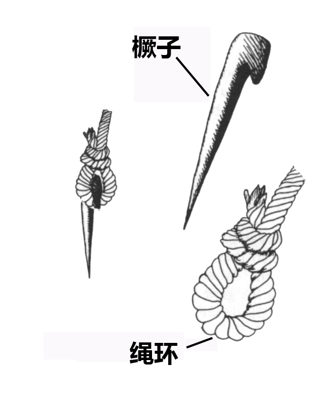
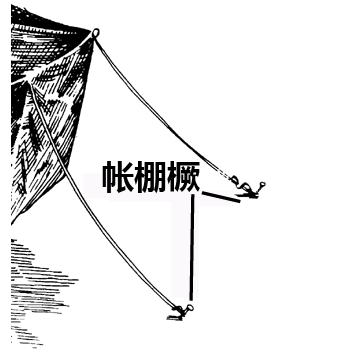

# Human-made Things in the Bible

## License Information

Human-made Things in the Bible © United Bible Societies, 2025. Adapted from: <cite>The Works of Their Hands: Man-made Things in the Bible</cite>, by Ray Pritz © 2009 United Bible Societies. This work is licensed under Creative Commons Attribution-ShareAlike 4.0 International (<a href="https://creativecommons.org/licenses/by-sa/4.0/">https://creativecommons.org/licenses/by-sa/4.0/</a>).

--------------------------------

## 标题：帐棚（tent） (id: REALIA:3.2)

3\.2 标题：帐棚（tent）
================

经文出处
----

Hebrew 来：אהל (音译：’ahal（动词）)

[GEN 13:12](https://ref.ly/Gen13:12), [GEN 13:18](https://ref.ly/Gen13:18), [ISA 13:20](https://ref.ly/Isa13:20)

Hebrew 来：אֹהֶל (音译：’ohel)

[GEN 4:20](https://ref.ly/Gen4:20), [GEN 9:21](https://ref.ly/Gen9:21), [GEN 9:27](https://ref.ly/Gen9:27), [GEN 12:8](https://ref.ly/Gen12:8), [GEN 13:3](https://ref.ly/Gen13:3), [GEN 13:5](https://ref.ly/Gen13:5), [GEN 18:2](https://ref.ly/Gen18:2), [GEN 18:6](https://ref.ly/Gen18:6), [GEN 18:9](https://ref.ly/Gen18:9), [GEN 18:10](https://ref.ly/Gen18:10)

Hebrew 来：מִשְׁכָּן (音译：mishkan)

[NUM 24:5](https://ref.ly/Num24:5), [PSA 78:28](https://ref.ly/Ps78:28), [SNG 1:8](https://ref.ly/Song1:8), [ISA 54:2](https://ref.ly/Isa54:2), [JER 30:18](https://ref.ly/Jer30:18), [EZK 25:4](https://ref.ly/Ezek25:4)

Hebrew 来：סֻכָּה (音译：sukah)

[2SA 11:11](https://ref.ly/2Sam11:11), [1KI 20:12](https://ref.ly/1Kgs20:12), [1KI 20:16](https://ref.ly/1Kgs20:16)

Hebrew 来：קֻבָּה (音译：qubah)

[NUM 25:8](https://ref.ly/Num25:8)

Greek 希：αὐλή (音译：aulē)

[2MA 13:15](https://ref.ly/2Macc13:15)

Greek 希：προσκήνιον (音译：proskēnion)

[JDT 10:22](https://ref.ly/Jdt10:22)

Greek 希：σκηνή (音译：skēnē)

[HEB 11:9](https://ref.ly/Heb11:9), [JDT 3:3](https://ref.ly/Jdt3:3), [JDT 5:22](https://ref.ly/Jdt5:22), [JDT 6:10](https://ref.ly/Jdt6:10)

Greek 希：σκῆνος (音译：skēnos)

[2CO 5:1](https://ref.ly/2Cor5:1), [2CO 5:4](https://ref.ly/2Cor5:4), [WIS 9:15](https://ref.ly/Wis9:15)

Greek 希：σκήνωμα (音译：skēnōma)

[2PE 1:13](https://ref.ly/2Pet1:13), [2PE 1:14](https://ref.ly/2Pet1:14), [JDT 2:26](https://ref.ly/Jdt2:26), [JDT 9:8](https://ref.ly/Jdt9:8), [JDT 10:18](https://ref.ly/Jdt10:18), [JDT 14:7](https://ref.ly/Jdt14:7), [JDT 15:1](https://ref.ly/Jdt15:1), [1MA 9:66](https://ref.ly/1Macc9:66), [2MA 10:6](https://ref.ly/2Macc10:6), [1ES 1:48](https://ref.ly/1Esd1:48), [ODA 4:7](https://ref.ly/Odes4:7)

Greek 希：σκηνοποιός (音译：skēnopoios（“做帐棚的人”）)

[ACT 18:3](https://ref.ly/Acts18:3)

描述
--

*叙利亚沙漠中的贝都因人帐篷 (© yeowatzup, CC BY 2\.0, via Wikimedia Commons)*

帐棚是一种用布或兽皮（或同时使用）搭成的可移动住所，用柱子支撑，并用绳子拴在橛子上，使其固定在地上。帐棚通常是用山羊毛织成的布做的。

---

用途
--

帐棚是游牧民族的常住住所，也可以是打仗士兵的临时住所，或某人从一处永久住房搬进另一处之前，暂时栖身的地方。

---

翻译
--

*游牧民的帐篷 (© Deutsche Bibelgesellschaft, Stuttgart by United Bible Societies)*

在许多语言中，“帐棚”被译为“用布做的房子”。翻译者应该避免所选译词专指人们在度假时临时支搭的遮蔽场所。在旧约时期，这种帐棚是游牧民长期使用的住所，当牲畜从一个草场迁到另一个草场时，帐棚也随之迁移。

希伯来文动词*’ahal* 的意思是“支搭帐棚”（如NIV (New International Version (1984)) ）、“移动帐棚”（如RSV (Revised Standard Version (1952)) 、NASB (New American Standard Bible) ）、“扎营、搭营、搭帐篷”（如GNT (Good News Translation (1992)) 、TOB (Traduction Oecuménique de la Bible (French, 1975)) ）。

希伯来文*’ohel* 是指游牧民的住所，或士兵在军事行动中使用的帐棚（另参[3\.15 会幕和帐幕 (Tent of Meeting and Tabernacle)\<REALIA:3\.15\>](#) ）。如果目标语言用不同的词语表示两者，翻译者要仔细考察上下文。以下经文似乎是指军用帐棚：[JDG 7:13](https://ref.ly/Judg7:13); [1SA 17:54](https://ref.ly/1Sam17:54); [2KI 7:7](https://ref.ly/2Kgs7:7); [2KI 7:8](https://ref.ly/2Kgs7:8); [2KI 7:9](https://ref.ly/2Kgs7:9); [2KI 7:10](https://ref.ly/2Kgs7:10) 。也有一些人认为，在[ACT 18:3](https://ref.ly/Acts18:3) 中，保罗、亚居拉和百基拉是为军队制作帐棚。然而，传统上译为“制作帐棚的人”的希腊文词语，应译作“皮革工人”更为准确。

翻译者要留意，在以色列人的早期历史中，许多人住在帐棚里。“去到他的帐棚”或“逃到他们的帐棚”这样的短语，通常意思就是“回家”；例如，[2KI 14:12](https://ref.ly/2Kgs14:12) 的原文字面意思是“各人逃回自己的帐棚里”，但是上下文告诉我们，这些人住在房子里，因此可译为“各人逃回自己的家里”（如RSV (Revised Standard Version (1952)) ）。

希伯来文*mishkan* 的意思是“居所”，通常指旷野中的帐幕（参[3\.15\.2 帐幕 (Tabernacle)\<REALIA:3\.15\.2\>](#) ）。在上面列出的经文中，这个词特指人们居住的帐棚（不论牧民还是士兵）。在[NUM 24:5](https://ref.ly/Num24:5) 、[ISA 54:2](https://ref.ly/Isa54:2) 和[JER 30:18](https://ref.ly/Jer30:18) ，*mishkan* 出现在诗歌里面，与“帐棚”一词平行。在这些经文中，最好使用一个意为“居所、住宅”的统称。

在[NUM 25:8](https://ref.ly/Num25:8) 中，希伯来文*qubah* 的意思不确定。许多译本认为它是一个帐棚，可能有很高的圆顶（GNT (Good News Translation (1992)) 、NIV (New International Version (1984)) 、KJV (King James Version (1611)) 、NASB (New American Standard Bible) ），还有译本认为它是帐棚中的一个隔间或房间（RSV (Revised Standard Version (1952)) 、NEB (New English Bible (1970)) ）。有些译本（TOB (Traduction Oecuménique de la Bible (French, 1975)) 、SPCL (Spanish Common Language Version (Dios Habla Hoy)) ）认为它是一间卧室，但在脚注中注明它是一种特殊的帐棚，用于异教的宗教仪式，例如行淫或占卜。由于没有办法确定哪个理解是正确的，翻译者只需要从中选择其一。

[2MA 13:15](https://ref.ly/2Macc13:15) ：希腊文*aulē* 原本是指院子，后来指王宫。这节经文的上下文提到王所在营地的一部分，所以可将这个词译为“靠近王帐棚的地方”（如GNT (Good News Translation (1992)) ）。其他大多数译本译为“王的大帐棚”（如RSV (Revised Standard Version (1952)) ）。然而，采用英文“pavilion”（“大帐棚”）的译法，充其量也只能说是含义模糊，在最差的情况下（例如在英式英语中），甚至可能会被误解。翻译者应该依循GNT (Good News Translation (1992)) 的译法，或采用“安条克总部所在的营地”（ITCL (Italian Common Language Version) ）等短语。

在[JDT 10:22](https://ref.ly/Jdt10:22) 中，希腊文*proskēnion* 指的是帐棚里面靠近入口的区域，可译为“帐棚的外部”（如GNT (Good News Translation (1992)) ）、“帐棚的入口”（如NJB (New Jerusalem Bible (1985)) ）、“前厅”（如NAB (New American Bible (1970)) ）等。

* **Associated Passages:** 创世记 13:12; 创世记 13:18; 以赛亚书 13:20; 创世记 4:20; 创世记 9:21; 创世记 9:27; 创世记 12:8; 创世记 13:3; 创世记 13:5; 创世记 18:2; 创世记 18:6; 创世记 18:9; 创世记 18:10; 民数记 24:5; 诗篇 78:28; 雅歌 1:8; 以赛亚书 54:2; 耶利米书 30:18; 以西结书 25:4; 撒母耳记下 11:11; 列王纪上 20:12; 列王纪上 20:16; 民数记 25:8; 玛加伯下 13:15; 友弟德传 10:22; 希伯来书 11:9; 友弟德传 3:3; 友弟德传 5:22; 友弟德传 6:10; 哥林多后书 5:1; 哥林多后书 5:4; 智慧篇 9:15; 彼得后书 1:13; 彼得后书 1:14; 友弟德传 2:26; 友弟德传 9:8; 友弟德传 10:18; 友弟德传 14:7; 友弟德传 15:1; 玛加伯上 9:66; 玛加伯下 10:6; 厄斯德拉上 1:48; 颂歌 4:7; 使徒行传 18:3; 士师记 7:13; 撒母耳记上 17:54; 列王纪下 7:7; 列王纪下 7:8; 列王纪下 7:9; 列王纪下 7:10; 列王纪下 14:12

* **Associated ACAI Concepts:** Tent (ID: `realia:Tent`)

## 标题：帐棚门、分隔的幔子（door of tent, dividing curtain） (id: REALIA:3.2.1)

3\.2\.1 标题：帐棚门、分隔的幔子（door of tent, dividing curtain）
====================================================

经文出处
----

Hebrew 来：דֹּק (音译：doq)

[ISA 40:22](https://ref.ly/Isa40:22)

Hebrew 来：יְרִיעָה (音译：yri‘ah)

[PSA 104:2](https://ref.ly/Ps104:2), [SNG 1:5](https://ref.ly/Song1:5), [ISA 54:2](https://ref.ly/Isa54:2), [JER 4:20](https://ref.ly/Jer4:20), [JER 10:20](https://ref.ly/Jer10:20), [JER 49:29](https://ref.ly/Jer49:29), [HAB 3:7](https://ref.ly/Hab3:7)

Greek 希：αὐλαία (音译：aulaia)

[JDT 14:14](https://ref.ly/Jdt14:14)

描述和用途
-----

幔子将大帐棚的内部隔成几个空间。

---

翻译
--

希伯来文*yri‘ah* 起初指覆盖帐幕的罩棚（参[3\.15\.2\.3\.6\.1 细麻布幔子 (linen cloth strips)\<REALIA:3\.15\.2\.3\.6\.1\>](#) ）。在上面列出的大多数经文中，该词与一个意为“帐棚”的词平行对应。因此，它有时似乎是帐棚的换喻词（比较[2SA 7:2](https://ref.ly/2Sam7:2) “上帝的约柜在*yri‘ah* 里面”和[1CH 17:1](https://ref.ly/1Chr17:1) “耶和华的约柜在*yri‘ah* 下面”）。在[PSA 104:2](https://ref.ly/Ps104:2) 中，“铺张诸天，如铺*yri‘ah* ”的视觉意象源于帐幕中的幔子在约柜上方展开。

[JDT 14:14](https://ref.ly/Jdt14:14) 说，“巴哥阿就进去，敲了帐棚的门”（RSV (Revised Standard Version (1952)) 直译）。这种表达在英文中很不自然，在其他一些语言中也同样奇怪。NAB (New American Bible (1970)) 和NRSV (New Revised Standard Version (1989)) 试图通过把“门”（希腊文*aulaia* ）改成“入口”来解决这个问题。还有译本的改动更大，如“巴哥阿就进去，在帐棚的睡觉区域前拍手”（GNT (Good News Translation (1992)) 直译）。NJB (New Jerusalem Bible (1985)) 的译法更接近*aulaia* 的字面意思，英文意为：“巴哥阿进到帐棚里面，拍打分隔帐棚的幔子。”叙事的重点是，巴哥阿以为敖罗斐乃和友弟德是在床上，姿势不雅，便制造出响动，以防突然进去而惊吓到他们。

* **Associated Passages:** 以赛亚书 40:22; 诗篇 104:2; 雅歌 1:5; 以赛亚书 54:2; 耶利米书 4:20; 耶利米书 10:20; 耶利米书 49:29; 哈巴谷书 3:7; 友弟德传 14:14; 撒母耳记下 7:2; 历代志上 17:1

## 标题：帐棚橛、帐棚桩（tent peg, stake） (id: REALIA:3.2.2)

3\.2\.2 标题：帐棚橛、帐棚桩（tent peg, stake）
===================================

经文出处
----

Hebrew 来：יָתֵד (音译：yathed)

[EXO 27:19](https://ref.ly/Exod27:19), [EXO 27:19](https://ref.ly/Exod27:19), [EXO 35:18](https://ref.ly/Exod35:18), [EXO 35:18](https://ref.ly/Exod35:18), [EXO 38:20](https://ref.ly/Exod38:20), [EXO 38:31](https://ref.ly/Exod38:31), [EXO 38:31](https://ref.ly/Exod38:31), [EXO 39:40](https://ref.ly/Exod39:40), [NUM 3:37](https://ref.ly/Num3:37), [NUM 4:32](https://ref.ly/Num4:32), [JDG 4:21](https://ref.ly/Judg4:21), [JDG 4:21](https://ref.ly/Judg4:21), [JDG 4:22](https://ref.ly/Judg4:22), [JDG 5:26](https://ref.ly/Judg5:26), [EZR 9:8](https://ref.ly/Ezra9:8), [ISA 33:20](https://ref.ly/Isa33:20), [ISA 54:2](https://ref.ly/Isa54:2), [ZEC 10:4](https://ref.ly/Zech10:4)

Greek 希：πάσσαλος (音译：passalos)

[SIR 14:24](https://ref.ly/Sir14:24), [SIR 26:12](https://ref.ly/Sir26:12), [SIR 27:2](https://ref.ly/Sir27:2)

描述和用途
-----

帐棚橛是一端尖锐的短桩。把帐棚橛钉入到地里面，然后把帐棚绳子绑在上面，使帐棚固定。参[3\.2 帐棚 (tent)\<REALIA:3\.2\>](#) 中的插图。

---

翻译
--

《出埃及记》和《民数记》中提到的帐幕橛子是铜做的，用来固定帐幕的几层罩棚（参[3\.15\.2\.3\.6 罩棚 (coverings)\<REALIA:3\.15\.2\.3\.6\>](#) ）和一些立柱（参[3\.15\.2\.3\.3 竖杆、榫头、横档 (upright beam, tenon, crosspiece, rung)\<REALIA:3\.15\.2\.3\.3\>](#) ）。

帐棚橛提供安全保障，确保帐棚不会倒塌或被风吹走。因此，它有时是稳定和安全的象征。这种安全的含意可能体现在[EZR 9:8](https://ref.ly/Ezra9:8) 和[ISA 33:20](https://ref.ly/Isa33:20) 的译文中；例如，[EZR 9:8](https://ref.ly/Ezra9:8) 中有一句话的原文字面意思是“在他的圣所内给我们一根帐棚橛”，RSV (Revised Standard Version (1952)) 英文意为“在他的圣所中给我们一个安全把手”，GNT (Good News Translation (1992)) 为“在这圣所中安然居住”。

关于希伯来文*yathed* 在[JDG 16:14](https://ref.ly/Judg16:14) 中的另一种含义，参[1\.5\.3\.5 压杆、压条、针 (beater, batten, pin)\<REALIA:1\.5\.3\.5\>](#) 。

[SIR 14:24](https://ref.ly/Sir14:24) ：希腊文*passalos* 指的是帐棚的橛子。希伯来文版本的《次经‧便西拉智训》（《思》《德训篇》）中有一个词，只要略微修改该词中一个字母的一部分，便指“帐棚的绳子”或“帐棚的橛子”。无论哪一种读法，经文基本的意思都没有改变；GNT (Good News Translation (1992)) 的译法很好，英文意为：“尽可能靠近她的房子来安营。”如果翻译者想保留帐棚和房子的比喻，可以译为，“他把帐棚固定在她房子的墙上。”

* **Associated Passages:** 出埃及记 27:19; 出埃及记 35:18; 出埃及记 38:20; 出埃及记 38:31; 出埃及记 39:40; 民数记 3:37; 民数记 4:32; 士师记 4:21; 士师记 4:22; 士师记 5:26; 以斯拉记 9:8; 以赛亚书 33:20; 以赛亚书 54:2; 撒迦利亚书 10:4; 德训篇 14:24; 德训篇 26:12; 德训篇 27:2; 士师记 16:14

* **Associated ACAI Concepts:** Peg (ID: `realia:Peg`)
