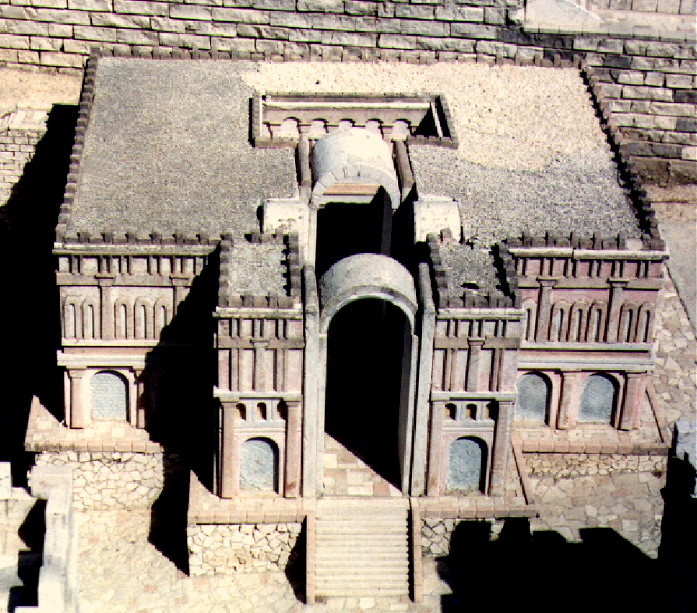

# Human-made Things in the Bible

## License Information

Human-made Things in the Bible © United Bible Societies, 2025. Adapted from: <cite>The Works of Their Hands: Man-made Things in the Bible</cite>, by Ray Pritz © 2009 United Bible Societies. This work is licensed under Creative Commons Attribution-ShareAlike 4.0 International (<a href="https://creativecommons.org/licenses/by-sa/4.0/">https://creativecommons.org/licenses/by-sa/4.0/</a>).

--------------------------------

## 标题：宫殿（palace） (id: REALIA:3.4)

3\.4 标题：宫殿（palace）
==================

经文出处
----

Hebrew 来：אַרְמוֹן (音译：’armon)

[1KI 16:18](https://ref.ly/1Kgs16:18), [2KI 15:25](https://ref.ly/2Kgs15:25), [2CH 36:19](https://ref.ly/2Chr36:19)

Hebrew 来：בִּירָה (音译：birah)

[1CH 29:1](https://ref.ly/1Chr29:1), [1CH 29:19](https://ref.ly/1Chr29:19)

Hebrew 来：בַּיִת (音译：bayith)

[GEN 12:15](https://ref.ly/Gen12:15), [GEN 12:17](https://ref.ly/Gen12:17), [GEN 41:40](https://ref.ly/Gen41:40), [GEN 45:2](https://ref.ly/Gen45:2), [GEN 45:8](https://ref.ly/Gen45:8), [GEN 45:16](https://ref.ly/Gen45:16), [GEN 47:14](https://ref.ly/Gen47:14), [GEN 50:4](https://ref.ly/Gen50:4)

Hebrew 来：בַּיִת מֶלֶךְ (音译：beyth (ha)melek)

[2SA 11:2](https://ref.ly/2Sam11:2), [2SA 11:8](https://ref.ly/2Sam11:8), [2SA 11:9](https://ref.ly/2Sam11:9), [2SA 15:35](https://ref.ly/2Sam15:35), [1KI 9:1](https://ref.ly/1Kgs9:1), [1KI 9:10](https://ref.ly/1Kgs9:10), [1KI 10:12](https://ref.ly/1Kgs10:12), [1KI 14:26](https://ref.ly/1Kgs14:26), [1KI 14:27](https://ref.ly/1Kgs14:27), [1KI 15:18](https://ref.ly/1Kgs15:18), [1KI 16:18](https://ref.ly/1Kgs16:18), [1KI 16:18](https://ref.ly/1Kgs16:18), [2KI 11:5](https://ref.ly/2Kgs11:5), [2KI 11:16](https://ref.ly/2Kgs11:16), [2KI 11:19](https://ref.ly/2Kgs11:19), [2KI 11:20](https://ref.ly/2Kgs11:20), [2KI 12:19](https://ref.ly/2Kgs12:19), [2KI 14:14](https://ref.ly/2Kgs14:14), [2KI 15:25](https://ref.ly/2Kgs15:25), [2KI 16:8](https://ref.ly/2Kgs16:8), [2KI 18:15](https://ref.ly/2Kgs18:15), [2KI 24:13](https://ref.ly/2Kgs24:13), [2KI 25:9](https://ref.ly/2Kgs25:9), [2CH 7:11](https://ref.ly/2Chr7:11), [2CH 8:11](https://ref.ly/2Chr8:11), [2CH 9:11](https://ref.ly/2Chr9:11), [2CH 12:10](https://ref.ly/2Chr12:10), [2CH 16:2](https://ref.ly/2Chr16:2), [2CH 21:17](https://ref.ly/2Chr21:17), [2CH 23:5](https://ref.ly/2Chr23:5), [2CH 23:15](https://ref.ly/2Chr23:15), [2CH 23:20](https://ref.ly/2Chr23:20), [2CH 25:24](https://ref.ly/2Chr25:24), [2CH 28:21](https://ref.ly/2Chr28:21), [NEH 3:25](https://ref.ly/Neh3:25), [EST 2:8](https://ref.ly/Esth2:8), [EST 2:9](https://ref.ly/Esth2:9), [EST 2:13](https://ref.ly/Esth2:13), [EST 4:13](https://ref.ly/Esth4:13), [EST 5:1](https://ref.ly/Esth5:1), [EST 5:1](https://ref.ly/Esth5:1), [EST 6:4](https://ref.ly/Esth6:4), [EST 9:4](https://ref.ly/Esth9:4), [JER 19:13](https://ref.ly/Jer19:13), [JER 21:11](https://ref.ly/Jer21:11), [JER 22:1](https://ref.ly/Jer22:1), [JER 26:10](https://ref.ly/Jer26:10), [JER 27:18](https://ref.ly/Jer27:18), [JER 27:21](https://ref.ly/Jer27:21), [JER 32:2](https://ref.ly/Jer32:2), [JER 33:4](https://ref.ly/Jer33:4), [JER 36:12](https://ref.ly/Jer36:12), [JER 38:7](https://ref.ly/Jer38:7), [JER 38:8](https://ref.ly/Jer38:8), [JER 38:11](https://ref.ly/Jer38:11), [JER 38:22](https://ref.ly/Jer38:22), [JER 39:8](https://ref.ly/Jer39:8), [JER 52:13](https://ref.ly/Jer52:13)

Hebrew 来：בִּיתָן (音译：bithan)

[EST 1:5](https://ref.ly/Esth1:5), [EST 7:7](https://ref.ly/Esth7:7), [EST 7:8](https://ref.ly/Esth7:8)

Hebrew 来：הֵיכָל (音译：heykal)

[1KI 21:1](https://ref.ly/1Kgs21:1), [2KI 20:18](https://ref.ly/2Kgs20:18), [2CH 36:7](https://ref.ly/2Chr36:7), [EZR 4:14](https://ref.ly/Ezra4:14), [PSA 45:9](https://ref.ly/Ps45:9), [PSA 45:16](https://ref.ly/Ps45:16), [PSA 144:12](https://ref.ly/Ps144:12), [PRO 30:28](https://ref.ly/Prov30:28), [ISA 13:22](https://ref.ly/Isa13:22), [ISA 39:7](https://ref.ly/Isa39:7), [DAN 1:4](https://ref.ly/Dan1:4), [DAN 4:1](https://ref.ly/Dan4:1), [DAN 4:26](https://ref.ly/Dan4:26), [JOL 4:5](https://ref.ly/Joel4:5)

Aramaic 兰：הֵיכַל (音译：heykal)

[EZR 4:14](https://ref.ly/Ezra4:14), [DAN 4:1](https://ref.ly/Dan4:1), [DAN 4:26](https://ref.ly/Dan4:26), [DAN 5:5](https://ref.ly/Dan5:5), [DAN 6:19](https://ref.ly/Dan6:19)

Greek 希：αὐλή (音译：aulē)

[1MA 11:46](https://ref.ly/1Macc11:46)

Greek 希：βασιλεία, βασίλειον, βασίλειος (音译：basileia, basileion, basileios)

[LUK 7:25](https://ref.ly/Luke7:25), [LJE 1:58](https://ref.ly/EpJer1:58), [1MA 2:10](https://ref.ly/1Macc2:10)

Greek 希：οἶκος, βασιλεία, βασιλεύς (音译：oiko (basileias), oikos (basileōs))

[MAT 11:8](https://ref.ly/Matt11:8), [JDT 2:1](https://ref.ly/Jdt2:1), [JDT 2:18](https://ref.ly/Jdt2:18), [JDT 11:23](https://ref.ly/Jdt11:23), [JDT 12:13](https://ref.ly/Jdt12:13), [JDT 14:18](https://ref.ly/Jdt14:18), [1MA 7:2](https://ref.ly/1Macc7:2)

Greek 希：πραιτώριον (音译：praitōrion)

[MAT 27:27](https://ref.ly/Matt27:27), [MRK 15:16](https://ref.ly/Mark15:16), [JHN 18:28](https://ref.ly/John18:28), [JHN 18:28](https://ref.ly/John18:28), [JHN 18:33](https://ref.ly/John18:33), [JHN 19:9](https://ref.ly/John19:9), [ACT 23:35](https://ref.ly/Acts23:35), [PHP 1:13](https://ref.ly/Phil1:13)

描述和用途
-----

*新约时代宫殿模型 (© Ray Pritz by United Bible Societies)*

宫殿是君王或统治者的住所。这种住所通常比普通百姓的住宅更大、更豪华。宫殿的结构和建筑材料差别很大。

---

翻译
--

“宫殿”可译为“王的家”或“统治者的家”。

希伯来文*’armon* 有时指的是王宫内修建有防御工事的部分，或其他防御强化住所；参[1KI 16:18](https://ref.ly/1Kgs16:18) 。在这些情况下，最好把它译为“堡垒”或“据点”。另参[3\.13\.3\.2 要塞、堡垒、城堡 (fortress, stronghold, castle, citadel, fort)\<REALIA:3\.13\.3\.2\>](#) 。

[PSA 45:9](https://ref.ly/Ps45:9) （《和》45:8）：“象牙宫殿”（“Ivory palaces”；RSV (Revised Standard Version (1952)) ；另参[1KI 22:39](https://ref.ly/1Kgs22:39) ）并不是全部用象牙建造的宫殿，而是用象牙装饰的宫殿；装饰的对象可能是建筑本身或里面的家具（参[1KI 10:18](https://ref.ly/1Kgs10:18) ；[AMO 3:15](https://ref.ly/Amos3:15) ，[AMO 6:4](https://ref.ly/Amos6:4) ）。

[PSA 144:12](https://ref.ly/Ps144:12) ：希伯来文*heykal* 可以指“王宫”或“圣殿”。一般来说，我们通过上下文，或是根据“上帝的”或“王的”等修饰语，能够确定该词指的是哪一个意思。然而，这个词在本节经文中的意思不确定；有些译本译为“王宫”（“palace”；RSV (Revised Standard Version (1952)) 、GNT (Good News Translation (1992)) ），而另一些译本译为“圣殿”（“temple”；NAB (New American Bible (1970)) 、NCV (New Century Version) ）。

关于福音书中的希腊文*praitōrion* 指的是耶路撒冷城内的哪个建筑，学者们的看法不一。可能是指位于城市西边的希律王宫，也可能是指圣殿区域西北部的安东尼亚堡。位于凯撒利亚的*praitōrion* （[ACT 23:35](https://ref.ly/Acts23:35) ）是大希律建造的王宫。在福音书中，把*praitōrion* 译为“总督官邸”或“统治者居住的大宅”就可以了。在有些语言中，“宫殿”一词可能指军事要塞，非常符合这些新约经文的语境。

* **Associated Passages:** 列王纪上 16:18; 列王纪下 15:25; 历代志下 36:19; 历代志上 29:1; 历代志上 29:19; 创世记 12:15; 创世记 12:17; 创世记 41:40; 创世记 45:2; 创世记 45:8; 创世记 45:16; 创世记 47:14; 创世记 50:4; 撒母耳记下 11:2; 撒母耳记下 11:8; 撒母耳记下 11:9; 撒母耳记下 15:35; 列王纪上 9:1; 列王纪上 9:10; 列王纪上 10:12; 列王纪上 14:26; 列王纪上 14:27; 列王纪上 15:18; 列王纪下 11:5; 列王纪下 11:16; 列王纪下 11:19; 列王纪下 11:20; 列王纪下 12:19; 列王纪下 14:14; 列王纪下 16:8; 列王纪下 18:15; 列王纪下 24:13; 列王纪下 25:9; 历代志下 7:11; 历代志下 8:11; 历代志下 9:11; 历代志下 12:10; 历代志下 16:2; 历代志下 21:17; 历代志下 23:5; 历代志下 23:15; 历代志下 23:20; 历代志下 25:24; 历代志下 28:21; 尼希米记 3:25; 以斯帖记 2:8; 以斯帖记 2:9; 以斯帖记 2:13; 以斯帖记 4:13; 以斯帖记 5:1; 以斯帖记 6:4; 以斯帖记 9:4; 耶利米书 19:13; 耶利米书 21:11; 耶利米书 22:1; 耶利米书 26:10; 耶利米书 27:18; 耶利米书 27:21; 耶利米书 32:2; 耶利米书 33:4; 耶利米书 36:12; 耶利米书 38:7; 耶利米书 38:8; 耶利米书 38:11; 耶利米书 38:22; 耶利米书 39:8; 耶利米书 52:13; 以斯帖记 1:5; 以斯帖记 7:7; 以斯帖记 7:8; 列王纪上 21:1; 列王纪下 20:18; 历代志下 36:7; 以斯拉记 4:14; 诗篇 45:9; 诗篇 45:16; 诗篇 144:12; 箴言 30:28; 以赛亚书 13:22; 以赛亚书 39:7; 但以理书 1:4; 但以理书 4:1; 但以理书 4:26; 约珥书 4:5; 但以理书 5:5; 但以理书 6:19; 玛加伯上 11:46; 路加福音 7:25; 耶利米书信 1:58; 玛加伯上 2:10; 马太福音 11:8; 友弟德传 2:1; 友弟德传 2:18; 友弟德传 11:23; 友弟德传 12:13; 友弟德传 14:18; 玛加伯上 7:2; 马太福音 27:27; 马可福音 15:16; 约翰福音 18:28; 约翰福音 18:33; 约翰福音 19:9; 使徒行传 23:35; 腓立比书 1:13; 列王纪上 22:39; 列王纪上 10:18; 阿摩司书 3:15; 阿摩司书 6:4

