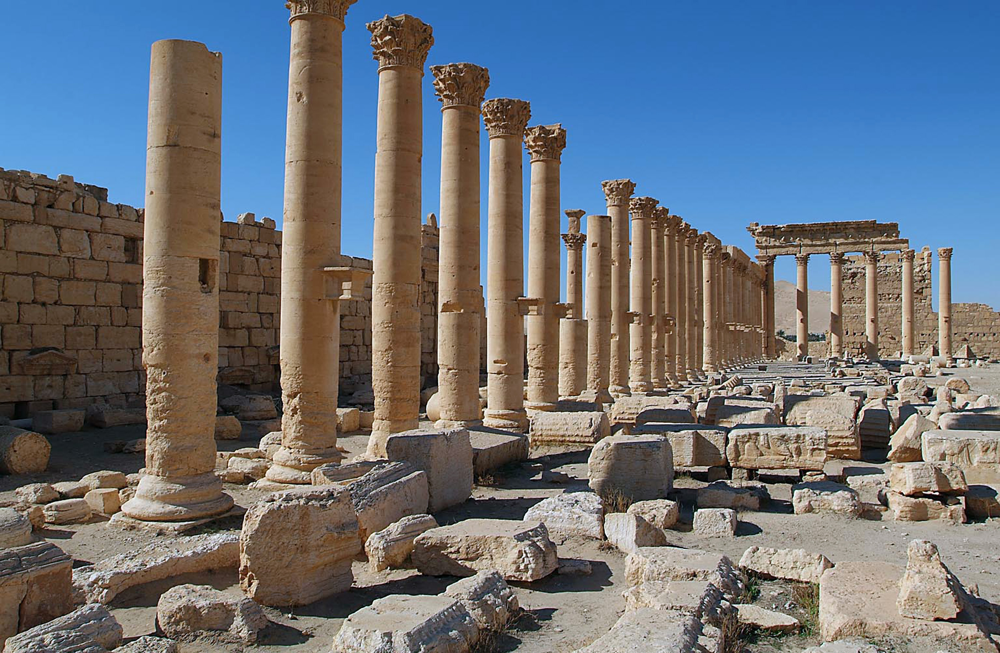

# Human-made Things in the Bible

## License Information

Human-made Things in the Bible © United Bible Societies, 2025. Adapted from: <cite>The Works of Their Hands: Man-made Things in the Bible</cite>, by Ray Pritz © 2009 United Bible Societies. This work is licensed under Creative Commons Attribution-ShareAlike 4.0 International (<a href="https://creativecommons.org/licenses/by-sa/4.0/">https://creativecommons.org/licenses/by-sa/4.0/</a>).

--------------------------------

## 标题：柱子、柱顶（column, pillar, capital） (id: REALIA:3.5)

3\.5 标题：柱子、柱顶（column, pillar, capital）
======================================

经文出处
----

### **柱子** ：

Hebrew 来：דְּבִיר (音译：dvir)

[2CH 3:16](https://ref.ly/2Chr3:16)

Hebrew 来：זָוִית (音译：zawith)

[PSA 144:12](https://ref.ly/Ps144:12)

Hebrew 来：מִסְעָד (音译：mis‘ad)

[1KI 10:12](https://ref.ly/1Kgs10:12)

Hebrew 来：מָצוּק (音译：matsuq)

[1SA 2:8](https://ref.ly/1Sam2:8)

Hebrew 来：עַמּוּד (音译：‘amud)

[EXO 13:21](https://ref.ly/Exod13:21), [EXO 13:21](https://ref.ly/Exod13:21), [EXO 13:22](https://ref.ly/Exod13:22), [EXO 13:22](https://ref.ly/Exod13:22), [EXO 14:19](https://ref.ly/Exod14:19), [EXO 14:24](https://ref.ly/Exod14:24), [EXO 26:32](https://ref.ly/Exod26:32), [EXO 26:37](https://ref.ly/Exod26:37), [EXO 27:10](https://ref.ly/Exod27:10), [EXO 27:10](https://ref.ly/Exod27:10), [EXO 27:11](https://ref.ly/Exod27:11), [EXO 27:11](https://ref.ly/Exod27:11), [EXO 27:11](https://ref.ly/Exod27:11), [EXO 27:12](https://ref.ly/Exod27:12), [EXO 27:14](https://ref.ly/Exod27:14), [EXO 27:15](https://ref.ly/Exod27:15), [EXO 27:16](https://ref.ly/Exod27:16), [EXO 27:17](https://ref.ly/Exod27:17), [EXO 33:9](https://ref.ly/Exod33:9), [EXO 33:10](https://ref.ly/Exod33:10), [EXO 35:11](https://ref.ly/Exod35:11), [EXO 35:17](https://ref.ly/Exod35:17), [EXO 36:36](https://ref.ly/Exod36:36), [EXO 36:38](https://ref.ly/Exod36:38), [EXO 38:10](https://ref.ly/Exod38:10), [EXO 38:11](https://ref.ly/Exod38:11), [EXO 38:11](https://ref.ly/Exod38:11), [EXO 38:12](https://ref.ly/Exod38:12), [EXO 38:12](https://ref.ly/Exod38:12), [EXO 38:14](https://ref.ly/Exod38:14), [EXO 38:15](https://ref.ly/Exod38:15), [EXO 38:17](https://ref.ly/Exod38:17), [EXO 38:17](https://ref.ly/Exod38:17), [EXO 38:17](https://ref.ly/Exod38:17), [EXO 38:19](https://ref.ly/Exod38:19), [EXO 38:28](https://ref.ly/Exod38:28), [EXO 39:33](https://ref.ly/Exod39:33), [EXO 39:40](https://ref.ly/Exod39:40), [EXO 40:18](https://ref.ly/Exod40:18), [NUM 3:36](https://ref.ly/Num3:36), [NUM 3:37](https://ref.ly/Num3:37), [NUM 4:31](https://ref.ly/Num4:31), [NUM 4:32](https://ref.ly/Num4:32), [NUM 12:5](https://ref.ly/Num12:5), [NUM 14:14](https://ref.ly/Num14:14), [NUM 14:14](https://ref.ly/Num14:14), [DEU 31:15](https://ref.ly/Deut31:15), [DEU 31:15](https://ref.ly/Deut31:15), [JDG 16:25](https://ref.ly/Judg16:25), [JDG 16:26](https://ref.ly/Judg16:26), [JDG 16:29](https://ref.ly/Judg16:29), [JDG 20:40](https://ref.ly/Judg20:40), [1KI 7:2](https://ref.ly/1Kgs7:2), [1KI 7:2](https://ref.ly/1Kgs7:2), [1KI 7:3](https://ref.ly/1Kgs7:3), [1KI 7:6](https://ref.ly/1Kgs7:6), [1KI 7:6](https://ref.ly/1Kgs7:6), [1KI 7:15](https://ref.ly/1Kgs7:15), [1KI 7:15](https://ref.ly/1Kgs7:15), [1KI 7:15](https://ref.ly/1Kgs7:15), [1KI 7:16](https://ref.ly/1Kgs7:16), [1KI 7:17](https://ref.ly/1Kgs7:17), [1KI 7:18](https://ref.ly/1Kgs7:18), [1KI 7:19](https://ref.ly/1Kgs7:19), [1KI 7:20](https://ref.ly/1Kgs7:20), [1KI 7:21](https://ref.ly/1Kgs7:21), [1KI 7:21](https://ref.ly/1Kgs7:21), [1KI 7:21](https://ref.ly/1Kgs7:21), [1KI 7:22](https://ref.ly/1Kgs7:22), [1KI 7:22](https://ref.ly/1Kgs7:22), [1KI 7:41](https://ref.ly/1Kgs7:41), [1KI 7:41](https://ref.ly/1Kgs7:41), [1KI 7:41](https://ref.ly/1Kgs7:41), [1KI 7:42](https://ref.ly/1Kgs7:42), [2KI 11:14](https://ref.ly/2Kgs11:14), [2KI 23:3](https://ref.ly/2Kgs23:3), [2KI 25:13](https://ref.ly/2Kgs25:13), [2KI 25:16](https://ref.ly/2Kgs25:16), [2KI 25:17](https://ref.ly/2Kgs25:17), [2KI 25:17](https://ref.ly/2Kgs25:17), [1CH 18:8](https://ref.ly/1Chr18:8), [2CH 3:15](https://ref.ly/2Chr3:15), [2CH 3:16](https://ref.ly/2Chr3:16), [2CH 3:17](https://ref.ly/2Chr3:17), [2CH 4:12](https://ref.ly/2Chr4:12), [2CH 4:12](https://ref.ly/2Chr4:12), [2CH 4:12](https://ref.ly/2Chr4:12), [2CH 4:13](https://ref.ly/2Chr4:13), [2CH 23:13](https://ref.ly/2Chr23:13), [NEH 9:12](https://ref.ly/Neh9:12), [NEH 9:12](https://ref.ly/Neh9:12), [NEH 9:19](https://ref.ly/Neh9:19), [NEH 9:19](https://ref.ly/Neh9:19), [EST 1:6](https://ref.ly/Esth1:6), [JOB 9:6](https://ref.ly/Job9:6), [JOB 26:11](https://ref.ly/Job26:11), [PSA 75:4](https://ref.ly/Ps75:4), [PSA 99:7](https://ref.ly/Ps99:7), [PRO 9:1](https://ref.ly/Prov9:1), [SNG 3:10](https://ref.ly/Song3:10), [SNG 5:15](https://ref.ly/Song5:15), [JER 1:18](https://ref.ly/Jer1:18), [JER 27:19](https://ref.ly/Jer27:19), [JER 52:17](https://ref.ly/Jer52:17), [JER 52:20](https://ref.ly/Jer52:20), [JER 52:21](https://ref.ly/Jer52:21), [JER 52:21](https://ref.ly/Jer52:21), [JER 52:22](https://ref.ly/Jer52:22), [EZK 40:49](https://ref.ly/Ezek40:49), [EZK 42:6](https://ref.ly/Ezek42:6), [EZK 42:6](https://ref.ly/Ezek42:6)

Greek 希：στῦλος (音译：stulos)

[GAL 2:9](https://ref.ly/Gal2:9), [1TI 3:15](https://ref.ly/1Tim3:15), [REV 3:12](https://ref.ly/Rev3:12), [REV 10:1](https://ref.ly/Rev10:1), [SIR 26:18](https://ref.ly/Sir26:18), [SIR 36:24](https://ref.ly/Sir36:24), [LJE 1:58](https://ref.ly/EpJer1:58), [1MA 13:29](https://ref.ly/1Macc13:29), [1MA 13:29](https://ref.ly/1Macc13:29), [4MA 17:3](https://ref.ly/4Macc17:3)

经文出处
----

### **柱顶** ：

Hebrew 来：כַּפְתּוֹר (音译：kaftor)

[AMO 9:1](https://ref.ly/Amos9:1), [ZEP 2:14](https://ref.ly/Zeph2:14)

Hebrew 来：כֹּתֶרֶת (音译：kothereth)

[1KI 7:16](https://ref.ly/1Kgs7:16), [1KI 7:16](https://ref.ly/1Kgs7:16), [1KI 7:16](https://ref.ly/1Kgs7:16), [1KI 7:17](https://ref.ly/1Kgs7:17), [1KI 7:17](https://ref.ly/1Kgs7:17), [1KI 7:17](https://ref.ly/1Kgs7:17), [1KI 7:18](https://ref.ly/1Kgs7:18), [1KI 7:18](https://ref.ly/1Kgs7:18), [1KI 7:19](https://ref.ly/1Kgs7:19), [1KI 7:20](https://ref.ly/1Kgs7:20), [1KI 7:20](https://ref.ly/1Kgs7:20), [1KI 7:31](https://ref.ly/1Kgs7:31), [1KI 7:41](https://ref.ly/1Kgs7:41), [1KI 7:41](https://ref.ly/1Kgs7:41), [1KI 7:42](https://ref.ly/1Kgs7:42), [2KI 25:17](https://ref.ly/2Kgs25:17), [2KI 25:17](https://ref.ly/2Kgs25:17), [2KI 25:17](https://ref.ly/2Kgs25:17), [2CH 4:12](https://ref.ly/2Chr4:12), [2CH 4:12](https://ref.ly/2Chr4:12), [2CH 4:13](https://ref.ly/2Chr4:13), [JER 52:22](https://ref.ly/Jer52:22), [JER 52:22](https://ref.ly/Jer52:22), [JER 52:22](https://ref.ly/Jer52:22)

Hebrew 来：רֹאשׁ (音译：ro’sh)

[2CH 3:15](https://ref.ly/2Chr3:15)

经文出处
----

### **根基、座** ：

Hebrew 来：אֶדֶן (音译：’eden)

[JOB 38:6](https://ref.ly/Job38:6), [SNG 5:15](https://ref.ly/Song5:15)

Greek 希：βάσις (音译：basis)

[SIR 26:18](https://ref.ly/Sir26:18)

描述
--

*赫菲斯托斯（Hephaestus）神庙的正面，显示支撑屋顶的带柱头的圆柱 (© Sailko, CC BY\-SA 3\.0, via Wikimedia Commons)*

柱子是一种用于支撑建筑物的直立杆状构件，通常是石头做的，也有用木头做的。有些柱子由三部分组成。柱子的中间柱身部分立在一个比柱子稍宽的底座上；柱身通常是圆柱形的，对于较大的柱子，柱身本体可能就由几个部分组成。柱子的顶部有时会有一个比较宽的顶，即柱顶。根据建筑物或房间的大小不同，柱子的尺寸和组成部分也很不同。另参[3\.14\.1\.2 柱廊、走廊、廊子、游廊 (colonnade, porch, covered walkway, stoa, portico)\<REALIA:3\.14\.1\.2\>](#) 。

---

用途
--

*帕尔米拉（Palmyra）的贝尔（Bel）神庙庭院四周的柱子 (© James Gordon from Los Angeles, California, USA (Temple of Bel, Palmyra, Syria), CC BY 2\.0, via Wikimedia Commons)*

柱子用来支撑屋顶，以及屋顶上面所有结构的重量。柱顶既增大了柱子顶部的支撑面积，又起到装饰的效果。

---

翻译
--

在有些语言中，“柱子”可以译为“支撑房屋的杆”或“支撑屋顶的直立圆木”。然而，建造房屋或礼堂时，这些重要构件通常都有专有名称。GNT (Good News Translation (1992)) 没有使用专业术语“柱顶”，其译词意为“柱子……的顶部”（[AMO 9:1](https://ref.ly/Amos9:1) ）。

从词源学来说，希伯来文*matsuq* 指的是用熔融金属浇铸而成的柱子。翻译者通常不需要在译文中说明这种制造方法。在[1SA 2:8](https://ref.ly/1Sam2:8) 中，作者用该词比喻上帝立定大地。有几个译本用“根基”来替代“柱子”的比喻。

[JDG 16:29](https://ref.ly/Judg16:29) ：参孙推倒的柱子很可能是木头做的，基本上是很粗的原木。

[1KI 7:15](https://ref.ly/1Kgs7:15); [1KI 7:16](https://ref.ly/1Kgs7:16); [1KI 7:17](https://ref.ly/1Kgs7:17); [1KI 7:18](https://ref.ly/1Kgs7:18); [1KI 7:19](https://ref.ly/1Kgs7:19); [1KI 7:20](https://ref.ly/1Kgs7:20); [1KI 7:21](https://ref.ly/1Kgs7:21); [1KI 7:22](https://ref.ly/1Kgs7:22) ：所罗门在圣殿入口两侧竖立了两根特殊的铜柱，作者对这些铜柱的描述有一些难解的地方。这些柱子甚至还有名字。

[1KI 7:15](https://ref.ly/1Kgs7:15) 的希伯来文本在描述这两根柱子时，使用了一种典型的修辞手法——省略法：描述第一根柱子及其高度时，可知第二根柱子的尺寸与此相同；描述第二根柱子及其周长时，可知第一根柱子也是这样。然而，译文不应该试图保留这种容易让人困惑的修辞手法。翻译者可以先描述其中一根柱子的尺寸，然后说第二根柱子也是一样的（RSV (Revised Standard Version (1952)) 、REB (Revised English Bible (1989)) ），不过最好把两根柱子放在一起来描述。NCV (New Century Version) 英文意为：“他造了两根铜柱，每根高二十七英尺，周长十八英尺。”CEV (Contemporary English Version) 没有说到周长，而是改用更加直观的直径，英文意为：“希兰制造了两根铜柱，高二十七英尺，直径约六英尺。”NIV (New International Version (1984)) 在脚注中给出了公制的高度和周长：高约8\.1米，周长约5\.4米。

[1KI 7:17](https://ref.ly/1Kgs7:17) 描述了这些柱子上方柱顶的设计，但是文本的表述不太清楚。GNT (Good News Translation (1992)) 和CEV (Contemporary English Version) 都在脚注中说明了这一点。然而，翻译者在翻译这节经文时，必须要提供一个能够让人明白的译法。可译为：“在柱子顶部的柱顶上，有网子和用编织物拧成的链子，一个柱顶有七个，另一个柱顶也有七个”（NASB (New American Standard Bible) 直译）。这样的字面翻译是不够的，因为译文难以理解。翻译者要记住，这是对装饰设计的一个描述，该设计中有网状物（或“网状／格子”），网状物中又有链子。翻译者要尽可能简单地向读者描述这种设计。GNT (Good News Translation (1992)) 提供了一个很好的例子，英文意为：“每根柱子的顶部都装饰有相互交错的链子图案”；CEV (Contemporary English Version) 为：“柱顶有七排看似链子的图案作为装饰。”[2CH 3:16](https://ref.ly/2Chr3:16) 中的平行经文可能也有同样的问题，有些人认为这节经文中的希伯来文*dvir* （通常指至圣所）其实是*ravid* 这个词，抄经者误把字母顺序调换了；*ravid* 指一种链子或项链。这节经文的前半句可译为：“他制造了好像项链的链子，并把它们安放在柱子的顶部”（RSV (Revised Standard Version (1952)) 直译）。

[1KI 7:19](https://ref.ly/1Kgs7:19) 提到柱顶的形状是“百合花”（希伯来文*shushan* ）。我们无法知道柱顶确切的形状。虽然*shushan* 通常被翻译成“百合花”，但是这个词可能指好几种花。因此，JB (Jerusalem Bible (1966)) 将这个词译为“flower\-shaped”（“花形的”），但是，这个译法在某些语境中可能会误导读者。在百合花不为人所知的地方，翻译者应选择一种当地生长的杯状的花。

[1KI 7:20](https://ref.ly/1Kgs7:20) 描述两根铜柱时，使用了希伯来文*beten* 一词，该词的字面意思是“肚子”。大多数译本认为这是指每根柱子的顶部一圈有某种突出物。REB (Revised English Bible (1989)) 使用了建筑专业术语“罗曼式柱顶”（“cushion”），这在通俗译本中是不合适的。其他译法有“碗状部分”（“bowl\-shaped part/section”；NIV (New International Version (1984)) ／NCV (New Century Version) ）和“圆形部分／顶”（“rounded section/tops”；GNT (Good News Translation (1992)) ／CEV (Contemporary English Version) ）。

[JOB 38:6](https://ref.ly/Job38:6) ：这里的希伯来文*’adanim* 与上面讨论过的[1SA 2:8](https://ref.ly/1Sam2:8) 中的*matsuq* 用法相似。《约伯记》的作者认为，地球是一座立在柱子上的建筑。这些柱子又立在底座上。这里指的是供柱子立于其上的“底座”（“bases”；RSV (Revised Standard Version (1952)) ）或“基脚”。NEB (New English Bible (1970)) 清楚地译出了这节经文的第一行，英文意为：“它的支柱立于何物之上？”翻译这行经文时，可能需要提供更多信息才能说清楚它的意思，例如，“底座立在哪里，才支撑起地球的柱子？”或“柱子撑起地球，基脚支撑柱子，那么基脚下面是什么？”

新约中所有提到“柱子”的经文都是比喻性的。有些译本倾向于表达意思，而不是保留柱子的比喻；例如，在[GAL 2:9](https://ref.ly/Gal2:9) 中，“柱子”指的是教会的领袖，可译为“教会的脊梁”（如CEV (Contemporary English Version) ）、“领袖”（如NCV (New Century Version) ）。

* **Associated Passages:** 历代志下 3:16; 诗篇 144:12; 列王纪上 10:12; 撒母耳记上 2:8; 出埃及记 13:21; 出埃及记 13:22; 出埃及记 14:19; 出埃及记 14:24; 出埃及记 26:32; 出埃及记 26:37; 出埃及记 27:10; 出埃及记 27:11; 出埃及记 27:12; 出埃及记 27:14; 出埃及记 27:15; 出埃及记 27:16; 出埃及记 27:17; 出埃及记 33:9; 出埃及记 33:10; 出埃及记 35:11; 出埃及记 35:17; 出埃及记 36:36; 出埃及记 36:38; 出埃及记 38:10; 出埃及记 38:11; 出埃及记 38:12; 出埃及记 38:14; 出埃及记 38:15; 出埃及记 38:17; 出埃及记 38:19; 出埃及记 38:28; 出埃及记 39:33; 出埃及记 39:40; 出埃及记 40:18; 民数记 3:36; 民数记 3:37; 民数记 4:31; 民数记 4:32; 民数记 12:5; 民数记 14:14; 申命记 31:15; 士师记 16:25; 士师记 16:26; 士师记 16:29; 士师记 20:40; 列王纪上 7:2; 列王纪上 7:3; 列王纪上 7:6; 列王纪上 7:15; 列王纪上 7:16; 列王纪上 7:17; 列王纪上 7:18; 列王纪上 7:19; 列王纪上 7:20; 列王纪上 7:21; 列王纪上 7:22; 列王纪上 7:41; 列王纪上 7:42; 列王纪下 11:14; 列王纪下 23:3; 列王纪下 25:13; 列王纪下 25:16; 列王纪下 25:17; 历代志上 18:8; 历代志下 3:15; 历代志下 3:17; 历代志下 4:12; 历代志下 4:13; 历代志下 23:13; 尼希米记 9:12; 尼希米记 9:19; 以斯帖记 1:6; 约伯记 9:6; 约伯记 26:11; 诗篇 75:4; 诗篇 99:7; 箴言 9:1; 雅歌 3:10; 雅歌 5:15; 耶利米书 1:18; 耶利米书 27:19; 耶利米书 52:17; 耶利米书 52:20; 耶利米书 52:21; 耶利米书 52:22; 以西结书 40:49; 以西结书 42:6; 加拉太书 2:9; 提摩太前书 3:15; 启示录 3:12; 启示录 10:1; 德训篇 26:18; 德训篇 36:24; 耶利米书信 1:58; 玛加伯上 13:29; 玛加伯四书 17:3; 阿摩司书 9:1; 西番雅书 2:14; 列王纪上 7:31; 约伯记 38:6

