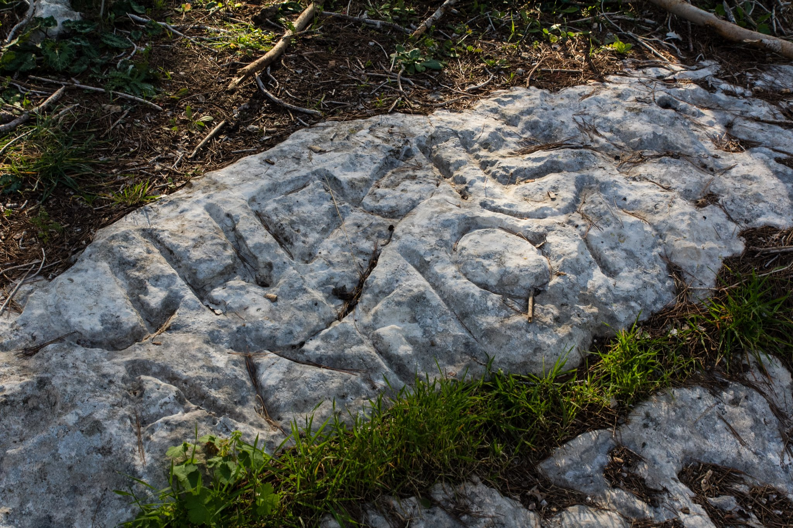

# Human-made Things in the Bible

## License Information

Human-made Things in the Bible © United Bible Societies, 2025. Adapted from: <cite>The Works of Their Hands: Man-made Things in the Bible</cite>, by Ray Pritz © 2009 United Bible Societies. This work is licensed under Creative Commons Attribution-ShareAlike 4.0 International (<a href="https://creativecommons.org/licenses/by-sa/4.0/">https://creativecommons.org/licenses/by-sa/4.0/</a>).

--------------------------------

## 标题：地界、界标（boundary marker） (id: REALIA:3.7)

3\.7 标题：地界、界标（boundary marker）
==============================

经文出处
----

Hebrew 来：גְּבוּל, גְּבוּלָה (音译：gvul, gvulah)

[DEU 19:14](https://ref.ly/Deut19:14), [DEU 27:17](https://ref.ly/Deut27:17), [JOB 24:2](https://ref.ly/Job24:2), [PRO 22:28](https://ref.ly/Prov22:28), [PRO 23:10](https://ref.ly/Prov23:10), [HOS 5:10](https://ref.ly/Hos5:10)

描述和用途
-----

*划定边界的石碑 (© Oren Rozen, CC BY\-SA 4\.0, via Wikimedia Commons)*

界标是放在地产边缘的石头，用来表明一个人的田地到哪里结束，另一个人的田地从哪里开始。界标有多种形式，可以是一块单独的大石头，上面刻着一些规条；也可以是一堆扁平的石头。

---

翻译
--

希伯来文短语*hisig gvul* ／*gvulah* 出现在上面列出的所有参考经文中，字面意思是“向后挪移边界”。某人挪移地标，就可以使自己的地业变大，而邻居的产业受到损失。在[JOB 24:2](https://ref.ly/Job24:2) 中，GNT (Good News Translation (1992)) 清楚表明了移动地标的目的，英文意为：“获得更多土地”。如果在有些地方，人们不清楚这些地标是用来表示土地所有权，这节经文的第一行就要作出适当的调整，例如译成，“霸占了不属于他们的土地”、“未经允许在他人的土地上耕种”、“在他人的土地上种植作物”，或“偷窃邻居的田地”。在翻译其他参考经文时，也可以参考这些译法。

* **Associated Passages:** 申命记 19:14; 申命记 27:17; 约伯记 24:2; 箴言 22:28; 箴言 23:10; 何西阿书 5:10

