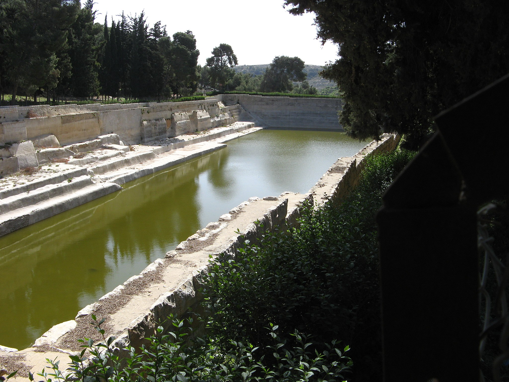

# Human-made Things in the Bible

## License Information

Human-made Things in the Bible © United Bible Societies, 2025. Adapted from: <cite>The Works of Their Hands: Man-made Things in the Bible</cite>, by Ray Pritz © 2009 United Bible Societies. This work is licensed under Creative Commons Attribution-ShareAlike 4.0 International (<a href="https://creativecommons.org/licenses/by-sa/4.0/">https://creativecommons.org/licenses/by-sa/4.0/</a>).

--------------------------------

## 标题：水池（pool） (id: REALIA:3.10)

3\.10 标题：水池（pool）
=================

经文出处
----

Hebrew 来：בְּרֵכָה (音译：brekah)

[2SA 2:13](https://ref.ly/2Sam2:13), [2SA 2:13](https://ref.ly/2Sam2:13), [2SA 2:13](https://ref.ly/2Sam2:13), [2SA 4:12](https://ref.ly/2Sam4:12), [1KI 22:38](https://ref.ly/1Kgs22:38), [2KI 18:17](https://ref.ly/2Kgs18:17), [2KI 20:20](https://ref.ly/2Kgs20:20), [NEH 2:14](https://ref.ly/Neh2:14), [NEH 3:15](https://ref.ly/Neh3:15), [NEH 3:16](https://ref.ly/Neh3:16), [ECC 2:6](https://ref.ly/Eccl2:6), [SNG 7:5](https://ref.ly/Song7:5), [ISA 7:3](https://ref.ly/Isa7:3), [ISA 22:9](https://ref.ly/Isa22:9), [ISA 22:11](https://ref.ly/Isa22:11), [ISA 36:2](https://ref.ly/Isa36:2), [NAM 2:9](https://ref.ly/Nah2:9)

Hebrew 来：מִקְוֶה, מִקְוָה (音译：miqveh, miqvah)

[EXO 7:19](https://ref.ly/Exod7:19), [ISA 22:11](https://ref.ly/Isa22:11)

Greek 希：κολυμβήθρα (音译：kolumbēthra)

[JHN 5:2](https://ref.ly/John5:2), [JHN 5:4](https://ref.ly/John5:4), [JHN 5:7](https://ref.ly/John5:7), [JHN 9:7](https://ref.ly/John9:7)

Greek 希：κρήνη (音译：krēnē)

[SIR 48:17](https://ref.ly/Sir48:17)

描述和用途
-----

*下所罗门池 (© Liadmalone, CC BY\-SA 3\.0, via Wikimedia Commons)*

水池是一个相对较大、露天的蓄水构筑物。

---

翻译
--

[EXO 7:19](https://ref.ly/Exod7:19) ：在这节经文中，希伯来文*miqveh* 可能是指一种特殊的蓄水池，或者更有可能是一个通用词语，重复前面的短语“埃及的水”。

[ISA 22:11](https://ref.ly/Isa22:11) ：在耶路撒冷的两道城墙之间建造的水池可能有两种用途：在围城期间储水，以及作护城河或灌满水的壕沟来阻挡攻击者。大多数译本都把这里的希伯来文*miqvah* 译为“reservoir”（“水库”；GNT (Good News Translation (1992)) 、NIV (New International Version (1984)) ）。

[NAM 2:9](https://ref.ly/Nah2:9) （《和》2:8）：这节经文的希伯来文本有一个问题，许多译本都是根据一个修订过的文本进行翻译的。水库中的水往外流，比喻尼尼微人从城里往外逃。因此，这节经文的前半部分可译为：“尼尼微如同一个水池，里面的水正在流失”（NIV (New International Version (1984)) 直译），或“如水从裂开的大坝流出，居民也从尼尼微逃跑”（GNT (Good News Translation (1992)) 直译）。

在[JHN 5:2](https://ref.ly/John5:2) ，希腊文*kolumbēthra* 指的是一个周围有五个廊子的水池，水池四面各有一个廊子，还有一个横跨水池的中间。[JHN 9:7](https://ref.ly/John9:7) 出现了同一个希腊文，但该处提到的水池要小得多，也简朴得多。这个水池已在耶路撒冷发掘出来。

* **Associated Passages:** 撒母耳记下 2:13; 撒母耳记下 4:12; 列王纪上 22:38; 列王纪下 18:17; 列王纪下 20:20; 尼希米记 2:14; 尼希米记 3:15; 尼希米记 3:16; 传道书 2:6; 雅歌 7:5; 以赛亚书 7:3; 以赛亚书 22:9; 以赛亚书 22:11; 以赛亚书 36:2; 那鸿书 2:9; 出埃及记 7:19; 约翰福音 5:2; 约翰福音 5:4; 约翰福音 5:7; 约翰福音 9:7; 德训篇 48:17

